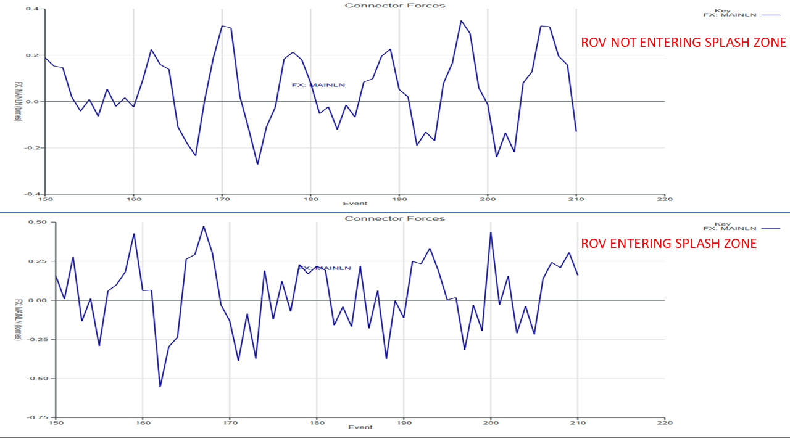

I would argue that the direct effect of wave/water particle dynamics contributes much more in the splash zone than the induced heave velocity of the LARS of the ROV

Like
like
5

Reply
8 Replies
8 Replies on Stefan Schlömilch’s comment
View Joël Ruesen’s profile
Joël Ruesen
 • 3rd+
Marine engineer at Mocean Offshore
1d

Stefan Schlömilch especially at this end/start of the hoist, agreed! One of the most interesting situations to analyse with the combination of wave action, LARS motions, hydro. damping, added mass and the shift in pendulum frequencies as you hoist/lower. Challenging puzzle :)

Like
like
1

Reply
View Dr. Xu Xiang’s profile
Dr. Xu Xiang
 • 2nd
Sjefingeniør | Fluid dynamics | Naval Architect | Bridge Engineer | Researcher
1d

Stefan Schlömilch 'Under certain conditions', but not absolute :)

Like

Reply
View Stefan Schlömilch’s profile
Stefan Schlömilch
 • Following
Helping marine contractors and designers achieve higher weather limits and more efficient designs through state-of-the-art engineering analysis
1d

Dr. Xu Xiang the shorter the wave period is the more true my statement is :)

Like
like
1

Reply
View Herm Bussemaker’s profile
Herm Bussemaker
 • 2nd
Offshore Engineering Expert
23h

Stefan Schlömilch indeed as the vessel motions are smaller at shorter wave length (period).

Like

Reply
View Agusta Ndururu’s profile
Agusta Ndururu
Author
Assistant Manager for Engineering Department in Paxocean
23h

Stefan Schlömilch yes, correct, but here in this model my objective was to capture the heave/pitch effect only, the wave load was towards 180-degree direction which will affect the model toward FX direction, here is the comparation of the FX force between model entering splash zone and not. The force is not significant because the ROV frame in the model is modeled using tube 100mm, so the area is too small while the weight is 26.2 ton. So, I guess I need to add the area in the ROV model.
…more
Comment image, no alternative text available

Like
like
2

Reply
View Herm Bussemaker’s profile
Herm Bussemaker
 • 2nd
Offshore Engineering Expert
22h

Stefan Schlömilch Agusta Ndururu from these plots, my comment would be that your time step is too large.

Like
like
3

Reply
View Agusta Ndururu’s profile
Agusta Ndururu
Author
Assistant Manager for Engineering Department in Paxocean
21h

Herm Bussemaker may i know how to determine the correct time step? Or what would you recommend for this model?

Like

Reply
View Herm Bussemaker’s profile
Herm Bussemaker
 • 2nd
Offshore Engineering Expert
19h

Agusta Ndururu there must be something in the DNV guidelines. Rule of thumb would be about 8 time steps per shortest relevant dynamic cyle. So if you have a system with a dynamic resonance period of 3 second, which you have, time step should be smaller than 3/8 second. 
Your time trace is very spiky, which is an indication the the time step is too large and the result are unrelaible.

