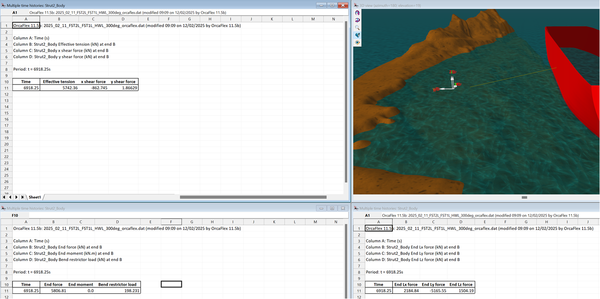
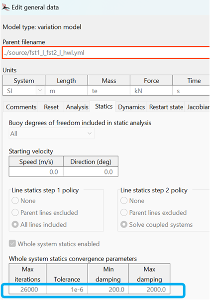

Dear Vamsee,

Thanks for sending your model across. I have taken a look and am happy to try to answer your question.

When I ran your model (using OF 11.5b), I could not reproduce the exact numbers that you quoted at t = 6918.25s, although my results did display the same behaviour that you were questioning; namely that the force components at EndB (Lx, Ly, Lz) did not match the EndB Effective Tension.

The screen-shot below shows the results I obtained at t = 6918.25s.

I have attached a spreadsheet that confirms the following:
•	If you take the magnitude of the "End Force" components (Lx, Ly, Lz — bottom right in the image above) we achieve 5806.81kN, which is the reported "End force" in the bottom left window.
•	The "End force" includes tension AND the shear forces, so if you square and add each of the three numbers in the top left window above, and take the square-root of the result, we again arrive at the force of 5806.81kN.
Thus, the answer to your question is that "End Force" includes tension and shear forces, whereas the "Effective tension" result just reports the tension. I hope that this helps to explain the apparent discrepancy you were observing.

Incidentally, I noticed that your Statics settings on the General data form were very different from the default values (see below). You may have good reason for this, but I found that statics solves very quickly and seemingly without problems with the default values.
 

If we can be of any further assistance, please let us know.
Best wishes,
Louise

 
T :  +44(0)1229 584742
E :  orcina@orcina.com
W:  www.orcina.com
 

________________________________________
From: Vamsee Achanta <vamseea@acma-inc.com>
Sent: 11 February 2025 16:30
To: Orcina <orcina@orcina.com>
Cc: Scott McClure <scottm@acma-inc.com>; sivakumar.pabolu@gmail.com <sivakumar.pabolu@gmail.com>; Bram Weisman <bramw@acma-inc.com>
Subject: RE: Vessel Loads | In Vessel Coordinate System 
 
Louise,
 
Thank you for the prompt response. Please find attached the .dat file. The time  is : 6918.25s
 
The line is: Strut2_Body,  End B
The attached Vessel is: FST2
 
The detailed result I got is below. I used min/max to identify the same and they seem to happen at approximately the same time.
 
Thank you,
Vamsee
 
 
From: Orcina <orcina@orcina.com>
Sent: Tuesday, February 11, 2025 8:16 AM
To: Vamsee Achanta <vamseea@acma-inc.com>
Cc: Scott McClure <scottm@acma-inc.com>; sivakumar.pabolu@gmail.com; Bram Weisman <bramw@acma-inc.com>
Subject: Re: Vessel Loads | In Vessel Coordinate System
 
Dear Vamsee,
 
Thanks for getting back to us about your query. In order to give you specific, useful advice on this, please could you send us your .dat file (and tell us which simulation time produced the results below) and we'll be able to take a look?
 
Best wishes,
Louise
 
 
 
 
T :  +44(0)1229 584742
E :  orcina@orcina.com
W:  www.orcina.com
 
________________________________________
From: Vamsee Achanta <vamseea@acma-inc.com>
Sent: 11 February 2025 09:06
To: Orcina <orcina@orcina.com>
Cc: Scott McClure <scottm@acma-inc.com>; sivakumar.pabolu@gmail.com <sivakumar.pabolu@gmail.com>; Bram Weisman <bramw@acma-inc.com>
Subject: RE: Vessel Loads | In Vessel Coordinate System
 
Dear Louise,
 
I am extracting end Lx, Ly, Lz forces. I am also extracting tension at End B (same side). However, the values at the same time seem to not match. See details below.
 
Tension at End B: 5966.4 kN
Moment: 0
Bend Restrictor Load (For bend restrictor design if needed): 11851 kN
 
End Lx, Ly, Lz (at end B). Moments are also zero
 
Strut6_FST_Lx	Strut6_FST_Ly	Strut6_FST_Lz
kN	kN	kN
-2271.3	5361.7	1560.3
 
Resultant of end components: 6028.38 kN
 
Why is there a difference between line tension and Resultant? Any insight will be greatly appreciated.
 
Thank you,
Vamsee
 
From: Orcina <orcina@orcina.com>
Sent: Tuesday, November 26, 2024 5:31 AM
To: Vamsee Achanta <vamseea@acma-inc.com>
Cc: Scott McClure <scottm@acma-inc.com>; sivakumar.pabolu@gmail.com
Subject: Re: Vessel Loads | In Vessel Coordinate System
 
Dear Vamsee,
 
Thank you for your question about reporting loads with respect to the vessel's coordinate system.
 
I am not sure that I have understood exactly what you are asking, so I will give some general guidance here and if you need further assistance, it would be great if you could elaborate and also send a copy of your model so that we can help you more specifically.
 
As you may have read on this help page, OrcaFlex generates results for End loads (e.g. forces and moments at a line end), and we can select how these results are reported (i.e. using axes which are either Global, Local or with respect to the line end axes):
 
 
 
If I have understood your question correctly, selecting line end results for your strut in terms of local axes (L_xyz), will give the desired results in the vessel axes. Alternatively, you could attach other objects to your vessel (e.g. Constraints or 6D buoys with zero mass) with the line connected onto them in order to extract results. We can give further guidance on this if the above information hasn't answered your query.
 
I hope this has helped, but if not, please feel free to contact us again with your model.
 
Best wishes,
Louise Wilkin
 
 
T :  +44(0)1229 584742
E :  orcina@orcina.com
W:  www.orcina.com
 
 
 
________________________________________
From: Vamsee Achanta <vamseea@acma-inc.com>
Sent: 25 November 2024 20:00
To: Orcina <orcina@orcina.com>
Cc: Scott McClure <scottm@acma-inc.com>; sivakumar.pabolu@gmail.com <sivakumar.pabolu@gmail.com>
Subject: Vessel Loads | In Vessel Coordinate System
 
Dear Support Representative,
 
I have an articulated strut attached to a ship. See schematic below.
 
I am able to get the loads of the strut on the ship in global coordinate system. However, is there anyway, I can get the loads from the strut on the ship in ship coordinate system i.e. loads w.r.t the ship coordinate system? If yes, any reference documentation will be of great help.
 
 
 
 
Thank you,
Vamsee
