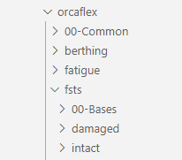

Objective: To be able to provide relative path for within the a folder structure

I am inheriting a legacy analysis with example folder structure below. Currently all files have a absolute path referenced in them. May I change it to relative path? If so how? Or will the relative references below work?

a/ Working directory higher in relative path hierarchy

working directory: fsts\damaged

Absolute reference:
                includefile: X:\orcaflex\00-Common\Wind_Ext_FST2L.yml

relative reference:
                includefile: ..\..\00-Common\Wind_Ext_FST2L.yml

b/ Working directory lower in relative path hierarchy

working directory: fsts\damaged

Absolute reference:
                includefile: X:\orcaflex\00-Common\Wind_Ext_FST2L.yml

relative reference:
                includefile: ..\..\00-Common\Wind_Ext_FST2L.yml
