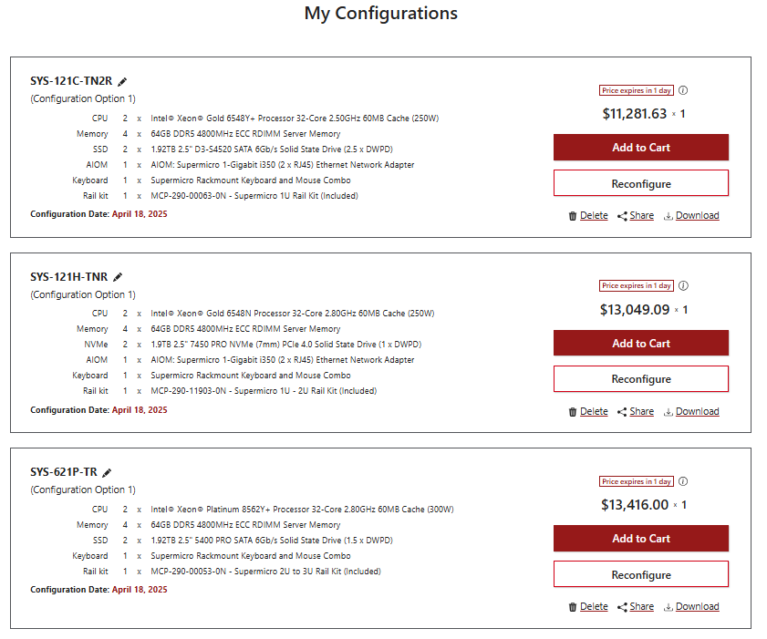
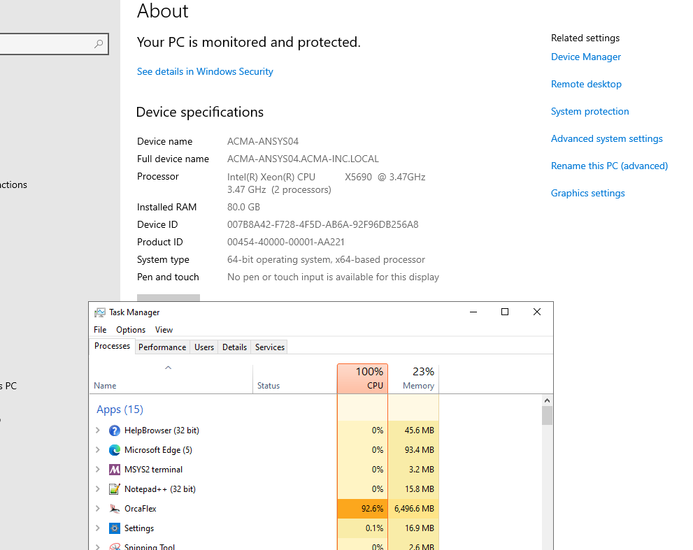

## Summary

Based on casestudy results, 
each Xeon core has 2 threads. For 11 threads,
CPU utilization : 100% ()

RAM utilization : 20% (10 GB) ~ 1 GB per core (2 GB per core with safety factor of 2)

Way foreard
https://store.supermicro.com/us_en/customer/configurations/

## CPU Analysis 

CPU with single thread
https://www.intel.com/content/www/us/en/products/sku/240359/intel-xeon-6740e-processor-96m-cache-2-40-ghz/specifications.html

Intel® Xeon® Gold 6548Y+ Processor 32-Core 2.50GHz 60MB Cache - 5th Gen
Intel® Xeon® Gold 6548N Processor 32-Core 2.50GHz 60MB Cache - 5th Gen
Intel® Xeon® Platinum 8562Y+ Processor 32-Core 2.80GHz 60MB Cache - 5th Gen

## Casestudy

### Communications - David Heffernan

Also is it better to directly get CPU which only allows 1 thread per core so it is a no brainer and no need to fiddle with anything?

Thank you for accommodating these piecemeal questions. They are coming across as I know more.

Thank you,
Vamsee

From: Vamsee Achanta 
Sent: Friday, April 18, 2025 5:50 AM
To: Orcina <orcina@orcina.com>
Cc: Scott McClure <scottm@acma-inc.com>
Subject: RE: Go-by Hardware Configurations

On the hyperthreading (2 threads per core) subject, did you find that 1 thread per core is faster? 

Also, does Orcaflex automatically switch it off (or) is there a setting that we can use to switch it off in OrcaFlex or can be done in OS level?

From: Orcina <orcina@orcina.com> 
Sent: Friday, April 18, 2025 4:21 AM
To: Vamsee Achanta <vamseea@acma-inc.com>
Cc: Scott McClure <scottm@acma-inc.com>
Subject: RE: Go-by Hardware Configurations

Vamsee

We have some information on our website:

https://www.orcina.com/support/hardwarerequirements/
https://www.orcina.com/support/hardwarerequirements/benchmark/

Specifically, the benchmark program allows you to evaluate machines. If you have a hardware supplier that has machines to hand, then you may be able to get them to use the benchmark program on your behalf.

GPU isn't relevant for simulation performance because OrcaFlex simulations run on the CPU.

The linear rule you mention, I guess is that scaling is linear with number of cores. This isn't generally true. Linear scaling is the holy grail, but I never seen it. In reality other factors come in to play. For instance, memory performance tends to stop you reaching linear scaling. The benchmark program will give you a strong indication of what actual throughput can be achieved.

We can't actually offer specific guidance on machine choice because the field is changing so rapidly. But generally speaking, more cores is better if there is sufficient memory, and sufficient memory throughput to support them. Hyperthreading (two threads per core) is generally unhelpful and we tend to disable it.

Best regards,

David Heffernan

From: Vamsee Achanta <vamseea@acma-inc.com> 
Sent: 18 April 2025 00:27
To: Orcina <orcina@orcina.com>
Cc: Scott McClure <scottm@acma-inc.com>
Subject: RE: Go-by Hardware Configurations

Dear Support Team,

We understand the more cores, it is better throughput assuming the linear rule. Typically, we run many parallel variation runs on our model.

Specifically, please pass on any GPU vs. CPU benchmark tests that we can relate to make decisions on the compute requirements.

Thank you very much,
Vamsee

From: Vamsee Achanta 
Sent: Thursday, April 17, 2025 5:14 PM
To: Orcina <orcina@orcina.com>
Subject: Go-by Hardware Configurations

Dear Support Team,

Do you have typical hardware configurations on your website (or by email) that we can refer to as go-by before we choose one of them? 

I reviewed the below link however would like to see typical hardware req chosen by the software users before deciding on one based on budget. Our budget is between USD 10,000 to USD 20000:
OrcaFlex benchmark

Thank you very much,
Vamsee

## Resources

https://youtu.be/xJNkEzy3-O4?si=5Ia6y_Ae7faV-Ms5

https://www.orcina.com/support/hardwarerequirements/
https://www.orcina.com/support/hardwarerequirements/benchmark/
