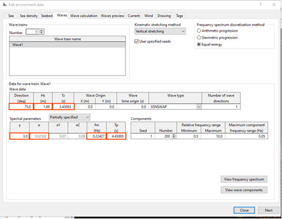

Vamsee

What?s going on here is that Tz and Tp are not independent from each other. The program presents them both as variables that can be set by the user, but when you change one, the other is updated. I suggest that you try doing exactly this in the GUI.

The way that Tz and Tp are related depends on the form of the spectrum. And you are also modifying gamma, the peak enhancement factor, which affects the form of the spectrum. Note that when you modify gamma in the GUI, Tz remains unchanged, but Tp is updated.

The documentation (https://www.orcina.com/webhelp/OrcaFlex/Redirector.htm?Environment,DataforJONSWAPandISSCspectra.htm) does cover this. The key text is:

?If you use partially-specified parameters, you must take care with the order in which you set parameters. The relationship between Tz and Tp (or fm ) depends on ? , so if you change the value of ? OrcaFlex must update either Tz or both of {Tp,fm} . We choose the latter, keeping the value of Tz constant. Consequently, you must set ? before setting either Tp or fm .?

Based on this you should change your YAML to set gamma before Tp, like so:

    Wave1:
      WaveDirection: 75.00
      WaveHs: 1.69
      WaveGamma: 3.00
      WaveTp: 4.84

Best regards,

David Heffernan

From: Vamsee Achanta <vamseea@acma-inc.com> 
Sent: 23 December 2024 10:02
To: Orcina <orcina@orcina.com>
Cc: Scott McClure <scottm@acma-inc.com>
Subject: OrcaFlex | Tp | not reading accurately?

Dear Support Representative,

I used the attached input (see excerpt below). Is there any specific reason why the Tp is read as ~4.45s? Based on some spot checks Tp = 1s looks accurate.

Input:
    Wave1:
      WaveDirection: 75.00
      WaveHs: 1.69
      WaveTp: 4.84
      WaveGamma: 3.00

For some reason, the program reads this input as given below in the UI i.e. Tp = 4.45s. 

Thank you,
Vamsee
