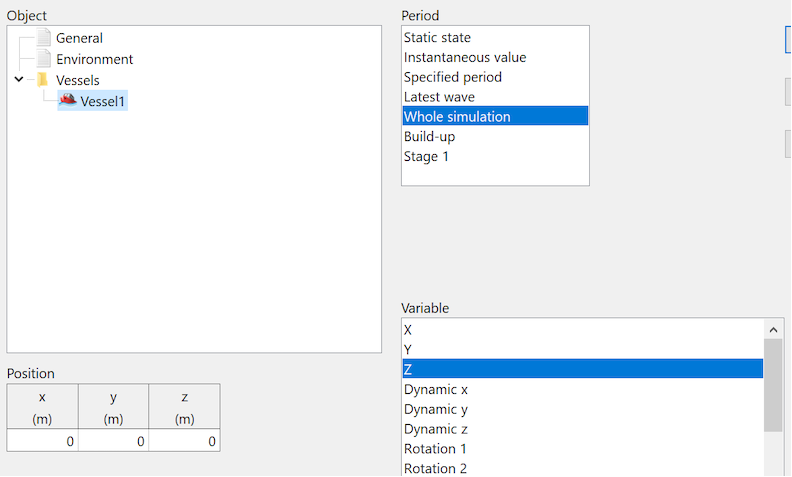

Vamsee

OrcaFlex already does the rigid body transformations that you need, both from the GUI and from the API.

From the GUI, when you select a motion result (position, velocity, acceleration) you are also asked for a results reporting position, relative to the body origin, and with respect to body axes. For example:

 

This is documented here: https://www.orcina.com/webhelp/OrcaFlex/Redirector.htm?Results,Producingresults.htm

For the API this information is provided in the objectExtra parameter of any results function. You can find an example in the object extra section of our "introduction to the Python interface to OrcaFlex" which I know you have been using.

Best regards,

David Heffernan

From: Vamsee Achanta <vamseea@acma-inc.com> 
Sent: 05 December 2024 11:36
To: Orcina <orcina@orcina.com>
Subject: OrcaFlex | 6DOF Transformation

Dear Support Representative,

For a given vessel time domain analysis, is there a function or OrcaFlex command that I can use to get 6 DOF motions, velocity and accelerations (and statistics) at any arbitrary location. Unfortunately, I did not plan these arbitrary locations upfront and in my model and want to get then after the analysis has been run. An ideal example function is below:
motions_at_location = OrcFXAPI.function  (Vessel Object, Location (X, Y, Z)) 
velocity_at_location = OrcFXAPI.function  (Vessel Object, Location (X, Y, Z)) 
acceleration_at_location = OrcFXAPI.function  (Vessel Object, Location (X, Y, Z)) 

Worst case, if you know of an industry standard rigid body motion python function, please let me know?

Thank you,
Vamsee

