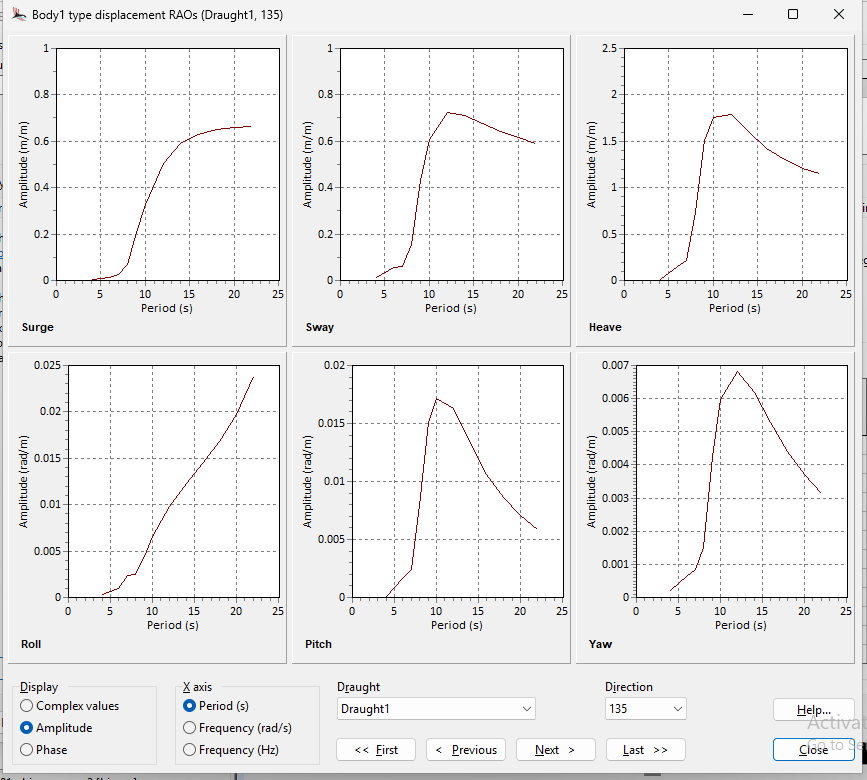
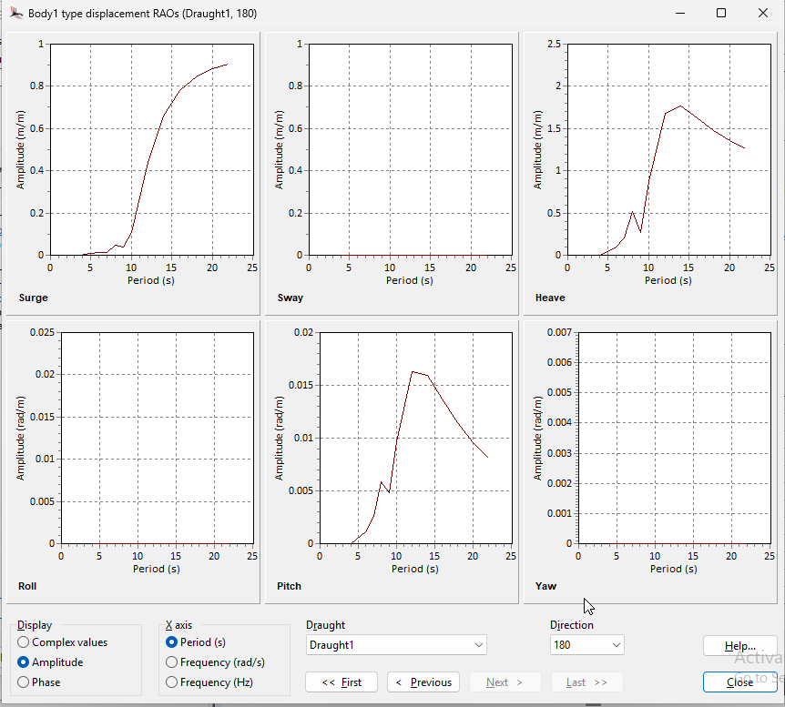

- Run OrcaWave example
- Learn to transfer vessel results into OrcaFlex analysis

- Can we run analysis with 1 body mesh. Do we need mesh for surrounding water.

## Input Data

The comparison of input data between aqwa and orcawave is summarized in table below.

| Parameter |  Unit | OrcaWave | AQWA |
|-----------|-------|----------|------|
| Mass | kg | 1.0e6 | 1.0e6 |
| Inertia | kg.m^2 | 1.0e9 | 1.0e9 |
| Added Mass | kg.s^2 | 1.0e6 | 1.0e6 |
| Damping | kg.s | 1.0e6 | 1.0e6 |

## Hydrostatics

## RAO Comparison

### AQWA

135 deg RAO

<!--  -->
<!--  -->

### OrcaWave

135 deg RAO

<!--  -->

<!--  -->

<!-- Orcawave RAOs As displayed in Orcawave
 -->
