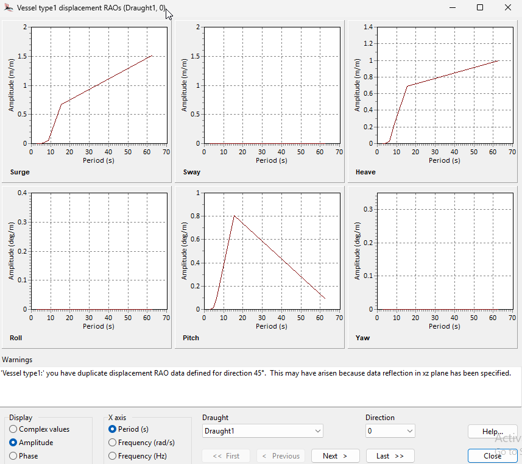
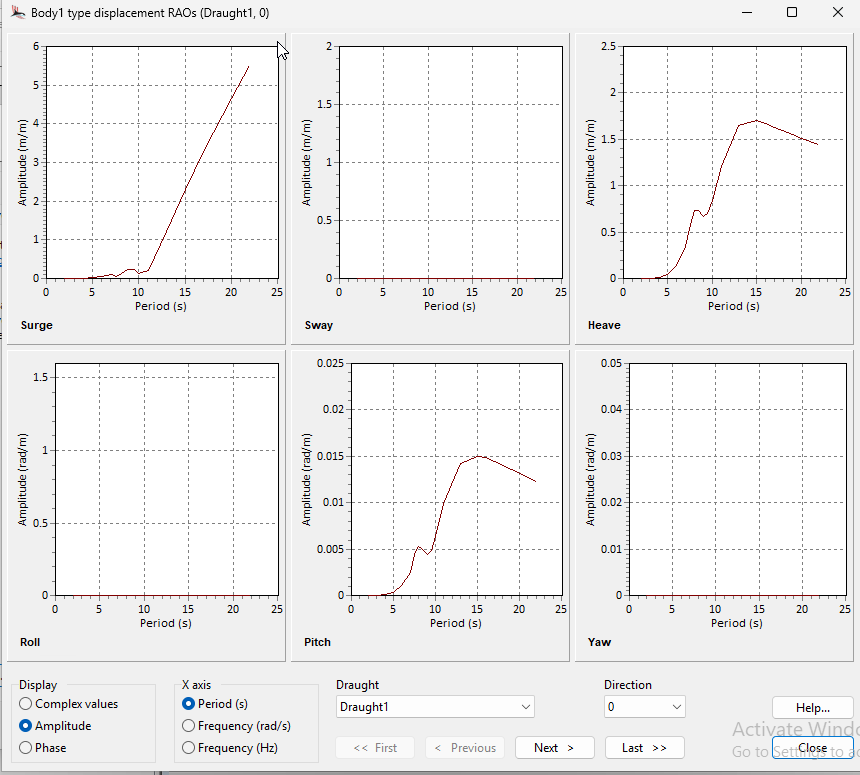

- Run OrcaWave example
- Learn to transfer vessel results into OrcaFlex analysis

- Can we run analysis with 1 body mesh. Do we need mesh for surrounding water.

## Input Data

## Hydrostatics

## RAO Comparison

### AQWA

<!--  -->
<!--  -->

### OrcaWave

<!-- Orcawave RAOs As displayed in Orcawave
 -->
