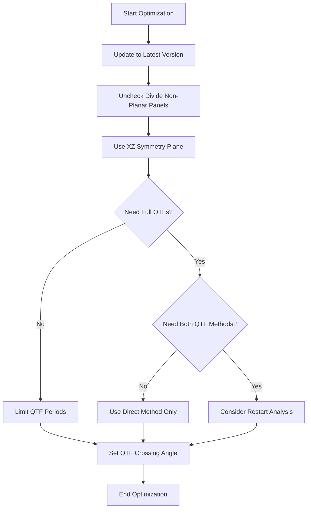

### Summary

### 2025-06-24 Recommendations
I have taken a look at your model and I can make the following suggestions:
•	Are you using the latest version of OrcaWave? Some recent updates (notably in version 11.3) have improved performance and reduced the amount of memory needed (as reported on the Validation page) per thread. Obviously if you can reduce the memory you can increase the thread count. When I open your model in the latest version, the requirement is only 13GB per thread.
•	You can further reduce the memory requirement, and also speed up the calculation, by unchecking the box to divide non-planar panels on the Calculation page. If you do this, I recommend you also increase the waterline gap tolerance (e.g. to 0.02m), which will ensure that the waterline is closed (which means OrcaWave is able to add interior surface panels and create a control surface, as your model currently does). This reduces the memory to 4.3GB per thread.
•	You can further reduce the memory requirement and speed up the calculation by using a mesh file with an xz symmetry plane. Ideally you would generate a mesh file in your specialist meshing software. However, OrcaWave has a tool to save a symmetrised body mesh (via the API). This tool was added in version 11.5a. When I do this, the memory required per thread reduces to 2.1GB.
•	Do you need full QTFs for both sum frequencies and difference frequencies? and for all combinations of your 24 wave periods? If not, you can reduce the run time by setting min and/or max QTF periods, or by choosing to include only difference frequencies (both on the Environment page). I note that you do not have any free surface panelled zone in the full QTF calculation. Neglecting the free surface is not usually appropriate for sum frequency QTFs.
•	Do you need both direct and indirect QTF calculation methods? If you only include the direct method, this will improve run time and reduce memory further (down to 1.6GB per thread). My usual advice is that users should include both methods when performing experimental calculations (e.g. testing mesh convergence, or testing QTF data choices), so that you can compare potential load results from the direct and indirect methods, but such experiments only need to be performed on a subset of wave periods. Once you have confirmed that your model is set up correctly and the results are converged, I advise including only the direct QTF calculation method in the full model.
•	Finally, if you want to experiment with data values, it might also be beneficial to use restart analyses. This would mean you can experiment, e.g. with different data for the full QTF calculation, more quickly. It will not reduce the run time of a one-off model run.
•	Do you need full QTFs for all combinations of wave headings? If you only need unidirectional full QTFs (which is quite a common situation) then setting the max QTF crossing angle to zero will speed up the full QTF calculations.
