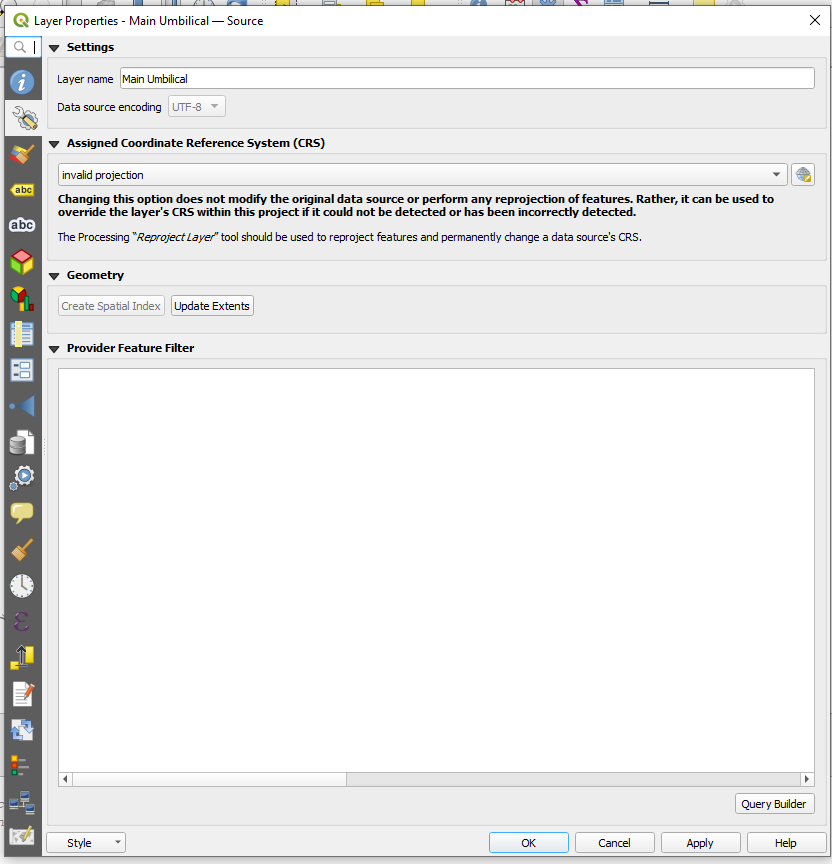
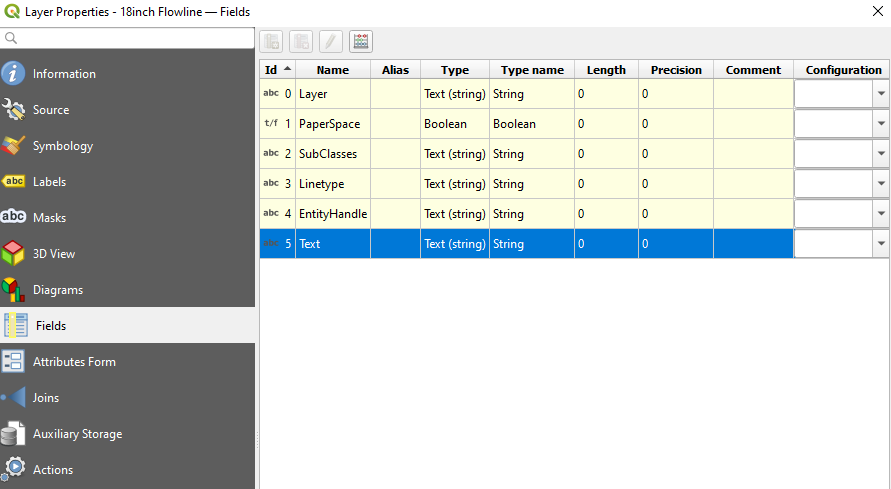
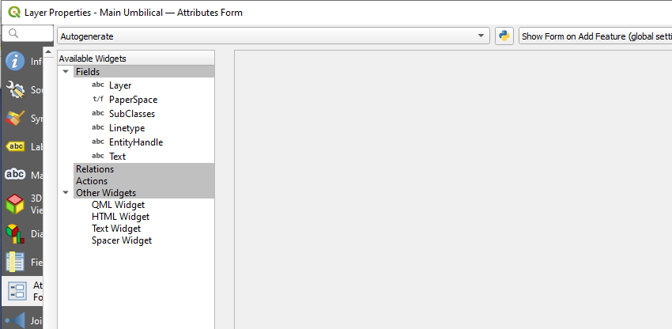

# Introduction

Scope of work:
Prepare profile plots for alignment sheets for the project for various lines.

### Input files

Key learnings:

- Put the files relative to the folder.
- Also, copy to local folder to avoid unforeseen errors such as filename changes, relocated files etc.

| File | Description | File Path | Layer Name | Geometry Type | Unique Geometry Type |
| --- | --- | --- | --- | --- | --- |
| Terrain | Terrain | ../Terrain.shp | Terrain |  |  |
| Main Umbilical | Main Umbilical | ../500 Subsea Facilities/Blocks/Flowline and Umbilical Routes/Main Umbilical_2.1.dxf | entities | LineString | yes |
| 4inch Coiled Pipeline | 4inch Coiled Pipeline | ../500 Subsea Facilities/Blocks/Flowline and Umbilical Routes/4inch Coiled Pipeline_2.1.dxf | entities | LineString | yes |
| 4inch Saline Diffuser Line | 4inch Saline Diffuser Line | ../500 Subsea Facilities/Blocks/Flowline and Umbilical Routes/4inch Saline Diffuser Line_2.1.dxf | entities | LineString25D | yes |
| 18inch Flowline | 18inch Flowline | ../500 Subsea Facilities/Blocks/Flowline and Umbilical Routes/18inch Flowline_2.1.dxf | entities | LineString | yes |
| Main Infield Umbilical | Main Infield Umbilical | ../500 Subsea Facilities/Blocks/Flowline and Umbilical Routes/Main Infield Umbilical_2.1.dxf | entities | LineString25D | yes |
| Offshore and Onshore combined Bathymetry | Offshore and Onshore combined Bathymetry | ../500 Subsea Facilities/Bathymetry/Copy For Use/Offshore and Onshore combined Bathymetry for Aminta.dxf | entities | LineString25D | yes |

### Output files

| File | Description | File Path | Layer Name | Geometry Type | Unique Geometry Type |
| --- | --- | --- | --- | --- | --- |
| TIN Interpolation | Intermediate output | ../intermediate/TIN_interpolation.tif | TIN Interpolation | Raster |  |

### Steps

#### Importing Lines

Current line settings:

- invalid projection

- Fields

- Attributes Form

#### TIN Interpolation

- Using the bathymetry data provided, TIN interpoloation is performed to estabilish a grid of data.
- Search for `TIN Interpolation` in the Processing Toolbox.
  - Advanced settings:
  - Select ignore errors and continue processing.
  - Select the input layer as `Offshore and Onshore combined Bathymetry`.
  - Select the attribute as `ELEVATION`.
  - Select the output file as `TIN_interpolation.tif`.
  - Click on `Run`.

#### Profile Plot

### Macro Recording Research

References:
<https://github.com/volaya/qgis-python-course/tree/master>

<https://github.com/volaya/qgis-python-course/blob/master/macros/macros.rst>

### Logging messages

view -> Panels -> Log Messages Panel

<https://gis.stackexchange.com/questions/84790/where-does-qgis-write-its-error-log-messages>
