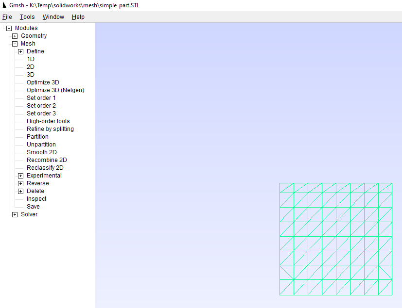
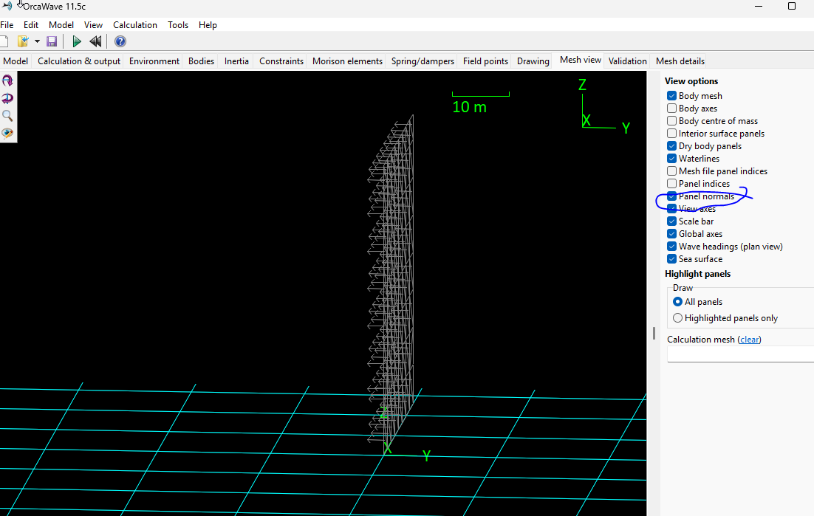

## Summary

Method 1, Geometry & Mesh in CAD program:
- Prepare geoemtry in CAD program (SolidWorks)
- Prepare mesh in CAD program
- Test mesh in OrcaFlex (or openfoam etc.)

Method 1, Geometry in CAD program:
- Prepare geoemtry in CAD program (SolidWorks)
- Export to STL format
- Import STL file into GMSH
- Test mesh in OrcaFlex (or openfoam etc.)

## References

https://www.youtube.com/watch?v=9OGv9QzVW0E&t=149s

https://gmsh.info/

# Creating Surface Panels

https://www.reddit.com/r/FSAE/comments/7d1k9v/surface_panels_in_solidworks/

### 3D Sketch to Surface

- Create a 3D sketch
- filled surface
- Create mesh
- Export mesh in GMSH program

- Test mesh in OrcaFlex (or OpenFOAM etc.)
  - show normals (pointing in -ve Y direction)
  - Can we change normals to point in +ve Y Direction?

https://www.youtube.com/watch?v=vxP2iy5-ZX4&t=434

To create a surface from a sketch in SolidWorks, you'll typically use the "Planar Surface" feature or other surface modeling tools like "Filled Surface" or "Lofted Surface" depending on the sketch's geometry and desired surface type. For simple, closed, planar sketches, "Planar Surface" is the way to go. For more complex shapes or 3D sketches, you might need to utilize other surfacing tools. 
Here's a breakdown of how to create a surface from a sketch in SolidWorks:
1. Planar Surface (for simple, closed, 2D sketches):
Create a closed, non-intersecting 2D sketch: Ensure your sketch forms a single, enclosed shape on a plane.
Access the command: Go to Insert > Surface > Planar, or find the "Planar Surface" icon on the Surfaces toolbar.
Select the sketch: In the PropertyManager, choose your sketch under "Bounding Entities" (either from the graphics area or FeatureManager design tree).
Confirm: Click "OK" to create the planar surface.
Edit: To modify the surface, edit the underlying sketch. 
1. Filled Surface (for more complex shapes, including 3D sketches):
Access the command: Insert > Surface > Filled Surface.
Select the sketch: Choose the 3D sketch or a set of edges that define the surface boundary.
Configure settings: Adjust parameters like edge tangency, curvature, etc., as needed.
Confirm: Click OK to create the filled surface. 
1. Other Surface Tools (for specific scenarios):
Lofted Surface: Creates a surface between two or more profiles. Useful for transitioning between different shapes. 
Boundary Surface: Offers more control over surface shape and curvature, especially for complex shapes. 
Extruded Surface: Creates a surface by extruding a sketch along a path. 
Swept Surface: Creates a surface by sweeping a profile along a guide curve. 
Ruled Surface: Creates a ruled surface between two curves. 
1. Tips for 3D Sketches:
Split Line:
For projecting a sketch onto a curved surface, consider using the Split Line feature. 
Convert to 2D:
If possible, convert the 3D sketch to a 2D sketch on a plane to use Planar Surface. 
Selection Manager:
For complex shapes, use the Selection Manager to pick edges or vertices for surface creation. 
1. Additional Notes:
Knitting Surfaces:
.
If you're creating multiple surfaces, you may need to "knit" them together into a single surface body using the Knit Surface feature. 
Converting Solids to Surfaces:
.
You can also convert a solid body to a surface body using the Delete Face command. 
By understanding these different surface tools and techniques, you can effectively create surfaces from your sketches in SolidWorks. 
=======

https://www.youtube.com/watch?v=9OGv9QzVW0E&t=149s

https://gmsh.info/

# Exporting Meshes from SolidWorks
