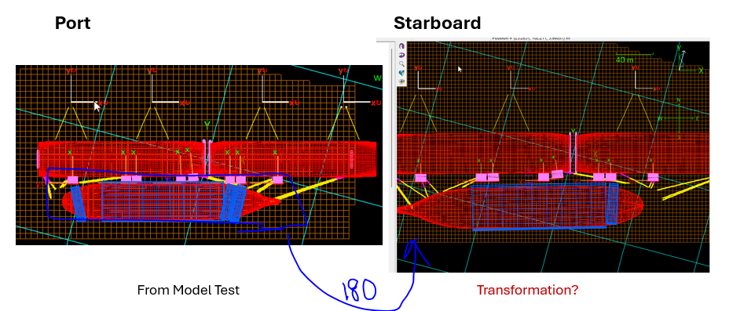

### Introduction

An example to transform coefficient data from port side to starboard side.
- The ship data consists of neighbouring structures on port (and/or starboard) side.
- Model test is done for port berthing side only to obtain wind and current coefficients.
- Wind Coefficient data is required for starboard berthing side.
- Wind Coefficient data is Cx, Cy, Cz, Cnx, Cny, Cnz
  - Cz, Cnx, Cny are close to zero and are equated to zero
  - Cx, Cy, Cnz are non-zero and asymmetric.

- Current Coefficient data is Cx, Cy, Cz, Cnx, Cny, Cnz
  - Cz, Cnx, Cny are close to zero and are equated to zero ? (untouched for WLNG project - check?)
  - Cx, Cy, Cnz are non-zero and asymmetric.

### Summary

- Transformation is only done for **non-zero** coefficients as follows:
  - LNGC rotated by 180 deg
    - The local angles are rotated by 180 deg
  - The Surge coefficients are multiplied by -1 
  - The Sway coefficients are multiplied by -1 

### Details

Refer to other documents in repository location below

docs\sub_ship_design\coefficients\transformations\model_test\from_port_to_starboard
