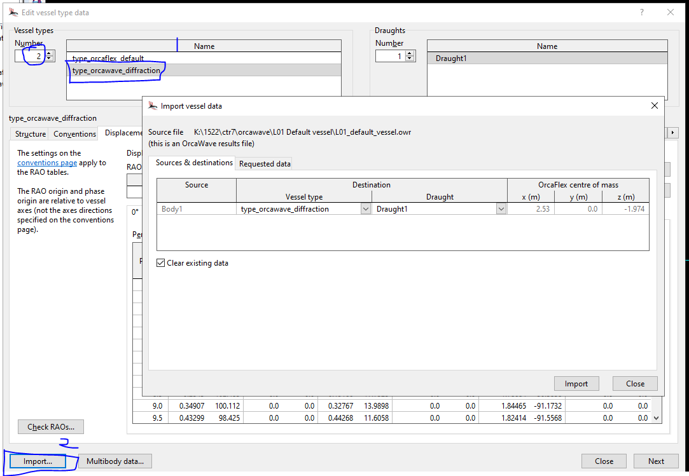
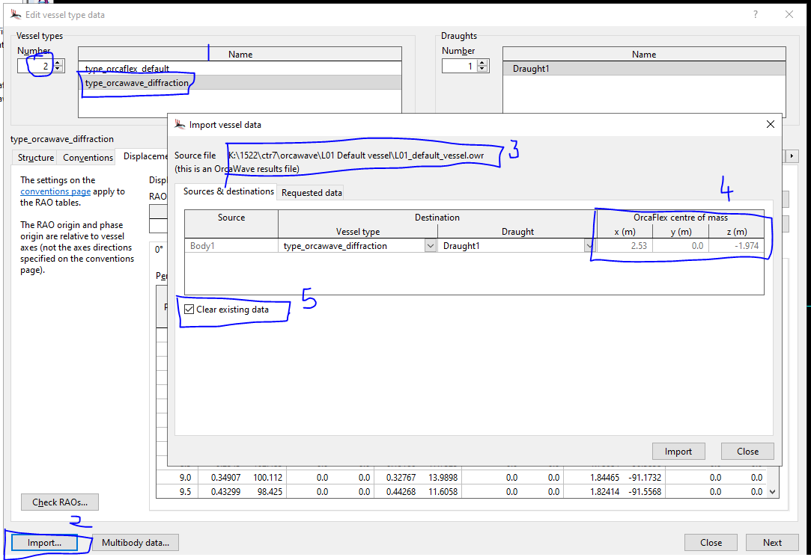
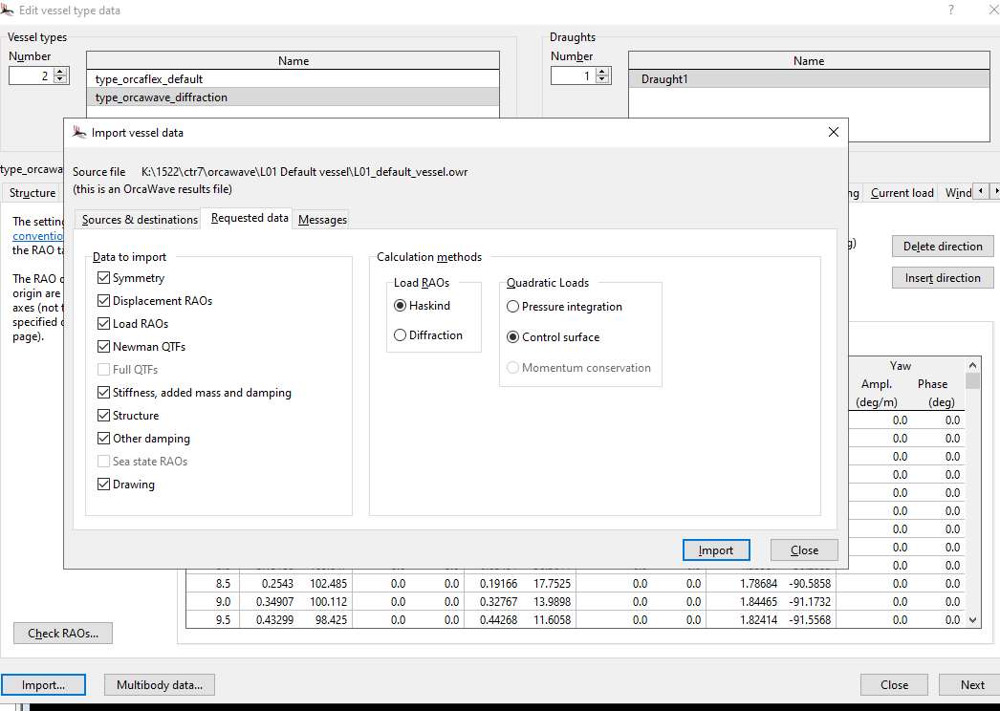

## Introduction

The data from orcawave analysis file .owr can be imported into orcaflex using the following steps.

## Method 1 - Brand New OrcaFlex Run

- Drag and drop the .owr file into the OrcaFlex interface (or)
- file | open .owr file to create a new OrcaFlex run with a vessel (and associated data from .owr file)

## Method 2 - import data using vessel type data form

- Right click to Edit "Vessel Types" Form
- Add a new vessel type
- Click on "Import" button at the bottom of the form
  - See the image below:

- Select the .owr file
- Click "Open" to import the data into the vessel types form

- Check the "Requested Data" Tab to see the imported data

- Messages will show warnings and errors (if any)
- 