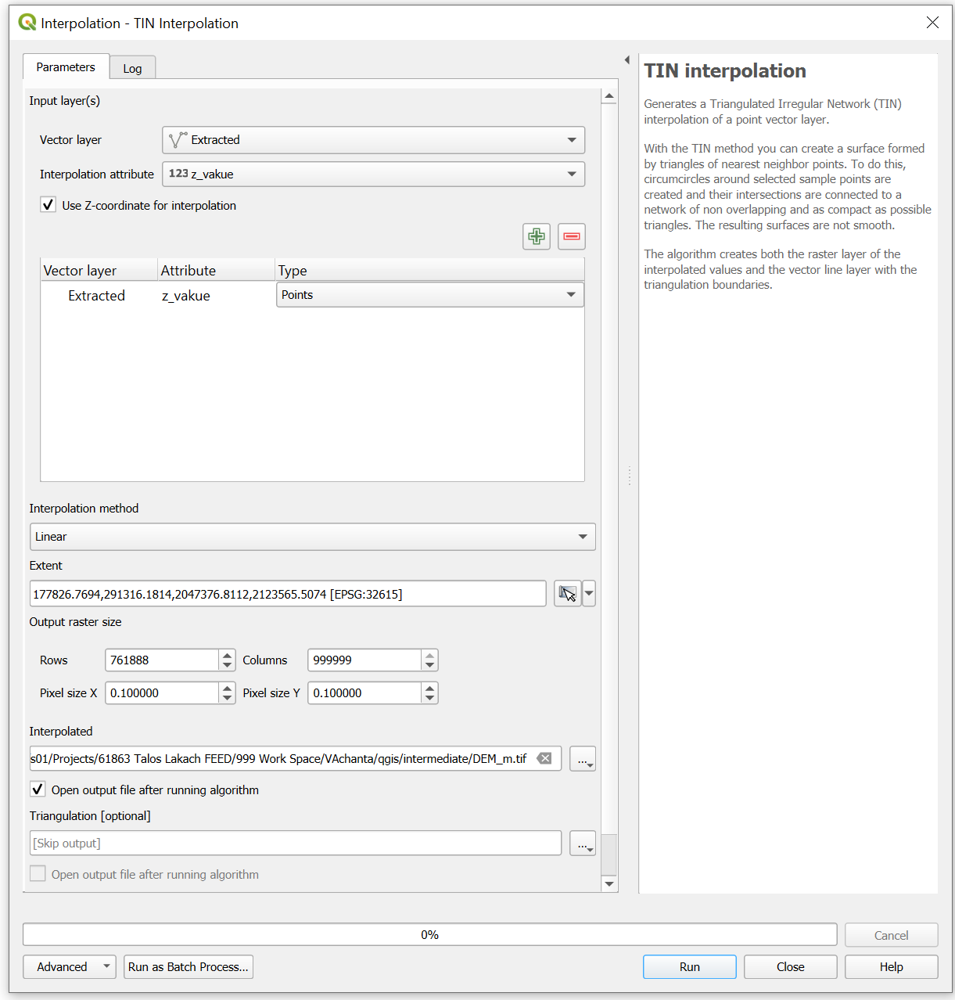

### Summary

`{'OUTPUT': '//dgi-hou-fs01/Projects/61863 Talos Lakach FEED/999 Work '
'Space/VAchanta/qgis/intermediate/DEM_20px_m.tif',
'TRIANGULATION': ''}`

Chanigng units during TIN interpolation

## TIN Interpolation

- Using the bathymetry data provided, TIN interpoloation is performed to estabilish a grid of data.
- Search for `TIN Interpolation` in the Processing Toolbox.
  - Advanced settings:
  - Select ignore errors and continue processing.
  - Select the input layer as `Extracted'?
  - Select the attribute as `z_valued as attribute`.
  - Check the box for `Use z for interpolation`.
  - Advanced alogorithm features
    - ignore errors on geometry
    - units can be changed?
  - Select the output file as `TIN_interpolation.tif`.

  - Click on `Run`.

### Main Algorithm settings

- Input z_vakue; z interpolate (dxf elevation is in mm)
- Input z_first; z interpolate (dxf elevation is in mm)

### Advanced Algorithm settings

- Distance settings in m (output of dxf elevation is in mm) - NOT Working
- Distance settings in mm (output is in ?) - Area of interpolation becaome small - NOT WOrking

### Way Forward

Is the elevation input to TIN interpolation wrong? Unable to verify

Can I multiply the TIN output by 1000 to get the correct area of interpolation? Unable

Profile Tool Output

# Digital Elevation Model (DEM) Data

- DEM Elevation scale can be set to 1000 to change from mm to m.
- Check in the 3D DXF output file the elevation is correct or otherwise. Nope, values are still in mm.
- Need to scale by 10000 just to give values to Dave?
