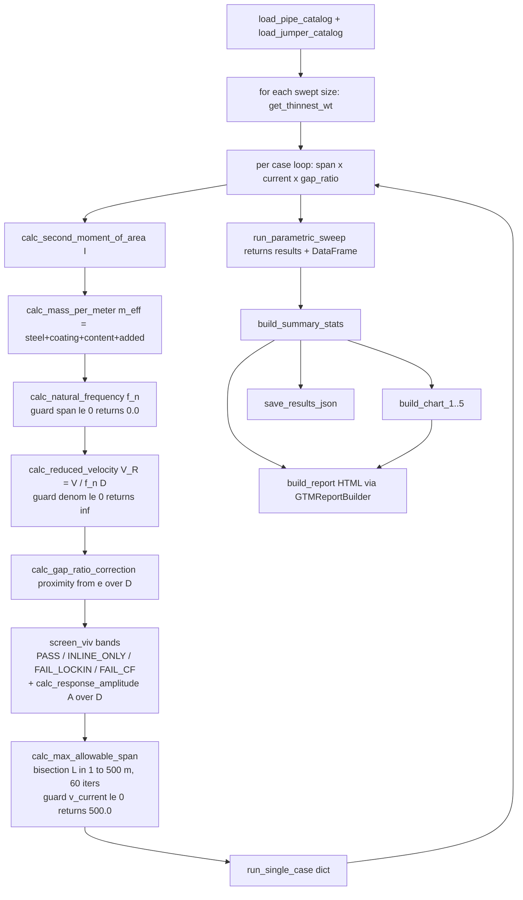

# Demo 01 — DNV-RP-F105 Free-Span VIV Screening: Code-Faithful Analysis

> Source: `examples/demos/gtm/demo_01_dnv_freespan_viv.py` (verified line-by-line)
> Catalogs: `data/pipelines.json`, `data/rigid_jumpers.json`
> Governing code: **DNV-RP-F105 (2017) — Free Spanning Pipelines** (per `code_ref` line 1098 / report line 978)

## 1. Summary

This demo runs a **parametric free-span vortex-induced-vibration (VIV) screening** for offshore
pipelines and rigid jumpers using the **DNV-RP-F105 simplified methodology**. For each parametric
case it computes the freespan natural frequency `f_n`, the reduced velocity `V_R = V/(f_n·D)`,
applies a seabed-proximity (gap-ratio) correction to the VIV onset thresholds, classifies the case
into one of four screening bands (`PASS` / `INLINE_ONLY` / `FAIL_CF` / `FAIL_LOCKIN`), estimates a
response amplitude ratio `A/D`, and back-solves a maximum allowable span before cross-flow onset by
bisection. Outputs are 5 Plotly charts, a branded HTML report (`GTMReportBuilder`), and a JSON
results file (with `--from-cache`/`--force` support).

**Honest envelope:** this is a **screening tool, NOT a full DNV-RP-F105 assessment.** It uses a
single pinned-pinned beam mode, a simplified piecewise `A/D` model, zero effective axial force,
no soil-pipe interaction, no wave/combined loading, and no S-N fatigue calculation. Results flag
cases that *warrant* detailed analysis; they do not constitute an acceptance check.

## 2. Calc chain (verbatim functions, equations, constants)

All line numbers refer to `demo_01_dnv_freespan_viv.py`.

### Physical constants (lines 84–98)
| Constant | Value | Line |
|---|---|---|
| `SEAWATER_DENSITY` | `1025.0` kg/m³ | 85 |
| `GRAVITY` | `9.80665` m/s² | 86 |
| `STEEL_DENSITY` | `7850.0` kg/m³ | 87 |
| `STEEL_YOUNGS_MODULUS` | `207e9` Pa | 88 |
| `COATING_DENSITY` | `950.0` kg/m³ | 89 |
| `CONTENT_DENSITY` | `800.0` kg/m³ (oil-filled, conservative for freespan) | 90 |
| `CA_DEFAULT` (added mass) | `1.0` | 98 |

> Note: `GRAVITY` is defined but **never used** in any calc (no weight/submerged-weight term enters
> `f_n`, `V_R`, or the screening). Effective mass uses density·area only.

### Boundary-condition coefficients (lines 92–95)
| Constant | Value | Line | Used? |
|---|---|---|---|
| `C_N_PINNED` | `3.5596` "Pinned-pinned first mode (pi^2)" | 93 | yes (via default) |
| `C_N_FIXED` | `22.373` "Fixed-fixed first mode" | 94 | **NO — defined but never referenced** (its only other textual mention is the `calc_natural_frequency` docstring, line 251: "22.4 fixed") |
| `C_N_DEFAULT` | `= C_N_PINNED` | 95 | yes (sole coefficient used) |

> **Discrepancy:** the line-93 comment annotates `3.5596` as `(pi^2)`, but `pi² ≈ 9.8696`.
> `3.5596` is not π²; it is the empirical/simplified pinned-mode coefficient actually used.
> The comment is misleading; the **code value `3.5596` is authoritative.**

### VIV onset thresholds (lines 100–107)
| Constant | Value | Line |
|---|---|---|
| `VR_ONSET_IL` (in-line onset) | `1.0` | 101 |
| `VR_ONSET_CF` (cross-flow onset) | `3.0` | 102 |
| `VR_LOCKIN_LOW` | `4.0` | 103 |
| `VR_LOCKIN_HIGH` | `8.0` | 104 |
| `GAMMA_F` (fatigue safety factor) | `1.3` | 107 |

### Calc steps (in execution order)

**1. `load_pipe_catalog()` (line 144)** — opens `data/pipelines.json`, returns `(data, data["pipes"])`.

**2. `load_jumper_catalog()` (line 151)** — opens `data/rigid_jumpers.json`, returns
`(data, data["common_properties"])`.

**3. `get_thinnest_wt(pipe)` (line 171)** — `min(pipe["wall_thicknesses"], key=lambda wt: wt["wt_m"])`.
Selects the **thinnest** wall = lowest stiffness = worst case for VIV. (Sibling `get_thickest_wt`,
line 166, exists but is **not used** in the sweep.)

**4. `calc_second_moment_of_area(od_m, wt_m)` (line 180)**
`id_m = od_m - 2.0*wt_m` ; `I = math.pi/64.0 * (od_m**4 - id_m**4)`  [m⁴].

**5. `calc_mass_per_meter(...)` (line 189)** — defaults `coating_thickness_m=0.003`,
densities from constants. Components:
- `m_steel = (π/4·(od²−id²)) · steel_density`
- `m_coating = (π/4·(od_coated²−od²)) · coating_density`, `od_coated = od + 2·coating_thickness`
- `m_content = (π/4·id²) · content_density`
- `m_added = SEAWATER_DENSITY · (π/4·od²) · CA_DEFAULT`
- **`m_eff = m_steel + m_coating + m_content + m_added`** (line 221)

> Added mass uses bare-steel OD (`od_m`), not coated OD. `CA_DEFAULT=1.0` is fixed (line 218).

**6. `calc_natural_frequency(od_m, wt_m, span_m, ...)` (line 232)** — `c_n=C_N_DEFAULT`.
- Guard: `if span_m <= 0: return 0.0` (line 257).
- `ei = STEEL_YOUNGS_MODULUS · I`
- `m_eff` from `calc_mass_per_meter`.
- Guard: `if m_eff <= 0: return 0.0` (line 268).
- **`f_n = c_n / (2.0*math.pi) * math.sqrt(ei / (m_eff * span_m**4))`**  [Hz] (line 271).

**7. `calc_reduced_velocity(v_current, f_n, od_m)` (line 275)**
`denom = f_n*od_m`; **guard `if denom <= 0: return float("inf")`** (line 281);
else `V_R = v_current/denom`.

**8. `calc_gap_ratio_correction(e_over_d)` (line 286)** — proximity multiplier on onset thresholds.
- `if math.isinf(e_over_d): return 1.0` (mid-water, no proximity).
- else **`return 1.0 + max(0.0, (1.0 - e_over_d) * 0.5)`** (line 296). For `e/D≥1` → 1.0;
  for `e/D<1` the factor rises above 1.0 (delays onset).

**9. `screen_viv(v_r, e_over_d=1.0)` (line 318)** → `(status, a_over_d)`.
- `proximity = calc_gap_ratio_correction(e_over_d)`
- `v_r_onset_il = VR_ONSET_IL * proximity`; `v_r_onset_cf = VR_ONSET_CF * proximity`
- `a_over_d = calc_response_amplitude(v_r, v_r_onset_il, v_r_onset_cf)`
- Band logic (lines 336–343):
  - `v_r < v_r_onset_il` → `STATUS_PASS`
  - `v_r < v_r_onset_cf` → `STATUS_INLINE_ONLY`
  - `VR_LOCKIN_LOW <= v_r <= VR_LOCKIN_HIGH` (4.0–8.0) → `STATUS_FAIL_LOCKIN`
  - else → `STATUS_FAIL_CF`

> **Discrepancy / ordering subtlety:** the lock-in test (`4.0<=v_r<=8.0`) is evaluated against the
> **fixed** constants 4.0/8.0, while the IL/CF onset tests are scaled by `proximity`. So when
> `e/D<1` (proximity>1), there is a `v_r` window above the scaled CF onset but below 4.0 that
> classifies as `FAIL_CF`, and `v_r>8.0` also returns `FAIL_CF` (not lock-in). Lock-in is therefore
> a *bounded* band, with `FAIL_CF` covering both the 3·prox→4.0 shoulder and everything above 8.0.

**10. `calc_response_amplitude(v_r, v_r_onset_il, v_r_onset_cf)` (line 299)**
- `v_r < v_r_onset_il` → `0.0`
- `v_r < v_r_onset_cf` (in-line) → `min(0.15, 0.15 * v_r / v_r_onset_cf)`
- else (cross-flow) → `a_d = 0.4 * (v_r - 3.0) * GAMMA_F`; `return min(0.9, max(0.0, a_d))`

> **Discrepancy:** the CF branch hard-codes the literal `3.0` (line 314), **not** `v_r_onset_cf`.
> So the amplitude curve's CF knee is anchored at `V_R=3.0` even when the *band* CF onset was
> scaled by proximity. Docstring (line 305) labels the IL cap formula with `V_R_onset_CF`, matching
> code. Minor internal inconsistency between the scaled onset and the literal-3.0 amplitude anchor.

**11. `calc_max_allowable_span(od_m, wt_m, v_current, e_over_d=1.0, ...)` (line 348)** — see §6.
- Guard: `if v_current <= 0: return 500.0` (line 363).
- `v_r_target = VR_ONSET_CF * calc_gap_ratio_correction(e_over_d)`
- Bisection on span over `l_lo, l_hi = 1.0, 500.0` (line 370), **`for _ in range(60)`** (line 372).
- Increases `l_lo` while `v_r < v_r_target` (span too short), else lowers `l_hi`.
- Returns `(l_lo + l_hi)/2.0`.

**12. `run_single_case(...)` (line 393)** — chains `calc_natural_frequency` → `calc_reduced_velocity`
→ `screen_viv` → `calc_max_allowable_span` → `calc_mass_per_meter`; returns a dict with rounded
`f_n_hz` (4dp), `v_r` (3dp), `a_over_d` (4dp), `status`, `max_allowable_span_m` (1dp),
`m_eff_kg_per_m` (2dp). `e_over_d` is serialized as the string `"inf"` for mid-water (line 436).

**13. `run_parametric_sweep(pipe_catalog, jumper_props)` (line 450)** — nested loops (see §3);
builds per-case dicts with `case_id` `PL-NNNN` / `JM-NNNN`; returns `(results, DataFrame)`.

**14. `build_summary_stats(df)` (line 928)** — per `pipe_type`×`nominal_size`: counts of each status
and `Acceptable % = (n_pass + n_inline)/total*100`.

**15. Charts** — `build_chart_1_frequency_vs_span` (537), `build_chart_2_viv_onset_map` (600),
`build_chart_3_max_span_heatmap` (681), `build_chart_4_pass_fail_matrix` (750),
`build_chart_5_jumper_vs_pipeline` (824). Charts 1/2/3/5 **recompute** from catalog (Chart 5 runs an
inner 50-iteration current-bisection, lines 850/879); Chart 4 reads the swept `df`.

**16. `build_report(...)` (line 961)** — `GTMReportBuilder`, code refs DNV-RP-F105 (2017),
DNV-RP-C205 (2010), DNV-OS-F101 (2013); writes `output/demo_01_freespan_report.html`.

**17. `save_results_json(...)` (line 1086)** — writes `results/demo_01_freespan_results.json` with
metadata (note line 1111 records `"boundary_condition": "pinned-pinned (C_n = 3.56)"`).
`load_cached_results` (1124) restores `inf` gap ratios.

## 3. Parameter matrix (hardcoded sweep)

### Pipelines (lines 110–113)
| Axis | Values | Count |
|---|---|---|
| `PIPELINE_SIZES` | `["8in", "12in", "16in"]` | 3 |
| `PIPELINE_SPAN_LENGTHS_M` | `[10, 20, 30, 40, 50, 60, 70, 80]` | 8 |
| `CURRENT_VELOCITIES_MS` | `[0.2, 0.4, 0.6, 0.8, 1.0]` | 5 |
| `PIPELINE_GAP_RATIOS` | `[0.5, 1.0, 2.0, 5.0]` | 4 |

Pipeline cases = 3 × 8 × 5 × 4 = **480**.

### Jumpers (lines 116–117; current axis shared)
| Axis | Values | Count |
|---|---|---|
| size | single `"8in-jumper"` (from `common_properties`) | 1 |
| `JUMPER_SPAN_LENGTHS_M` | `[5, 10, 15, 20, 25, 30, 35, 40]` | 8 |
| `CURRENT_VELOCITIES_MS` | `[0.2, 0.4, 0.6, 0.8, 1.0]` | 5 |
| `JUMPER_GAP_RATIOS` | `[0.5, 1.0, 2.0, 5.0, inf]` (inf = mid-water) | 5 |

Jumper cases = 1 × 8 × 5 × 5 = **200**.

**TOTAL = 480 + 200 = 680 cases.**

### Catalog-derived inputs actually consumed
| Member | OD (m) | WT used (thinnest) | Schedule | Coating t (m) |
|---|---|---|---|---|
| 8in pipeline | 0.2191 | 0.0082 (8.18 mm) | Sch 40 | 0.003 |
| 12in pipeline | 0.3239 | 0.0095 (9.53 mm) | Sch 40 | 0.004 |
| 16in pipeline | 0.4064 | 0.0095 (9.53 mm) | Sch 30 | 0.005 |
| 8in jumper | 0.2191 | 0.0183 (18.26 mm) | Sch 120 (label) | 0.003 (FBE) |

> The 6"/10"/20"/24" catalog entries are present in `pipelines.json` but **not swept** (only 8/12/16
> are in `PIPELINE_SIZES`). The jumper uses `common_properties` only; the per-jumper `jumpers[]`
> array (JMP-20…JMP-100) is **not read** by this demo.

## 4. Control-flow flowchart

## 5. Completeness + loophole register

| Area | Status in demo | Gap vs rigorous DNV-RP-F105 | Severity |
|---|---|---|---|
| Boundary conditions | Pinned-pinned only (`C_N_DEFAULT=C_N_PINNED=3.5596`, line 95). `C_N_FIXED=22.373` **defined but never referenced** (line 94). | F105 needs realistic modal modeling (effective span, soil-dependent end fixity, multi-span). Fixed-fixed and intermediate fixity never exercised. | High |
| Natural-frequency model | Simple Euler beam `f_n=C_n/(2π)·√(EI/(m_eff·L⁴))` (line 271). | F105 uses static-deflection / effective-mass corrections, `C1..C6` coefficients, soil springs, and concrete-coating stiffness factor (CSF). | High |
| Effective axial force | **Assumed zero** — no axial term anywhere in `f_n`; report assumption line 1066 states `Effective axial force = 0`. | F105 `f_n` is strongly modified by effective axial force (tension raises, compression lowers; buckling risk). Omission can be non-conservative. | High |
| Soil-pipe interaction | None — pure free span; assumption line 1072 `No soil-pipe interaction stiffness modelled`. | F105 requires seabed dynamic stiffness (vertical/lateral), penetration, effective span length. | High |
| Wave / combined loading | None — steady current only; assumption line 1065. | F105 combines wave + current (`U_w`, current ratio `α`), directionality, and time-domain or stochastic loading. | High |
| Fatigue / S-N | None — no stress range, no S-N curve, no damage accumulation. `GAMMA_F=1.3` only scales `A/D` amplitude. | F105 acceptance is fatigue-damage based (S-N, SCF, response-induced stress). Screening gives no fatigue life. | High |
| Multi-mode response | Single first mode only; assumption line 1073 `Single-mode response only`. | F105 may require higher in-line/cross-flow modes at high `V_R`. | Med |
| Response / amplitude model | Piecewise `A/D` (line 299): IL `min(0.15,…)`, CF `min(0.9, 0.4·(V_R−3.0)·1.3)`. CF anchor hard-codes `3.0` not the scaled onset. | F105 uses response-amplitude curves dependent on stability parameter `K_sd`, damping, and `V_R` — not a single linear ramp. | Med |
| Added-mass variation | Fixed `Ca=1.0` (line 218), applied on bare OD. | F105 added mass `C_a(e/D)` varies with gap ratio and oscillation amplitude; constant 1.0 is an approximation. | Med |
| Gap-ratio correction | Ad-hoc `1+max(0,(1−e/D)·0.5)` on onset only (line 296); does not also modify `C_a` or damping. | F105 proximity affects onset, added mass, and response amplitude jointly. | Med |
| WT selection | Thinnest WT only (`get_thinnest_wt`, line 173). `get_thickest_wt` unused. | Conservative for VIV stiffness, but real screening should also check governing operating WT and corrosion-allowance state. | Low |
| Content density | Fixed `800 kg/m³` (line 90); no empty/flooded/seawater sensitivity sweep. | Empty (lighter `m_eff` → higher `f_n`) vs water-filled changes `f_n` materially; only one density tested. | Med |
| Edge case: `span_m<=0` | `calc_natural_frequency` returns `0.0` (line 257). | Then `V_R` → `inf` → classified `FAIL_CF`. Acceptable but a zero/degenerate span is silently scored, not rejected. | Low |
| Edge case: `f_n·D<=0` | `calc_reduced_velocity` returns `float("inf")` (line 281). | Propagates to `FAIL_CF`; no explicit error/flag. | Low |
| Edge case: `v_current<=0` | `calc_max_allowable_span` returns `500.0` (line 364). | Indistinguishable from a genuine 500 m saturation result (see §6); also `screen_viv` would see `V_R=0` → `PASS`. | Med |
| Catalog coverage | Only 8/12/16" pipelines + one jumper swept; 6/10/20/24" present but unused. | Not a correctness gap; scope limitation to document. | Low |

## 6. Bisection-saturation loophole (explicit call-out)

`calc_max_allowable_span` (line 348) bisection-solves `V_R(L) = VR_ONSET_CF·proximity` for span `L`:

- **Bounds:** `l_lo, l_hi = 1.0, 500.0` (line 370).
- **Iterations:** `for _ in range(60)` (line 372); comment claims "~1e-18 m precision".
- Update rule (lines 381–384): if `v_r < v_r_target` → `l_lo = l_mid` (raise floor); else `l_hi = l_mid`.

**Silent saturation:** Because `f_n ∝ 1/L²`, `V_R ∝ L²`, so `V_R` is **monotonically increasing in L**.
If even at the upper bound `L=500 m` the reduced velocity never reaches `v_r_target`
(i.e. no CF onset exists within `[1, 500] m`), the `v_r < v_r_target` branch fires on every
iteration, `l_lo` climbs toward 500, and the function **returns ≈ 500.0 m with no flag** indicating
the onset was never bracketed. This is **indistinguishable** from:
1. a real physical span where CF onset genuinely occurs near 500 m, and
2. the `v_current <= 0` early-return of exactly `500.0` (line 364).

Consequently any "max allowable span ≈ 500 m" cell in Chart 3 / the JSON may be a **clipped /
no-onset artifact**, not a computed limit. Severity: **Med-High** for downstream parametric use
(the value reads as authoritative but can be a saturated bound).

> **Fix is tracked SEPARATELY as a distinct bug** (raise/parameterize the upper bound and/or return
> an explicit `no_onset` sentinel/status when `l_hi` is never lowered). This document only **records**
> the behavior; no code change is made here.

---
*Verified against source on 2026-05-29. Where any prose conflicts with the code, the code (with the
cited line) is authoritative.*
