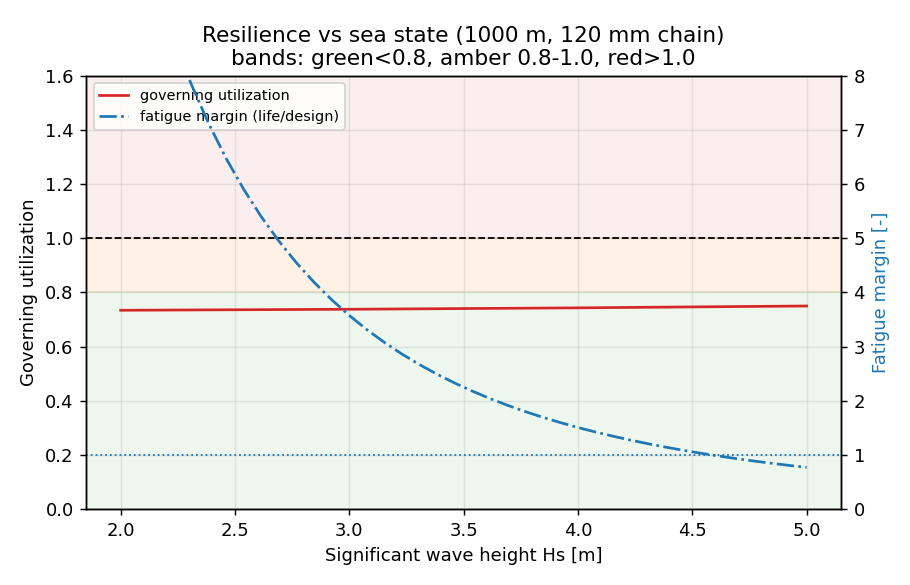
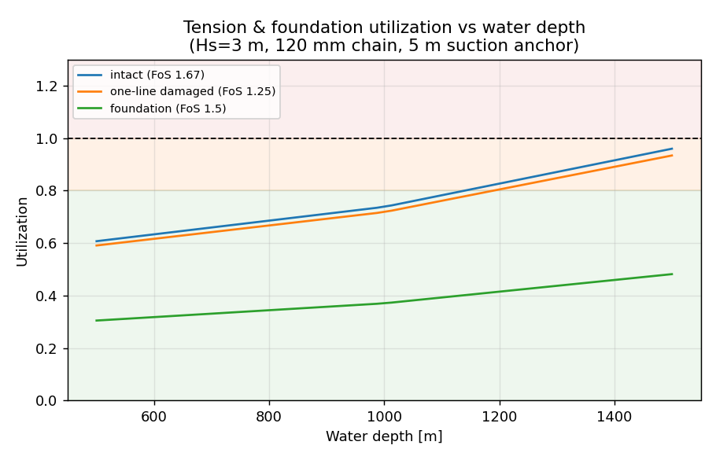
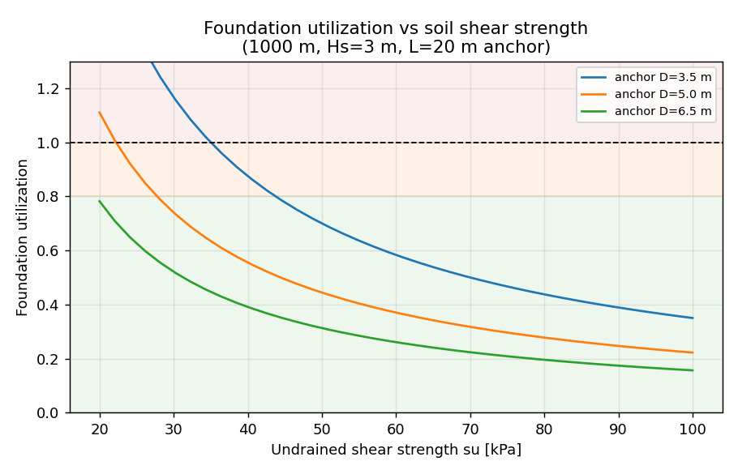
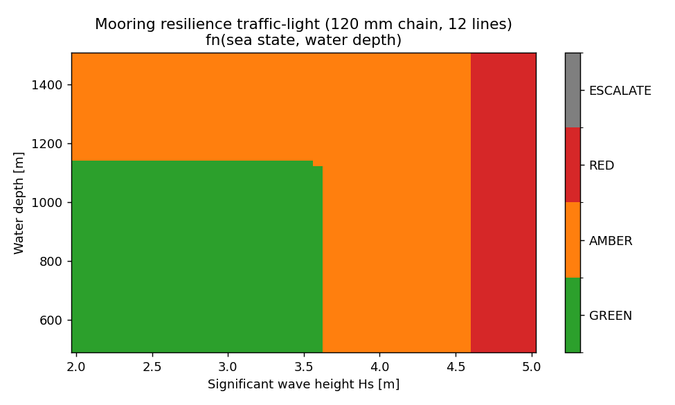

# Mooring-system resilience screening curves

Reduced-order resilience screening for a spread-moored unit, composing the
existing **fpso_mooring_full** (peak line tension) and **anchor_capacity**
(holding capacity) atlases with a closed-form DNV chain fatigue check.
Generated by `run_resilience_curves.py` (digitalmodel #974).

> Screening tool only. A full mooring analysis (OrcaFlex) remains the document
> of record. Out-of-range atlas queries are escalated, never extrapolated.

## Checks & safety factors

| Check | Source | Safety factor | Basis |
|---|---|---|---|
| Intact tension | fpso_mooring_full atlas | 1.67 | API RP 2SK ASD intact |
| One-line damaged | intact x 1.3 redistribution | 1.25 | API RP 2SK ASD damaged |
| Foundation | anchor_capacity atlas | 1.5 | DNV-OS-E301 geotechnical |
| Fatigue | DNV studless chain T-N (m=3.0) | margin vs 25 y | dynamic range ~ 45.0 kN/m Hs |

Traffic-light: **GREEN** all util < 0.8 and fatigue margin > 2; **AMBER** util
0.8-1.0 or margin 1-2; **RED** util > 1.0 or margin < 1; **ESCALATE** outside
atlas coverage.

## Baseline unit

12-line spread, 120 mm studless chain (MBL 15000 kN, area
22600 mm^2), 1000 m water depth, 5 m x 20 m
suction anchor in su=60 kPa clay, Hs=3 m / Tp=11 s.

Result: intact util **0.74**, damaged util **0.72**,
foundation util **0.37**, fatigue life **89 y**
(margin 3.6) -> **GREEN**.

## Curves

### resilience_vs_Hs

### util_intact_vs_damaged

### foundation_vs_soil

### resilience_map_Hs_depth

## Note on atlas sensitivity

In the current `fpso_mooring_full` atlas, peak line tension is dominated by
**water depth** (~5.5 -> 8.7 MN over 500-1500 m) and is only weakly sensitive to
Hs. Extreme-weather severity therefore drives **fatigue** here (via the dynamic
tension range), while depth drives the **strength/foundation** utilizations. A
higher-fidelity tension atlas would sharpen the Hs dependence of the ULS checks.
