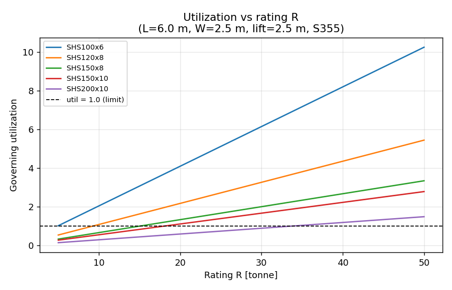
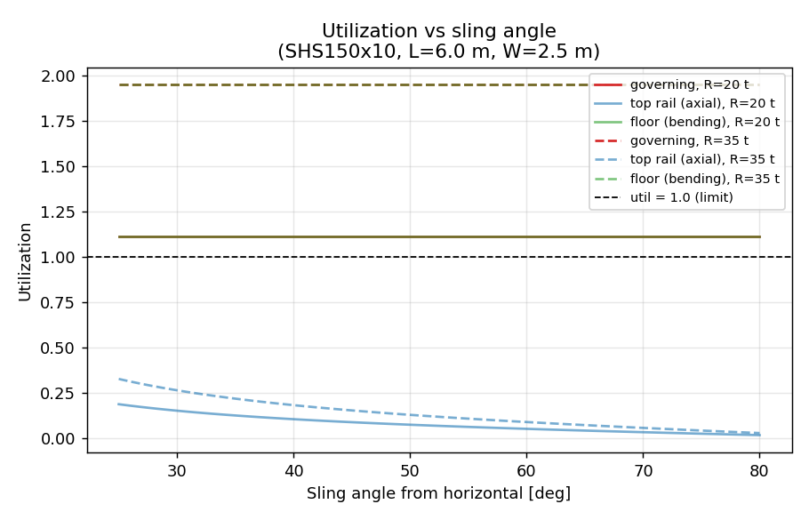
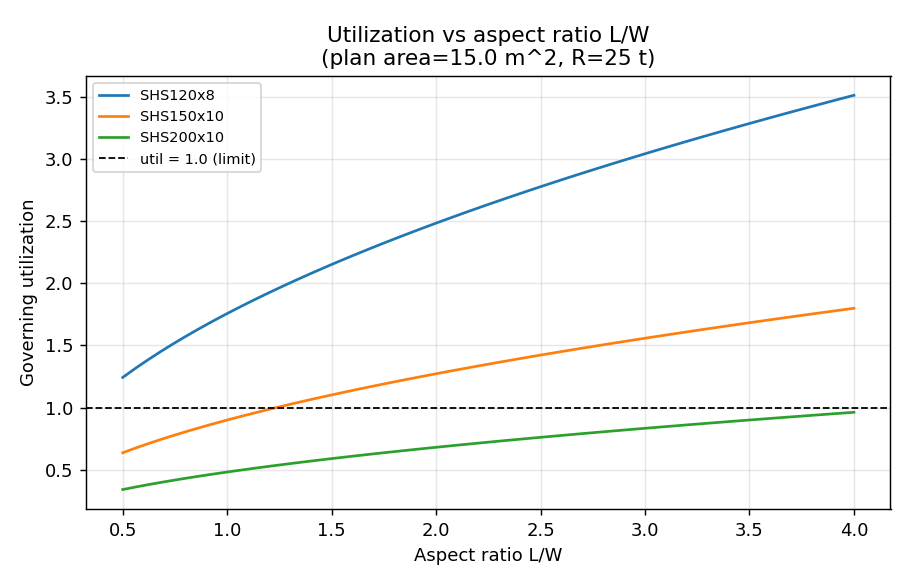
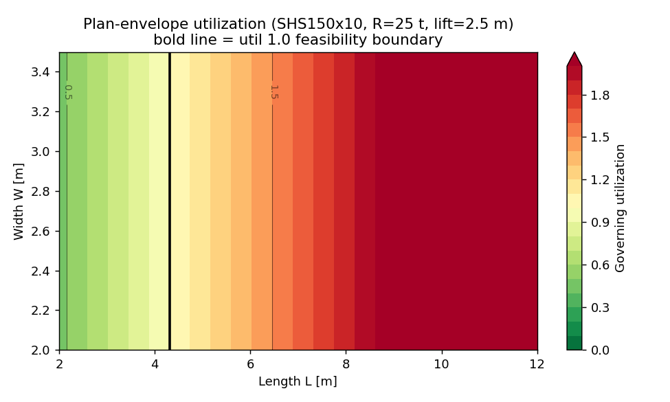

# DNV 2.7-1 offshore-container utilization curves

Reduced-order structural **screening** of the governing offshore-lift load case
for an offshore container (CCU) per DNV 2.7-1 / DNV-ST-E271. Generated by
`run_utilization_curves.py`.

> Screening tool only. Final design must be verified by FEA per DNV-ST-E271.

## Model & assumptions

- 4-point top lift to a master link; **skew case** (two diagonally opposite
  slings carry the full rating R) taken as governing, per DNV 2.7-1.
- Dynamic amplification factor DAF = 1.3; material factor
  gamma_m = 1.15; usage factor eta = 0.85;
  tare fraction = 0.25 (payload = (1-tare) * R).
- Material S355 (fy = 355 MPa); allowable = fy * eta / gamma_m
  = 262 MPa.
- Top side rail checked in axial (inward horizontal sling component); bottom
  floor beam checked in bending (payload UDL, simply supported over L).

## Baseline unit

L = 6.0 m, W = 2.5 m, H = 2.5 m, lift height = 2.5 m,
R = 25 t, frame = SHS150x10.
Sling angle = 37.6 deg. Governing utilization = **1.39**
(top rail 0.14, floor 1.39).

## Section comparison at baseline (R = 25 t)

| Section | Area [cm^2] | Z [cm^3] | Top rail | Floor | Governing |
|---|---|---|---|---|---|
| SHS100x6 | 22.6 | 66.7 | 0.35 | 5.12 | **5.12** |
| SHS120x8 | 35.8 | 125.5 | 0.22 | 2.72 | **2.72** |
| SHS150x8 | 45.4 | 204.3 | 0.17 | 1.67 | **1.67** |
| SHS150x10 | 56.0 | 245.2 | 0.14 | 1.39 | **1.39** |
| SHS200x10 | 76.0 | 458.5 | 0.10 | 0.75 | **0.75** |

## Curves

### util_vs_rating

### util_vs_sling_angle

### util_vs_aspect_ratio

### util_envelope_LW

