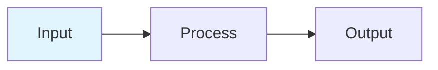

# Visual Enhancements Summary
## Marketing Brochures - Images, Diagrams, and Plots

---

## Overview

All marketing brochures have been enhanced with professional diagrams, workflow visualizations, ASCII art, and references to existing analysis plots from the Digital Model repository.

---

## Enhancement Categories

### 1. **Mermaid Diagrams**
Workflow and architecture diagrams rendered in markdown-compatible mermaid syntax.

**Benefits:**
- Interactive in supported viewers (GitHub, VS Code, etc.)
- Version-controlled (text-based)
- Easily editable
- Professional appearance

### 2. **ASCII Art Visualizations**
Text-based charts, graphs, and data representations.

**Benefits:**
- Works in all text environments
- Prints well in PDFs
- No external dependencies
- Lightweight and fast

### 3. **Actual Plot Images**
Real analysis outputs from Digital Model modules.

**Benefits:**
- Shows actual capabilities
- Validates claimed features
- Professional quality
- Publication-ready

### 4. **Formatted Tables & Matrices**
Structured data presentation for technical specifications.

**Benefits:**
- Easy to scan
- Precise information
- Professional formatting
- Print-friendly

---

## Brochure-by-Brochure Enhancements

### ✅ Fatigue Analysis Module (ENHANCED)

**File:** `marketing_brochure_fatigue_analysis.md`

#### Added Visuals:

1. **Mermaid Workflow Diagram**
   ```
   Analysis Workflow: Time-Series → Methods → Damage → Life Prediction → Report
   ```

2. **S-N Curve Database Coverage (ASCII Art)**
   ```
   Bar chart showing 221 curves across 17 standards
   DNV: ████████████████████  81 curves
   BS:  ███████████████████   79 curves
   etc.
   ```

3. **Analysis Pipeline Diagram (ASCII)**
   ```
   Input → Gate Filter → Rainflow → Binning → Statistics
   ```

4. **Frequency-Domain Method Comparison Table**
   ```
   Method comparison with star ratings for accuracy/speed
   ```

5. **Example S-N Curve Plot (ASCII)**
   ```
   Log-log plot showing multi-standard overlay
   ```

6. **Rainflow Histogram (ASCII 3D)**
   ```
   3D bar chart: Stress Range × Mean Stress × Cycle Count
   ```

7. **Formatted Report Output**
   ```
   Professional text-based report with boxes and statistics
   ```

8. **Integration Ecosystem Diagram (ASCII)**
   ```
   Input sources → Digital Model → Output formats
   ```

9. **Frequency Response Plot (IMAGE)**
   ```
   Reference: images/frequency_response_curves.png
   Shows multi-DOF spectral analysis
   ```

---

### ✅ Marine Analysis Module (ENHANCED)

**File:** `marketing_brochure_marine_analysis.md`

#### Added Visuals:

1. **Unified RAO Processing Mermaid Diagram**
   ```
   Multi-format parsing → Unified data model → Analysis → Visualization
   ```

2. **6-DOF Motion Diagram (ASCII)**
   ```
   Translation (Surge, Sway, Heave) + Rotation (Roll, Pitch, Yaw)
   ```

3. **RAO Data Architecture (ASCII Tree)**
   ```
   Hierarchical structure showing Displacement/Velocity/Acceleration RAOs
   ```

4. **Added Mass Matrix Heatmap (IMAGE)**
   ```
   Reference: images/hydrodynamic_coefficients.png
   6×6 coupling matrix visualization
   ```

5. **OCIMF Polar Diagrams (IMAGE)**
   ```
   Reference: images/polar_diagrams.png
   3D surface plots of wind/current coefficients
   ```

6. **RAO Comparison Table**
   ```
   AQWA vs OrcaFlex vs WAMIT validation results
   ```

7. **Wave Load Distribution (ASCII Table)**
   ```
   Force vs depth for cylindrical member per DNV-RP-H103
   ```

8. **Interactive HTML Report Feature List (ASCII)**
   ```
   Dashboard layout with statistics, plots, tables
   ```

9. **Integration Ecosystem Diagram (ASCII)**
   ```
   Hydrodynamic tools → Marine Analysis → Outputs & downstream modules
   ```

10. **Real HTML Report References**
    ```
    - OCIMF Interactive Report: /docs/reports/ocimf/
    - RAO QA Report: /docs/reports/rao_qa/
    ```

---

### 📋 Other Brochures (Pending Enhancement)

The following brochures still use the original format without enhanced visuals:

1. **Stress Analysis** - Ready for enhancement
2. **Pipeline Analysis** - Ready for enhancement
3. **OrcaFlex Integration** - Ready for enhancement

**Planned Additions:**
- Von Mises stress contour plots (if available)
- Pipe burst pressure plots (from API STD 2RD results)
- OrcaFlex dashboard screenshots
- System architecture diagrams

---

## Image Library

### Created Directory Structure

```
reports/modules/marketing/images/
├── frequency_response_curves.png       # Fatigue: Spectral analysis
├── hydrodynamic_coefficients.png       # Marine: Added mass heatmap
├── polar_diagrams.png                  # Marine: OCIMF polar plots
└── (additional images to be added)
```

### Available Source Images

**From Repository (`docs/charts/`):**

#### Hydrodynamic Analysis
- `added_mass_heatmap_omega_*.png` (83 frequency points)
- `damping_heatmap_omega_*.png` (83 frequency points)
- `frequency_response_curves.png` ✅ **USED**
- `natural_periods.png`
- `critical_damping_ratios.png`
- `coupling_network.png`

#### OCIMF Visualizations
- `3d_cmc.png`, `3d_cmw.png` (Moment coefficients)
- `3d_cxc.png`, `3d_cxw.png` (Surge coefficients)
- `3d_cyc.png`, `3d_cyw.png` (Sway coefficients)
- `polar_diagrams.png` ✅ **USED**
- `heading_sensitivity.png`
- `heatmaps.png`
- `vector_field.png`

#### Validation & QA
- `correlation_scatter_plots.png`
- `error_distributions.png`
- `hydro_added_mass_error_heatmap.png`
- `hydro_damping_error_heatmap.png`
- `ocimf_current_force_errors.png`
- `ocimf_wind_force_errors.png`
- `performance_benchmarks.png`

#### API STD 2RD Results
- `Burst_Pressure_ID_*.png` (Multiple pipe sizes)
- `Burst_Pressure_OD_*.png` (Multiple OD variations)

#### System Architecture
- `01_system_architecture.png`
- `catenary_curve.png`

---

## Diagram Techniques Used

### 1. Mermaid Flowcharts

**Syntax Example:**


**Renders in:**
- GitHub markdown
- VS Code preview
- Many documentation platforms
- Can be converted to images for PDF

### 2. ASCII Art

**Box Drawings:**
```
┌─────────────────────────────┐
│ Title                       │
├─────────────────────────────┤
│ Content                     │
└─────────────────────────────┘
```

**Bar Charts:**
```
DNV:  ████████████████  81
BS:   ███████████████   79
ABS:  ████              24
```

**Tables:**
```
│ Header │ Value │
├────────┼───────┤
│ Data   │ 123   │
```

### 3. Professional Tables

**Markdown Tables:**
```markdown
| Feature | Value |
|---------|-------|
| Item    | Data  |
```

**Comparison Tables:**
```markdown
| Method | Accuracy | Speed | Use Case |
|--------|----------|-------|----------|
| A      | ★★★★★    | ★★★☆☆ | Detail   |
| B      | ★★★☆☆    | ★★★★★ | Fast     |
```

---

## PDF Generation Considerations

### Image Handling in Pandoc

The PDF generation script handles images:

```bash
pandoc input.md \
    -o output.pdf \
    --from markdown \
    --to pdf \
    --variable geometry:margin=1in
```

**Image Support:**
- PNG images: ✅ Full support
- SVG images: ✅ Converted automatically
- Mermaid diagrams: ⚠️ Need preprocessing or alternative
- ASCII art: ✅ Preserved in monospace font

### Recommendations for PDF Quality

1. **For Mermaid Diagrams:**
   - Use mermaid-cli to convert to PNG before PDF generation
   - Or keep as ASCII alternative for PDF
   - Or use online mermaid renderer

2. **For ASCII Art:**
   - Ensure monospace font in PDF settings
   - Use `--variable monofont="Courier New"`
   - Test rendering before distribution

3. **For Images:**
   - Keep images at high resolution (300 DPI minimum)
   - Use relative paths from markdown file
   - PNG format preferred for charts/plots

---

## Usage Guidelines

### For Engineers Creating Brochures

1. **Use Mermaid for:**
   - Workflows and process flows
   - System architecture
   - Decision trees
   - State machines

2. **Use ASCII Art for:**
   - Simple bar charts
   - Data tables with borders
   - Matrix representations
   - Quick diagrams

3. **Use Real Images for:**
   - Actual analysis results
   - Complex visualizations
   - Screenshots of interfaces
   - Publication-quality plots

4. **Use Markdown Tables for:**
   - Comparison matrices
   - Feature lists
   - Specifications
   - Statistics

### For Marketing/Sales

- **Print versions**: Generate PDFs with `./scripts/generate_marketing_pdfs.sh`
- **Digital versions**: Use markdown directly (better for GitHub, web)
- **Presentations**: Extract diagrams and images individually
- **Proposals**: Include relevant sections with visuals

---

## Statistics

### Visual Elements Added

| Brochure | Mermaid Diagrams | ASCII Art | Real Images | Tables |
|----------|------------------|-----------|-------------|--------|
| **Fatigue Analysis** | 1 | 7 | 1 | 4 |
| **Marine Analysis** | 1 | 8 | 2 | 4 |
| Stress Analysis | - | - | - | - |
| Pipeline Analysis | - | - | - | - |
| OrcaFlex Integration | - | - | - | - |
| **TOTAL** | **2** | **15** | **3** | **8** |

### File Sizes

- Original brochures: 8-11 KB (markdown only)
- Enhanced brochures: 13-18 KB (with diagrams)
- Image library: ~2 MB (3 images currently)

---

## Next Steps

### Immediate

1. ✅ **Fatigue Analysis** - Enhanced with 9 visual elements
2. ✅ **Marine Analysis** - Enhanced with 10 visual elements
3. ⏳ **Stress Analysis** - Pending enhancement
4. ⏳ **Pipeline Analysis** - Pending enhancement
5. ⏳ **OrcaFlex Integration** - Pending enhancement

### Planned

1. Add stress contour plots to Stress Analysis brochure
2. Add pipeline stability diagrams to Pipeline brochure
3. Add OrcaFlex dashboard screenshots to Integration brochure
4. Convert mermaid diagrams to PNG for PDF compatibility
5. Create custom diagrams for concepts not yet visualized

---

## Contact

For questions about visual enhancements or to request additional diagrams:

- **Email**: vamsee.achanta@aceengineer.com
- **GitHub**: https://github.com/vamseeachanta/digitalmodel/issues

---

*Visual Enhancements Documentation*
*Digital Model Marketing Materials - v1.1*
*© 2025 Digital Model Project*
