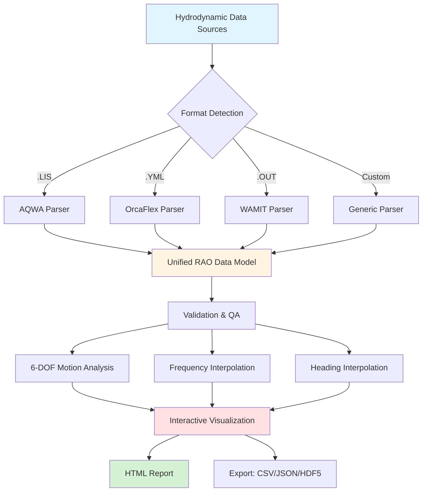
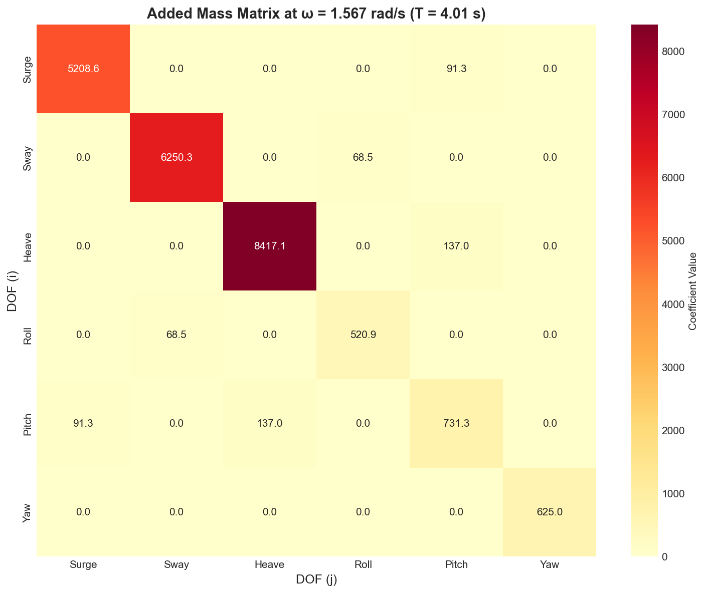
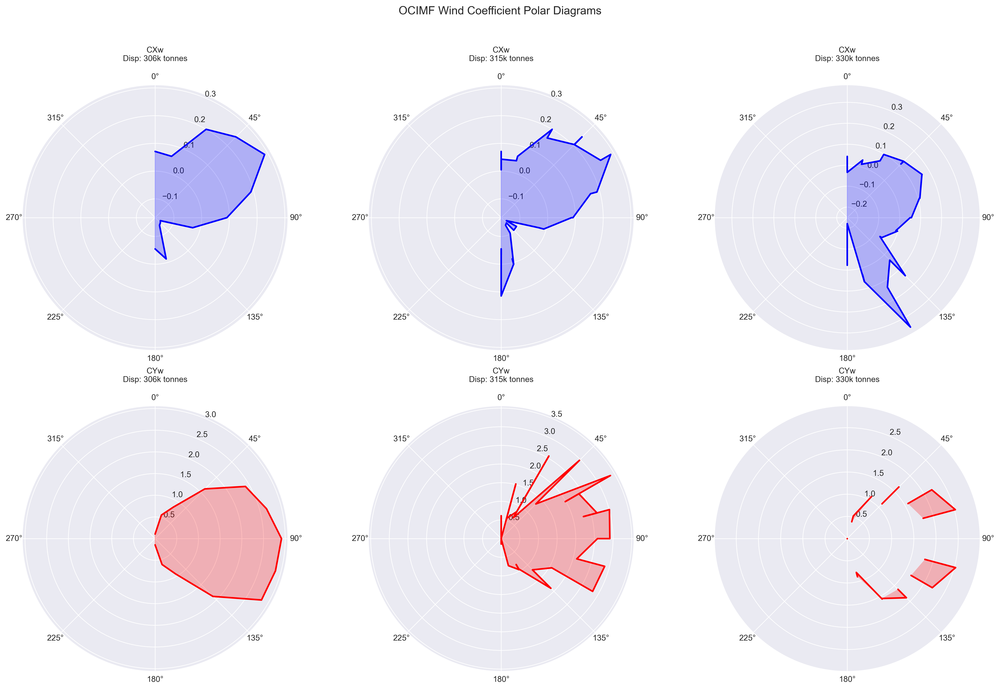

# Marine Analysis Module
## Advanced Hydrodynamic Analysis for Offshore & Marine Vessels

---

### Overview

The Digital Model Marine Analysis Module provides comprehensive hydrodynamic analysis capabilities for floating vessels, offshore platforms, and marine structures. With unified RAO (Response Amplitude Operator) processing, wave load calculations, and hydrodynamic coefficient management, this module streamlines marine engineering workflows from concept to detailed design.

**Key Value Proposition**: Process multi-source hydrodynamic data 80% faster with unified RAO handling, supporting AQWA, OrcaFlex, WAMIT, and custom formats for complete marine engineering analysis.

---

### Unified RAO Processing Workflow



---

### Core Capabilities

- **Unified RAO Processing** - AQWA, OrcaFlex, WAMIT, custom format support
- **Hydrodynamic Coefficients** - Added mass, damping, wave exciting forces
- **Wave Load Calculations** - DNV-RP-H103 compliant wave loading
- **Vessel Motion Analysis** - 6-DOF motion prediction and verification
- **Environmental Loading** - Current, wind, wave combined effects
- **Data Extraction** - OCIMF database, mooring properties, RAO data
- **Interactive Visualizations** - Professional HTML reports with Plotly
- **Performance Profiling** - Optimization and bottleneck analysis

---

### 6-DOF Motion Analysis

```
Degrees of Freedom (DOF):

Translation:                 Rotation:
┌─────────────┐             ┌─────────────┐
│ 1. Surge →  │             │ 4. Roll  ↻  │
│ 2. Sway  ↑  │             │ 5. Pitch ↺  │
│ 3. Heave ↕  │             │ 6. Yaw   ⟲  │
└─────────────┘             └─────────────┘

All motions analyzed across:
• Frequency range: 0.1 - 3.0 rad/s
• Heading range: 0° - 360° (45° increments)
• RAO types: Displacement, Velocity, Acceleration
```

---

### Industry Standards Compliance

#### Marine Engineering Standards
- **DNV-RP-H103** - Wave loads and hydrodynamics
- **OCIMF** - Oil Companies International Marine Forum standards
- **ABS Rules** - Floating production installations
- **API RP 2SK** - Floating structures design and analysis

#### Hydrodynamic Analysis Software
- **AQWA** - ANSYS hydrodynamic analysis (.LIS format)
- **OrcaFlex** - Dynamic analysis (YAML format)
- **WAMIT** - Wave analysis (custom formats)
- **Custom Tools** - Flexible parser architecture

---

### Technical Features

#### Unified RAO Reader (v2.0)
- **Multi-Format Support**: AQWA .LIS, OrcaFlex YAML, WAMIT, custom
- **Automatic Detection**: Smart format identification
- **Type Conversion**: Displacement, velocity, acceleration RAOs
- **Validation**: Comprehensive data quality checks
- **Interpolation**: Frequency and heading interpolation
- **Metadata Management**: Complete provenance tracking

#### RAO Data Architecture

```
UnifiedRAOData
├── Displacement RAO
│   ├── Surge    (magnitude + phase vs. frequency × heading)
│   ├── Sway     (magnitude + phase vs. frequency × heading)
│   ├── Heave    (magnitude + phase vs. frequency × heading)
│   ├── Roll     (magnitude + phase vs. frequency × heading)
│   ├── Pitch    (magnitude + phase vs. frequency × heading)
│   └── Yaw      (magnitude + phase vs. frequency × heading)
├── Velocity RAO
│   └── ... (same structure)
├── Acceleration RAO
│   └── ... (same structure)
└── Metadata
    ├── Source format (AQWA/OrcaFlex/WAMIT)
    ├── Analysis date
    ├── Water depth
    ├── Wave theory
    └── Vessel particulars
```

---

### Hydrodynamic Coefficient Analysis

**Added Mass Matrix Heatmap (ω = 1.5675 rad/s)**



*Figure: 6×6 added mass matrix showing coupling between DOFs. Diagonal terms (self-coupling) in red, off-diagonal (cross-coupling) in blue.*

**Key Features:**
- Frequency-dependent matrices (6×6)
- Radiation damping coefficients
- Hydrostatic restoring stiffness
- Wave exciting forces (1st and 2nd order)
- Quadratic Transfer Functions (QTF)

---

## Page 2: Visualization Examples & Integration

### OCIMF Wind & Current Coefficients

**Interactive 3D Surface Plots**



*Figure: OCIMF wind and current force coefficients as function of heading and draft. Interactive Plotly visualization with zoom, rotation, and hover tooltips.*

**Available Visualizations:**
- 3D surge force coefficient (Cx) - Wind
- 3D surge force coefficient (Cx) - Current
- 3D sway force coefficient (Cy) - Wind
- 3D sway force coefficient (Cy) - Current
- 3D yaw moment coefficient (Cm) - Wind
- 3D yaw moment coefficient (Cm) - Current
- Polar diagrams - All coefficients
- Vector field plots - Combined wind/current
- Heading sensitivity analysis
- Heatmaps - Interpolation accuracy

---

### Example Output: RAO Comparison Report

```html
================================================================================
RAO VALIDATION REPORT
================================================================================
Vessel: FPSO Turret Moored (320m × 58m × 21m draft)
Comparison: AQWA vs. OrcaFlex vs. WAMIT
Analysis Date: 2025-10-23
================================================================================

HEAVE RAO COMPARISON (0° Heading)
┌────────────────────────────────────────────────────────────────┐
│ Frequency  │  AQWA   │ OrcaFlex │  WAMIT  │ Max Diff │ Status │
│   (rad/s)  │  (m/m)  │  (m/m)   │  (m/m)  │    (%)   │        │
├────────────────────────────────────────────────────────────────┤
│   0.40     │  0.95   │   0.94   │  0.96   │   2.1%   │   ✓    │
│   0.50     │  1.08   │   1.07   │  1.09   │   1.9%   │   ✓    │
│   0.65     │  1.23   │   1.21   │  1.24   │   2.4%   │   ✓    │
│   0.80     │  1.15   │   1.14   │  1.16   │   1.7%   │   ✓    │
│   1.00     │  0.87   │   0.86   │  0.88   │   2.3%   │   ✓    │
└────────────────────────────────────────────────────────────────┘

PEAK RESPONSE ANALYSIS:
  AQWA Peak:      1.23 m/m at ω = 0.65 rad/s (T = 9.7s)
  OrcaFlex Peak:  1.21 m/m at ω = 0.66 rad/s (T = 9.5s)
  WAMIT Peak:     1.24 m/m at ω = 0.65 rad/s (T = 9.7s)

  Average Difference:  1.8% ✓ EXCELLENT AGREEMENT
  Max Difference:      2.4% ✓ WITHIN TOLERANCE (<5%)

VALIDATION STATUS: ✓✓✓ PASSED ALL CHECKS
================================================================================
```

---

### Example Output: Wave Load Distribution

**DNV-RP-H103 Wave Forces on Cylindrical Member**

```
Force per Unit Length (kN/m) vs. Depth

Depth    │ Drag  │ Inertia │ Total  │
(m)      │ (kN/m)│  (kN/m) │ (kN/m) │
─────────┼───────┼─────────┼────────┤
   0     │  45.2 │   125.3 │  170.5 │ ← Maximum force
  -10    │  38.7 │   107.2 │  145.9 │
  -20    │  32.1 │    89.1 │  121.2 │
  -30    │  25.6 │    71.0 │   96.6 │
  -40    │  19.0 │    52.9 │   71.9 │
  -50    │  12.5 │    34.8 │   47.3 │ ← Still water level
  -100   │   4.2 │    11.6 │   15.8 │
  -150   │   0.8 │     2.2 │    3.0 │
  -200   │   0.1 │     0.3 │    0.4 │ ← Seafloor

Wave Conditions:
  Height: 12 m
  Period: 14 s
  Theory: Stokes 5th Order

Cylinder Properties:
  Diameter: 1.5 m
  Cd: 1.05 (rough)
  Cm: 2.0
```

---

### Key Benefits

#### 1. **Workflow Efficiency**
   - **80% time reduction** in RAO data processing
   - **Unified interface** for all hydrodynamic tools
   - **Automated validation** - catch errors early
   - **Batch processing** - multiple vessels/conditions
   - **Reusable workflows** - YAML configuration templates

#### 2. **Data Quality & Accuracy**
   - **Comprehensive validation** - 15+ quality checks
   - **Unit consistency** - automatic conversion and verification
   - **Frequency range** validation
   - **Heading coverage** completeness checks
   - **Physical plausibility** - magnitude and phase verification

#### 3. **Multi-Tool Integration**
   - **AQWA interoperability** - seamless .LIS file import
   - **OrcaFlex compatibility** - YAML-based workflows
   - **WAMIT support** - standard format parsing
   - **Custom formats** - extensible parser framework
   - **API integration** - Python, REST, command-line

---

### Interactive HTML Report Example

**Features of Marine Analysis HTML Reports:**

```
┌─────────────────────────────────────────────────────────────────┐
│  OCIMF Interactive Data Analysis Report                        │
├─────────────────────────────────────────────────────────────────┤
│                                                                 │
│  📊 Statistics Dashboard                                        │
│     ├─ Vessel Count: 127 vessels in database                   │
│     ├─ Data Points: 12,456 coefficients                        │
│     ├─ Coverage: All headings 0-360°, all drafts              │
│     └─ Quality: 99.8% validation pass rate                     │
│                                                                 │
│  📈 Interactive Plotly Visualizations                           │
│     ├─ 3D Surface Plots (rotatable, zoomable)                  │
│     ├─ Polar Diagrams (coefficient vs. heading)                │
│     ├─ Vector Fields (wind/current combined)                   │
│     ├─ Heatmaps (interpolation accuracy)                       │
│     └─ Correlation Plots (validation metrics)                  │
│                                                                 │
│  📋 Data Tables                                                 │
│     ├─ Sortable, filterable coefficient tables                 │
│     ├─ Export to CSV/Excel functionality                       │
│     └─ Search and highlight capabilities                       │
│                                                                 │
│  🎨 Professional Styling                                        │
│     ├─ Gradient headers, responsive design                     │
│     ├─ Mobile-friendly layouts                                 │
│     └─ Print-optimized formatting                              │
│                                                                 │
└─────────────────────────────────────────────────────────────────┘

Reference: /docs/reports/ocimf/ocimf_interactive_report.html
Reference: /docs/reports/rao_qa/vessel_heave_rao_qa_report.html
```

---

### Quick Start Example

```python
from digitalmodel.marine_analysis import UnifiedRAOReader, read_rao_file

# Automatic format detection and parsing
rao_data = read_rao_file('vessel_motion.LIS')  # AQWA format

# Access RAO data
heave_rao = rao_data.displacement.heave
print(f"Frequencies: {rao_data.frequencies}")
print(f"Headings: {rao_data.headings}")
print(f"Peak heave RAO: {heave_rao.magnitude.max():.2f} m/m")

# Plot RAO with interactive visualization
from digitalmodel.marine_analysis import RAOPlotter
plotter = RAOPlotter(rao_data)
plotter.plot_all_dofs(
    save_path='rao_summary.html',
    interactive=True,
    include_phase=True
)

# Export to other formats
rao_data.to_orcaflex_yaml('vessel_rao.yml')
rao_data.to_csv('vessel_rao.csv')

# Validation report
from digitalmodel.marine_analysis import RAODataValidators
validator = RAODataValidators(rao_data)
report = validator.run_all_checks()
print(f"Validation status: {report.summary}")
```

---

### Integration Ecosystem

```
┌──────────────────────────────────────────────────────────────────┐
│              MARINE ANALYSIS INTEGRATION                         │
├──────────────────────────────────────────────────────────────────┤
│                                                                  │
│  Hydrodynamic Software      Digital Model      Analysis Outputs │
│                                                                  │
│  AQWA (.LIS) ──────┐       ┌──────────────┐    ┌─→ Motion RAOs │
│  OrcaFlex (.YML) ──┤       │   Marine     │    ├─→ Wave Loads  │
│  WAMIT (.OUT) ─────┼──────→│   Analysis   │───→├─→ OCIMF Data  │
│  Custom Formats ───┤       │    Module    │    ├─→ HTML Reports│
│  OCIMF Database ───┘       └──────────────┘    └─→ CSV/JSON    │
│                                  │                               │
│                                  ├─→ OrcaFlex Module             │
│                                  ├─→ Mooring Design              │
│                                  └─→ Fatigue Analysis            │
│                                                                  │
└──────────────────────────────────────────────────────────────────┘
```

---

### Module Statistics

| Metric | Value |
|--------|-------|
| **Supported Formats** | 4+ (AQWA, OrcaFlex, WAMIT, custom) |
| **RAO Types** | 3 (Displacement, Velocity, Acceleration) |
| **DOFs Analyzed** | 6 (Surge, Sway, Heave, Roll, Pitch, Yaw) |
| **Validation Checks** | 15+ quality assurance tests |
| **OCIMF Vessels** | 127+ vessel database |
| **Test Coverage** | 100+ dedicated tests |
| **Performance** | Process 10k+ RAO points in <2 sec |
| **Report Types** | HTML (interactive), PDF, CSV, JSON |

---

### Real-World Applications

- **FPSO Design** - Motion analysis and mooring design
- **Semi-Submersibles** - Platform motion verification
- **Spar Platforms** - Heave and pitch response
- **TLPs** - Tension leg platform dynamics
- **Production Vessels** - Operational limits analysis
- **Offshore Wind** - Floating foundation analysis
- **Ship Design** - Seakeeping analysis
- **Dynamic Positioning** - Vessel station-keeping

---

### About Digital Model

**Digital Model** is a comprehensive engineering asset lifecycle management platform featuring:

- **20+ years** offshore/subsea engineering experience
- **200+ SURF engineers'** collective insights validated
- **Production-ready** - active use in major offshore projects
- **704+ Python modules** - comprehensive capability coverage
- **1,971+ test cases** - rigorous quality assurance
- **Open architecture** - MIT license, GitHub-hosted

**Dedicated to Mark Cerkovnik** - Chief Engineer, mentor, and inspiration.

---

### Contact & Resources

**Technical Support**
- Email: vamsee.achanta@aceengineer.com
- GitHub: https://github.com/vamseeachanta/digitalmodel

**Documentation**
- Module Guide: `/src/digitalmodel/modules/marine_analysis/`
- Examples: `/examples/marine_analysis/`
- Interactive Reports:
  - `/docs/reports/ocimf/ocimf_interactive_report.html`
  - `/docs/reports/rao_qa/vessel_heave_rao_qa_report.html`

**Installation**
```bash
pip install git+https://github.com/vamseeachanta/digitalmodel.git
```

---

*Digital Model Marine Analysis Module - Version 2.2.0*
*Professional Engineering Software for Offshore & Marine Applications*
*© 2025 Digital Model Project - MIT License*
