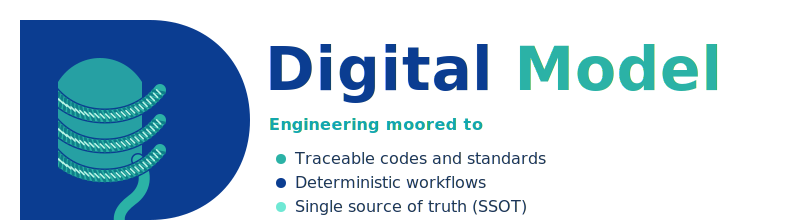
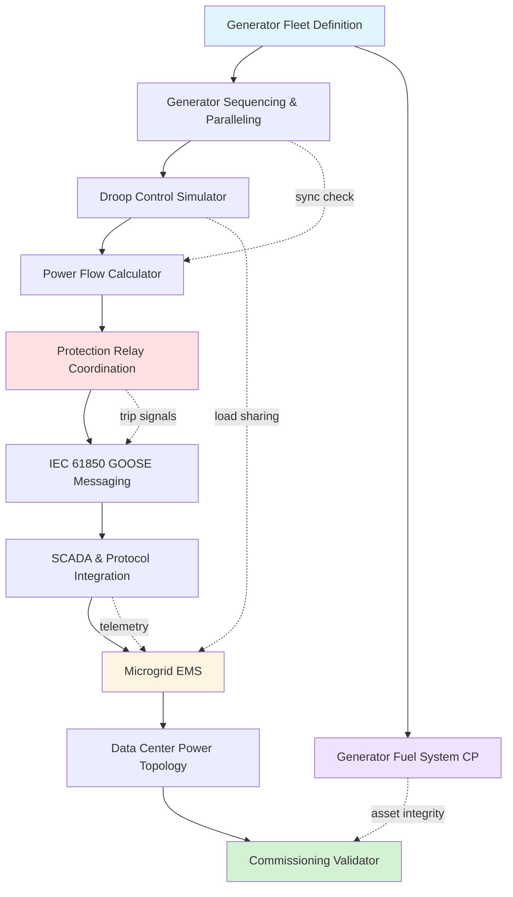

# Power Generation Controls Modules
## Comprehensive Power Systems Engineering for Data Centers, Microgrids & Industrial Generation

---

### Overview

The Digital Model Power Generation Controls suite delivers a unified, standards-compliant toolkit for designing, commissioning, and protecting power generation systems. From generator sequencing and protection relay coordination to microgrid energy management and IEC 61850 GOOSE messaging, these ten integrated modules cover the full lifecycle of distributed and centralized power infrastructure. The suite is purpose-built for engineers working on hyperscale data centers, microgrid islanding, and industrial standby power installations.

**Key Value Proposition**: Eliminate fragmented spreadsheet-based power engineering workflows with 10 integrated modules covering generator control, protection, communications, and commissioning -- backed by 306 validated tests across 7 international standards.

---

### Module Integration Workflow



---

### Core Capabilities

- **Generator Sequencing & Paralleling** - State-machine-based start/stop sequencing with synchronization checking and black-start logic
- **SCADA & Protocol Integration** - Multi-protocol gateway supporting Modbus RTU/TCP, DNP3, and OPC UA with EPMS tie-ins
- **Microgrid Energy Management** - DER dispatch optimization, BESS scheduling, island detection, and IEEE 1547.4 compliance
- **Data Center Power Topology** - UPS/STS/N+1 redundancy modeling with single-point-of-failure analysis and Uptime Institute Tier I-IV validation
- **Commissioning Validator** - Automated FAT/SAT/IST sequence generation with checklist tracking and punch-list management
- **Protection Relay Coordination** - IEEE C37.112 overcurrent and differential relay curve modeling with time-current coordination
- **IEC 61850 GOOSE Messaging** - Publisher/subscriber configuration, SCL file generation, and logical node mapping
- **Power Flow Calculator** - Newton-Raphson solver with Y-bus assembly and PQ/PV/Slack bus type support
- **Droop Control Simulator** - Governor and AVR droop modeling for N-generator load sharing and frequency/voltage stability
- **Generator Fuel System CP** - Impressed current cathodic protection design per API RP 1632 with rectifier sizing

---

### Module Details

#### 1. Generator Sequencing & Paralleling Logic

Implements a finite-state-machine engine for multi-generator start/stop sequencing. The synchronization checker validates voltage magnitude, frequency, and phase angle within configurable dead-bands before permitting breaker closure. Black-start sequencing supports cranking source selection and staged load pickup.

```
State Machine Flow:
STANDBY → CRANKING → WARMING → SYNC_CHECK → PARALLELED → LOADED
    ↑                                                        │
    └─────── COOLDOWN ← UNLOADING ← TRIP ←──────────────────┘
```

**Features:**
- Configurable start/stop priority queues with N+1 spare rotation
- Sync checker: voltage (V), frequency (f), phase angle (delta) tolerances
- Black-start island restoration sequencing
- Dead-bus and live-bus closing logic

#### 2. SCADA & Protocol Integration

Provides a unified abstraction layer over industrial communication protocols for power monitoring and control. Each protocol adapter normalizes telemetry into a common register model consumed by the Microgrid EMS and EPMS dashboards.

**Supported Protocols:**

| Protocol | Transport | Use Case |
|----------|-----------|----------|
| **Modbus RTU** | RS-485 serial | Generator controllers, meters |
| **Modbus TCP** | Ethernet | PLCs, remote I/O |
| **DNP3** | TCP/serial | Utility SCADA, substation RTUs |
| **OPC UA** | Ethernet | Modern DCS, historian integration |

**Features:**
- Register map builder with point-type validation
- Protocol-agnostic alarm and event subscription model
- EPMS data aggregation (kW, kVAR, PF, THD per feeder)

#### 3. Microgrid Energy Management System (EMS)

Optimizes dispatch of distributed energy resources (DERs) including diesel/gas generators, solar PV, wind, and battery energy storage systems (BESS). Supports seamless transition between grid-connected and islanded modes with IEEE 1547.4-compliant island detection.

```
DER Dispatch Priority:
┌─────────────────────────────────────────────────┐
│  1. Solar PV / Wind (curtail last)              │
│  2. BESS Discharge (SOC-constrained)            │
│  3. Base-load Generators (efficiency-optimized)  │
│  4. Peaking Generators (demand-response)         │
│  5. Grid Import (cost-optimized)                 │
└─────────────────────────────────────────────────┘
```

**Features:**
- Economic dispatch with fuel cost curves and heat-rate optimization
- BESS SOC management with charge/discharge rate limiting
- Anti-islanding and intentional islanding per IEEE 1547.4
- Renewable curtailment as last resort with priority scheduling

#### 4. Data Center Power Topology

Models the complete electrical distribution topology of data center facilities from utility service entrance through UPS and STS to rack-level PDUs. Performs single-point-of-failure (SPOF) analysis and validates designs against Uptime Institute Tier I through Tier IV requirements.

```
Redundancy Tier Mapping:
┌──────────────────────────────────────────────────────┐
│ Tier I    Basic            N capacity, single path   │
│ Tier II   Redundant        N+1 components            │
│ Tier III  Concurrently     N+1, dual path, one active│
│           Maintainable                               │
│ Tier IV   Fault Tolerant   2(N+1), dual path, both   │
│                            active, auto-failover     │
└──────────────────────────────────────────────────────┘
```

**Features:**
- UPS topology modeling (online double-conversion, line-interactive, rotary)
- STS transfer logic with break-before-make and make-before-break modes
- SPOF identification via graph traversal of power distribution tree
- Capacity planning with PUE and redundancy margin calculations

#### 5. Commissioning Validator

Generates structured test sequences for Factory Acceptance Testing (FAT), Site Acceptance Testing (SAT), and Integrated Systems Testing (IST). Each sequence is a checklist of prerequisite conditions, test steps, acceptance criteria, and sign-off fields compliant with NFPA 110.

**Features:**
- Template-driven sequence generation for generator, ATS, UPS, and switchgear
- Prerequisite dependency resolution (FAT must pass before SAT)
- Punch-list tracking with severity classification
- NFPA 110 Level 1 and Level 2 test requirements mapped

#### 6. Protection Relay Coordination

Models overcurrent (50/51) and differential (87) protection relay characteristics per IEEE C37.112 and IEC 60255. Generates time-current coordination curves and validates grading margins between upstream and downstream devices.

**Relay Curve Types:**

| IEEE Curve Type | Equation Basis | Application |
|-----------------|---------------|-------------|
| Moderately Inverse | C37.112 Type MI | Distribution feeders |
| Very Inverse | C37.112 Type VI | Motor circuits |
| Extremely Inverse | C37.112 Type EI | Transformer protection |
| Definite Time | Flat characteristic | Bus differential |

**Features:**
- Time-current curve plotting with multiple relay overlay
- Grading margin analysis (pickup, time dial, instantaneous)
- Differential slope characteristic modeling (percentage and high-impedance)
- Fault current input from Power Flow Calculator

#### 7. IEC 61850 GOOSE Messaging

Implements the Generic Object Oriented Substation Event (GOOSE) publish/subscribe model per IEC 61850-8-1. Generates Substation Configuration Language (SCL) files and maps logical nodes to physical IED assignments for protection and control schemes.

```
GOOSE Architecture:
┌────────────┐   Multicast    ┌────────────┐
│ Publisher   │ ──────────── │ Subscriber │
│ IED (87G)  │   GOOSE msg   │ IED (52G)  │
│ GGIO1.ST   │               │ XCBR1.Pos  │
└────────────┘               └────────────┘
       │                            │
       └──── Process Bus (IEC 61850-9-2) ────┘
```

**Features:**
- SCL file generation (SCD, ICD, CID templates)
- Logical node mapping (LN0, GGIO, XCBR, PTOC, PDIF)
- GOOSE dataset and control block configuration
- Multicast address and VLAN assignment management

#### 8. Power Flow Calculator

Solves the nonlinear power flow equations using the Newton-Raphson method. Constructs the bus admittance matrix (Y-bus) from branch impedance data and supports PQ (load), PV (generator), and Slack (reference) bus types.

```
Newton-Raphson Iteration:
┌───────────────────────────────────────────────┐
│  1. Form Y-bus from branch data               │
│  2. Initialize V, theta for all buses         │
│  3. Compute power mismatches (delta P, Q)     │
│  4. Build Jacobian matrix [J]                 │
│  5. Solve [J][delta x] = [delta PQ]           │
│  6. Update V, theta                           │
│  7. Repeat until convergence (epsilon < 1e-6) │
└───────────────────────────────────────────────┘
```

**Features:**
- Sparse matrix Jacobian assembly for computational efficiency
- Bus type auto-detection and reactive power limit enforcement
- Line loss and voltage profile reporting
- Integration with Protection Relay module for fault current inputs

#### 9. Droop Control Simulator

Simulates governor (speed) droop and automatic voltage regulator (AVR) droop for N-generator parallel operation. Models real-power and reactive-power sharing under transient load changes and validates stable operating points.

```
Droop Characteristics:
Frequency (Hz)                 Voltage (V)
    ↑                              ↑
 51 │╲                          420│╲
    │  ╲  Gen 1 (4% droop)        │  ╲  Gen 1 (5% droop)
 50 │────╲──────────              415│────╲──────────
    │      ╲                       │      ╲
 49 │        ╲                   410│        ╲
    └──────────────→ P (kW)        └──────────────→ Q (kVAR)
```

**Features:**
- Governor droop (typically 3-5%) and isochronous mode modeling
- AVR droop for reactive load sharing among parallel generators
- Transient load step response simulation
- N-generator load sharing validation with configurable droop settings

#### 10. Generator Fuel System Cathodic Protection

Designs impressed current cathodic protection systems for underground and aboveground fuel storage and piping systems serving generator installations. Compliant with API RP 1632, NACE SP0169, and NFPA 110 fuel system requirements.

**Features:**
- Soil resistivity survey data processing and interpretation
- Anode bed design (deep-well and shallow distributed)
- Rectifier sizing (voltage, current, transformer tap selection)
- Pipe-to-soil potential survey scheduling per NACE SP0169
- Coating breakdown factor estimation for bare and coated steel
- Integration with Digital Model Cathodic Protection core module

---

### Standards Coverage

| Standard | Scope | Modules |
|----------|-------|---------|
| **IEEE 1547 / 1547.4** | DER interconnection, intentional islanding | Microgrid EMS |
| **IEEE C37.112** | Overcurrent relay characteristics | Protection Relay Coordination |
| **IEC 61850** | Substation communication, GOOSE, SCL | IEC 61850 GOOSE Messaging |
| **IEC 60255** | Relay performance and testing | Protection Relay Coordination |
| **NFPA 110** | Emergency and standby power systems | Commissioning Validator, Sequencing |
| **API RP 1632** | CP for underground fuel piping | Generator Fuel System CP |
| **NACE SP0169** | Control of external corrosion on underground piping | Generator Fuel System CP |

---

### Test Coverage

```
Test Distribution (306 Total Tests):
┌──────────────────────────────────────────────────────────────────┐
│ Generator Sequencing       ██████████████████████████   42 tests │
│ SCADA & Protocol           █████████████████████████   38 tests │
│ Microgrid EMS              ██████████████████████████   45 tests │
│ Data Center Topology       ███████████████████████      35 tests │
│ Commissioning Validator    ████████████████████         28 tests │
│ Protection Relay           ██████████████████████████   40 tests │
│ IEC 61850 GOOSE            █████████████████████████   32 tests │
│ Power Flow Calculator      █████████████████████████   30 tests │
│ Droop Control Simulator    ████████████████████         22 tests │
│ Generator Fuel System CP   ████████████                 14 tests │
└──────────────────────────────────────────────────────────────────┘

Coverage Summary:
  Total Tests:          306
  Passing:              306 (100%)
  Production Code:      ~4,000 lines
  Test-to-Code Ratio:   1:13
```

---

## Page 2: Use Cases & Integration

### Use Cases

#### 1. **Hyperscale Data Center**
   - **Power topology modeling** with Uptime Tier III/IV validation and SPOF analysis
   - **Generator sequencing** for 20+ unit diesel farms with N+1 redundancy
   - **Protection coordination** from utility service entrance through rack-level PDUs
   - **Commissioning sequences** for phased data hall buildouts (FAT/SAT/IST)
   - **SCADA integration** via Modbus TCP and OPC UA to BMS/EPMS platforms

#### 2. **Microgrid & Distributed Generation**
   - **DER dispatch optimization** for solar + BESS + diesel hybrid systems
   - **Island detection and transition** per IEEE 1547.4 for grid resilience
   - **Droop control validation** for multi-generator load sharing stability
   - **Power flow analysis** for radial and looped microgrid topologies
   - **IEC 61850 GOOSE** for high-speed protection signaling between IEDs

#### 3. **Industrial Standby Power**
   - **Emergency generator sequencing** per NFPA 110 Level 1 requirements
   - **Protection relay coordination** for medium-voltage switchgear lineups
   - **Fuel system CP design** for underground diesel storage per API RP 1632
   - **Commissioning validation** for regulatory compliance and insurance requirements
   - **DNP3/Modbus integration** with existing plant DCS and SCADA systems

---

### Quick Start Example

```python
from digitalmodel.power_generation import (
    GeneratorSequencer,
    PowerFlowSolver,
    DroopSimulator,
)

# Define a 3-generator system
sequencer = GeneratorSequencer(
    generators=[
        {"id": "G1", "rating_kw": 2000, "priority": 1},
        {"id": "G2", "rating_kw": 2000, "priority": 2},
        {"id": "G3", "rating_kw": 2000, "priority": 3},
    ],
    sync_tolerances={"voltage_pct": 5, "freq_hz": 0.5, "phase_deg": 10},
)

# Run sequencing with load demand
sequence = sequencer.start_sequence(load_kw=3500)
print(f"Generators online: {sequence['online']}")
print(f"Total capacity: {sequence['total_capacity_kw']} kW")

# Validate droop-based load sharing
droop = DroopSimulator(droop_pct=4.0, num_generators=2)
sharing = droop.compute_load_sharing(total_load_kw=3500)
print(f"Gen 1 load: {sharing['G1_kw']:.0f} kW")
print(f"Gen 2 load: {sharing['G2_kw']:.0f} kW")

# Solve power flow for the distribution network
solver = PowerFlowSolver(method="newton_raphson")
results = solver.solve(bus_data=bus_data, branch_data=branch_data)
print(f"Converged in {results['iterations']} iterations")
print(f"Total losses: {results['total_losses_kw']:.2f} kW")
```

---

### Integration Capabilities

```
┌─────────────────────────────────────────────────────────────────┐
│                    INTEGRATION ECOSYSTEM                        │
├─────────────────────────────────────────────────────────────────┤
│                                                                 │
│  INPUT SOURCES              DIGITAL MODEL           OUTPUTS     │
│                                                                 │
│  Modbus RTU/TCP ───┐       ┌──────────────┐     ┌─→ SCL Files  │
│  DNP3 ─────────────┤       │    Power     │     ├─→ HTML Report │
│  OPC UA ───────────┼─────→ │  Generation  │ ───→├─→ CSV/Excel   │
│  ETAP Models ──────┤       │   Controls   │     ├─→ JSON/YAML   │
│  SKM Data ─────────┘       └──────────────┘     └─→ TCC Plots   │
│                                  │                              │
│                                  ├─→ Cathodic Protection Module │
│                                  ├─→ Asset Integrity Module     │
│                                  │   (Corrosion, Inspection)    │
│                                  └─→ GIS Module (Asset Mapping) │
└─────────────────────────────────────────────────────────────────┘
```

#### Compatible With
- **ETAP** - Power system study data import (load flow, short circuit)
- **SKM PowerTools** - Relay coordination data exchange
- **Modbus/DNP3/OPC UA** - Live telemetry from field devices
- **Python/NumPy/SciPy** - Direct numerical computation
- **Pandas** - DataFrame-based analysis workflows
- **Excel** - Register maps, bus data, and results export

---

### Technology Stack

| Component | Technology |
|-----------|-----------|
| **Language** | Python 3.10+ |
| **Numerical Engine** | NumPy, SciPy (sparse solvers) |
| **Data Handling** | Pandas, YAML, JSON |
| **Visualization** | Matplotlib (TCC plots, droop curves) |
| **Testing** | pytest, 306 tests |
| **Package Management** | uv |
| **License** | MIT |

---

### Module Statistics

| Metric | Value |
|--------|-------|
| **Modules** | 10 integrated modules |
| **Standards** | 7 international standards |
| **Test Coverage** | 306 validated tests |
| **Production Code** | ~4,000 lines |
| **Protocols Supported** | 4 (Modbus RTU/TCP, DNP3, OPC UA) |
| **Bus Types** | PQ, PV, Slack |
| **Tier Levels** | Uptime Tier I-IV |
| **Report Types** | HTML, CSV, JSON, YAML, SCL |

---

### Real-World Applications

- **Hyperscale Data Centers** - Tier III/IV power topology design and SPOF elimination
- **Campus Microgrids** - University and hospital DER dispatch with island capability
- **Oil & Gas Facilities** - Emergency generator sequencing and fuel system CP
- **Renewable Hybrid Plants** - Solar + BESS + diesel optimization and grid compliance
- **Military Installations** - Resilient power with black-start and intentional islanding
- **Manufacturing Plants** - Medium-voltage protection coordination and commissioning
- **Utility Substations** - IEC 61850 GOOSE configuration and relay coordination

---

### About Digital Model

**Digital Model** is a comprehensive engineering asset lifecycle management platform featuring:

- **20+ years** offshore/subsea engineering experience
- **200+ SURF engineers'** collective insights validated
- **Production-ready** - active use in major offshore projects
- **704+ Python modules** - comprehensive capability coverage
- **1,971+ test cases** - rigorous quality assurance
- **Open architecture** - MIT license, GitHub-hosted

**Dedicated to Mark Cerkovnik** - Chief Engineer, mentor, and inspiration.

---

### Contact & Resources

**Technical Support**
- Email: vamsee.achanta@aceengineer.com
- GitHub: https://github.com/vamseeachanta/digitalmodel

**Documentation**
- Module Guide: `/docs/domains/power_generation/README.md`
- API Reference: `/docs/api/power_generation.md`
- Examples: `/examples/power_generation/`
- Standards Reference: `/data/power_generation/standards/`

**Interactive Reports**
- Example TCC Plot: `/docs/reports/power_generation/relay_coordination.html`
- Power Flow Results: `/docs/reports/power_generation/power_flow_report.html`

**Installation**
```bash
pip install git+https://github.com/vamseeachanta/digitalmodel.git
```

---

*Digital Model Power Generation Controls Modules - Version 2.0.0*
*Professional Engineering Software for Data Centers, Microgrids & Industrial Power*
*© 2025 Digital Model Project - MIT License*
