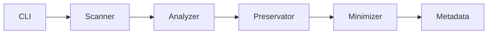

# 🤖 Create Go-By Folder Tool - Agent Quick Start Guide

## Purpose
This specification defines a Python tool that creates lightweight, representative "go-by" versions of large project folders, reducing size by >99% while preserving structure, patterns, and key examples.

## Quick Navigation
- **Main Spec**: [spec.md](./spec.md) - Complete technical specification
- **Task Breakdown**: [tasks.md](./tasks.md) - Implementation tasks with time estimates  
- **Prompt History**: [prompt.md](./prompt.md) - Requirements evolution and decisions
- **Template Doc**: [template.md](./template.md) - Original requirements template

## Tool Overview

### What It Does
Transforms large folders (up to 10GB) into compact templates that:
- Preserve complete directory structure
- Keep ONE original file per type unchanged
- Replace variations with lightweight representatives
- Generate AI-friendly documentation

### Key Features
| Feature | Description |
|---------|-------------|
| **Size Reduction** | >99% compression (excluding preserved originals) |
| **Original Preservation** | One authentic file per type/pattern |
| **Smart Minimization** | Context-aware file reduction |
| **Progress Tracking** | Real-time progress with ETA |
| **Error Recovery** | Checkpoint saves and resume capability |
| **User Interaction** | Prompts for ambiguous decisions |

## Technical Architecture

### Module Structure
```
create_go_by/
├── cli.py                 # Command interface (argparse)
├── scanner.py             # File system traversal
├── analyzer.py            # Pattern detection
├── preservator.py         # Original selection
├── minimizer.py           # File reduction
├── metadata_generator.py  # Documentation creation
├── progress_reporter.py   # Progress tracking
└── error_handler.py       # Recovery system
```

### Core Workflow
1. **Scan** source folder (max 10GB)
2. **Analyze** patterns and variations
3. **Select** originals (chronologically oldest)
4. **Minimize** variation files
5. **Generate** metadata and documentation
6. **Report** completion with statistics

## Implementation Plan

### Phase Summary (64 hours total)
1. **Setup & Infrastructure** (8h) - Project structure, CLI, validation
2. **File Operations** (12h) - Scanner, analyzer, preservation logic
3. **Processing** (10h) - Minimizers for different file types
4. **Metadata** (8h) - JSON/YAML/Markdown generation
5. **User Interaction** (6h) - Progress, prompts, warnings
6. **Advanced Features** (8h) - Checkpoints, recovery, optimization
7. **Testing** (10h) - Unit, integration, documentation
8. **Deployment** (4h) - Packaging, distribution

### Critical Path


## Key Decisions Made

### File Selection
- **Strategy**: Chronological (oldest first)
- **Rationale**: Preserves historical baseline
- **Implementation**: Sort by creation time, fallback to modification

### Size Limits
- **Maximum**: 10GB source folder
- **Handling**: User prompted for confirmation if exceeded
- **Rationale**: Balance between utility and performance

### User Interaction Points
1. **Compressed files** (.zip, .7z) - Ask for handling
2. **Symlinks** - Document and request guidance
3. **Large duplicates** (>50KB) - User resolution
4. **Overwrite** - Explicit flag required
5. **Sensitive data** - Alert if detected

### Error Recovery
- **Checkpoints**: Every 1000 files
- **Resume**: `--resume` flag
- **Rollback**: `--rollback` flag
- **Repair**: `--repair` flag

## Output Structure

### Generated Files
```
go-by-folder/
├── AGENT_OVERVIEW.md      # AI-friendly guide
├── GO_BY_METADATA.json    # Statistics and rules
├── GO_BY_MAPPING.json     # File mappings
├── _originals/            # Preserved originals
│   └── ORIGINALS_INDEX.md # Original file list
├── _templates/            # Pattern templates
├── _samples/              # Representative samples
└── [source_structure]/    # Minimized files
```

### Metadata Schema
```json
{
  "source": "path/to/original",
  "created": "ISO-8601",
  "statistics": {
    "total_files": 1234,
    "original_size": "2.5GB",
    "goby_size": "18MB",
    "compression_ratio": 0.72
  },
  "patterns": {...},
  "preservation_strategy": "chronological"
}
```

## Success Criteria
- ✅ Go-by <1% of original (excluding originals)
- ✅ All patterns represented
- ✅ Originals unchanged in `_originals/`
- ✅ AGENT_OVERVIEW.md readable in <5 min
- ✅ Processes 1GB in <2 minutes
- ✅ Memory usage <500MB for 10GB source

## Testing Strategy

### Coverage Areas
- **Unit**: Each module independently
- **Integration**: End-to-end workflows
- **Performance**: Large folder handling
- **Recovery**: Checkpoint/resume functionality
- **Edge Cases**: Symlinks, duplicates, special files

### Test Data
- Small project (100 files, <10MB)
- Medium project (1000 files, ~100MB)
- Large project (10000 files, ~1GB)
- Edge cases folder (symlinks, duplicates)

## Development Guidelines

### Code Standards
- Python 3.10+ with type hints
- Black formatting
- Comprehensive docstrings
- Error handling with custom exceptions
- Logging at appropriate levels

### Dependencies
- `click` or `argparse` for CLI
- `tqdm` for progress bars
- `pyyaml` for YAML support
- `pytest` for testing

## Next Steps for Implementation

1. **Set up project** with uv/poetry
2. **Implement CLI** with all arguments
3. **Create scanner** with progress hooks
4. **Build analyzer** for pattern detection
5. **Develop minimizers** for each file type
6. **Generate metadata** files
7. **Add error recovery**
8. **Write comprehensive tests**
9. **Package for distribution**

## Quick Reference for Developers

### Key Classes
- `CreateGoBy` - Main orchestrator
- `FileScanner` - Directory traversal
- `PatternAnalyzer` - Pattern detection
- `FilePreservator` - Original selection
- `FileMinimizer` - Size reduction
- `MetadataGenerator` - Documentation

### Command Examples
```bash
# Basic usage
create-go-by -s ./source -t ./target

# With options
create-go-by -s ./source -t ./target --overwrite --max-file-size 5KB

# Resume from checkpoint
create-go-by --resume -t ./target

# Analysis mode
create-go-by -s ./simulations -t ./template --analysis-mode
```

## Important Notes
- Original files are NEVER modified
- User decisions are documented for consistency
- All prompts have sensible defaults
- Progress is saved for resumability
- Errors don't corrupt partial output