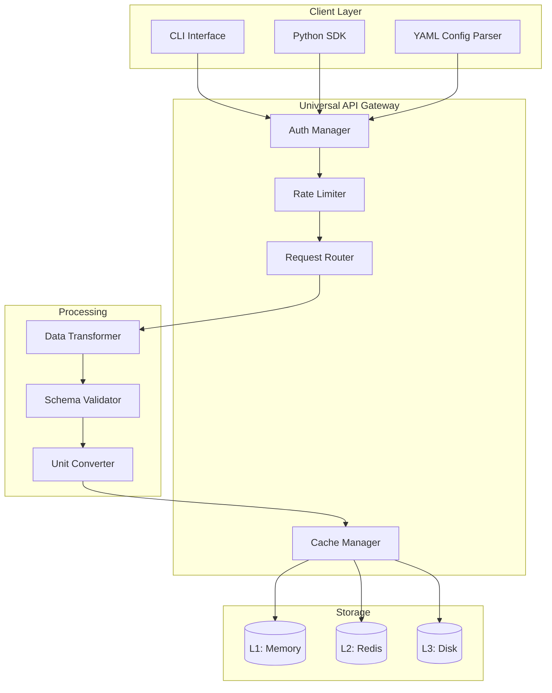
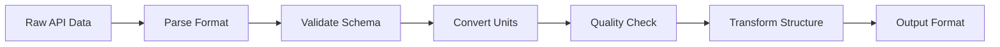

# Common Components for Data Procurement

> **Version**: 1.0.0
> **Created**: 2025-10-23
> **Status**: Active Reference Module
> **Purpose**: DRY (Don't Repeat Yourself) shared components for all data procurement specifications

---

## Overview

This module defines **reusable components** shared across all asset-specific data procurement specifications. Following the DRY principle, common architecture patterns, API client configurations, testing frameworks, and infrastructure are defined once here and referenced by individual asset specs.

**Referenced By:**
- Metocean Data Specification
- Vessel Systems Specification
- Mooring Systems Specification
- Riser Systems Specification
- Pipeline Systems Specification
- Wind Systems Specification
- And all future data procurement modules

---

## Universal API Client Framework

### Core Architecture



### Protocol Support
- **REST APIs**: HTTP/1.1, HTTP/2, HTTP/3
- **Authentication**: API Keys, OAuth2, JWT, HMAC
- **Data Formats**: JSON, XML, CSV, NetCDF, HDF5, GRIB
- **Compression**: gzip, br, deflate

---

## Multi-Tier Caching System

### Cache Hierarchy

| Tier | Storage | Latency | TTL | Use Case |
|------|---------|---------|-----|----------|
| **L1** | In-Memory (LRU) | <10ms | 5 min | Hot data, frequent access |
| **L2** | Redis Cluster | <50ms | 1 hour | Session data, user queries |
| **L3** | Disk (Parquet/HDF5) | <200ms | 1 day - 30 days | Historical data, batch jobs |

### Cache Invalidation Strategies
1. **Time-based**: TTL expiration
2. **Event-based**: Data source updates
3. **Capacity-based**: LRU eviction
4. **Manual**: User-triggered refresh

---

## Configuration Management

### YAML Schema Structure

```yaml
# Common configuration schema for all data procurement modules
version: "1.0"

data_source:
  category: "string"          # metocean, vessel, mooring, etc.
  provider: "string"          # API provider name
  api_type: "REST|GraphQL"    # API protocol
  base_url: "string"          # Base API endpoint

authentication:
  method: "api_key|oauth2|jwt"
  credentials:
    key: "${ENV_VAR}"         # Environment variable reference
    secret: "${ENV_VAR}"

rate_limiting:
  requests_per_minute: integer
  burst_capacity: integer

caching:
  enabled: boolean
  ttl_seconds: integer
  tier: "L1|L2|L3"

data_format:
  input: "json|xml|csv|netcdf"
  output: "json|parquet|hdf5"

validation:
  schema: "path/to/schema.json"
  strict_mode: boolean

units:
  system: "SI|Imperial|Mixed"
  conversions:
    - from: "string"
      to: "string"
```

### Environment Variables (Security)

```bash
# Common environment variables for all data procurement
export DATA_PROCUREMENT_CACHE_DIR="/path/to/cache"
export DATA_PROCUREMENT_LOG_LEVEL="INFO"
export DATA_PROCUREMENT_MAX_RETRIES=3
export DATA_PROCUREMENT_TIMEOUT=30

# Per-provider API keys (asset-specific)
export NOAA_API_KEY="your_key_here"
export OPEN_METEO_API_KEY="your_key_here"
```

---

## Data Transformation Pipeline

### Transformation Stages



### Standard Transformers

1. **Format Parsers**
   - JSON → Python dict
   - XML → Python dict
   - CSV → Pandas DataFrame
   - NetCDF → xarray Dataset
   - GRIB → xarray Dataset

2. **Unit Converters**
   - SI ↔ Imperial
   - Coordinate systems (lat/lon, UTM, local)
   - Time zones (UTC, local)
   - Angular units (degrees, radians)

3. **Quality Validators**
   - Range checks (min/max)
   - Missing data detection
   - Outlier identification
   - Consistency checks

---

## Testing Framework

### Test Structure (Common to All Asset Specs)

```python
# Common test structure for all data procurement modules
import pytest
from digitalmodel.data_procurement import BaseAPIClient

@pytest.fixture
def api_client():
    """Common API client fixture"""
    return BaseAPIClient(config_path="configs/test_config.yml")

class TestAPIIntegration:
    """Integration tests (no mocks - use real APIs/data)"""

    def test_connection(self, api_client):
        """Test API connectivity"""
        assert api_client.health_check() is True

    def test_data_retrieval(self, api_client):
        """Test data retrieval with real API"""
        data = api_client.fetch(params={"test": "param"})
        assert data is not None

    def test_caching(self, api_client):
        """Test caching behavior"""
        # First call - cache miss
        data1 = api_client.fetch(params={"test": "cache"})
        # Second call - cache hit
        data2 = api_client.fetch(params={"test": "cache"})
        assert data1 == data2

class TestDataValidation:
    """Data validation tests"""

    def test_schema_validation(self, api_client):
        """Test data against schema"""
        data = api_client.fetch(params={"test": "schema"})
        assert api_client.validate_schema(data) is True

    def test_unit_conversion(self, api_client):
        """Test unit conversions"""
        data_si = api_client.fetch(units="SI")
        data_imperial = api_client.convert_units(data_si, target="Imperial")
        assert data_imperial is not None

class TestPerformance:
    """Performance benchmarks"""

    def test_latency(self, api_client, benchmark):
        """Measure API latency"""
        result = benchmark(api_client.fetch, params={"test": "latency"})
        assert result is not None

    def test_throughput(self, api_client):
        """Test concurrent requests"""
        import concurrent.futures
        with concurrent.futures.ThreadPoolExecutor(max_workers=10) as executor:
            futures = [executor.submit(api_client.fetch) for _ in range(100)]
            results = [f.result() for f in futures]
        assert len(results) == 100
```

### Test Requirements (All Modules)

- **No Mocks**: Use real APIs and repository data
- **Coverage**: >90% code coverage
- **Performance**: <100ms for cached data, <2s for fresh data
- **Integration**: Test with actual data sources

---

## Error Handling & Resilience

### Error Categories

```python
# Common exception hierarchy
class DataProcurementError(Exception):
    """Base exception for all data procurement errors"""
    pass

class APIConnectionError(DataProcurementError):
    """API connection failures"""
    pass

class AuthenticationError(DataProcurementError):
    """Authentication failures"""
    pass

class RateLimitError(DataProcurementError):
    """Rate limit exceeded"""
    pass

class ValidationError(DataProcurementError):
    """Data validation failures"""
    pass

class TransformationError(DataProcurementError):
    """Data transformation failures"""
    pass
```

### Retry Strategy

```python
# Common retry configuration
RETRY_CONFIG = {
    "max_attempts": 3,
    "backoff_factor": 2,  # Exponential backoff
    "retry_on": [
        APIConnectionError,
        RateLimitError,
    ],
    "no_retry_on": [
        AuthenticationError,
        ValidationError,
    ]
}
```

---

## Performance Requirements (Universal)

### Latency Targets

| Operation | P50 | P95 | P99 | Max |
|-----------|-----|-----|-----|-----|
| **Cached Data** | <10ms | <50ms | <100ms | <200ms |
| **Fresh Data** | <500ms | <1s | <2s | <5s |
| **Batch (1000 req)** | <5s | <10s | <15s | <30s |

### Throughput Targets

- **Sustained**: 1,000 requests/second
- **Burst**: 5,000 requests/second (10s)
- **Concurrent**: 1,000 simultaneous connections

### Reliability Targets

- **Availability**: 99.9% (8.76 hours downtime/year)
- **Error Rate**: <0.1% for system errors
- **Recovery Time**: <30 seconds for failover

---

## Security Standards (Universal)

### Data Protection

- **Transit**: TLS 1.3 minimum
- **Storage**: AES-256 encryption
- **API Keys**: Environment variables only, never hardcoded
- **Credentials**: Vault/secrets manager integration

### Access Control

- **Rate Limiting**: Per-user and per-IP limits
- **Authentication**: API key rotation every 90 days
- **Logging**: Complete audit trail for all API access

### Compliance

- **Data Privacy**: GDPR compliant
- **Data Residency**: Configurable storage location
- **Retention**: Automatic purging per policy

---

## Observability & Monitoring

### Metrics (Prometheus Format)

```python
# Common metrics for all data procurement modules
from prometheus_client import Counter, Histogram, Gauge

# Request metrics
api_requests_total = Counter(
    'data_procurement_requests_total',
    'Total API requests',
    ['category', 'provider', 'status']
)

api_request_duration = Histogram(
    'data_procurement_request_duration_seconds',
    'API request duration',
    ['category', 'provider']
)

# Cache metrics
cache_hits = Counter(
    'data_procurement_cache_hits_total',
    'Cache hits',
    ['tier', 'category']
)

cache_misses = Counter(
    'data_procurement_cache_misses_total',
    'Cache misses',
    ['tier', 'category']
)

# Error metrics
api_errors = Counter(
    'data_procurement_errors_total',
    'API errors',
    ['category', 'provider', 'error_type']
)
```

### Structured Logging

```python
import structlog

log = structlog.get_logger()

# Common log structure
log.info(
    "api_request",
    category="metocean",
    provider="NOAA",
    endpoint="/data/wave",
    duration_ms=123,
    cache_hit=False,
    status="success"
)
```

---

## FREE API Registry

### Universal Free APIs (Usable Across Categories)

| API | Provider | Coverage | Rate Limit | Auth | Data Format |
|-----|----------|----------|------------|------|-------------|
| **NOAA APIs** | NOAA | Global metocean | 1000/day | API Key (free) | JSON, CSV, NetCDF |
| **ERA5 (Copernicus)** | ECMWF | Global weather/ocean | Unlimited | Free account | GRIB, NetCDF |
| **Open-Meteo** | Open-Meteo | Global weather | Unlimited | None | JSON |
| **GEBCO** | GEBCO | Global bathymetry | Unlimited | None | NetCDF, GeoTIFF |
| **MarineTraffic Public** | MarineTraffic | Vessel positions | 5 req/min | None | JSON |
| **OpenSeaMap** | OpenSeaMap | Marine navigation | Unlimited | None | XML |

### API Selection Criteria

✅ **Must Have:**
- Free tier available
- No credit card required
- Public documentation
- Reliable uptime (>99%)

❌ **Exclude:**
- Commercial-only APIs
- Requires payment for basic access
- Deprecated or sunset APIs

---

## Agent Delegation (Common Pattern)

### Universal Agent Roles

| Agent | Responsibilities | Tools | Parallel |
|-------|------------------|-------|----------|
| **Data Agent** | API integration, data fetching | requests, aiohttp | Yes |
| **Testing Agent** | Test creation, validation | pytest, hypothesis | Yes |
| **Transform Agent** | Data transformation, units | pandas, xarray | Yes |
| **Cache Agent** | Cache management, optimization | redis, diskcache | Yes |
| **DevOps Agent** | Infrastructure, monitoring | docker, prometheus | Yes |
| **Security Agent** | Auth, encryption, compliance | cryptography, vault | Yes |
| **Documentation Agent** | API docs, examples | sphinx, mkdocs | Yes |

---

## Directory Structure (Standard)

```
specs/modules/data-procurement/<category-name>/
├── spec.md                    # Main specification
├── configs/
│   ├── production.yml         # Production configuration
│   ├── development.yml        # Development configuration
│   └── test.yml               # Test configuration
├── sub-specs/
│   ├── technical-spec.md      # Technical details
│   ├── api-spec.md            # API specifications
│   ├── tests.md               # Test specifications
│   └── data-schema.md         # Data schemas
├── templates/
│   ├── config_template.yml    # Configuration template
│   └── example_usage.py       # Usage examples
└── diagrams/
    ├── architecture.mmd       # Mermaid diagrams
    └── data-flow.mmd          # Data flow diagrams
```

---

## Usage Pattern (Reference for All Specs)

### Python SDK Usage

```python
from digitalmodel.data_procurement import DataClient

# Initialize client (common pattern)
client = DataClient(
    category="metocean",  # or vessel, mooring, etc.
    config_path="configs/production.yml"
)

# Fetch data (common interface)
data = client.fetch(
    location={"lat": 30.0, "lon": -90.0},
    parameters=["wave_height", "wind_speed"],
    time_range={"start": "2024-01-01", "end": "2024-01-31"}
)

# Transform and validate (common methods)
data_si = client.convert_units(data, target="SI")
validated_data = client.validate(data_si)

# Cache management (common interface)
client.cache.clear(tier="L1")
client.cache.warm_up(params={"common_queries"})
```

---

## Version Control & Updates

### Semantic Versioning

- **Major**: Breaking API changes
- **Minor**: New features, backward compatible
- **Patch**: Bug fixes, no API changes

### Change Log

```markdown
## [1.0.0] - 2025-10-23
### Added
- Initial common components specification
- Universal API client framework
- Multi-tier caching system
- Standard testing framework
- FREE API registry
```

---

## References

- **Web API Integration Spec**: @specs/modules/data-procurement/web-api-integration/spec.md
- **CALM Buoy Data**: @specs/modules/data-procurement/CALM_Buoy_claude.md
- **Repository Data**: @src/digitalmodel/data/
- **Test Framework**: @tests/modules/data_procurement/

---

*Common Components Version 1.0.0*
*Referenced by all data procurement asset specifications*
*Last Updated: 2025-10-23*
