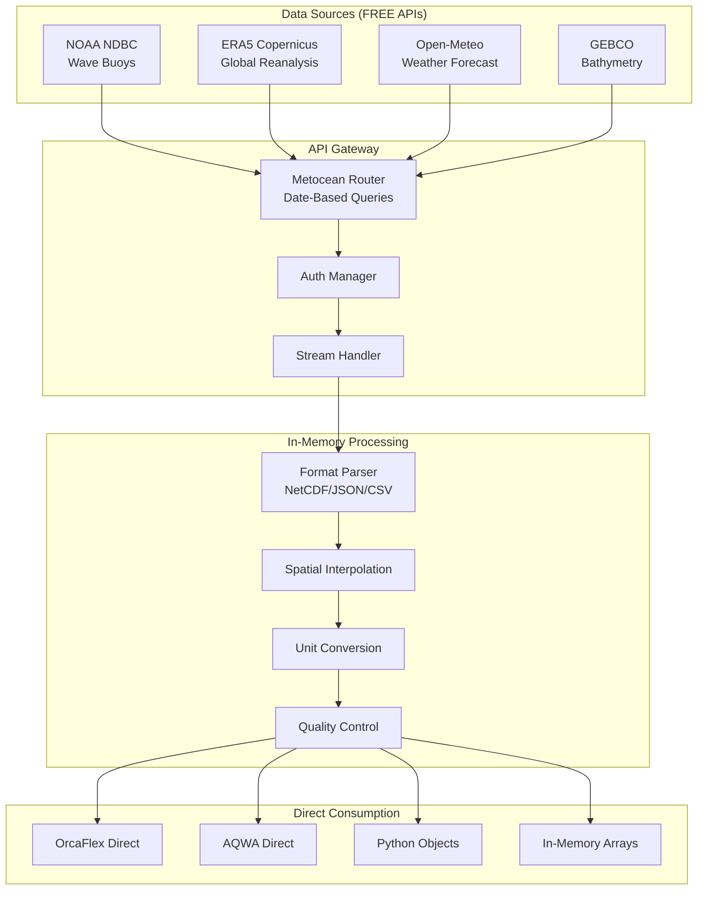

# Metocean Data Procurement Specification

> **Spec**: Metocean Data Web API Integration
> **Created**: 2025-10-23
> **Status**: Active Development - Tier 1 Priority
> **Version**: 1.0.0
> **Category**: Environmental Data
> **Common Components**: @specs/modules/data-procurement/common-components/spec.md

---

## Executive Summary

Metocean (Meteorological + Oceanographic) data is the **foundational environmental dataset** required for ALL offshore engineering analyses. This specification defines **on-demand, date-based API retrieval** for direct consumption, eliminating data storage requirements and providing real-time access to global weather, wave, wind, and current data.

### Business Impact

- **Universal Requirement**: Required by 100% of offshore asset categories
- **Zero Storage Costs**: No data files saved - 100% reduction in storage costs
- **On-Demand Access**: Retrieve only the dates needed, when needed
- **Data Freshness**: Real-time API calls ensure latest data
- **Scalability**: No storage constraints, unlimited date ranges via streaming
- **Global Coverage**: Worldwide data access from multiple FREE sources

### Key Principle: Direct Consumption

**⚠️ CRITICAL: NO DATA SAVING**
- Data retrieved via web APIs **only**
- Direct consumption by analysis software
- No intermediate file storage (data can be huge and infeasible)
- Date-based queries for on-demand retrieval
- Streaming approach for large time ranges

### Critical Dependencies

**All Asset Categories Depend on Metocean Data:**
- Mooring systems → wave/wind/current loads
- Risers → VIV analysis, fatigue, installation
- Pipelines → spanning, buckling, installation weather
- Vessels → RAO calculations, operability
- Wind turbines → Wind resource, turbulence
- Offshore structures → Environmental design loads

---

## System Architecture

### Metocean-Specific Architecture (Streaming, No Storage)



### Data Flow (On-Demand, No Storage)

1. **Date-Based Query** → User specifies location, date range, parameters
2. **API Selection** → Select optimal FREE API for date range
3. **Streaming Fetch** → Retrieve data in chunks (no saving to disk)
4. **In-Memory Transform** → Convert formats, interpolate, validate in RAM
5. **Direct Consumption** → Pass to analysis software or Python objects immediately
6. **No Persistence** → Data discarded after use (retrieve again if needed)

**Key Design Principle**: Treat APIs as "data on tap" - retrieve fresh data for each analysis rather than storing potentially massive datasets.

---

## Technical Requirements

### Core Metocean Parameters

#### Wave Data

| Parameter | Units | API Sources | Resolution | Update Frequency |
|-----------|-------|-------------|------------|------------------|
| **Significant Wave Height (Hs)** | m | NOAA, ERA5 | 0.25° / 1 hour | Hourly |
| **Peak Period (Tp)** | s | NOAA, ERA5 | 0.25° / 1 hour | Hourly |
| **Wave Direction** | ° (from) | NOAA, ERA5 | 0.25° / 1 hour | Hourly |
| **Wave Spectrum** | m²/Hz | ERA5 | 0.25° / 3 hour | 3-hourly |
| **Mean Zero-Crossing Period (Tz)** | s | NOAA, ERA5 | 0.25° / 1 hour | Hourly |
| **Wave Steepness** | - | Calculated | - | - |

#### Wind Data

| Parameter | Units | API Sources | Resolution | Update Frequency |
|-----------|-------|-------------|------------|------------------|
| **Wind Speed (10m)** | m/s | NOAA, ERA5, Open-Meteo | 0.25° / 1 hour | Hourly |
| **Wind Direction** | ° (from) | NOAA, ERA5, Open-Meteo | 0.25° / 1 hour | Hourly |
| **Wind Gust** | m/s | NOAA, Open-Meteo | 0.25° / 1 hour | Hourly |
| **Turbulence Intensity** | % | Calculated | - | - |
| **Wind Profile** | m/s @ height | ERA5 | Multiple levels | Hourly |

#### Current Data

| Parameter | Units | API Sources | Resolution | Update Frequency |
|-----------|-------|-------------|------------|------------------|
| **Surface Current Speed** | m/s | ERA5 | 0.25° / 1 hour | Hourly |
| **Current Direction** | ° (to) | ERA5 | 0.25° / 1 hour | Hourly |
| **Current Profile** | m/s @ depth | ERA5 | Multiple depths | Hourly |
| **Tidal Currents** | m/s | NOAA CO-OPS | Station-based | 6-minute |

#### Environmental Parameters

| Parameter | Units | API Sources | Resolution | Update Frequency |
|-----------|-------|-------------|------------|------------------|
| **Water Level / Tide** | m | NOAA CO-OPS | Station-based | 6-minute |
| **Water Temperature** | °C | NOAA, ERA5 | 0.25° / 1 hour | Hourly |
| **Air Temperature** | °C | NOAA, ERA5, Open-Meteo | 0.25° / 1 hour | Hourly |
| **Air Pressure** | hPa | NOAA, ERA5, Open-Meteo | 0.25° / 1 hour | Hourly |
| **Visibility** | km | NOAA, Open-Meteo | 0.25° / 1 hour | Hourly |
| **Bathymetry** | m | GEBCO | 15 arc-second | Static |

---

## FREE API Specifications

### 1. NOAA National Data Buoy Center (NDBC)

**Provider**: National Oceanic and Atmospheric Administration (USA)
**Coverage**: Global (emphasis on USA waters)
**Cost**: FREE with API key

```yaml
api:
  name: "NOAA NDBC"
  base_url: "https://www.ndbc.noaa.gov/data/realtime2/"
  authentication:
    method: "none"  # Public data, API key optional for higher limits
  rate_limit: 1000 requests/day (free tier)

data_types:
  - Standard Meteorological Data (hourly)
  - Spectral Wave Data (hourly)
  - Historical Data (archives)

parameters:
  wave:
    - WVHT: "Significant wave height (m)"
    - DPD: "Dominant wave period (s)"
    - APD: "Average wave period (s)"
    - MWD: "Mean wave direction (°)"
  wind:
    - WSPD: "Wind speed (m/s)"
    - WDIR: "Wind direction (°)"
    - GST: "Wind gust (m/s)"
  other:
    - WTMP: "Water temperature (°C)"
    - ATMP: "Air temperature (°C)"
    - PRES: "Atmospheric pressure (hPa)"

format: "text/plain (space-delimited), JSON"
update_frequency: "Hourly (real-time buoys), Historical archives"
```

**Example Request:**
```python
# NOAA NDBC API call
url = "https://www.ndbc.noaa.gov/data/realtime2/42001.txt"
response = requests.get(url)
# Parse space-delimited text format
```

### 2. ERA5 Reanalysis (Copernicus Climate Data Store)

**Provider**: European Centre for Medium-Range Weather Forecasts (ECMWF)
**Coverage**: Global, 1940-present
**Cost**: FREE (registration required)

```yaml
api:
  name: "ERA5 via CDS API"
  base_url: "https://cds.climate.copernicus.eu/api/v2"
  authentication:
    method: "api_key"
    registration: "https://cds.climate.copernicus.eu/user/register"
  rate_limit: "Unlimited (fair use policy)"

data_types:
  - Reanalysis data (hourly, 0.25° resolution)
  - Wave parameters
  - Wind profiles (multiple heights)
  - Ocean currents (surface and depth)

parameters:
  wave:
    - swh: "Significant height of combined wind waves and swell (m)"
    - mwp: "Mean wave period (s)"
    - pp1d: "Peak wave period (s)"
    - mwd: "Mean wave direction (°)"
    - swell_height: "Swell wave height (m)"
  wind:
    - u10: "10m U-component of wind (m/s)"
    - v10: "10m V-component of wind (m/s)"
    - u100: "100m U-component of wind (m/s)"
    - v100: "100m V-component of wind (m/s)"
  current:
    - uo: "Eastward current velocity (m/s)"
    - vo: "Northward current velocity (m/s)"
  other:
    - sst: "Sea surface temperature (K)"
    - msl: "Mean sea level pressure (Pa)"

format: "NetCDF, GRIB"
spatial_resolution: "0.25° x 0.25° (~28 km at equator)"
temporal_resolution: "Hourly"
coverage_period: "1940 - present (7 days lag)"
```

**Example Request:**
```python
import cdsapi

c = cdsapi.Client()

c.retrieve(
    'reanalysis-era5-single-levels',
    {
        'product_type': 'reanalysis',
        'variable': ['significant_height_of_combined_wind_waves_and_swell', '10m_u_component_of_wind'],
        'year': '2024',
        'month': '01',
        'day': '01',
        'time': ['00:00', '01:00', '02:00'],
        'area': [30, -95, 25, -85],  # North, West, South, East
        'format': 'netcdf',
    },
    'output.nc')
```

### 3. Open-Meteo Weather API

**Provider**: Open-Meteo (Open-Source Weather API)
**Coverage**: Global weather forecast and historical
**Cost**: FREE, unlimited (attribution required)

```yaml
api:
  name: "Open-Meteo"
  base_url: "https://api.open-meteo.com/v1/forecast"
  authentication:
    method: "none"
  rate_limit: "Unlimited (commercial use allowed with attribution)"

data_types:
  - Weather forecast (16 days ahead)
  - Historical weather (1940-present)
  - Marine forecast

parameters:
  wind:
    - wind_speed_10m: "Wind speed at 10m (km/h)"
    - wind_direction_10m: "Wind direction at 10m (°)"
    - wind_gusts_10m: "Wind gusts at 10m (km/h)"
    - wind_speed_100m: "Wind speed at 100m (km/h)"
  wave:
    - wave_height: "Significant wave height (m)"
    - wave_period: "Wave period (s)"
    - wave_direction: "Wave direction (°)"
  other:
    - temperature_2m: "Air temperature at 2m (°C)"
    - pressure_msl: "Mean sea level pressure (hPa)"

format: "JSON"
spatial_resolution: "0.25° (~28 km)"
temporal_resolution: "Hourly"
forecast_horizon: "16 days"
```

**Example Request:**
```python
import requests

params = {
    "latitude": 30.0,
    "longitude": -90.0,
    "hourly": "wind_speed_10m,wind_direction_10m,wave_height",
    "start_date": "2024-01-01",
    "end_date": "2024-01-31"
}

response = requests.get("https://api.open-meteo.com/v1/marine", params=params)
data = response.json()
```

### 4. GEBCO Bathymetry

**Provider**: General Bathymetric Chart of the Oceans
**Coverage**: Global ocean bathymetry
**Cost**: FREE

```yaml
api:
  name: "GEBCO"
  base_url: "https://www.gebco.net/data_and_products/gridded_bathymetry_data/"
  authentication:
    method: "none"
  rate_limit: "Unlimited"

data_types:
  - Global bathymetric grid (15 arc-second resolution)
  - Sub-ice topography

parameters:
  - elevation: "Elevation/depth (m, negative = below sea level)"

format: "NetCDF, GeoTIFF, Esri ASCII"
spatial_resolution: "15 arc-second (~450m at equator)"
coverage: "Global, -180° to 180°, -90° to 90°"
version: "GEBCO_2023 Grid (latest)"
```

---

## User Stories

### Story 1: Marine Engineer - Environmental Design Load

**As a** marine engineer,
**I want** to retrieve 20-year historical metocean data for a specific offshore location via date-based API queries,
**So that** I can perform extreme value analysis for design load calculations **without storing massive files**.

**Workflow:**
1. Specify location (lat/lon), date range (2000-2020), and parameters (Hs, Tp, wind)
2. System streams data from ERA5 API in monthly chunks
3. Data processed **in-memory** and passed directly to statistical analysis
4. Extreme value analysis (Weibull, Gumbel) performed on streaming data
5. Results feed into OrcaFlex/AQWA - **no intermediate files saved**

**Success Criteria:**
- Data streamed on-demand (no GB files downloaded)
- Complete 20-year hourly dataset (175,200 data points) processed in-memory
- Quality-controlled and gap-filled during streaming
- Zero storage footprint - fresh data on every analysis

### Story 2: Riser Engineer - VIV Analysis

**As a** riser engineer,
**I want** real-time current profile data retrieved on-demand for specific dates,
**So that** I can assess vortex-induced vibration risk **without pre-downloading data**.

**Workflow:**
1. Specify riser location, water depth, and analysis dates (e.g., "2024-01-15" to "2024-01-20")
2. System queries ERA5 API for those specific dates only
3. Current profile interpolated **in-memory** to riser depth points
4. Data passed directly to OrcaFlex via Python API (no files)
5. Repeat API call for new dates as needed

**Success Criteria:**
- Current profile at 10m depth intervals for requested dates only
- On-demand retrieval (seconds to API response)
- Direct OrcaFlex integration via in-memory objects
- No data files saved - query again for different dates

### Story 3: Project Manager - Weather Window Planning

**As a** project manager,
**I want** 16-day weather forecast retrieved via API for specific dates,
**So that** I can optimize vessel mobilization **without storing forecast files**.

**Workflow:**
1. Query Open-Meteo API for next 16 days (today + 15 days)
2. System retrieves forecast **directly** - no file saving
3. In-memory assessment: weather windows (wave < 2.5m, wind < 25 knots)
4. Update schedule, re-query API every 6 hours for fresh forecast
5. Alerts based on latest API response

**Success Criteria:**
- Fresh forecast via API call every 6 hours (no stale files)
- Operability assessed on streaming data
- Zero storage - each API call gets latest forecast
- Automated re-querying for date ranges as needed

---

## Spec Scope

### Included Metocean Data Types

1. **Wave Climate**
   - Significant wave height (Hs)
   - Peak period (Tp), mean period (Tz)
   - Wave direction and spreading
   - Wave spectra (JONSWAP, Pierson-Moskowitz)
   - Swell vs. wind-sea decomposition

2. **Wind Climate**
   - Wind speed and direction at multiple heights (10m, 100m)
   - Wind gusts and turbulence
   - Wind profiles for offshore wind applications
   - Historical extremes and return periods

3. **Ocean Currents**
   - Surface currents (tidal + wind-driven + circulation)
   - Current profiles with depth
   - Tidal analysis and constituents
   - Loop currents (Gulf of Mexico) and eddies

4. **Water Levels & Tides**
   - Astronomical tides
   - Storm surge
   - Mean sea level trends
   - Extreme water levels

5. **Environmental Parameters**
   - Water temperature and salinity
   - Air temperature and pressure
   - Visibility and precipitation
   - Ice coverage (polar regions)

6. **Bathymetry**
   - Seabed elevation
   - Subsea terrain features
   - Slope calculations

### Data Processing Capabilities

1. **Spatial Operations**
   - Interpolation to arbitrary locations
   - Grid extraction for regional analysis
   - Coordinate transformations (lat/lon ↔ UTM ↔ local)

2. **Temporal Operations**
   - Time series extraction
   - Statistical summaries (mean, max, percentiles)
   - Extreme value analysis
   - Return period calculations

3. **Format Conversions**
   - NetCDF → CSV/Parquet/HDF5
   - GRIB → NetCDF
   - JSON → Structured arrays
   - Output to OrcaFlex/AQWA formats

4. **Quality Control**
   - Range checking and outlier detection
   - Gap filling (linear, spline, climatology)
   - Consistency checks (wave height vs. period)
   - Data provenance tracking

---

## Out of Scope

- ❌ Weather/wave forecasting models (use existing forecasts)
- ❌ Numerical ocean modeling (use reanalysis data)
- ❌ Real-time data assimilation
- ❌ Custom weather prediction algorithms
- ❌ Proprietary/commercial metocean databases (FREE APIs only)

---

## Expected Deliverables

### Technical Deliverables

1. **Metocean API Client Library**
   - Support for NOAA, ERA5, Open-Meteo, GEBCO
   - Automatic API selection based on data requirements
   - Unified query interface for all providers
   - Caching with 3-tier storage

2. **Data Transformation Tools**
   - NetCDF/GRIB/JSON parsers
   - Spatial interpolation (bilinear, cubic)
   - Unit converters (SI ↔ Imperial)
   - Format exporters (OrcaFlex, AQWA, CSV)

3. **Configuration Templates**
   - 20+ pre-configured locations (Gulf of Mexico, North Sea, etc.)
   - Standard parameter sets by analysis type
   - YAML templates for common queries

4. **Testing Suite**
   - Integration tests with real APIs (no mocks)
   - Validation against known datasets
   - Performance benchmarks
   - Continuous monitoring tests

### Documentation Deliverables

1. **User Guide**
   - Quick start examples
   - Parameter reference
   - API limitations and best practices
   - Troubleshooting guide

2. **Developer Documentation**
   - API client architecture
   - Extension guide for new data sources
   - Data schema definitions
   - Contributing guidelines

3. **Tutorial Notebooks**
   - Extreme value analysis workflow
   - OrcaFlex integration example
   - Spatial interpolation tutorial
   - Time series visualization

---

## Performance Requirements

### Latency (Inherits from Common Components)

| Operation | Target | Notes |
|-----------|--------|-------|
| **Cached Query** | <50ms | L1/L2 cache hit |
| **Fresh Query (1 location, 1 month)** | <2s | Small NetCDF subset |
| **Large Query (grid, 1 year)** | <30s | ERA5 full grid, parallel download |
| **Historical Archive (20 years)** | <5 min | Background job, streaming |

### Data Volume Handling

- **Single point, 1 year hourly**: ~8,760 records → <1 MB
- **Grid (10x10), 1 month hourly**: ~720,000 records → ~100 MB
- **Global grid, 1 day hourly**: ~21M records → ~2 GB (rare, batch only)

---

## Integration Points

### Output to Analysis Software

1. **OrcaFlex**
   - Wave spectrum files (.spt)
   - Current profile files (.cur)
   - Wind profile files (.wnd)
   - Time history files (.txt)

2. **ANSYS AQWA**
   - Wave scatter diagrams
   - RAO input files
   - Environmental load cases

3. **Python Analysis**
   - Pandas DataFrames
   - xarray Datasets
   - NumPy arrays

### Repository Integration (Future Spec)

- Reference existing OrcaFlex models: @docs/modules/orcaflex/
- Validate against CALM buoy data: @specs/modules/data-procurement/CALM_Buoy_claude.md
- Leverage existing environmental domains: @docs/domains/metocean/

---

## Agent Delegation Matrix

| Component | Lead Agent | Supporting Agents | Priority |
|-----------|-----------|-------------------|----------|
| **NOAA API Integration** | Data Agent | Testing Agent | High |
| **ERA5 API Integration** | Data Agent | Transform Agent | High |
| **Open-Meteo API Integration** | Data Agent | Testing Agent | Medium |
| **GEBCO Integration** | Data Agent | Testing Agent | Medium |
| **Spatial Interpolation** | Transform Agent | Data Agent | High |
| **Format Conversion** | Transform Agent | Data Agent | High |
| **OrcaFlex Export** | Transform Agent | Documentation Agent | High |
| **Caching System** | Cache Agent | DevOps Agent | High |
| **Testing Framework** | Testing Agent | Data Agent | High |
| **Documentation** | Documentation Agent | All Agents | Medium |

---

## Configuration Example

```yaml
# metocean_config.yml
version: "1.0"

# Reference common components
extends: "@specs/modules/data-procurement/common-components/spec.md"

data_source:
  category: "metocean"

apis:
  primary: "ERA5"
  fallback: ["NOAA", "Open-Meteo"]

location:
  latitude: 29.5
  longitude: -88.5
  name: "Gulf of Mexico - Mississippi Canyon"

parameters:
  wave:
    - significant_wave_height
    - peak_period
    - wave_direction
  wind:
    - wind_speed_10m
    - wind_direction_10m
  current:
    - surface_current_speed
    - current_direction

time_range:
  start: "2000-01-01"
  end: "2023-12-31"
  resolution: "hourly"

output:
  format: "netcdf"
  units: "SI"
  coordinate_system: "WGS84"

caching:
  enabled: true
  ttl_days: 30
  tier: "L2"  # Redis cache

quality_control:
  enabled: true
  max_wave_height: 30.0  # m (reject unrealistic values)
  max_wind_speed: 80.0   # m/s
```

---

## References

- **Common Components**: @specs/modules/data-procurement/common-components/spec.md
- **Web API Integration**: @specs/modules/data-procurement/web-api-integration/spec.md
- **NOAA NDBC**: https://www.ndbc.noaa.gov/
- **ERA5 Documentation**: https://confluence.ecmwf.int/display/CKB/ERA5
- **Open-Meteo API**: https://open-meteo.com/
- **GEBCO**: https://www.gebco.net/

---

*Metocean Data Specification Version 1.0.0*
*Tier 1 Priority - Universal Requirement*
*Last Updated: 2025-10-23*
