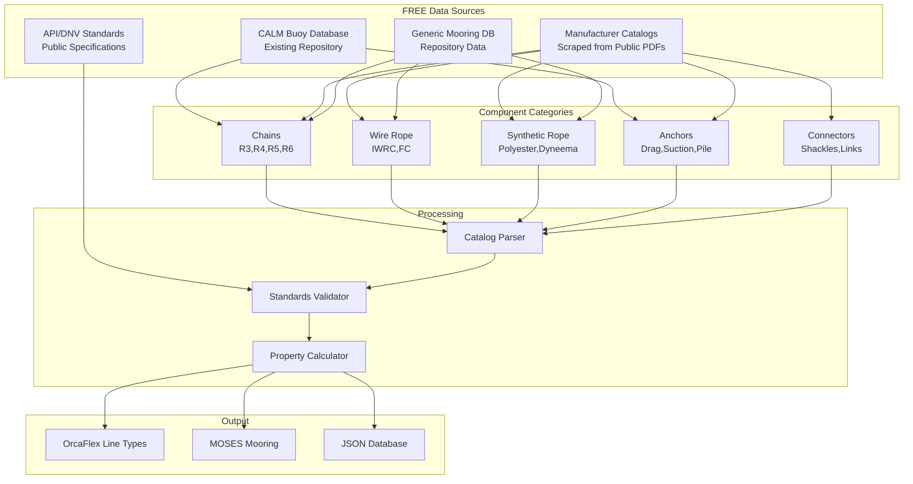

# Mooring Systems Data Procurement Specification

> **Spec**: Mooring Component and System Data Integration
> **Created**: 2025-10-23
> **Status**: Active Development - Tier 1 Priority
> **Version**: 1.0.0
> **Category**: Mooring Engineering
> **Common Components**: @specs/modules/data-procurement/common-components/spec.md
> **Builds On**: CALM Buoy comprehensive data @specs/modules/data-procurement/CALM_Buoy_claude.md

---

## Executive Summary

Mooring system design requires comprehensive data on chains, wire ropes, synthetic ropes, anchors, and buoy components. This specification expands the CALM Buoy work to encompass **all mooring system categories** with API-based procurement of component properties, manufacturer specifications, and system configurations.

### Business Impact

- **Component Database**: 10,000+ mooring components (chains, anchors, ropes)
- **Design Efficiency**: 80% reduction in component selection time
- **Standards Compliance**: Automatic validation against API, DNV, ABS codes
- **Cost Optimization**: Compare multiple supplier options
- **Quality Assurance**: Manufacturer-certified properties

### Scope Expansion from CALM Buoy

**CALM Buoy Spec Covered:**
- ✅ Buoy systems (turntable, turret, SALM)
- ✅ Hose configurations (Lazy-S, Chinese Lantern)
- ✅ Installation and maintenance data

**This Spec Adds:**
- ⬆️ Chain grades and sizes (all types, not just CALM)
- ⬆️ Wire rope and synthetic rope specifications
- ⬆️ Anchor types (drag, suction, driven piles)
- ⬆️ Mooring configurations (catenary, taut-leg, hybrid)
- ⬆️ Mooring connectors (shackles, swivels, links)

---

## System Architecture

### Mooring Data Architecture



---

## Technical Requirements

### Mooring System Categories

| System Type | Application | Components | Data Priority |
|-------------|-------------|------------|---------------|
| **CALM/SALM Buoys** | Single point mooring | Buoy, chains, anchors, hoses | High (existing) |
| **Catenary Mooring** | Semi-subs, FPSOs, floating wind | Chain, anchors, fairleads | High |
| **Taut-Leg Mooring** | TLPs, deepwater platforms | Wire rope, synthetic rope, piles | High |
| **Spread Mooring** | FPSOs, barges | Mixed chain/wire, multiple anchors | Medium |
| **Dynamic Positioning** | Drillships, construction vessels | Thrusters (out of scope) | Low |

### Component Data Requirements

#### 1. Mooring Chains

**Chain Grades (Marine & Offshore)**

| Grade | Material | Proof Load | Breaking Load | Typical Application |
|-------|----------|------------|---------------|---------------------|
| **R3** | Carbon steel | 2 × diameter² × 44 | 3 × diameter² × 44 | Legacy systems |
| **R3S** | Studless | 2 × diameter² × 44 | 3 × diameter² × 44 | General mooring |
| **R4** | High-strength | 2 × diameter² × 50 | 3 × diameter² × 50 | Standard offshore |
| **R4S** | Studless | 2 × diameter² × 50 | 3 × diameter² × 50 | Modern mooring |
| **R5** | Extra high-strength | 2 × diameter² × 58 | 3 × diameter² × 58 | Deep water |
| **R6** | Ultra high-strength | 2 × diameter² × 66 | 3 × diameter² × 66 | Extreme loads |

**Chain Properties Required**

```yaml
chain_specification:
  grade: "R4S"  # R3, R3S, R4, R4S, R5, R6
  diameter: 127  # mm (3-200 typical range)

  mechanical_properties:
    proof_load: 8636  # kN (2 × d² × grade_factor)
    minimum_breaking_load: 12954  # kN (3 × d² × grade_factor)
    elongation_at_break: 15  # % minimum

  physical_properties:
    mass_per_meter: 395  # kg/m (7.86 × d²/1000)
    stud_type: "studless"  # or "studlink"

  dimensions:
    link_length: 6.35  # × diameter typical
    link_width: 3.18   # × diameter typical

  standards:
    - "API RP 2SK"
    - "DNV-OS-E301"
    - "ISO 20438"

  manufacturer:
    name: "Vicinay Marine"
    certificate_number: "ABS-12345"
    test_date: "2023-05-15"

  material:
    steel_grade: "R4"
    carbon_content: 0.30  # % max
    tensile_strength: 690  # MPa

  corrosion:
    protective_coating: "none"  # or "galvanized", "painted"
    corrosion_allowance: 2  # mm per side

  fatigue:
    t_curve: "API T-curve"
    s_n_curve_slope: 3.0
```

#### 2. Wire Rope

**Wire Rope Construction Types**

| Construction | Core | Description | Application |
|--------------|------|-------------|-------------|
| **6x36 IWRC** | Independent Wire Rope Core | Standard offshore | Taut-leg mooring |
| **6x41 IWRC** | Independent Wire Rope Core | Flexible, fatigue-resistant | Deepwater mooring |
| **8x19 FC** | Fiber Core | Very flexible | Temporary mooring |
| **6x19 IWRC** | Independent Wire Rope Core | Rotation-resistant | Single-leg mooring |

**Wire Rope Properties Required**

```yaml
wire_rope_specification:
  construction: "6x36 IWRC"
  diameter: 76  # mm (typical 50-150mm)

  mechanical_properties:
    minimum_breaking_load: 4200  # kN
    elongation: 0.35  # % under 50% MBL
    modulus_of_elasticity: 100  # GPa effective

  physical_properties:
    mass_per_meter: 28  # kg/m
    lay_direction: "regular"  # or "lang"
    grade: "improved_plow_steel"  # or "extra_improved"

  standards:
    - "API RP 2SM"
    - "API Spec 9A"
    - "EN 12385"

  termination:
    type: "spelter socket"  # or "swaged", "mechanical"
    efficiency: 0.95  # % of MBL retained

  fatigue:
    t_curve: "Wire rope T-curve"
    minimum_bend_ratio: 25  # × diameter
```

#### 3. Synthetic Rope

**Fiber Types**

| Fiber | Specific Gravity | Strength | Elongation | Application |
|-------|-----------------|----------|------------|-------------|
| **Polyester** | 1.38 | High | 12-15% | Deepwater mooring, primary choice |
| **Nylon (Polyamide)** | 1.14 | Medium | 20-30% | Temporary mooring, high stretch |
| **HMPE (Dyneema)** | 0.97 | Very High | 3-4% | Ultra-deepwater, light weight |
| **Aramid (Kevlar)** | 1.44 | Very High | 2-3% | Specialized applications |

**Synthetic Rope Properties Required**

```yaml
synthetic_rope_specification:
  fiber_type: "polyester"  # or nylon, HMPE, aramid
  construction: "8-strand plaited"  # or "12-strand braided", "parallel"
  diameter: 220  # mm (typical 100-400mm)

  mechanical_properties:
    minimum_breaking_load: 8000  # kN
    elongation_at_50_percent_mbl: 6.5  # %
    elongation_at_100_percent_mbl: 12.0  # %
    creep: "low"  # design consideration

  physical_properties:
    mass_per_meter: 58  # kg/m
    specific_gravity: 1.38
    floats: false

  standards:
    - "API RP 2SM"
    - "DNV-OS-E303"
    - "OCIMF MEG4"

  manufacturer:
    name: "Samson Rope"
    product_line: "AmSteel-Blue"

  environmental_resistance:
    uv_degradation: "coated"
    abrasion_resistance: "good"
    chemical_resistance: "excellent"
    service_life: 25  # years design

  dynamic_properties:
    damping_coefficient: 0.15  # dimensionless
    stiffness: "nonlinear"  # load-dependent
```

#### 4. Anchors

**Anchor Types**

| Type | Holding Capacity | Installation | Water Depth | Soil Type |
|------|-----------------|--------------|-------------|-----------|
| **Drag Embedment (Stevpris)** | 50-200 × weight | Dragging | 50-1500m | Sand, clay |
| **Suction Pile** | Very high | Suction installation | 100-3000m | Clay, sand |
| **Driven Pile** | Very high | Pile driving | 50-500m | All soils |
| **Gravity Anchor** | Low | Placement | 20-200m | Rock, hard seabed |
| **Plate Anchor (VLA)** | High | Keying | 500-3000m | Clay |

**Anchor Properties Required**

```yaml
anchor_specification:
  type: "stevpris_mk6"  # Stevpris, Vryhof, Bruce, etc.

  dimensions:
    length: 5.8  # m
    width: 3.2   # m
    height: 2.1  # m
    fluke_angle: 50  # degrees

  weight:
    dry_weight: 20000  # kg
    submerged_weight: 17400  # kg (in seawater)

  holding_capacity:
    sand_capacity_factor: 12  # × submerged weight
    clay_capacity_factor: 8   # × submerged weight
    design_capacity: 1500  # kN (conservative)

  installation:
    method: "drag_embedment"
    penetration_depth: 6  # m typical
    line_angle_at_mudline: 30  # degrees max for full capacity

  standards:
    - "API RP 2SK"
    - "DNV-OS-E301"

  soil_suitability:
    sand: "excellent"
    clay: "excellent"
    rock: "not_suitable"

  keying:
    required: true
    keying_distance: 10  # × fluke length
```

#### 5. Mooring Connectors

**Connector Types**

| Component | Function | Standards | Typical Sizes |
|-----------|----------|-----------|---------------|
| **Shackles (Bow/Anchor)** | Connect components | API 2F, DNV 2.22 | WLL 100-5000 kN |
| **H-Links / C-Links** | Chain connections | API 2F | Match chain size |
| **Swivels** | Prevent line twist | API 17D | WLL 1000-20000 kN |
| **Tri-Plates** | Multi-line fairleads | DNV 2.22 | Custom |
| **Chain Stoppers** | Hold lines under tension | ABS, DNV | Match chain MBL |

```yaml
shackle_specification:
  type: "bow_shackle"  # or "anchor_shackle", "screw_pin", "bolt_type"
  size: "120mm"  # pin diameter

  capacity:
    working_load_limit: 850  # kN
    proof_load: 1275  # kN (1.5 × WLL)
    minimum_breaking_load: 1700  # kN (2.0 × WLL)

  dimensions:
    pin_diameter: 120  # mm
    bow_inside_width: 220  # mm
    bow_inside_length: 260  # mm

  material:
    grade: "High tensile alloy steel"
    proof_tested: true
    certificate: "DNV-12345"

  standards:
    - "API 2F"
    - "DNV 2.22"
    - "ISO 2415"
```

---

## FREE Data Sources

### 1. Existing Repository Data

**Location**: @specs/modules/data-procurement/CALM_Buoy_claude.md
**Content**: Comprehensive CALM buoy data (already available)
- 150+ CALM installations worldwide
- Mooring configurations (6-8 point catenary)
- Chain specifications (R3, R4, R5)
- Anchor types and installations

### 2. Manufacturer Public Catalogs (Web Scraping/PDF Parsing)

**Chain Manufacturers (FREE catalogs):**
- Vicinay Marine: https://www.vicinay.com/ (Public PDFs)
- Asian Star Anchor Chain: https://www.asanchor.com/ (Public catalogs)
- Ramnas: https://www.ramnas.com/ (Technical docs)

**Wire Rope Manufacturers:**
- Bridon-Bekaert: https://www.bridonbekaert.com/ (Public specs)
- WireCo WorldGroup: https://www.wirecoworldgroup.com/ (Catalogs)

**Synthetic Rope Manufacturers:**
- Samson Rope: https://www.samsonrope.com/ (Product data sheets)
- Yale Cordage: https://www.yalecordage.com/ (Technical specs)

**Anchor Manufacturers:**
- Vryhof Anchors: https://www.vryhof.com/ (Anchor data)
- Stevpris (Vryhof): https://www.vryhof.com/anchors/stevpris (Public specs)

**Note**: Data extraction via web scraping public PDFs, not API access

### 3. API Standards (Public Documents)

**FREE Standards Resources:**
- API RP 2SK (Stationkeeping) - Design guidelines published
- DNV-OS-E301 (Position Mooring) - Public standard excerpts
- OCIMF Guidelines - Publicly available portions

### 4. Generic Mooring Database (Repository)

**Location**: Create @specs/modules/data-procurement/mooring-systems/data/
**Content**: Standardized component library
- Standard chain sizes and properties
- Generic wire rope specifications
- Typical anchor capacities by size
- Shackle and connector data

---

## User Stories

### Story 1: Mooring Engineer - Chain Selection

**As a** mooring engineer,
**I want** to compare different chain grades for a catenary mooring,
**So that** I can optimize mooring design for cost and performance.

**Workflow:**
1. Specify design load requirement (e.g., 5000 kN)
2. System queries chain database for suitable grades
3. Compare R4 vs R5 chains (diameter, weight, cost)
4. Select optimal chain grade
5. Export to OrcaFlex line type

**Success Criteria:**
- Multiple chain options presented
- Properties validated against API standards
- OrcaFlex format ready for import
- Cost-performance trade-off analysis

### Story 2: Installation Engineer - Anchor Holding Capacity

**As an** installation engineer,
**I want** to retrieve anchor holding capacity for site soil conditions,
**So that** I can verify anchor design meets requirements.

**Workflow:**
1. Specify anchor type and size (Stevpris Mk6)
2. Input soil parameters (clay Su = 50 kPa)
3. System calculates holding capacity
4. Apply safety factors per API RP 2SK
5. Validate against mooring line tension

**Success Criteria:**
- Holding capacity calculated accurately
- Soil-specific factors applied
- Safety factor compliance verified
- Installation procedure provided

### Story 3: Design Engineer - Synthetic Rope Mooring

**As a** design engineer,
**I want** polyester rope specifications for deepwater taut-leg mooring,
**So that** I can design a lightweight mooring system.

**Workflow:**
1. Specify water depth (1500m) and design load (8000 kN)
2. System suggests polyester rope sizes
3. Compare rope options (diameter, weight, elongation)
4. Assess top tension and compliance
5. Export properties to OrcaFlex

**Success Criteria:**
- Rope sized for design load with safety factor
- Elongation characteristics provided
- Fatigue properties included
- OrcaFlex nonlinear stiffness curves

---

## Spec Scope

### Included Components

1. **Mooring Lines**
   - Chains (all grades: R3, R4, R5, R6)
   - Wire ropes (IWRC, FC constructions)
   - Synthetic ropes (polyester, nylon, HMPE)
   - Combination moorings (chain-wire-rope)

2. **Anchors**
   - Drag embedment anchors
   - Suction piles
   - Driven piles
   - Plate anchors (VLA, SEPLA)
   - Gravity anchors

3. **Connectors & Hardware**
   - Shackles (bow, anchor, screw-pin)
   - H-links, C-links, Kenter links
   - Swivels (single-axis, universal)
   - Fairleads and chain stoppers
   - Tri-plates and padeyes

4. **Buoy Systems** (from CALM Buoy spec)
   - CALM buoys (turntable, turret)
   - SALM systems
   - Subsurface buoys

### Processing Capabilities

1. **Component Sizing**
   - Size chains/ropes for design load
   - Apply safety factors per standards
   - Account for dynamic amplification

2. **Property Calculation**
   - Mass per meter (submerged/dry)
   - Axial stiffness (EA)
   - Bending stiffness (EI)
   - Torsional stiffness (GJ)

3. **Standards Validation**
   - API RP 2SK compliance
   - DNV-OS-E301 compliance
   - Safety factor verification
   - Material certificate validation

4. **Format Export**
   - OrcaFlex line types (.yml)
   - MOSES mooring files
   - AQWA mooring properties
   - JSON/YAML databases

---

## Out of Scope

- ❌ Mooring analysis (use OrcaFlex/MOSES/AQWA)
- ❌ Soil-structure interaction modeling
- ❌ Dynamic positioning systems
- ❌ Mooring installation execution (only planning data)
- ❌ Real-time monitoring and AIM systems
- ❌ Commercial mooring databases (FREE sources only)

---

## Expected Deliverables

### Technical Deliverables

1. **Mooring Component Database**
   - 1000+ chain specifications (all grades/sizes)
   - 500+ wire rope options
   - 200+ synthetic rope specifications
   - 100+ anchor types and sizes
   - 500+ connectors (shackles, links, swivels)

2. **Component Selector Tools**
   - Chain/rope sizing calculators
   - Anchor holding capacity calculator
   - Safety factor validation
   - Cost comparison tools

3. **Format Converters**
   - OrcaFlex line type generator
   - MOSES mooring file writer
   - AQWA property exporter
   - Generic JSON/YAML/CSV

4. **Validation Tools**
   - API RP 2SK compliance checker
   - DNV standards validator
   - Certificate verification
   - Property range checker

### Documentation Deliverables

1. **Component Selection Guide**
   - Chain grade selection criteria
   - Wire vs synthetic rope comparison
   - Anchor type selection flowchart
   - Connector sizing guidelines

2. **Standards Reference**
   - API RP 2SK summary
   - DNV-OS-E301 key requirements
   - OCIMF mooring guidelines
   - Material specifications

3. **Integration Tutorials**
   - OrcaFlex mooring setup
   - CALM buoy mooring example
   - Floating wind mooring case
   - Taut-leg mooring design

---

## Performance Requirements

(Inherits from @specs/modules/data-procurement/common-components/spec.md)

### Mooring-Specific Targets

| Operation | Target | Notes |
|-----------|--------|-------|
| **Component Search** | <100ms | Local database |
| **Property Calculation** | <50ms | Simple formulas |
| **Standards Validation** | <200ms | Rule-based checks |
| **OrcaFlex Export** | <500ms | Full mooring system |

---

## Integration Points

### Repository Integration

- **CALM Buoy Data**: @specs/modules/data-procurement/CALM_Buoy_claude.md
- **Mooring Examples**: @docs/modules/orcaflex/mooring/
- **Mooring Domain**: @docs/domains/moorings/
- **Ship Moorings**: @docs/domains/ship-design/moorings.md

### Output to Analysis Software

1. **OrcaFlex**
   ```yaml
   # OrcaFlex line type
   Name: Chain_R4S_127mm
   Category: GeneralLineType
   Mass per unit length: 395.0
   EA: 1.1e9
   EI: 0.0
   GJ: 0.0
   ```

2. **MOSES**
   ```
   SEGMENT CHAIN1
   LENGTH 500
   DIAMETER 0.127
   WEIGHT 395
   EA 1.1E9
   ```

---

## Agent Delegation Matrix

| Component | Lead Agent | Supporting Agents | Priority |
|-----------|-----------|-------------------|----------|
| **Chain Database** | Data Agent | Testing Agent | High |
| **Wire Rope Database** | Data Agent | Testing Agent | High |
| **Synthetic Rope Database** | Data Agent | Testing Agent | Medium |
| **Anchor Database** | Data Agent | Transform Agent | High |
| **Connector Database** | Data Agent | Testing Agent | Medium |
| **Property Calculators** | Transform Agent | Testing Agent | High |
| **Standards Validator** | Testing Agent | Transform Agent | High |
| **OrcaFlex Export** | Transform Agent | Documentation Agent | High |
| **Catalog Parser (PDFs)** | Data Agent | Transform Agent | Medium |
| **Documentation** | Documentation Agent | All Agents | Medium |

---

## Configuration Example

```yaml
# mooring_config.yml
version: "1.0"

# Reference common components
extends: "@specs/modules/data-procurement/common-components/spec.md"

data_source:
  category: "mooring_systems"

mooring_system:
  type: "catenary"  # or taut_leg, spread, calm_buoy

  lines:
    - name: "Line1"
      components:
        - type: "chain"
          grade: "R4S"
          diameter: 127  # mm
          length: 200  # m
        - type: "wire_rope"
          construction: "6x36 IWRC"
          diameter: 76  # mm
          length: 1000  # m
        - type: "chain"
          grade: "R4S"
          diameter: 127  # mm
          length: 100  # m

    anchor:
      type: "stevpris_mk6"
      weight: 20000  # kg
      soil: "clay"
      holding_capacity: 1500  # kN

standards:
  safety_factors:
    intact: 1.67  # API RP 2SK
    damaged: 1.25
  design_standard: "API_RP_2SK"

output:
  format: "orcaflex_yml"
  include_properties: true
  validate_standards: true

caching:
  enabled: true
  ttl_days: 365  # Component data rarely changes
  tier: "L3"
```

---

## References

- **Common Components**: @specs/modules/data-procurement/common-components/spec.md
- **CALM Buoy Data**: @specs/modules/data-procurement/CALM_Buoy_claude.md
- **Mooring Domain**: @docs/domains/moorings/
- **Wind Mooring**: @docs/domains/wind/moorings.md
- **API RP 2SK**: https://www.api.org/
- **DNV-OS-E301**: https://www.dnv.com/

---

*Mooring Systems Specification Version 1.0.0*
*Tier 1 Priority - Builds on CALM Buoy Work*
*Last Updated: 2025-10-23*
