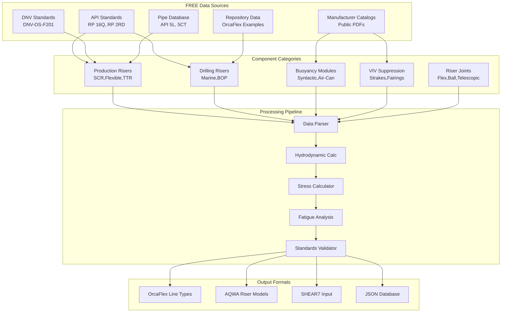

# Riser Systems Data Procurement Specification

> **Spec**: Riser Component and System Data Integration
> **Created**: 2025-10-23
> **Status**: Active Development - Tier 2 Priority
> **Version**: 1.0.0
> **Category**: Riser Engineering
> **Common Components**: @specs/modules/data-procurement/common-components/spec.md
> **Builds On**: Mooring Systems @specs/modules/data-procurement/mooring-systems/spec.md

---

## Executive Summary

Riser systems connect subsea equipment to floating facilities, requiring comprehensive data on production risers, drilling risers, buoyancy modules, VIV suppression, and installation equipment. This specification defines API-based procurement of riser specifications, manufacturer data, and system configurations for analysis in OrcaFlex, AQWA, and specialized riser software.

### Business Impact

- **Component Library**: 5,000+ riser pipes, joints, and components
- **Design Efficiency**: 70% reduction in riser modeling time
- **VIV Analysis Support**: Complete suppression device database
- **Standards Compliance**: API RP 16Q, API RP 2RD, DNV-OS-F201 validation
- **Installation Planning**: Equipment specifications and procedures
- **Multi-Analysis**: Support for strength, fatigue, VIV, installation

### Critical Applications

**Riser Data Required For:**
- Production riser design (SCR, flexible, TTR, hybrid)
- Drilling riser analysis (marine drilling riser, BOP, LMRP)
- VIV assessment and suppression design
- Installation weather window analysis
- Fatigue life prediction
- Riser hang-off analysis
- Operability studies

---

## System Architecture

### Riser Data Architecture



---

## Technical Requirements

### Riser System Categories

| System Type | Application | Water Depth | Complexity | Priority |
|-------------|-------------|-------------|------------|----------|
| **Steel Catenary Riser (SCR)** | FPSO/Semi production | 500-3000m | Medium | High |
| **Flexible Riser** | FPSO/Semi production | 100-2000m | Medium | High |
| **Top-Tensioned Riser (TTR)** | TLP/Spar production | 500-3000m | High | Medium |
| **Hybrid Riser** | Deepwater production | 1500-3000m | High | Medium |
| **Marine Drilling Riser** | Floating drilling | 500-3000m | High | High |
| **Workover Riser** | Intervention operations | 500-2000m | Medium | Low |

### 1. Production Risers

#### Steel Catenary Riser (SCR)

**Description**: Free-hanging steel pipe from seabed to floating facility
**Configuration**: Catenary shape, touchdown zone, hang-off at topside

```yaml
scr_specification:
  pipe:
    outer_diameter: 12.75  # inch (8" to 24" typical)
    wall_thickness: 0.688  # inch
    material_grade: "API 5L X65"  # or X60, X70

  mechanical_properties:
    yield_strength: 448  # MPa
    tensile_strength: 531  # MPa
    youngs_modulus: 207  # GPa
    poissons_ratio: 0.30

  physical_properties:
    steel_density: 7850  # kg/m³
    contents_density: 850  # kg/m³ (oil/gas)
    internal_pressure: 10.3  # MPa (1500 psi)
    external_pressure: 15.0  # MPa @ 1500m depth

  coatings:
    corrosion_coating:
      type: "3LPE"  # 3-Layer Polyethylene
      thickness: 3.2  # mm
      density: 940  # kg/m³
    insulation:
      type: "polypropylene"
      thickness: 50  # mm (for production temperature)
      density: 500  # kg/m³

  length:
    total_length: 2500  # m (seabed to hang-off)
    suspended_length: 1800  # m
    touchdown_zone: 200  # m

  standards:
    - "API RP 2RD"
    - "DNV-OS-F201"
    - "API 5L"

  analysis_requirements:
    - static_analysis
    - dynamic_analysis
    - fatigue_assessment
    - viv_screening
    - installation_analysis
```

#### Flexible Riser

**Description**: Multi-layer flexible pipe with metallic/polymer construction
**Configuration**: Lazy-S, Steep-S, Lazy wave, steep wave

```yaml
flexible_riser_specification:
  pipe:
    nominal_diameter: 10  # inch (6" to 16" typical)
    minimum_bend_radius: 7.0  # m (7 × diameter typical)

  construction_layers:
    - layer: "Carcass"
      material: "Stainless steel interlocked"
      function: "Collapse resistance"
    - layer: "Pressure sheath"
      material: "HDPE/PA11"
      function: "Fluid containment"
    - layer: "Pressure armor"
      material: "High-tensile steel wires"
      function: "Internal pressure resistance"
    - layer: "Tensile armor (inner)"
      material: "High-tensile steel wires"
      angle: 55  # degrees (cross-wound)
      function: "Axial load resistance"
    - layer: "Tensile armor (outer)"
      material: "High-tensile steel wires"
      angle: -55  # degrees (cross-wound)
    - layer: "Outer sheath"
      material: "Polyamide"
      function: "Environmental protection"

  mechanical_properties:
    minimum_breaking_load: 4500  # kN
    axial_stiffness_empty: 550  # MN (at low tension)
    axial_stiffness_full: 800  # MN (at high tension)
    bending_stiffness: 25  # kNm² (low for flexibility)
    torsional_stiffness: 5  # kNm²/rad

  physical_properties:
    mass_per_meter_dry: 150  # kg/m
    mass_per_meter_wet: 85  # kg/m (submerged)
    outer_diameter: 350  # mm (including sheath)

  operating_conditions:
    design_pressure: 20.0  # MPa
    design_temperature: 90  # °C
    service_life: 20  # years

  configuration:
    type: "lazy_wave"  # or lazy_s, steep_s, steep_wave
    buoyancy_modules: true
    hang_off: "flexible_joint"

  standards:
    - "API 17J"
    - "API 17K"
    - "DNV-OS-F201"

  manufacturer_data:
    manufacturer: "Technip / Baker Hughes / Prysmian"
    certification: "API 17J Type Approval"
```

#### Top-Tensioned Riser (TTR)

**Description**: Vertical riser under constant tension (TLP, Spar)
**Configuration**: Tensioned by platform buoyancy or external tensioners

```yaml
ttr_specification:
  pipe:
    outer_diameter: 21.0  # inch (16" to 24" typical)
    wall_thickness: 1.0  # inch
    material_grade: "API 5L X70"

  tension_system:
    top_tension: 2000  # kN (constant tension)
    tensioner_type: "hydro-pneumatic"  # or direct pull from TLP buoyancy
    tensioner_stroke: 30  # m (for TLP heave motion)

  mechanical_properties:
    axial_stiffness: 3200  # MN (EA)
    bending_stiffness: 180  # MNm² (EI)
    minimum_top_tension: 1500  # kN
    maximum_top_tension: 2500  # kN

  riser_joints:
    - joint_type: "flex_joint_top"
      location: "topside"
      angular_capacity: 10  # degrees
      stiffness: "nonlinear"
    - joint_type: "flex_joint_bottom"
      location: "subsea_wellhead"
      angular_capacity: 7  # degrees

  length:
    total_length: 1800  # m
    riser_sections: 40  # sections
    section_length: 45  # m per section

  standards:
    - "API RP 2RD"
    - "DNV-OS-F201"

  analysis_requirements:
    - strength_check
    - fatigue_at_joints
    - viv_assessment
    - tensioner_sizing
```

### 2. Drilling Risers

#### Marine Drilling Riser

**Description**: Large-diameter riser for drilling from floating vessels
**Configuration**: Telescopic joint, flex joint, buoyancy modules, BOP, LMRP

```yaml
marine_drilling_riser_specification:
  main_pipe:
    outer_diameter: 21.0  # inch (19.25" to 22" typical)
    wall_thickness: 0.875  # inch
    material_grade: "API 2F Grade 50"

  riser_joints:
    standard_joint_length: 75  # ft (22.86 m)
    pup_joint_lengths: [10, 20, 40]  # ft
    total_joints: 50  # typical for 1500m depth

  auxiliary_lines:
    - line: "kill_line"
      diameter: 3.5  # inch
      function: "Well control - pump heavy mud"
    - line: "choke_line"
      diameter: 3.5  # inch
      function: "Well control - circulate"
    - line: "booster_line"
      diameter: 4.0  # inch
      function: "Boost mud returns"
    - line: "hydraulic_lines"
      count: 2
      diameter: 1.5  # inch
      function: "BOP control"

  special_joints:
    - joint: "telescopic_joint"
      location: "near_vessel"
      stroke: 50  # ft (15.24 m)
      function: "Accommodate vessel heave"
    - joint: "upper_flex_joint"
      location: "below_telescopic"
      angular_capacity: 10  # degrees
    - joint: "lower_flex_joint"
      location: "above_lmrp"
      angular_capacity: 7  # degrees
    - joint: "ball_joint"
      location: "subsea_wellhead"
      angular_capacity: 12  # degrees

  subsea_equipment:
    - equipment: "LMRP"
      weight_in_air: 180  # tonnes
      weight_in_water: 160  # tonnes
      height: 4.5  # m
    - equipment: "BOP_stack"
      weight_in_air: 350  # tonnes
      weight_in_water: 310  # tonnes
      height: 12  # m

  buoyancy_modules:
    module_type: "syntactic_foam"
    coverage: 95  # % of riser length
    buoyancy_per_joint: 12  # kN (net buoyancy)

  tension:
    top_tension: 1200  # kN (minimum required)
    margin_over_buoyancy: 250  # kN

  analysis_cases:
    - case: "connected_mode"
      description: "Drilling operations, BOP connected"
    - case: "disconnected_mode"
      description: "Riser hung-off, BOP on seabed"
    - case: "recoil"
      description: "Emergency disconnect, riser recoil"
    - case: "weak_point"
      description: "Maximum offset before damage"

  standards:
    - "API RP 16Q"
    - "API Spec 16F"
    - "DNV-OS-F201"

  repository_examples:
    - "@docs/modules/orcaflex/risers/drilling/automation-excel/"
    - "@docs/modules/orcaflex/risers/drilling/hang-off-analysis/"
```

### 3. Buoyancy Modules

**Types**: Syntactic foam, air-can buoyancy
**Application**: Flexible risers, drilling risers, umbilicals

```yaml
buoyancy_module_specification:
  syntactic_foam:
    type: "distributed_buoyancy"
    density: 500  # kg/m³ (typical 450-650)
    outer_diameter: 700  # mm (fits over riser)
    inner_diameter: 360  # mm (riser OD + clearance)
    length: 5.0  # m per module

    mechanical_properties:
      compressive_strength: 20  # MPa @ rated depth
      tensile_strength: 8  # MPa
      shear_strength: 5  # MPa

    buoyancy_calculation:
      module_volume: 1.54  # m³ (π/4 × (OD²-ID²) × L)
      water_displaced: 1578  # kg (ρ_water × volume)
      module_weight: 770  # kg (ρ_foam × volume)
      net_buoyancy: 808  # kg (displaced - weight)
      net_buoyancy_per_meter: 162  # kg/m

    installation:
      split_configuration: "two_halves"
      clamping: "steel_bands"
      spacing_on_riser: "continuous"  # or intermittent

    environmental_resistance:
      water_absorption: 3  # % by volume max
      service_life: 20  # years
      uv_resistance: "coated"

  air_can_buoyancy:
    type: "concentrated_buoyancy"
    outer_diameter: 2.5  # m
    height: 3.0  # m
    wall_thickness: 25  # mm steel

    capacity:
      internal_volume: 14.7  # m³
      water_displaced: 15078  # kg
      steel_weight: 2500  # kg
      ballast_weight: 500  # kg (adjustable)
      net_buoyancy: 12078  # kg

    design:
      design_depth: 2000  # m
      pressure_rating: 20  # MPa
      material: "API 2H Grade 50"
      corrosion_protection: "cathodic_protection"

    flooding_system:
      type: "controlled_flooding"
      valve_type: "ROV_operable"
      function: "Installation and recovery"

  standards:
    - "DNV-OS-E401 (Buoyancy Units)"
    - "ISO 17078-3"
```

### 4. VIV Suppression Devices

**Types**: Helical strakes, fairings, shrouds
**Application**: Suppress vortex-induced vibration

```yaml
viv_suppression_specification:
  helical_strakes:
    type: "fixed_geometry"
    strake_height: 0.10  # × pipe diameter (typical 0.10-0.15)
    pitch: 5.0  # × pipe diameter (typical 5D to 17.5D)
    number_of_starts: 3  # triple-start helix

    effectiveness:
      viv_reduction: 90  # % reduction in vibration amplitude
      drag_increase: 120  # % of bare pipe (increased drag)

    installation:
      coverage: "critical_zones"  # touchdown, splash zone
      length_per_section: 12  # m
      attachment: "clamped"

    application_ranges:
      current_speed: [0.5, 3.0]  # m/s
      reduced_velocity: [3, 15]  # Vr = V/(f×D)

  vortex_suppression_fairings:
    type: "streamlined_geometry"
    fairing_length: 1.2  # × pipe diameter
    fairing_width: 0.5  # × pipe diameter

    effectiveness:
      viv_reduction: 95  # % (better than strakes)
      drag_coefficient: 0.25  # (much lower than strakes)

    configuration:
      weathervaning: true  # aligns with current
      mounting: "rotating_collar"

    advantages:
      - "Lower drag than strakes"
      - "Better VIV suppression"
      - "Self-aligning with current"
    disadvantages:
      - "More complex installation"
      - "Higher cost"
      - "Maintenance requirements"

  coverage_optimization:
    screening_tools:
      - "SHEAR7"  # Industry-standard VIV prediction
      - "VIVANA (Orcina)"
      - "VIVA (MIT)"

    design_criteria:
      maximum_rms_amplitude: 0.15  # × diameter
      maximum_fatigue_damage: 0.30  # (30% of design life)

  standards:
    - "DNV-RP-F204 (Riser Fatigue)"
    - "DNV-RP-F105 (VIV)"
```

### 5. Riser Joints and Connections

**Types**: Flex joints, ball joints, telescopic joints
**Function**: Accommodate vessel motion and wellhead misalignment

```yaml
riser_joints_specification:
  flex_joint:
    type: "elastomeric_flex_joint"
    outer_diameter: 30  # inch
    height: 1.5  # m

    mechanical_properties:
      angular_capacity: 10  # degrees
      rotational_stiffness: 2500  # kNm/degree (nonlinear)
      axial_capacity: 5000  # kN

    elastomer_properties:
      material: "natural_rubber"
      hardness: 60  # Shore A
      service_life: 10  # years (replaceable)

    design_curve:
      moment_angle_relationship: "nonlinear"
      hysteresis: 10  # % (energy dissipation)

  ball_joint:
    type: "mechanical_ball_joint"
    outer_diameter: 36  # inch
    ball_diameter: 24  # inch

    mechanical_properties:
      angular_capacity: 12  # degrees (all directions)
      restoring_moment: 50  # kNm @ 5 degrees
      axial_capacity: 8000  # kN

    bearing:
      type: "steel_on_steel"
      lubrication: "grease_packed"
      seal_type: "multiple_elastomer_seals"

  telescopic_joint:
    type: "slip_joint"
    outer_diameter: 24  # inch
    stroke: 50  # ft (15.24 m)

    function: "Accommodate vessel heave motion"

    mechanical_properties:
      piston_diameter: 21  # inch (riser OD)
      barrel_diameter: 24  # inch
      seal_type: "high_pressure_packer"

    hydraulic_properties:
      recoil_pressure: 1500  # psi (prevents recoil)
      recoil_force: 780  # kN

  standards:
    - "API RP 16Q"
    - "API Spec 16F"
    - "DNV-OS-F201"
```

---

## FREE Data Sources

### 1. API Standards (Public Access)

**API RP 16Q** - Design, Selection, Operation and Maintenance of Marine Drilling Riser Systems
**Available**: Public summary, key tables
**Location**: @docs/domains/drilling/API 16 Q_mms_review_report.pdf

**API RP 2RD** - Design of Risers for Floating Production Systems
**Available**: Public excerpts, design criteria
**Content**: SCR, TTR, flexible riser design

**API 5L** - Specification for Line Pipe
**Available**: Pipe data tables (free)
**Location**: @docs/domains/pipe/API - 5LPipe-Data.xlsx

**API 5CT** - Specification for Casing and Tubing
**Available**: Pipe data tables (free)
**Location**: @docs/domains/pipe/API-5CT Pipe Data Book.xlsx

### 2. DNV Standards (Public Excerpts)

**DNV-OS-F201** - Dynamic Risers
**Available**: Public standard excerpts, design guidelines
**Content**: Riser analysis, fatigue, VIV

**DNV-RP-F105** - Free Spanning Pipelines
**Available**: VIV assessment methodology

**DNV-RP-F204** - Riser Fatigue
**Available**: Fatigue analysis procedures

### 3. Manufacturer Public Catalogs

**Buoyancy Module Manufacturers:**
- Balmoral: https://www.balmoral.co.uk/ (Syntactic foam specs)
- Trelleborg: https://www.trelleborg.com/ (Buoyancy solutions)
- Matrix Composites: https://www.matrixengineered.com/ (Public catalogs)

**VIV Suppression Manufacturers:**
- VIV Solutions (Shell): https://www.vivsolutions.com/ (Strake data)
- Trelleborg VIV: https://www.trelleborg.com/ (Fairing specs)

**Flex Joint Manufacturers:**
- Oil States Industries: https://www.oilstatesintl.com/ (Flex joint data)
- Cameron (SLB): https://www.slb.com/ (Subsea equipment)

**Note**: Data via web scraping public PDFs, technical bulletins

### 4. Repository Data (Existing)

**OrcaFlex Riser Examples:**
- Drilling riser models: @docs/modules/orcaflex/risers/drilling/
- Hang-off analysis: @docs/modules/orcaflex/risers/drilling/hang-off-analysis/
- Excel automation: @docs/modules/orcaflex/risers/drilling/automation-excel/

**Riser Domain Knowledge:**
- Damping guidance: @docs/domains/risers/damping.md
- Installation guidance: @docs/domains/risers/_installation.md
- Drilling risers: @docs/domains/drilling/drilling_risers.md

### 5. Generic Riser Database (To Create)

**Location**: Create @specs/modules/data-procurement/riser-systems/data/
**Content**:
- Standard riser pipe sizes and properties
- Generic buoyancy module specifications
- VIV suppression device library
- Flex joint characteristics
- Drilling riser component library

---

## User Stories

### Story 1: Riser Engineer - SCR Design

**As a** riser engineer,
**I want** to retrieve steel pipe specifications and buoyancy data for an SCR,
**So that** I can model the riser in OrcaFlex for strength and fatigue analysis.

**Workflow:**
1. Specify SCR requirements (12.75" OD, X65, 1500m depth)
2. System queries pipe database (API 5L)
3. Add 3LPE coating and insulation specifications
4. Calculate mass, EA, EI properties
5. Export to OrcaFlex line type format

**Success Criteria:**
- Complete pipe properties (OD, WT, material)
- Coating and insulation included
- Mass per meter (dry, wet, submerged)
- Axial and bending stiffness calculated
- OrcaFlex YAML format ready

### Story 2: Drilling Engineer - Marine Riser Configuration

**As a** drilling engineer,
**I want** to configure a marine drilling riser with BOP and buoyancy,
**So that** I can analyze riser behavior during drilling operations.

**Workflow:**
1. Specify water depth (1500m) and rig type (semi-submersible)
2. System suggests 21" API 2F riser with 75 ft joints
3. Add telescopic joint, flex joints, auxiliary lines
4. Include BOP (350 tonnes) and LMRP (180 tonnes)
5. Calculate required buoyancy (95% coverage)
6. Export complete riser model to OrcaFlex

**Success Criteria:**
- Complete riser joint configuration
- BOP/LMRP weights and dimensions
- Buoyancy module spacing
- Auxiliary line properties
- Top tension requirements calculated

### Story 3: VIV Specialist - Suppression Device Selection

**As a** VIV specialist,
**I want** to select helical strakes for VIV suppression on a flexible riser,
**So that** I can prevent fatigue damage in high-current zones.

**Workflow:**
1. Run VIV screening (SHEAR7 or VIVANA)
2. Identify critical zones (high current, high stress)
3. Query VIV device database for suppression options
4. Compare strakes vs. fairings (effectiveness, drag, cost)
5. Specify strake coverage zones
6. Update OrcaFlex model with suppression devices

**Success Criteria:**
- VIV screening results interpreted
- Critical zones identified (touchdown, splash zone)
- Suppression device selected (strakes/fairings)
- Coverage zones defined
- Drag coefficients updated in analysis

### Story 4: Installation Engineer - Weather Window Analysis

**As an** installation engineer,
**I want** to retrieve riser installation specifications and vessel data,
**So that** I can determine weather window requirements for riser deployment.

**Workflow:**
1. Specify riser configuration and installation vessel
2. Query metocean data for installation site (@specs/modules/data-procurement/metocean-data/)
3. Model installation stages (running, lowering, landing)
4. Calculate vessel motion limits and riser loads
5. Determine weather window criteria (Hs, wind, current)
6. Generate operability analysis report

**Success Criteria:**
- Installation sequence modeled
- Weather window criteria defined (Hs < 2.5m, wind < 25 kts)
- Vessel motion limits identified
- Installation duration estimated
- Weather window availability calculated

---

## Spec Scope

### Included Riser Types

1. **Production Risers**
   - Steel Catenary Risers (SCR)
   - Flexible Risers (Lazy-S, Lazy wave, Steep-S, Steep wave)
   - Top-Tensioned Risers (TTR) for TLPs/Spars
   - Hybrid Risers (steel + flexible sections)

2. **Drilling Risers**
   - Marine Drilling Risers (floating rigs)
   - Subsea BOP systems
   - LMRP (Lower Marine Riser Package)
   - Telescopic joints and flex joints

3. **Riser Components**
   - Buoyancy modules (syntactic foam, air-can)
   - VIV suppression (strakes, fairings, shrouds)
   - Flex joints (elastomeric, mechanical)
   - Ball joints and telescopic joints
   - Hang-off systems

4. **Installation Equipment**
   - Installation aids and procedures
   - Weather window analysis
   - Vessel requirements

### Processing Capabilities

1. **Property Calculation**
   - Mass per meter (dry, wet, submerged)
   - Axial stiffness (EA), bending stiffness (EI), torsional stiffness (GJ)
   - Hydrodynamic coefficients (Cd, Ca, Cm)
   - Internal/external pressure effects

2. **Buoyancy Optimization**
   - Calculate required buoyancy for drilling risers
   - Optimize buoyancy module spacing
   - Account for contents and coatings

3. **VIV Assessment**
   - Screening criteria (reduced velocity, mode shapes)
   - Suppression device selection
   - Coverage zone optimization

4. **Standards Validation**
   - API RP 16Q compliance (drilling risers)
   - API RP 2RD compliance (production risers)
   - DNV-OS-F201 compliance (all risers)
   - Safety factor verification

5. **Format Export**
   - OrcaFlex line types and vessel models
   - AQWA riser properties
   - SHEAR7 VIV input files
   - Generic JSON/YAML/CSV databases

---

## Out of Scope

- ❌ Detailed structural analysis (use OrcaFlex/AQWA/ABAQUS)
- ❌ VIV analysis (use SHEAR7/VIVANA)
- ❌ Riser fabrication and welding procedures
- ❌ Real-time riser monitoring systems
- ❌ Proprietary riser databases (FREE sources only)
- ❌ Riser installation execution (only planning data)

---

## Expected Deliverables

### Technical Deliverables

1. **Riser Component Database**
   - 500+ pipe specifications (API 5L, 5CT sizes)
   - 200+ flexible riser configurations
   - 100+ buoyancy module types
   - 50+ VIV suppression devices
   - 50+ flex joint specifications

2. **Riser Design Tools**
   - Pipe property calculator
   - Buoyancy module spacing calculator
   - VIV screening tool
   - Top tension calculator
   - Hang-off load calculator

3. **Format Converters**
   - OrcaFlex line type generator
   - AQWA riser model exporter
   - SHEAR7 input file generator
   - Generic JSON/YAML/CSV

4. **Validation Tools**
   - API RP 16Q compliance checker
   - API RP 2RD compliance checker
   - DNV-OS-F201 validator
   - Property range checker

### Documentation Deliverables

1. **Riser Selection Guide**
   - SCR vs. flexible vs. TTR comparison
   - Buoyancy module selection criteria
   - VIV suppression device selection flowchart
   - Installation method recommendations

2. **Standards Reference**
   - API RP 16Q summary (drilling risers)
   - API RP 2RD summary (production risers)
   - DNV-OS-F201 key requirements
   - Material specifications

3. **Integration Tutorials**
   - OrcaFlex SCR modeling
   - Flexible riser configuration
   - Drilling riser hang-off analysis
   - VIV analysis workflow

---

## Performance Requirements

(Inherits from @specs/modules/data-procurement/common-components/spec.md)

### Riser-Specific Targets

| Operation | Target | Notes |
|-----------|--------|-------|
| **Pipe Property Lookup** | <50ms | Local database |
| **Buoyancy Calculation** | <100ms | Simple formulas |
| **VIV Screening** | <5s | Simplified screening |
| **OrcaFlex Export (Full Riser)** | <1s | Complete riser model |
| **Standards Validation** | <200ms | Rule-based checks |

---

## Integration Points

### Repository Integration

- **Drilling Riser Examples**: @docs/modules/orcaflex/risers/drilling/
- **Riser Domain**: @docs/domains/risers/
- **Drilling Domain**: @docs/domains/drilling/drilling_risers.md
- **Installation Domain**: @docs/domains/installation/riser.md
- **Pipe Data**: @docs/domains/pipe/

### Metocean Dependency

**Critical Dependency**: Riser analysis requires metocean data
- Current profiles for VIV assessment
- Wave data for dynamic analysis
- Wind data for installation analysis

**Reference**: @specs/modules/data-procurement/metocean-data/spec.md

### Output to Analysis Software

1. **OrcaFlex**
   ```yaml
   # OrcaFlex line type
   Name: SCR_12.75_X65_3LPE
   Category: GeneralLineType
   OD: 0.32385  # m
   ID: 0.28893  # m
   Mass per unit length: 242.5  # kg/m (dry)
   EA: 3.45e9  # N
   EI: 1.82e7  # Nm²
   GJ: 1.21e7  # Nm²/rad
   ```

2. **SHEAR7 (VIV Input)**
   ```
   RISER PROPERTIES
   DIAMETER 0.324 M
   MASS 242.5 KG/M
   EI 1.82E7 NM2
   TENSION 1500 KN
   LENGTH 2000 M
   ```

---

## Agent Delegation Matrix

| Component | Lead Agent | Supporting Agents | Priority |
|-----------|-----------|-------------------|----------|
| **Pipe Database (API 5L/5CT)** | Data Agent | Testing Agent | High |
| **Flexible Riser Database** | Data Agent | Transform Agent | High |
| **Buoyancy Module Database** | Data Agent | Testing Agent | Medium |
| **VIV Suppression Database** | Data Agent | Testing Agent | High |
| **Riser Joint Database** | Data Agent | Testing Agent | Medium |
| **Property Calculators** | Transform Agent | Testing Agent | High |
| **Buoyancy Calculator** | Transform Agent | Testing Agent | High |
| **VIV Screening Tool** | Transform Agent | Testing Agent | High |
| **Standards Validator** | Testing Agent | Transform Agent | High |
| **OrcaFlex Export** | Transform Agent | Documentation Agent | High |
| **SHEAR7 Export** | Transform Agent | Documentation Agent | Medium |
| **Catalog Parser (PDFs)** | Data Agent | Transform Agent | Medium |
| **Documentation** | Documentation Agent | All Agents | Medium |

---

## Configuration Example

```yaml
# riser_config.yml
version: "1.0"

# Reference common components
extends: "@specs/modules/data-procurement/common-components/spec.md"

data_source:
  category: "riser_systems"

riser_system:
  type: "scr"  # or flexible, ttr, drilling

  # Steel Catenary Riser (SCR) Configuration
  scr:
    pipe:
      outer_diameter: 12.75  # inch
      wall_thickness: 0.688  # inch
      material_grade: "API 5L X65"

    coatings:
      corrosion:
        type: "3LPE"
        thickness: 3.2  # mm
      insulation:
        type: "polypropylene"
        thickness: 50  # mm

    length:
      total_length: 2500  # m
      water_depth: 1500  # m

    analysis:
      include_viv: true
      include_fatigue: true
      include_installation: false

  # Flexible Riser Configuration (Alternative)
  flexible:
    nominal_diameter: 10  # inch
    configuration: "lazy_wave"
    buoyancy_modules: true
    manufacturer: "Technip"

  # Marine Drilling Riser Configuration (Alternative)
  drilling:
    main_pipe:
      outer_diameter: 21.0  # inch
      material: "API 2F Grade 50"
    riser_joints:
      joint_length: 75  # ft
      number_of_joints: 50
    subsea_equipment:
      bop_weight: 350  # tonnes
      lmrp_weight: 180  # tonnes
    buoyancy:
      coverage: 95  # %
      module_type: "syntactic_foam"

# Metocean integration
metocean:
  source: "@specs/modules/data-procurement/metocean-data/"
  location:
    latitude: 28.5
    longitude: -89.0
  parameters:
    - current_profile
    - wave_spectrum
    - wind_profile

# Output configuration
output:
  format: "orcaflex_yml"  # or aqwa, shear7, json
  include_buoyancy: true
  include_viv_devices: true
  validate_standards: true

# Caching
caching:
  enabled: true
  ttl_days: 365  # Riser data rarely changes
  tier: "L3"

# Standards validation
standards:
  production_risers: "API_RP_2RD"
  drilling_risers: "API_RP_16Q"
  general: "DNV_OS_F201"
  safety_factors:
    strength: 1.67
    fatigue: 10.0
```

---

## Implementation Dependencies

### Tier 1 Dependencies (Must Complete First)

1. **Metocean Data** - @specs/modules/data-procurement/metocean-data/spec.md
   - Current profiles for VIV analysis
   - Wave data for dynamic analysis
   - Required for all riser analyses

2. **Common Components** - @specs/modules/data-procurement/common-components/spec.md
   - Caching infrastructure
   - Data validation framework
   - Format conversion utilities

### Optional Integrations

1. **Mooring Systems** - @specs/modules/data-procurement/mooring-systems/spec.md
   - Coupled mooring-riser analysis
   - Shared anchor data

2. **Vessel Systems** - @specs/modules/data-procurement/vessel-systems/spec.md
   - Coupled vessel-riser analysis
   - Vessel RAOs for drilling riser analysis

---

## Effort Estimation

### Development Phases

| Phase | Component | Estimated Effort | Dependencies |
|-------|-----------|-----------------|--------------|
| **Phase 1** | Pipe database (API 5L/5CT) | 3 days | None |
| **Phase 2** | Property calculators | 2 days | Phase 1 |
| **Phase 3** | Buoyancy module database | 2 days | Phase 1 |
| **Phase 4** | VIV suppression database | 3 days | Phase 1 |
| **Phase 5** | Drilling riser components | 4 days | Phase 1, 2, 3 |
| **Phase 6** | OrcaFlex export | 2 days | Phase 1, 2 |
| **Phase 7** | Standards validation | 2 days | Phase 1, 2 |
| **Phase 8** | Integration & testing | 3 days | All phases |

**Total Estimated Effort**: 21 days (4.2 weeks)

### Resource Requirements

- **Data Agent**: Pipe/component database creation
- **Transform Agent**: Property calculators, format converters
- **Testing Agent**: Standards validation, test suite
- **Documentation Agent**: User guides, API docs

---

## References

- **Common Components**: @specs/modules/data-procurement/common-components/spec.md
- **Metocean Data**: @specs/modules/data-procurement/metocean-data/spec.md
- **Mooring Systems**: @specs/modules/data-procurement/mooring-systems/spec.md
- **Vessel Systems**: @specs/modules/data-procurement/vessel-systems/spec.md
- **Riser Domain**: @docs/domains/risers/
- **Drilling Domain**: @docs/domains/drilling/drilling_risers.md
- **OrcaFlex Riser Examples**: @docs/modules/orcaflex/risers/
- **API RP 16Q**: https://www.api.org/
- **API RP 2RD**: https://www.api.org/
- **DNV-OS-F201**: https://www.dnv.com/

---

*Riser Systems Specification Version 1.0.0*
*Tier 2 Priority - Depends on Metocean Data*
*Last Updated: 2025-10-23*
