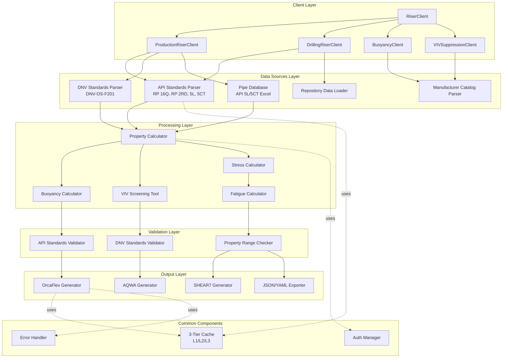

# Riser Systems Technical Specification

This is the technical specification for the riser systems data procurement detailed in @specs/modules/data-procurement/riser-systems/spec.md

> **Created**: 2025-10-23
> **Version**: 1.0.0
> **Status**: Design Phase

---

## System Architecture

### Overview

The Riser Systems data procurement module provides comprehensive access to production riser, drilling riser, buoyancy module, VIV suppression, and riser joint specifications through a unified API. The system follows the established DRY principles from common components while adding riser-specific functionality.

### High-Level Architecture



---

## Component Specifications

### 1. RiserClient (Base Client)

**Responsibility**: Main entry point for riser data access

**Class Structure**:
```python
class RiserClient:
    """
    Main client for riser systems data procurement.
    Provides unified access to all riser types and components.
    """

    def __init__(self, config: RiserConfig):
        """
        Initialize RiserClient with configuration.

        Args:
            config: RiserConfig object with API keys, cache settings, etc.
        """
        self.config = config
        self.cache = CacheManager(config.cache_config)
        self.auth = AuthManager(config.auth_config)

        # Specialized clients
        self.production = ProductionRiserClient(config, self.cache, self.auth)
        self.drilling = DrillingRiserClient(config, self.cache, self.auth)
        self.buoyancy = BuoyancyClient(config, self.cache, self.auth)
        self.viv = VIVSuppressionClient(config, self.cache, self.auth)

    def query_pipe(
        self,
        pipe_type: Literal["API_5L", "API_5CT"],
        outer_diameter: float,  # inches
        wall_thickness: Optional[float] = None,
        grade: Optional[str] = None
    ) -> PipeSpecification:
        """
        Query pipe specifications from API 5L or 5CT database.

        Args:
            pipe_type: API standard (5L for line pipe, 5CT for casing/tubing)
            outer_diameter: Pipe outer diameter in inches
            wall_thickness: Optional wall thickness in inches
            grade: Optional material grade (e.g., X65, X70 for 5L)

        Returns:
            PipeSpecification with complete properties

        Example:
            >>> client = RiserClient(config)
            >>> pipe = client.query_pipe(
            ...     pipe_type="API_5L",
            ...     outer_diameter=12.75,
            ...     wall_thickness=0.688,
            ...     grade="X65"
            ... )
            >>> print(pipe.mass_per_meter)  # kg/m
        """
        pass

    def calculate_properties(
        self,
        pipe: PipeSpecification,
        coatings: Optional[List[Coating]] = None,
        contents: Optional[Contents] = None
    ) -> RiserProperties:
        """
        Calculate complete riser properties.

        Args:
            pipe: Base pipe specification
            coatings: List of coatings (corrosion, insulation)
            contents: Pipe contents (oil, gas, mud)

        Returns:
            RiserProperties with mass, EA, EI, GJ, hydrodynamic coefficients

        Example:
            >>> props = client.calculate_properties(
            ...     pipe=pipe,
            ...     coatings=[
            ...         Coating(type="3LPE", thickness=3.2, density=940),
            ...         Coating(type="polypropylene", thickness=50, density=500)
            ...     ],
            ...     contents=Contents(density=850, pressure=10.3)
            ... )
        """
        pass

    def export_to_orcaflex(
        self,
        riser_config: RiserConfiguration,
        output_path: str
    ) -> str:
        """
        Export complete riser configuration to OrcaFlex YAML format.

        Args:
            riser_config: Complete riser configuration
            output_path: Path to save OrcaFlex YAML file

        Returns:
            Path to generated file

        Example:
            >>> riser = RiserConfiguration(...)
            >>> path = client.export_to_orcaflex(riser, "scr_model.yml")
        """
        pass
```

---

### 2. ProductionRiserClient

**Responsibility**: Handle production riser data (SCR, flexible, TTR, hybrid)

**Class Structure**:
```python
class ProductionRiserClient:
    """
    Client for production riser data procurement.
    Supports SCR, flexible, TTR, and hybrid risers.
    """

    def query_scr(
        self,
        outer_diameter: float,  # inches
        wall_thickness: float,  # inches
        grade: str,  # API 5L grade (X60, X65, X70)
        water_depth: float,  # meters
        coatings: Optional[List[Coating]] = None
    ) -> SteelCatenaryRiser:
        """
        Query Steel Catenary Riser specifications.

        Args:
            outer_diameter: Pipe OD in inches
            wall_thickness: Wall thickness in inches
            grade: API 5L material grade
            water_depth: Water depth in meters
            coatings: Optional coatings (3LPE, insulation)

        Returns:
            SteelCatenaryRiser with complete properties

        Design Checks:
            - Hoop stress (pressure containment)
            - Bending stress (touchdown zone)
            - Combined stress (DNV-OS-F201)
            - Fatigue (wave-induced, VIV)

        Example:
            >>> scr = client.production.query_scr(
            ...     outer_diameter=12.75,
            ...     wall_thickness=0.688,
            ...     grade="X65",
            ...     water_depth=1500,
            ...     coatings=[
            ...         Coating(type="3LPE", thickness=3.2),
            ...         Coating(type="insulation", thickness=50)
            ...     ]
            ... )
        """
        pass

    def query_flexible(
        self,
        nominal_diameter: float,  # inches
        configuration: Literal["lazy_s", "lazy_wave", "steep_s", "steep_wave"],
        design_pressure: float,  # MPa
        manufacturer: Optional[str] = None
    ) -> FlexibleRiser:
        """
        Query flexible riser specifications.

        Args:
            nominal_diameter: Nominal bore in inches
            configuration: Riser configuration type
            design_pressure: Design pressure in MPa
            manufacturer: Optional manufacturer (Technip, Baker Hughes, etc.)

        Returns:
            FlexibleRiser with multi-layer construction and properties

        Properties Include:
            - Layer construction (carcass, pressure armor, tensile armor)
            - Nonlinear stiffness curves (EA, EI)
            - Minimum bend radius
            - Fatigue properties

        Example:
            >>> flex = client.production.query_flexible(
            ...     nominal_diameter=10,
            ...     configuration="lazy_wave",
            ...     design_pressure=20.0,
            ...     manufacturer="Technip"
            ... )
        """
        pass

    def query_ttr(
        self,
        outer_diameter: float,  # inches
        wall_thickness: float,  # inches
        grade: str,
        top_tension: float,  # kN
        tensioner_type: Literal["hydro_pneumatic", "direct_pull"]
    ) -> TopTensionedRiser:
        """
        Query Top-Tensioned Riser specifications (TLP/Spar).

        Args:
            outer_diameter: Pipe OD in inches
            wall_thickness: Wall thickness in inches
            grade: API 5L material grade
            top_tension: Applied top tension in kN
            tensioner_type: Tensioning system type

        Returns:
            TopTensionedRiser with flex joints and tension system

        Components Include:
            - Top flex joint (at platform)
            - Bottom flex joint (at wellhead)
            - Tensioner specifications
            - Riser joints

        Example:
            >>> ttr = client.production.query_ttr(
            ...     outer_diameter=21.0,
            ...     wall_thickness=1.0,
            ...     grade="X70",
            ...     top_tension=2000,
            ...     tensioner_type="hydro_pneumatic"
            ... )
        """
        pass

    def validate_api_2rd(
        self,
        riser: Union[SteelCatenaryRiser, FlexibleRiser, TopTensionedRiser],
        design_factors: DesignFactors
    ) -> ValidationResult:
        """
        Validate production riser against API RP 2RD.

        Args:
            riser: Production riser configuration
            design_factors: Safety factors and design criteria

        Returns:
            ValidationResult with pass/fail and recommendations

        Checks:
            - Burst pressure capacity
            - Collapse pressure capacity
            - Combined loading (API equation)
            - Fatigue life (>20 years)
            - VIV screening

        Example:
            >>> result = client.production.validate_api_2rd(
            ...     riser=scr,
            ...     design_factors=DesignFactors(
            ...         safety_factor_burst=1.5,
            ...         safety_factor_collapse=1.5,
            ...         fatigue_factor=10.0
            ...     )
            ... )
            >>> assert result.passed
        """
        pass
```

---

### 3. DrillingRiserClient

**Responsibility**: Handle marine drilling riser data (API RP 16Q)

**Class Structure**:
```python
class DrillingRiserClient:
    """
    Client for marine drilling riser data procurement.
    Supports API RP 16Q standards for floating drilling operations.
    """

    def query_marine_riser(
        self,
        outer_diameter: float,  # inches (typically 19.25", 21")
        grade: Literal["API_2F_50", "API_2F_60"],
        water_depth: float,  # meters
        rig_type: Literal["semi_submersible", "drillship"]
    ) -> MarineDrillingRiser:
        """
        Query marine drilling riser specifications.

        Args:
            outer_diameter: Main riser OD in inches
            grade: API 2F material grade
            water_depth: Water depth in meters
            rig_type: Floating rig type

        Returns:
            MarineDrillingRiser with complete system

        System Includes:
            - Riser joints (75 ft standard)
            - Telescopic joint (50 ft stroke)
            - Upper flex joint
            - Lower flex joint
            - Auxiliary lines (kill, choke, booster, hydraulic)
            - Buoyancy modules
            - BOP/LMRP weights

        Example:
            >>> drill_riser = client.drilling.query_marine_riser(
            ...     outer_diameter=21.0,
            ...     grade="API_2F_50",
            ...     water_depth=1500,
            ...     rig_type="semi_submersible"
            ... )
        """
        pass

    def calculate_buoyancy_requirements(
        self,
        riser: MarineDrillingRiser,
        bop_weight: float,  # tonnes
        lmrp_weight: float,  # tonnes
        target_margin: float = 250  # kN
    ) -> BuoyancyRequirements:
        """
        Calculate required buoyancy for drilling riser.

        Args:
            riser: Marine drilling riser configuration
            bop_weight: BOP stack weight in air (tonnes)
            lmrp_weight: LMRP weight in air (tonnes)
            target_margin: Target tension margin (kN)

        Returns:
            BuoyancyRequirements with coverage and module spacing

        Calculation:
            Total weight = riser + aux lines + BOP + LMRP
            Required buoyancy = total weight - target top tension
            Module spacing = continuous or spaced

        Example:
            >>> buoy_req = client.drilling.calculate_buoyancy_requirements(
            ...     riser=drill_riser,
            ...     bop_weight=350,
            ...     lmrp_weight=180,
            ...     target_margin=250
            ... )
            >>> print(buoy_req.coverage_percent)  # 95%
            >>> print(buoy_req.modules_per_joint)  # 2.4 kN per joint
        """
        pass

    def analyze_hang_off(
        self,
        riser: MarineDrillingRiser,
        storm_conditions: MetoceanConditions,
        hang_off_mode: Literal["hard", "soft"]
    ) -> HangOffAnalysisResult:
        """
        Analyze riser hang-off during storm conditions.

        Args:
            riser: Marine drilling riser
            storm_conditions: Design storm metocean data
            hang_off_mode: Hard hang-off or soft hang-off

        Returns:
            HangOffAnalysisResult with stresses and fatigue

        Analysis:
            - Wave fatigue (repeated loading)
            - VIV fatigue (current-induced)
            - Stress concentrations at hang-off
            - Operability limits

        Example:
            >>> result = client.drilling.analyze_hang_off(
            ...     riser=drill_riser,
            ...     storm_conditions=MetoceanConditions(Hs=5.0, Tp=12, current=1.5),
            ...     hang_off_mode="hard"
            ... )
        """
        pass

    def analyze_weak_point(
        self,
        riser: MarineDrillingRiser,
        rig_offset: float,  # meters
        wellhead_capacity: float  # kN
    ) -> WeakPointResult:
        """
        Perform weak point analysis for emergency disconnect.

        Args:
            riser: Marine drilling riser
            rig_offset: Horizontal rig offset in meters
            wellhead_capacity: Wellhead load capacity in kN

        Returns:
            WeakPointResult with maximum safe offset

        Purpose:
            Determine maximum rig offset before:
            - Wellhead failure
            - Conductor failure
            - Riser damage
            - BOP connector failure

        Example:
            >>> weak_point = client.drilling.analyze_weak_point(
            ...     riser=drill_riser,
            ...     rig_offset=8.0,
            ...     wellhead_capacity=2000
            ... )
            >>> assert weak_point.margin_of_safety > 1.0
        """
        pass

    def validate_api_16q(
        self,
        riser: MarineDrillingRiser,
        analysis_results: Dict[str, Any]
    ) -> ValidationResult:
        """
        Validate drilling riser against API RP 16Q.

        Args:
            riser: Marine drilling riser configuration
            analysis_results: Analysis outputs (static, dynamic, fatigue)

        Returns:
            ValidationResult with compliance status

        Checks:
            - Stress utilization < 0.67 (operating)
            - Stress utilization < 0.80 (survival)
            - Fatigue life > 3 years (minimum)
            - Top tension margin adequate
            - Telescopic joint stroke sufficient

        Example:
            >>> result = client.drilling.validate_api_16q(
            ...     riser=drill_riser,
            ...     analysis_results=orcaflex_results
            ... )
        """
        pass

    def load_from_repository(
        self,
        example_name: str
    ) -> MarineDrillingRiser:
        """
        Load drilling riser from repository examples.

        Args:
            example_name: Name of repository example

        Available Examples:
            - "drilling/automation-excel/SemiSub_BC.dat"
            - "drilling/hang-off-analysis/Hard/10Bjoints/"

        Returns:
            MarineDrillingRiser configuration from repository

        Example:
            >>> riser = client.drilling.load_from_repository(
            ...     "drilling/automation-excel/SemiSub_BC.dat"
            ... )
        """
        pass
```

---

### 4. BuoyancyClient

**Responsibility**: Handle buoyancy module data and calculations

**Class Structure**:
```python
class BuoyancyClient:
    """
    Client for buoyancy module specifications.
    Supports syntactic foam and air-can buoyancy.
    """

    def query_syntactic_foam(
        self,
        riser_od: float,  # mm
        design_depth: float,  # meters
        target_buoyancy: float  # kN/m
    ) -> SyntacticFoamModule:
        """
        Query syntactic foam buoyancy module.

        Args:
            riser_od: Riser outer diameter in mm
            design_depth: Design water depth in meters
            target_buoyancy: Target net buoyancy in kN/m

        Returns:
            SyntacticFoamModule with dimensions and properties

        Design:
            - Module OD sized for target buoyancy
            - Foam density selected for depth rating
            - Compressive strength validated

        Example:
            >>> foam = client.buoyancy.query_syntactic_foam(
            ...     riser_od=324,
            ...     design_depth=2000,
            ...     target_buoyancy=1.6
            ... )
            >>> print(foam.outer_diameter)  # 700 mm
            >>> print(foam.net_buoyancy_per_meter)  # 1.62 kN/m
        """
        pass

    def query_air_can(
        self,
        target_buoyancy: float,  # kN (total)
        design_depth: float,  # meters
        attachment_type: Literal["clamp_on", "integral"]
    ) -> AirCanBuoyancy:
        """
        Query air-can buoyancy specifications.

        Args:
            target_buoyancy: Target total buoyancy in kN
            design_depth: Design water depth in meters
            attachment_type: How air-can attaches to riser

        Returns:
            AirCanBuoyancy with tank dimensions and properties

        Design:
            - Sized for target buoyancy
            - Wall thickness for pressure rating
            - Flooding system for installation

        Example:
            >>> air_can = client.buoyancy.query_air_can(
            ...     target_buoyancy=12000,
            ...     design_depth=2000,
            ...     attachment_type="clamp_on"
            ... )
        """
        pass

    def calculate_spacing(
        self,
        riser_length: float,  # m
        riser_weight: float,  # kN total
        target_top_tension: float,  # kN
        module: Union[SyntacticFoamModule, AirCanBuoyancy]
    ) -> BuoyancyLayout:
        """
        Calculate buoyancy module spacing along riser.

        Args:
            riser_length: Total riser length in meters
            riser_weight: Total riser weight in kN
            target_top_tension: Target top tension in kN
            module: Buoyancy module type

        Returns:
            BuoyancyLayout with coverage zones and spacing

        Optimization:
            - Continuous vs. intermittent coverage
            - Coverage zones (upper, middle, lower)
            - Minimize total buoyancy cost

        Example:
            >>> layout = client.buoyancy.calculate_spacing(
            ...     riser_length=2000,
            ...     riser_weight=2500,
            ...     target_top_tension=500,
            ...     module=foam
            ... )
            >>> print(layout.coverage_percent)  # 95%
        """
        pass

    def validate_dnv_e401(
        self,
        module: Union[SyntacticFoamModule, AirCanBuoyancy],
        design_depth: float
    ) -> ValidationResult:
        """
        Validate buoyancy module against DNV-OS-E401.

        Args:
            module: Buoyancy module
            design_depth: Design water depth

        Returns:
            ValidationResult for DNV standard

        Checks:
            - Compressive strength adequate
            - Safety factor > 1.5
            - Water absorption < 5%

        Example:
            >>> result = client.buoyancy.validate_dnv_e401(foam, 2000)
            >>> assert result.passed
        """
        pass
```

---

### 5. VIVSuppressionClient

**Responsibility**: Handle VIV suppression device data and screening

**Class Structure**:
```python
class VIVSuppressionClient:
    """
    Client for VIV suppression device specifications.
    Supports helical strakes, fairings, and shrouds.
    """

    def query_helical_strakes(
        self,
        riser_od: float,  # m
        design_current: float  # m/s
    ) -> HelicalStrakes:
        """
        Query helical strake specifications.

        Args:
            riser_od: Riser outer diameter in meters
            design_current: Design current speed in m/s

        Returns:
            HelicalStrakes with geometry and effectiveness

        Design:
            - Strake height = 0.10 × D (typical)
            - Pitch = 5D to 17.5D
            - Triple-start helix

        Example:
            >>> strakes = client.viv.query_helical_strakes(
            ...     riser_od=0.324,
            ...     design_current=1.5
            ... )
            >>> print(strakes.viv_reduction_percent)  # 90%
            >>> print(strakes.drag_increase_percent)  # 120%
        """
        pass

    def query_fairings(
        self,
        riser_od: float,  # m
        design_current: float,  # m/s
        weathervaning: bool = True
    ) -> VIVFairings:
        """
        Query VIV fairing specifications.

        Args:
            riser_od: Riser outer diameter in meters
            design_current: Design current speed in m/s
            weathervaning: Whether fairings rotate with current

        Returns:
            VIVFairings with geometry and effectiveness

        Advantages:
            - Better VIV suppression than strakes (95% vs. 90%)
            - Lower drag coefficient (Cd = 0.25 vs. 1.2)
            - Self-aligning with current

        Example:
            >>> fairings = client.viv.query_fairings(
            ...     riser_od=0.324,
            ...     design_current=1.5,
            ...     weathervaning=True
            ... )
        """
        pass

    def screen_viv_risk(
        self,
        riser_config: RiserConfiguration,
        current_profile: CurrentProfile,
        mode_shapes: List[ModeShape]
    ) -> VIVScreeningResult:
        """
        Perform VIV screening analysis (simplified).

        Args:
            riser_config: Riser configuration
            current_profile: Current profile with depth
            mode_shapes: Riser mode shapes

        Returns:
            VIVScreeningResult with critical zones

        Screening Criteria:
            - Reduced velocity: Vr = U / (f × D)
            - Lock-in range: 4 < Vr < 10
            - Critical zones: where lock-in occurs

        Note:
            Detailed VIV analysis requires SHEAR7/VIVANA

        Example:
            >>> result = client.viv.screen_viv_risk(
            ...     riser_config=scr,
            ...     current_profile=current,
            ...     mode_shapes=modes
            ... )
            >>> print(result.critical_zones)  # [touchdown, midwater]
        """
        pass

    def optimize_coverage(
        self,
        screening_result: VIVScreeningResult,
        device_type: Literal["strakes", "fairings"],
        budget_constraint: Optional[float] = None
    ) -> VIVCoverageLayout:
        """
        Optimize VIV suppression device coverage.

        Args:
            screening_result: VIV screening result
            device_type: Type of suppression device
            budget_constraint: Optional budget limit (USD)

        Returns:
            VIVCoverageLayout with coverage zones

        Optimization:
            - Minimize coverage (cost)
            - Achieve fatigue damage < 0.30
            - Prioritize high-stress zones

        Example:
            >>> layout = client.viv.optimize_coverage(
            ...     screening_result=result,
            ...     device_type="strakes",
            ...     budget_constraint=500000
            ... )
            >>> print(layout.total_coverage_length)  # 800 m
        """
        pass

    def validate_dnv_f105(
        self,
        viv_analysis: VIVAnalysisResult,
        design_life: float = 20  # years
    ) -> ValidationResult:
        """
        Validate VIV assessment against DNV-RP-F105.

        Args:
            viv_analysis: Detailed VIV analysis results
            design_life: Design life in years

        Returns:
            ValidationResult for DNV standard

        Checks:
            - Fatigue damage < 1.0 / safety factor
            - RMS amplitude < 0.15 × D

        Example:
            >>> result = client.viv.validate_dnv_f105(viv_analysis, 20)
            >>> assert result.passed
        """
        pass
```

---

## Data Models

### Core Data Structures

```python
@dataclass
class PipeSpecification:
    """Base pipe specification from API 5L or 5CT."""
    outer_diameter: float  # inches
    wall_thickness: float  # inches
    inner_diameter: float  # inches (calculated)
    material_grade: str  # e.g., "X65", "X70"
    yield_strength: float  # MPa
    tensile_strength: float  # MPa
    youngs_modulus: float  # GPa
    poissons_ratio: float
    density: float  # kg/m³
    mass_per_meter: float  # kg/m (bare pipe)
    standard: Literal["API_5L", "API_5CT"]


@dataclass
class Coating:
    """Pipe coating specification."""
    type: str  # "3LPE", "polypropylene", "PU"
    thickness: float  # mm
    density: float  # kg/m³
    function: str  # "corrosion", "insulation", "abrasion"


@dataclass
class RiserProperties:
    """Complete riser properties for analysis."""
    # Mass properties
    mass_per_meter_dry: float  # kg/m
    mass_per_meter_wet: float  # kg/m (with contents)
    mass_per_meter_submerged: float  # kg/m (in seawater)

    # Stiffness properties
    EA: float  # N (axial stiffness)
    EI: float  # Nm² (bending stiffness)
    GJ: float  # Nm²/rad (torsional stiffness)

    # Geometric properties
    outer_diameter: float  # m
    inner_diameter: float  # m
    wall_thickness: float  # m

    # Hydrodynamic properties
    Cd_normal: float  # Drag coefficient (normal)
    Ca_normal: float  # Added mass coefficient (normal)
    Cd_axial: float  # Drag coefficient (axial)
    Ca_axial: float  # Added mass coefficient (axial)


@dataclass
class SteelCatenaryRiser:
    """Steel Catenary Riser (SCR) configuration."""
    pipe: PipeSpecification
    properties: RiserProperties
    length: float  # m
    water_depth: float  # m
    hang_off_angle: float  # degrees
    touchdown_zone_length: float  # m
    coatings: List[Coating]
    standards: List[str]  # ["API RP 2RD", "DNV-OS-F201"]


@dataclass
class MarineDrillingRiser:
    """Marine drilling riser system."""
    main_pipe: PipeSpecification
    riser_joints: List[RiserJoint]
    telescopic_joint: TelescopicJoint
    flex_joints: List[FlexJoint]
    auxiliary_lines: List[AuxiliaryLine]
    buoyancy_modules: List[BuoyancyModule]
    bop_weight: float  # tonnes
    lmrp_weight: float  # tonnes
    target_top_tension: float  # kN
    water_depth: float  # m
    standards: List[str]  # ["API RP 16Q"]


@dataclass
class VIVScreeningResult:
    """VIV screening analysis result."""
    critical_zones: List[CriticalZone]
    max_reduced_velocity: float
    fatigue_damage_ratio: float
    suppression_required: bool
    recommended_device: Literal["strakes", "fairings", "none"]
```

---

## Integration with Metocean Data

### Dependency on Metocean Module

Riser analysis requires metocean data from @specs/modules/data-procurement/metocean-data/spec.md:

```python
class RiserMetoceanIntegration:
    """
    Integration layer between riser and metocean modules.
    """

    def __init__(
        self,
        riser_client: RiserClient,
        metocean_client: MetoceanClient
    ):
        self.riser = riser_client
        self.metocean = metocean_client

    def get_current_profile(
        self,
        location: Location,
        date_range: DateRange,
        water_depth: float
    ) -> CurrentProfile:
        """
        Retrieve current profile for riser VIV analysis.

        Args:
            location: Riser location (lat/lon)
            date_range: Date range for analysis
            water_depth: Water depth in meters

        Returns:
            CurrentProfile at 10m depth intervals

        Uses:
            - Metocean ERA5 API for surface current
            - Depth interpolation (power law or measured)
            - 1-year, 10-year return period

        Example:
            >>> integration = RiserMetoceanIntegration(riser_client, metocean_client)
            >>> current = integration.get_current_profile(
            ...     location=Location(lat=28.5, lon=-89.0),
            ...     date_range=DateRange("2020-01-01", "2020-12-31"),
            ...     water_depth=1500
            ... )
            >>> print(current.speed_at_depth(1000))  # m/s at 1000m depth
        """
        pass

    def get_wave_spectrum(
        self,
        location: Location,
        return_period: int = 100  # years
    ) -> WaveSpectrum:
        """
        Retrieve wave spectrum for dynamic riser analysis.

        Args:
            location: Riser location
            return_period: Design return period (years)

        Returns:
            WaveSpectrum (JONSWAP or Pierson-Moskowitz)

        Example:
            >>> wave = integration.get_wave_spectrum(
            ...     location=Location(lat=28.5, lon=-89.0),
            ...     return_period=100
            ... )
            >>> print(wave.Hs)  # 10.5 m (100-year storm)
        """
        pass
```

---

## OrcaFlex Export Specification

### Line Type Export

```python
def export_orcaflex_line_type(
    riser: Union[SteelCatenaryRiser, FlexibleRiser],
    output_path: str
) -> str:
    """
    Export riser to OrcaFlex line type YAML format.

    Args:
        riser: Riser configuration
        output_path: Path to save YAML file

    Returns:
        Path to generated file

    OrcaFlex Format:
        - Line type properties
        - Outer/inner diameter
        - Mass per unit length (submerged)
        - Axial stiffness (EA)
        - Bending stiffness (EI)
        - Torsional stiffness (GJ)
        - Hydrodynamic coefficients
    """
    yaml_content = f"""
Name: {riser.name}
Category: GeneralLineType

# Geometric Properties
OD: {riser.properties.outer_diameter:.5f}  # m
ID: {riser.properties.inner_diameter:.5f}  # m

# Mass Properties
Mass per unit length: {riser.properties.mass_per_meter_submerged:.2f}  # kg/m (submerged)

# Stiffness Properties
EA: {riser.properties.EA:.3e}  # N
EI: {riser.properties.EI:.3e}  # Nm²
GJ: {riser.properties.GJ:.3e}  # Nm²/rad

# Hydrodynamic Properties
Cd (Normal): {riser.properties.Cd_normal:.2f}
Ca (Normal): {riser.properties.Ca_normal:.2f}
Cd (Axial): {riser.properties.Cd_axial:.2f}
Ca (Axial): {riser.properties.Ca_axial:.2f}

# Coating
ContactDiameter: {riser.properties.outer_diameter:.5f}  # m (with coatings)
"""
    with open(output_path, 'w') as f:
        f.write(yaml_content)

    return output_path
```

---

## Testing Strategy

### Unit Tests

```python
class TestRiserClient:
    """Unit tests for RiserClient."""

    def test_query_pipe_api_5l(self):
        """Test API 5L pipe query."""
        client = RiserClient(config)
        pipe = client.query_pipe(
            pipe_type="API_5L",
            outer_diameter=12.75,
            wall_thickness=0.688,
            grade="X65"
        )
        assert pipe.outer_diameter == 12.75
        assert pipe.material_grade == "X65"
        assert pipe.mass_per_meter > 0

    def test_calculate_properties_with_coatings(self):
        """Test property calculation with coatings."""
        client = RiserClient(config)
        pipe = client.query_pipe("API_5L", 12.75, 0.688, "X65")
        props = client.calculate_properties(
            pipe=pipe,
            coatings=[
                Coating(type="3LPE", thickness=3.2, density=940),
                Coating(type="polypropylene", thickness=50, density=500)
            ]
        )
        # Bare pipe mass + coating mass
        assert props.mass_per_meter_dry > pipe.mass_per_meter

    def test_export_orcaflex(self):
        """Test OrcaFlex YAML export."""
        client = RiserClient(config)
        scr = client.production.query_scr(
            outer_diameter=12.75,
            wall_thickness=0.688,
            grade="X65",
            water_depth=1500
        )
        path = client.export_to_orcaflex(scr, "test_scr.yml")
        assert os.path.exists(path)
        # Validate YAML structure
        with open(path, 'r') as f:
            data = yaml.safe_load(f)
            assert "Name" in data
            assert "EA" in data
```

### Integration Tests

```python
class TestRiserMetoceanIntegration:
    """Integration tests with metocean module."""

    def test_current_profile_for_viv(self):
        """Test current profile retrieval for VIV analysis."""
        integration = RiserMetoceanIntegration(riser_client, metocean_client)
        current = integration.get_current_profile(
            location=Location(lat=28.5, lon=-89.0),
            date_range=DateRange("2020-01-01", "2020-12-31"),
            water_depth=1500
        )
        assert current.surface_speed > 0
        assert len(current.profile) > 0  # Multiple depths

    def test_wave_spectrum_for_dynamic_analysis(self):
        """Test wave spectrum retrieval."""
        integration = RiserMetoceanIntegration(riser_client, metocean_client)
        wave = integration.get_wave_spectrum(
            location=Location(lat=28.5, lon=-89.0),
            return_period=100
        )
        assert wave.Hs > 0  # Significant wave height
        assert wave.Tp > 0  # Peak period
```

---

## Error Handling

```python
class RiserDataError(Exception):
    """Base exception for riser data errors."""
    pass

class PipeNotFoundError(RiserDataError):
    """Pipe specification not found in database."""
    pass

class StandardsValidationError(RiserDataError):
    """Standards validation failed."""
    def __init__(self, standard: str, failures: List[str]):
        self.standard = standard
        self.failures = failures
        super().__init__(f"{standard} validation failed: {failures}")

class BuoyancyCalculationError(RiserDataError):
    """Buoyancy calculation error (negative top tension, etc.)."""
    pass
```

---

## Performance Considerations

### Caching Strategy

1. **L1 Cache (In-Memory)**: Pipe specifications (rarely change)
2. **L2 Cache (Redis)**: Calculated properties (expensive computations)
3. **L3 Cache (Disk)**: Repository data (OrcaFlex examples)

### Optimization Opportunities

1. **Parallel Processing**: Calculate properties for multiple risers concurrently
2. **Lazy Loading**: Load repository data only when requested
3. **Property Memoization**: Cache calculated properties by configuration hash

---

## References

- **Main Specification**: @specs/modules/data-procurement/riser-systems/spec.md
- **Common Components**: @specs/modules/data-procurement/common-components/spec.md
- **Metocean Integration**: @specs/modules/data-procurement/metocean-data/spec.md
- **API RP 16Q**: Marine Drilling Riser Systems
- **API RP 2RD**: Design of Risers for Floating Production Systems
- **DNV-OS-F201**: Dynamic Risers
- **OrcaFlex Manual**: https://www.orcina.com/webhelp/OrcaFlex/

---

*Technical Specification Version 1.0.0*
*Last Updated: 2025-10-23*
