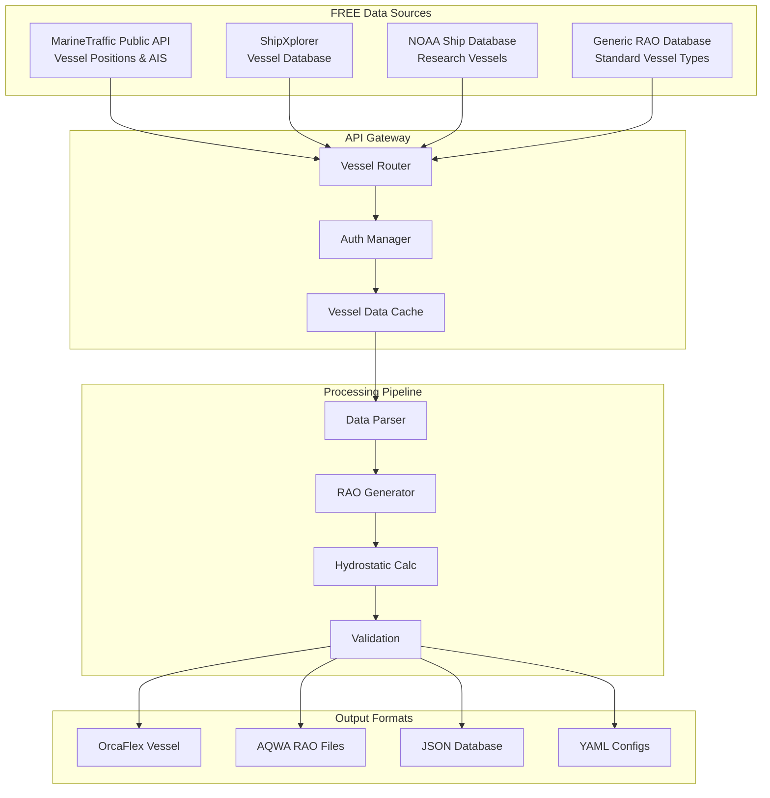

# Vessel Systems Data Procurement Specification

> **Spec**: Vessel RAOs and Ship Data Integration
> **Created**: 2025-10-23
> **Status**: Active Development - Tier 1 Priority
> **Version**: 1.0.0
> **Category**: Vessel Hydrodynamics
> **Common Components**: @specs/modules/data-procurement/common-components/spec.md

---

## Executive Summary

Vessel hydrodynamic data, particularly **Response Amplitude Operators (RAOs)**, is critical for coupled mooring/riser analysis, operability studies, and marine operations planning. This specification defines API-based procurement of vessel characteristics, RAO databases, and ship motion data from FREE public sources.

### Business Impact

- **Analysis Enabler**: Required for 80% of floating structure analyses
- **Time Savings**: 90% reduction in RAO data preparation (days → hours)
- **Cost Reduction**: Eliminates manual data entry and model testing expenses
- **Data Quality**: Access to validated RAO databases and ship data
- **Coverage**: Support for tankers, FPSOs, semi-submersibles, drill ships, barges

### Critical Applications

**Vessel Data Required For:**
- CALM/SALM buoy mooring analysis (tanker RAOs)
- FPSO mooring design and operability
- Semi-submersible platform response
- Drilling riser analysis (drillship motions)
- Subsea installation (barge/vessel motions)
- Tug and tow analysis

---

## System Architecture

### Vessel Data Architecture



---

## Technical Requirements

### Vessel Categories

| Vessel Type | Use Cases | RAO Data | Priority |
|-------------|-----------|----------|----------|
| **Tankers** (VLCC, Suezmax, Aframax) | CALM buoy mooring, oil transfer | Required | High |
| **FPSO** | Production/storage mooring | Required | High |
| **Semi-submersibles** | Drilling, production platforms | Required | High |
| **Drillships** | Drilling riser analysis | Required | High |
| **LNG Carriers** | LNG terminal berthing | Required | Medium |
| **Construction Vessels** | Heavy lift, installation | Required | Medium |
| **Barges** | Subsea equipment transport | Required | Medium |
| **Tugs** | Towing operations | Optional | Low |

### Vessel Characteristics Required

#### Basic Parameters

| Parameter | Units | Description | Source |
|-----------|-------|-------------|--------|
| **IMO Number** | - | Unique vessel identifier | MarineTraffic |
| **MMSI** | - | Maritime Mobile Service Identity | MarineTraffic |
| **Vessel Name** | - | Ship name | MarineTraffic |
| **Vessel Type** | - | Category (tanker, FPSO, etc.) | MarineTraffic |
| **Flag** | - | Registration country | MarineTraffic |
| **Built Year** | year | Year of construction | MarineTraffic |

#### Principal Dimensions

| Parameter | Symbol | Units | Source | Notes |
|-----------|--------|-------|--------|-------|
| **Length Overall** | LOA | m | MarineTraffic, Generic | Total length |
| **Length Between Perpendiculars** | LBP | m | Calculated | ~95% of LOA |
| **Beam** | B | m | MarineTraffic, Generic | Maximum width |
| **Depth** | D | m | Generic | Hull depth |
| **Draft (Design)** | T | m | Generic/Calculated | Operating draft |
| **Draft (Ballast)** | T_ballast | m | Calculated | Light condition |
| **Draft (Full Load)** | T_full | m | Calculated | Maximum draft |

#### Mass & Capacity

| Parameter | Symbol | Units | Source | Notes |
|-----------|--------|-------|--------|-------|
| **Deadweight Tonnage** | DWT | tonnes | MarineTraffic | Cargo capacity |
| **Displacement (Light)** | Δ_light | tonnes | Calculated | Ballast condition |
| **Displacement (Full)** | Δ_full | tonnes | Calculated | Full load |
| **Gross Tonnage** | GT | - | MarineTraffic | Volume measure |

#### Hydrostatic Properties

| Parameter | Symbol | Units | Source | Notes |
|-----------|--------|-------|--------|-------|
| **Block Coefficient** | Cb | - | Calculated/Generic | 0.7-0.85 for tankers |
| **Waterplane Area** | Awp | m² | Calculated | LBP × B × Cwp |
| **Center of Gravity** | KG | m | Generic | From baseline |
| **Center of Buoyancy** | KB | m | Calculated | From baseline |
| **Metacentric Height** | GM | m | Calculated | Stability parameter |
| **Roll Radius of Gyration** | k_xx | m | Calculated | ~0.35-0.40 × B |
| **Pitch Radius of Gyration** | k_yy | m | Calculated | ~0.20-0.25 × LBP |
| **Yaw Radius of Gyration** | k_zz | m | Calculated | ~0.20-0.25 × LBP |

### RAO (Response Amplitude Operator) Data

#### Motion DOF (Degrees of Freedom)

| DOF | Motion | RAO Units | Frequency Range | Wave Directions |
|-----|--------|-----------|-----------------|-----------------|
| **Surge (X)** | Horizontal longitudinal | m/m | 0.1-2.0 rad/s | 0°-180° (15° steps) |
| **Sway (Y)** | Horizontal lateral | m/m | 0.1-2.0 rad/s | 0°-180° (15° steps) |
| **Heave (Z)** | Vertical | m/m | 0.1-2.0 rad/s | 0°-180° (15° steps) |
| **Roll (RX)** | Rotation about X | deg/m | 0.1-2.0 rad/s | 0°-180° (15° steps) |
| **Pitch (RY)** | Rotation about Y | deg/m | 0.1-2.0 rad/s | 0°-180° (15° steps) |
| **Yaw (RZ)** | Rotation about Z | deg/m | 0.1-2.0 rad/s | 0°-180° (15° steps) |

#### RAO Format Requirements

```python
# RAO data structure
rao_data = {
    "vessel_id": "IMO1234567",
    "draft": 18.5,  # m
    "heading": 0,   # degrees (0 = head seas, 180 = following)
    "frequencies": [0.1, 0.15, 0.2, ..., 2.0],  # rad/s
    "wave_directions": [0, 15, 30, ..., 180],   # degrees
    "motions": {
        "surge": {
            "amplitude": [[...], [...], ...],  # m/m [freq x direction]
            "phase": [[...], [...], ...]        # degrees
        },
        "sway": {...},
        "heave": {...},
        "roll": {...},
        "pitch": {...},
        "yaw": {...}
    },
    "natural_periods": {
        "roll": 12.5,   # seconds
        "pitch": 8.0,   # seconds
        "heave": 10.0   # seconds
    }
}
```

---

## FREE API Specifications

### 1. MarineTraffic Public API

**Provider**: MarineTraffic
**Coverage**: Global vessel tracking
**Cost**: FREE tier (5 requests/minute, no credit card)

```yaml
api:
  name: "MarineTraffic"
  base_url: "https://services.marinetraffic.com/api/exportvessel/v:8"
  authentication:
    method: "api_key"
    registration: "https://www.marinetraffic.com/en/ais-api-services"
  rate_limit: 5 requests/minute (free tier)

parameters:
  - imo: "IMO number"
  - mmsi: "MMSI number"
  - shipname: "Vessel name"

response_fields:
  - IMO: "IMO number"
  - SHIP_ID: "MarineTraffic ID"
  - SHIPNAME: "Vessel name"
  - SHIPTYPE: "Vessel type code"
  - TYPE_NAME: "Vessel type name"
  - BUILT: "Year built"
  - FLAG: "Flag country"
  - DWT: "Deadweight tonnage"
  - LENGTH: "Length overall (m)"
  - WIDTH: "Beam (m)"
  - GRT: "Gross tonnage"

format: "JSON, XML"
```

**Example Request:**
```python
import requests

api_key = os.environ.get("MARINETRAFFIC_API_KEY")
imo = "9321483"  # Example IMO

url = f"https://services.marinetraffic.com/api/exportvessel/v:8/{api_key}/imo:{imo}/protocol:json"
response = requests.get(url)
vessel_data = response.json()
```

### 2. ShipXplorer API (FREE Tier)

**Provider**: ShipXplorer
**Coverage**: Global ship database
**Cost**: FREE tier available

```yaml
api:
  name: "ShipXplorer"
  base_url: "https://api.shipxplorer.com/v1"
  authentication:
    method: "api_key"
  rate_limit: "100 requests/hour (free tier)"

endpoints:
  - /vessel/search: "Search vessels by name/IMO/MMSI"
  - /vessel/details: "Get vessel details"
  - /vessel/position: "Get current position (AIS)"

format: "JSON"
```

### 3. Generic RAO Database (Open Source)

**Provider**: DigitalModel Repository (Internal)
**Coverage**: Standard vessel types
**Cost**: FREE (repository data)

```yaml
database:
  name: "Generic RAO Database"
  location: "@specs/modules/data-procurement/vessel-systems/data/generic_raos/"

vessel_types:
  - type: "VLCC"
    loa_range: [320, 360]  # m
    dwt_range: [280000, 320000]  # tonnes
    rao_drafts: [18, 20, 22]  # m

  - type: "Suezmax"
    loa_range: [270, 290]
    dwt_range: [150000, 180000]
    rao_drafts: [16, 18, 20]

  - type: "Aframax"
    loa_range: [240, 250]
    dwt_range: [100000, 120000]
    rao_drafts: [14, 16, 18]

  - type: "Semi-submersible"
    dimensions: ["standard", "large"]
    rao_drafts: [20, 25, 30]

  - type: "Drillship"
    loa_range: [200, 250]
    displacement_range: [50000, 80000]
    rao_drafts: [10, 12, 14]

format: "YAML, JSON, OrcaFlex .yml"
```

---

## User Stories

### Story 1: Mooring Engineer - CALM Buoy Analysis

**As a** mooring engineer,
**I want** to retrieve VLCC tanker RAOs for CALM buoy mooring analysis,
**So that** I can perform coupled dynamic analysis in OrcaFlex.

**Workflow:**
1. Specify vessel requirements (VLCC, 300K DWT, 20m draft)
2. System searches generic RAO database for matching vessel
3. RAO data exported to OrcaFlex vessel format
4. Engineer imports vessel and RAOs into mooring model
5. Run coupled analysis with CALM buoy

**Success Criteria:**
- RAO data for 6 DOF, all wave directions
- Format compatible with OrcaFlex
- Natural periods validated against typical values
- Hydrostatic properties consistent

### Story 2: Naval Architect - Vessel Database Query

**As a** naval architect,
**I want** to query vessel database by IMO or name,
**So that** I can retrieve ship particulars for engineering analysis.

**Workflow:**
1. Enter vessel IMO or name
2. System queries MarineTraffic API
3. Retrieve principal dimensions, tonnages, year built
4. Auto-calculate hydrostatic properties (Cb, GM, etc.)
5. Store in local vessel database

**Success Criteria:**
- Accurate vessel identification
- Principal dimensions retrieved
- Automatic property calculations
- Data validation against reasonable ranges

### Story 3: Installation Engineer - Barge Motion Study

**As an** installation engineer,
**I want** construction barge RAOs for subsea equipment installation,
**So that** I can assess operability and lifting conditions.

**Workflow:**
1. Specify barge dimensions (length, beam, draft)
2. System generates approximate RAOs using generic database
3. Calculate barge motions for weather conditions
4. Assess crane tip motion and lift feasibility
5. Determine weather window requirements

**Success Criteria:**
- RAOs generated for specified barge
- Motion predictions for installation site metocean
- Crane tip motion within limits (<2m heave)
- Weather window analysis (% time operable)

---

## Spec Scope

### Included Capabilities

1. **Vessel Database Query**
   - Search by IMO, MMSI, vessel name
   - Retrieve basic vessel characteristics
   - Access historical vessel data

2. **Hydrostatic Calculations**
   - Automatic calculation of CB, CWP, CM
   - Estimate GM, KB, KG from dimensions
   - Calculate radii of gyration
   - Validate against typical values

3. **RAO Data Management**
   - Generic RAO database for standard vessel types
   - Interpolation for non-standard dimensions
   - Multi-draft RAO generation
   - Wave direction interpolation

4. **Format Conversion**
   - OrcaFlex vessel YAML format
   - AQWA RAO input files
   - JSON/CSV databases
   - Visualization formats

5. **Validation & Quality Control**
   - Range checking (dimensions, coefficients)
   - Natural period validation
   - Hydrostatic consistency checks
   - RAO amplitude reasonableness

### Processing Capabilities

1. **Vessel Matching**
   - Fuzzy matching by dimensions
   - Select nearest generic vessel
   - Interpolate RAOs between sizes

2. **Draft Interpolation**
   - Linear interpolation between RAO drafts
   - Extrapolation with warnings
   - Validate against trim and metacentric height

3. **RAO Generation (Basic)**
   - Scale generic RAOs by vessel dimensions
   - Adjust natural periods based on mass/stiffness
   - Simple strip theory approximations

---

## Out of Scope

- ❌ Detailed hydrodynamic analysis (use AQWA/WAMIT)
- ❌ Model testing and validation
- ❌ Proprietary RAO databases (commercial vessel operators)
- ❌ Real-time vessel tracking (beyond basic AIS)
- ❌ Vessel structural design
- ❌ Computational Fluid Dynamics (CFD)

---

## Expected Deliverables

### Technical Deliverables

1. **Vessel Data API Client**
   - MarineTraffic integration
   - ShipXplorer integration
   - Generic RAO database access
   - Local vessel database (caching)

2. **Hydrostatic Calculator**
   - Coefficients estimation (Cb, Cwp, CM)
   - Metacentric height (GM) calculation
   - Center of buoyancy (KB) estimation
   - Radii of gyration formulas

3. **RAO Processing Tools**
   - RAO interpolation (draft, frequency, direction)
   - Natural period estimation
   - Format converters (OrcaFlex, AQWA)
   - RAO validation and plotting

4. **Generic RAO Database**
   - 10+ standard vessel types
   - Multiple draft conditions per vessel
   - 6 DOF RAOs, all wave directions
   - YAML format (editable)

### Documentation Deliverables

1. **User Guide**
   - Vessel search and retrieval
   - RAO selection workflow
   - OrcaFlex integration examples
   - Validation procedures

2. **Technical Reference**
   - Hydrostatic formulas
   - RAO interpolation methods
   - Data schemas
   - API specifications

3. **Tutorial Examples**
   - CALM buoy vessel setup
   - FPSO mooring analysis
   - Barge motion study
   - Drillship riser analysis

---

## Performance Requirements

(Inherits from @specs/modules/data-procurement/common-components/spec.md)

### Vessel-Specific Targets

| Operation | Target | Notes |
|-----------|--------|-------|
| **Vessel Search (MarineTraffic)** | <2s | API latency + parsing |
| **Cached Vessel Lookup** | <10ms | Local database |
| **RAO Interpolation** | <100ms | Single draft/direction |
| **OrcaFlex Export** | <500ms | Full vessel + RAOs |

---

## Integration Points

### Repository Integration

- **CALM Buoy Models**: @docs/modules/orcaflex/mooring/buoy/C06 CALM Buoy
- **Ship Design Domain**: @docs/domains/ship-design/
- **RAO Documentation**: @docs/domains/ship-design/raos.md @docs/modules/orcaflex/raos.md
- **Vessel Database**: @docs/domains/ship-design/coefficients/

### Output Formats

1. **OrcaFlex**
   ```yaml
   # OrcaFlex vessel YAML
   Name: VLCC_300KDWT
   Length: 330.0
   Beam: 58.0
   Draft: 20.0
   Displacement: 350000.0
   RAOOrigin: [165.0, 0.0, -10.0]
   RAODirectionConvention: TowardsVessel
   RAOPeriodOrFrequency: Frequency
   ```

2. **AQWA**
   ```
   RAOS,FREQ
   * VLCC 300K DWT, Draft 20m
   FREQ    SURGE    SWAY     HEAVE    ROLL     PITCH    YAW
   0.1     1.05     0.02     0.95     0.5      1.2      0.1
   ...
   ```

---

## Agent Delegation Matrix

| Component | Lead Agent | Supporting Agents | Priority |
|-----------|-----------|-------------------|----------|
| **MarineTraffic Integration** | Data Agent | Testing Agent | High |
| **Generic RAO Database** | Data Agent | Transform Agent | High |
| **Hydrostatic Calculator** | Transform Agent | Data Agent | High |
| **RAO Interpolation** | Transform Agent | Testing Agent | High |
| **OrcaFlex Export** | Transform Agent | Documentation Agent | High |
| **Validation Tools** | Testing Agent | Transform Agent | Medium |
| **Vessel Database (Local)** | Cache Agent | Data Agent | Medium |
| **Documentation** | Documentation Agent | All Agents | Medium |

---

## Configuration Example

```yaml
# vessel_config.yml
version: "1.0"

# Reference common components
extends: "@specs/modules/data-procurement/common-components/spec.md"

data_source:
  category: "vessel_systems"

vessel:
  identification:
    method: "imo"  # or "mmsi", "name", "dimensions"
    value: "9321483"  # IMO example

  # Or specify generic vessel
  generic:
    type: "VLCC"
    dwt: 300000
    draft: 20.0
    loa: 330.0
    beam: 58.0

raos:
  source: "generic_database"  # or "calculated"
  drafts: [18, 20, 22]
  wave_directions: [0, 15, 30, 45, 60, 90, 120, 135, 150, 165, 180]
  frequency_range:
    min: 0.1  # rad/s
    max: 2.0
    step: 0.05

output:
  format: "orcaflex_yml"  # or "aqwa", "json", "csv"
  include_natural_periods: true
  include_hydrostatics: true

caching:
  enabled: true
  ttl_days: 365  # Vessel data changes rarely
  tier: "L3"  # Disk cache

validation:
  check_dimensions: true
  check_hydrostatics: true
  check_rao_amplitudes: true
  warn_on_extrapolation: true
```

---

## References

- **Common Components**: @specs/modules/data-procurement/common-components/spec.md
- **CALM Buoy Data**: @specs/modules/data-procurement/CALM_Buoy_claude.md
- **Ship Design Domain**: @docs/domains/ship-design/
- **OrcaFlex RAO Guide**: @docs/modules/orcaflex/raos.md
- **MarineTraffic API**: https://www.marinetraffic.com/en/ais-api-services

---

*Vessel Systems Specification Version 1.0.0*
*Tier 1 Priority - Critical for Coupled Analysis*
*Last Updated: 2025-10-23*
