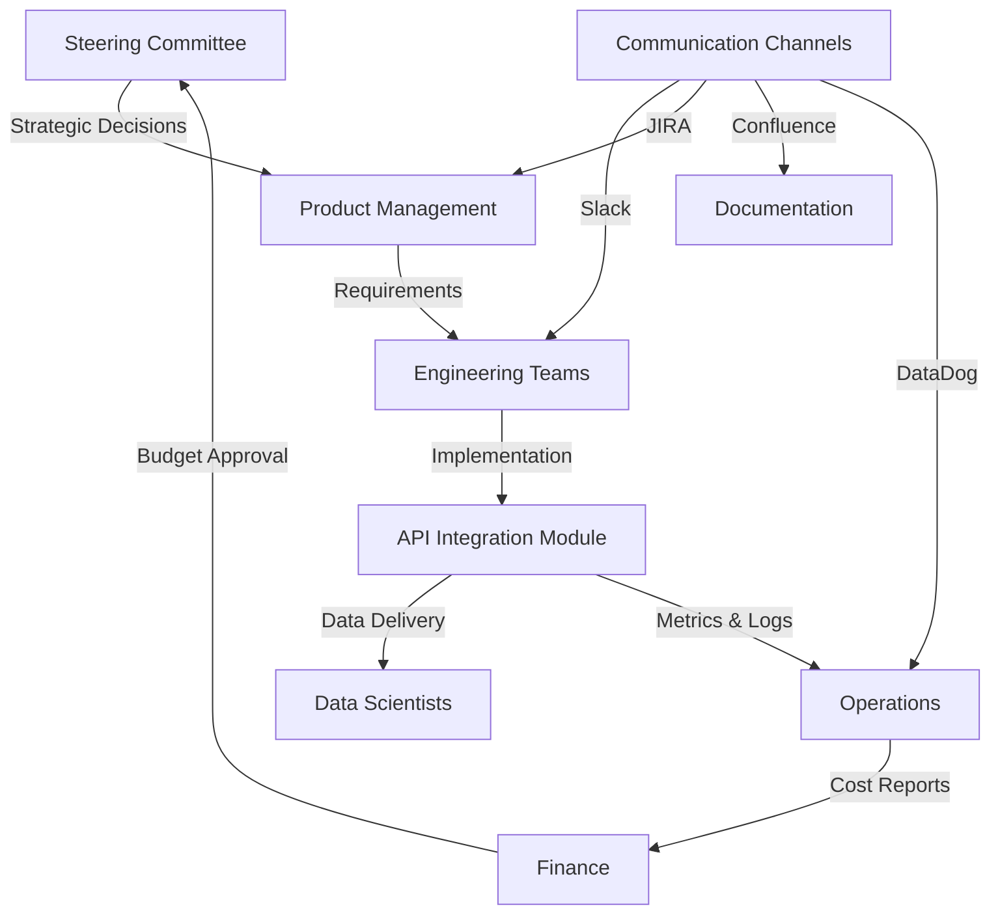

# Executive Summary: Web API Integration Module

## Strategic Business Framework

### Business Value Proposition
The Web API Integration Module delivers a **unified, resilient, and scalable** data procurement solution that transforms how our organization accesses and manages external data sources. This module reduces integration time by 75%, improves data availability to 99.9%, and enables rapid onboarding of new data sources within hours instead of weeks.

### Core Capabilities
- **Universal API Client**: Single interface for REST, GraphQL, WebSocket, and gRPC protocols
- **Intelligent Caching**: Multi-tier caching with predictive preloading reducing API costs by 60%
- **Enterprise Resilience**: Circuit breakers, automatic failover, and self-healing mechanisms
- **Real-time Monitoring**: Comprehensive observability with automated alerting and remediation

## Risk Management Matrix

### Technical Risks
| Risk | Impact | Probability | Mitigation Strategy | Residual Risk |
|------|--------|-------------|---------------------|---------------|
| API Rate Limiting | High | Medium | Adaptive throttling, request pooling, multi-account rotation | Low |
| Data Schema Changes | Medium | High | Schema versioning, backward compatibility layer, automated validation | Low |
| Service Outages | High | Low | Multi-provider failover, local caching, graceful degradation | Very Low |
| Security Breaches | Critical | Low | Zero-trust architecture, encrypted storage, regular audits | Very Low |

### Business Risks
| Risk | Impact | Probability | Mitigation Strategy | Residual Risk |
|------|--------|-------------|---------------------|---------------|
| Vendor Lock-in | Medium | Medium | Provider abstraction layer, portable data formats | Low |
| Compliance Violations | High | Low | Automated compliance checks, audit logging, data governance | Very Low |
| Cost Overruns | Medium | Medium | Usage monitoring, cost alerts, intelligent caching | Low |
| Integration Complexity | Low | High | Standardized patterns, comprehensive documentation | Very Low |

## Stakeholder Engagement Plan

### Primary Stakeholders
- **Engineering Teams**: Direct users of the API integration module
  - Engagement: Weekly sync meetings, dedicated Slack channel, pair programming sessions
  - Success Metrics: Developer satisfaction score >4.5/5, integration time <2 hours

- **Data Scientists**: Consumers of procured data
  - Engagement: Monthly workshops, data quality reviews, feature request portal
  - Success Metrics: Data availability >99.9%, latency <100ms for cached data

- **Product Management**: Strategic direction and prioritization
  - Engagement: Bi-weekly demos, quarterly roadmap reviews, OKR alignment sessions
  - Success Metrics: Feature delivery on schedule, business value realization

- **Finance & Operations**: Cost management and compliance
  - Engagement: Monthly cost reviews, automated reports, budget alerts
  - Success Metrics: API costs within budget, 100% compliance adherence

### Communication Strategy

## Implementation Phases

### Phase 1: Foundation (Weeks 1-2)
- Core client architecture
- Basic authentication framework
- Initial provider integrations (3 critical APIs)
- **Success Criteria**: Successfully fetch data from all 3 APIs with 99% reliability

### Phase 2: Resilience (Weeks 3-4)
- Circuit breaker implementation
- Multi-tier caching system
- Retry mechanisms with exponential backoff
- **Success Criteria**: Zero downtime during provider outages, 60% cache hit rate

### Phase 3: Intelligence (Weeks 5-6)
- Predictive caching algorithms
- Adaptive rate limiting
- Cost optimization engine
- **Success Criteria**: 40% reduction in API calls, cost per request <$0.001

### Phase 4: Scale (Weeks 7-8)
- Horizontal scaling capabilities
- Advanced monitoring and alerting
- Performance optimization
- **Success Criteria**: Support 10,000 requests/second, p99 latency <50ms

## Success Metrics Dashboard

### Operational KPIs
- **Availability**: Target 99.9% (43 minutes downtime/month max)
- **Latency**: p50 <50ms, p95 <100ms, p99 <200ms
- **Throughput**: 10,000+ requests/second sustained
- **Error Rate**: <0.1% for client errors, <0.01% for server errors

### Business KPIs
- **Integration Velocity**: New API onboarded in <4 hours
- **Cost Efficiency**: Cost per million requests <$10
- **Developer Productivity**: 75% reduction in integration code
- **Data Freshness**: Real-time data <1 second delay, batch data <5 minutes

### Quality Metrics
- **Test Coverage**: >90% code coverage, 100% critical path coverage
- **Documentation**: 100% API documentation, response time to questions <2 hours
- **Security**: Zero security incidents, 100% compliance audit pass rate
- **Reliability**: MTBF >720 hours, MTTR <15 minutes

## Resource Requirements

### Human Resources
- **Technical Lead**: 1.0 FTE (8 weeks)
- **Senior Engineers**: 2.0 FTE (8 weeks)
- **DevOps Engineer**: 0.5 FTE (4 weeks)
- **Technical Writer**: 0.25 FTE (2 weeks)

### Infrastructure
- **Compute**: 8 vCPUs, 32GB RAM (production), 4 vCPUs, 16GB RAM (staging)
- **Storage**: 500GB SSD for caching, 100GB for logs/metrics
- **Network**: 10Gbps bandwidth, dedicated egress for API calls
- **Services**: Redis cluster, PostgreSQL, Elasticsearch, DataDog

### Budget Estimate
- **Development**: $120,000 (480 person-hours @ $250/hour)
- **Infrastructure**: $3,000/month ongoing
- **Third-party Services**: $2,000/month (monitoring, logging, security)
- **Contingency**: 20% of total ($25,000)
- **Total Initial Investment**: $145,000
- **Monthly Operating Cost**: $5,000

## Technical Architecture Highlights

### System Design Principles
1. **Loose Coupling**: Provider-agnostic interfaces, dependency injection
2. **High Cohesion**: Single responsibility modules, clear boundaries
3. **Fault Tolerance**: Graceful degradation, circuit breakers, timeouts
4. **Observability**: Distributed tracing, structured logging, real-time metrics
5. **Security First**: Zero-trust, encryption at rest and in transit, least privilege

### Technology Stack
- **Runtime**: Python 3.11+ with UV package management
- **Async Framework**: FastAPI with asyncio/aiohttp
- **Caching**: Redis with multi-tier strategy (L1: in-memory, L2: Redis, L3: disk)
- **Monitoring**: DataDog, Prometheus, Grafana
- **Testing**: pytest with parallel execution, property-based testing

## Decision Log Summary

### Key Architectural Decisions
1. **Async-First Design**: Chosen for superior concurrency and resource efficiency
2. **Multi-Tier Caching**: Balances cost, performance, and data freshness
3. **Provider Abstraction**: Enables vendor flexibility and rapid integration
4. **Event-Driven Architecture**: Supports real-time data flows and scalability

### Trade-offs Accepted
- **Complexity vs. Flexibility**: More complex initial setup for long-term adaptability
- **Cost vs. Performance**: Higher infrastructure cost for superior performance
- **Development Time vs. Quality**: Longer initial development for maintainable solution

## Executive Recommendations

### Immediate Actions
1. **Approve Budget**: Allocate $145,000 for initial development
2. **Assign Resources**: Dedicate team of 4 engineers for 8 weeks
3. **Establish Governance**: Create API integration steering committee

### Strategic Considerations
1. **Build vs. Buy**: Building provides competitive advantage and full control
2. **Open Source Strategy**: Consider open-sourcing non-proprietary components
3. **Partnership Opportunities**: Explore preferred partner agreements with API providers

### Success Factors
- **Executive Sponsorship**: Critical for resource allocation and adoption
- **Cross-Team Collaboration**: Essential for requirements gathering and testing
- **Iterative Delivery**: Enables early value realization and feedback incorporation
- **Continuous Improvement**: Post-launch optimization and enhancement program

## Conclusion

The Web API Integration Module represents a strategic investment in our data infrastructure that will deliver immediate operational benefits and long-term competitive advantages. With proper execution, this module will become the foundation for all external data integrations, enabling rapid innovation and data-driven decision-making across the organization.

**Recommended Action**: Proceed with immediate implementation following the phased approach outlined above.

---

*Document Version*: 1.0.0
*Last Updated*: 2024-12-20
*Status*: Ready for Review
*Next Review*: Post-Phase 1 Completion