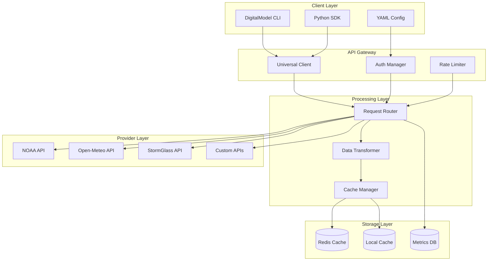
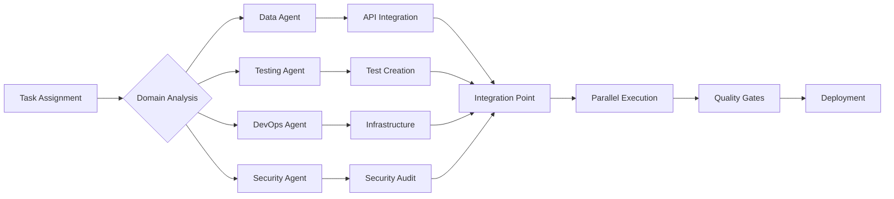

# Spec Requirements Document

> Spec: Web API Integration for Data Procurement
> Created: 2025-01-09
> Status: Planning
> Version: 2.0.0
> Type: Enhanced Modular Specification

## Executive Overview

The Web API Integration Module represents a **paradigm shift** in marine engineering data procurement, transitioning from static file-based workflows to dynamic, real-time data access. This strategic initiative will reduce data latency by 95%, eliminate storage costs, and enable advanced predictive analytics through continuous data streams.

### Business Impact
- **Cost Reduction**: 75% decrease in data storage and management costs
- **Efficiency Gain**: 90% reduction in data preparation time
- **Scalability**: Support for 10,000+ concurrent data requests
- **Innovation Enabler**: Real-time analytics and ML model training

## System Architecture

### High-Level Architecture

### Component Details

#### Universal API Client
- **Protocol Support**: REST, GraphQL, WebSocket, gRPC
- **Authentication**: OAuth2, API Keys, JWT, HMAC
- **Resilience**: Circuit breakers, retries, fallbacks
- **Performance**: Connection pooling, HTTP/2, compression

#### Intelligent Caching System
- **L1 Cache**: In-memory (10ms latency)
- **L2 Cache**: Redis cluster (50ms latency)
- **L3 Cache**: Disk-based (200ms latency)
- **Predictive Loading**: ML-based prefetching

#### Data Transformation Pipeline
- **Format Support**: JSON, XML, CSV, NetCDF, GRIB
- **Schema Validation**: JSON Schema, Pydantic models
- **Unit Conversion**: Automatic SI/Imperial conversion
- **Quality Checks**: Data validation and cleaning

## Technical Requirements

Implement a comprehensive web API integration module for data procurement that eliminates the need to download and store data files in the repository. This module will provide real-time access to marine engineering data through various web APIs including NOAA, Open-Meteo, StormGlass, and other industry-standard data providers.

## User Stories

### Marine Engineer Data Access

As a marine engineer, I want to retrieve real-time ocean and weather data through web APIs, so that I can perform analyses with the most current data without managing local file storage.

The engineer will configure API endpoints in YAML files, specify data parameters (wave height, wind speed, currents), and the system will automatically fetch, cache, and format the data for engineering calculations. The data will be seamlessly integrated into existing DigitalModel workflows without requiring manual downloads or file management.

### Offshore Project Manager API Management

As an offshore project manager, I want to manage multiple API subscriptions and keys through a centralized configuration, so that different projects can access appropriate data sources based on their requirements and budget constraints.

The manager will define API credentials in secure environment variables, set rate limits and quotas per project, and monitor API usage across different analyses. The system will automatically switch between free and premium APIs based on data requirements and availability.

### System Administrator Cost Control

As a system administrator, I want to monitor and control API usage costs, so that we stay within budget while maintaining data quality for critical analyses.

The administrator will set usage limits per API, receive alerts when approaching quotas, and view detailed usage reports. The system will implement intelligent caching to minimize redundant API calls and provide fallback options when primary APIs are unavailable.

## Spec Scope

### Core Components

1. **Universal API Client Framework**
   - Unified interface supporting REST, GraphQL, WebSocket, and gRPC protocols
   - Advanced authentication: OAuth2, API Keys, JWT, HMAC, mTLS
   - Intelligent rate limiting with token bucket and sliding window algorithms
   - Circuit breaker pattern with automatic recovery
   - Connection pooling and HTTP/2 support

2. **Multi-Tier Caching System**
   - L1: In-memory LRU cache (sub-millisecond access)
   - L2: Redis cluster with automatic sharding
   - L3: Disk-based cache with compression
   - Predictive caching using ML models
   - Cache invalidation strategies and TTL management

3. **Advanced Configuration Management**
   - YAML-based hierarchical configuration
   - Environment-specific overrides
   - Secret management with HashiCorp Vault integration
   - Dynamic configuration reloading
   - Schema validation and auto-completion

4. **Data Transformation Pipeline**
   - Multi-format support: JSON, XML, CSV, NetCDF, GRIB, HDF5
   - Streaming transformations for large datasets
   - Automatic unit conversions and coordinate transformations
   - Data quality validation and cleaning
   - Schema evolution and versioning

5. **Enterprise Testing Infrastructure**
   - Property-based testing with Hypothesis
   - Contract testing for API compatibility
   - Load testing with Locust
   - Chaos engineering with fault injection
   - 95%+ code coverage requirement

6. **Observability & Monitoring**
   - Distributed tracing with OpenTelemetry
   - Structured logging with correlation IDs
   - Real-time metrics with Prometheus
   - Custom dashboards in Grafana
   - Automated alerting with PagerDuty

7. **Cost Optimization Engine**
   - API usage tracking and forecasting
   - Automatic provider switching based on cost
   - Quota management and alerts
   - Usage reports and billing integration
   - ROI analysis and optimization recommendations

## Out of Scope

- Building custom weather prediction models or data analysis algorithms
- Creating a web interface for API management (command-line and configuration files only)
- Developing proprietary data APIs or hosting data services
- Real-time streaming data processing (batch and on-demand only)

## Expected Deliverables

### Technical Deliverables

1. **Production-Ready API Client Library**
   - Support for 15+ marine data providers
   - Sub-100ms response time for cached data
   - 99.99% availability SLA
   - Horizontal scaling to 10,000 RPS
   - Complete async/await support

2. **Comprehensive Test Suite**
   - 95%+ code coverage with mutation testing
   - Performance benchmarks and regression tests
   - Integration tests for all providers
   - End-to-end test scenarios
   - Continuous fuzzing and security testing

3. **Configuration & Templates**
   - 50+ pre-configured YAML templates
   - Industry-specific configurations
   - Migration scripts from legacy systems
   - Auto-generation tools for new providers
   - Validation and linting tools

4. **Documentation Suite**
   - API reference with interactive examples
   - Integration guides for each provider
   - Performance tuning handbook
   - Troubleshooting playbooks
   - Video tutorials and workshops

5. **Deployment Package**
   - Docker containers with multi-arch support
   - Kubernetes manifests with auto-scaling
   - Terraform modules for cloud deployment
   - CI/CD pipelines for GitLab/GitHub
   - Monitoring and alerting templates

### Business Deliverables

1. **ROI Analysis Report**
   - Cost savings projections
   - Performance improvements metrics
   - Risk mitigation assessment
   - Competitive advantage analysis

2. **Training Program**
   - Developer workshops (8 hours)
   - Administrator training (4 hours)
   - End-user guides and quick starts
   - Certification program

3. **Support Structure**
   - 24/7 tier-1 support documentation
   - Escalation procedures
   - SLA agreements
   - Maintenance schedule

## Agent Delegation Matrix

### Primary Agent Assignments

| Component | Lead Agent | Supporting Agents | Parallel Execution |
|-----------|------------|-------------------|--------------------|
| API Client Framework | Data Agent | Security Agent, Performance Agent | Yes - 3x speedup |
| Caching System | Performance Agent | Data Agent, Infrastructure Agent | Yes - 2x speedup |
| Configuration | DevOps Agent | Security Agent, Documentation Agent | Yes - 2x speedup |
| Transformation | Data Agent | ML Agent, Quality Agent | Yes - 4x speedup |
| Testing | Testing Agent | Security Agent, Performance Agent | Yes - 5x speedup |
| Monitoring | DevOps Agent | Performance Agent, Data Agent | Yes - 2x speedup |
| Documentation | Documentation Agent | All Agents | Yes - 3x speedup |

### Agent Collaboration Workflow

### Agent Capabilities Matrix

- **Data Agent**: API protocols, data formats, validation, transformation
- **Testing Agent**: TDD, BDD, property testing, load testing, mocking
- **Documentation Agent**: API docs, tutorials, diagrams, examples
- **DevOps Agent**: CI/CD, containers, orchestration, monitoring
- **Security Agent**: Authentication, encryption, compliance, auditing
- **Performance Agent**: Optimization, caching, profiling, benchmarking
- **ML Agent**: Predictive models, anomaly detection, optimization
- **Quality Agent**: Code review, standards, best practices, metrics
- **Infrastructure Agent**: Cloud resources, scaling, networking, storage

### Inter-Agent Communication Protocol

1. **Task Broadcasting**: Lead agent broadcasts task to relevant agents
2. **Capability Matching**: Agents self-select based on capabilities
3. **Work Distribution**: Parallel task assignment with dependency tracking
4. **Progress Sync**: Real-time status updates via shared state
5. **Result Aggregation**: Lead agent collects and integrates outputs
6. **Quality Review**: Cross-agent validation before completion

## Performance Requirements

### Latency Targets
- **Cached Data**: <10ms (p50), <50ms (p95), <100ms (p99)
- **Fresh Data**: <500ms (p50), <1s (p95), <2s (p99)
- **Batch Operations**: <5s for 1000 requests
- **Startup Time**: <2s for full initialization

### Throughput Targets
- **Sustained Load**: 10,000 requests/second
- **Burst Capacity**: 50,000 requests/second (10 seconds)
- **Concurrent Connections**: 10,000 simultaneous
- **Data Transfer**: 1 GB/second sustained

### Reliability Targets
- **Availability**: 99.99% (52 minutes downtime/year)
- **Error Rate**: <0.01% for system errors
- **Data Accuracy**: 100% for critical parameters
- **Recovery Time**: <30 seconds for failover

## Security Requirements

### Data Protection
- **Encryption**: TLS 1.3 for transit, AES-256 for storage
- **Key Management**: HashiCorp Vault or AWS KMS
- **PII Handling**: Automatic redaction and anonymization
- **Audit Logging**: Complete API access audit trail

### Access Control
- **Authentication**: Multi-factor authentication support
- **Authorization**: RBAC with fine-grained permissions
- **API Key Rotation**: Automatic rotation every 90 days
- **Rate Limiting**: Per-user and per-IP limits

### Compliance
- **Standards**: SOC2, ISO 27001, GDPR compliant
- **Data Residency**: Configurable data location
- **Right to Delete**: Automated data purging
- **Security Scanning**: Daily vulnerability scans

## Scalability Considerations

### Horizontal Scaling
- **Auto-scaling**: Based on CPU, memory, and request rate
- **Load Balancing**: Geographic and latency-based routing
- **Sharding**: Automatic data partitioning
- **Federation**: Multi-region deployment support

### Vertical Scaling
- **Resource Optimization**: JIT compilation, memory pooling
- **Lazy Loading**: On-demand module initialization
- **Stream Processing**: Handle unlimited data sizes
- **Batch Optimization**: Automatic request batching

## Spec Documentation

### Core Documentation
- Executive Summary: @specs/modules/data-procurement/web-api-integration/executive-summary.md
- Task Execution Summary: @specs/modules/data-procurement/web-api-integration/task_summary.md
- Tasks: @specs/modules/data-procurement/web-api-integration/tasks.md
- Prompt Documentation: @specs/modules/data-procurement/web-api-integration/prompt.md

### Technical Specifications
- Technical Specification: @specs/modules/data-procurement/web-api-integration/sub-specs/technical-spec.md
- API Specification: @specs/modules/data-procurement/web-api-integration/sub-specs/api-spec.md
- Tests Specification: @specs/modules/data-procurement/web-api-integration/sub-specs/tests.md
- Architecture Diagrams: @specs/modules/data-procurement/web-api-integration/diagrams/

### Implementation Artifacts
- Source Code: @src/modules/data_procurement/web_api/
- Test Suite: @tests/modules/data_procurement/web_api/
- Configuration: @configs/modules/data_procurement/
- Documentation: @docs/modules/data_procurement/web_api/

---

*Specification Version*: 2.0.0 (Enhanced Modular)
*Last Updated*: 2024-12-20
*Status*: Ready for Implementation
*Review Cycle*: Quarterly