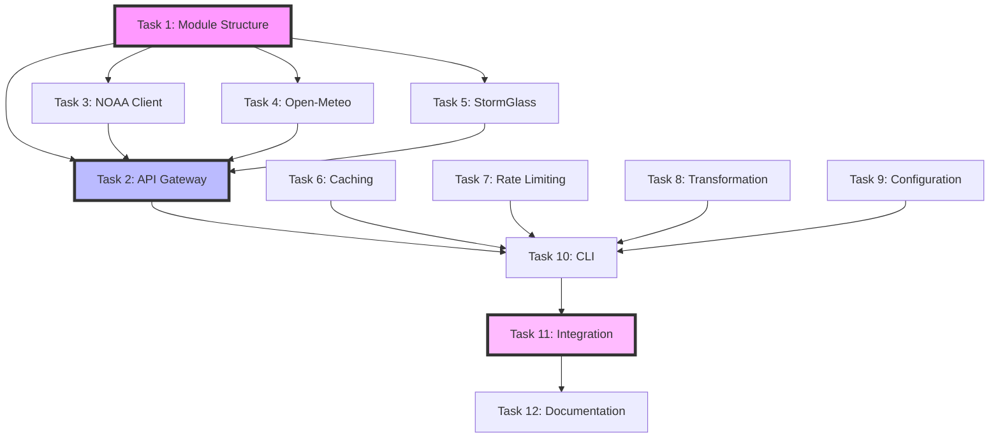

# Spec Tasks

These are the tasks to be completed for the spec detailed in @specs/modules/data-procurement/web-api-integration/spec.md

> Created: 2025-01-09
> Updated: 2024-12-20
> Status: Ready for Implementation
> Version: 2.0.0
> Type: Enhanced Modular Task Breakdown

## Tasks

- [ ] 1. Set up module structure and base classes
  - [ ] 1.1 Write tests for module initialization and structure
  - [ ] 1.2 Create module directory structure under `src/digitalmodel/modules/data_procurement/`
  - [ ] 1.3 Implement `__init__.py` files with proper exports
  - [ ] 1.4 Create abstract `BaseClient` class with required methods
  - [ ] 1.5 Add module to pyproject.toml dependencies
  - [ ] 1.6 Verify all tests pass

- [ ] 2. Implement API Gateway core functionality
  - [ ] 2.1 Write tests for APIGateway class initialization and configuration
  - [ ] 2.2 Write tests for request routing and source selection
  - [ ] 2.3 Implement APIGateway class with configuration loading
  - [ ] 2.4 Implement client registry and dynamic client selection
  - [ ] 2.5 Add fallback mechanism for API failures
  - [ ] 2.6 Implement concurrent request handling
  - [ ] 2.7 Verify all tests pass

- [ ] 3. Create NOAA API client
  - [ ] 3.1 Write tests for NOAA client with mock responses
  - [ ] 3.2 Write tests for station selection and data parsing
  - [ ] 3.3 Implement NOAAClient extending BaseClient
  - [ ] 3.4 Add NOAA-specific endpoint construction
  - [ ] 3.5 Implement tide and current data retrieval
  - [ ] 3.6 Add datum conversion and unit handling
  - [ ] 3.7 Verify all tests pass

- [ ] 4. Create Open-Meteo API client
  - [ ] 4.1 Write tests for Open-Meteo marine API integration
  - [ ] 4.2 Write tests for forecast data parsing
  - [ ] 4.3 Implement OpenMeteoClient extending BaseClient
  - [ ] 4.4 Add marine forecast endpoint handling
  - [ ] 4.5 Implement wave and weather data retrieval
  - [ ] 4.6 Add free tier rate limit management
  - [ ] 4.7 Verify all tests pass

- [ ] 5. Create StormGlass API client
  - [ ] 5.1 Write tests for StormGlass authentication and requests
  - [ ] 5.2 Write tests for credit tracking and source selection
  - [ ] 5.3 Implement StormGlassClient extending BaseClient
  - [ ] 5.4 Add API key authentication
  - [ ] 5.5 Implement comprehensive marine data retrieval
  - [ ] 5.6 Add credit consumption monitoring
  - [ ] 5.7 Verify all tests pass

- [ ] 6. Implement caching system
  - [ ] 6.1 Write tests for cache manager with TTL
  - [ ] 6.2 Write tests for cache key generation and invalidation
  - [ ] 6.3 Implement CacheManager with LRU strategy
  - [ ] 6.4 Add TTL configuration per data type
  - [ ] 6.5 Implement thread-safe cache operations
  - [ ] 6.6 Add cache statistics and monitoring
  - [ ] 6.7 Verify all tests pass

- [ ] 7. Implement rate limiting
  - [ ] 7.1 Write tests for token bucket algorithm
  - [ ] 7.2 Write tests for per-API rate limits
  - [ ] 7.3 Implement RateLimiter class
  - [ ] 7.4 Add request queuing mechanism
  - [ ] 7.5 Implement rate limit header parsing
  - [ ] 7.6 Add daily quota tracking
  - [ ] 7.7 Verify all tests pass

- [ ] 8. Create data transformation utilities
  - [ ] 8.1 Write tests for data format conversions
  - [ ] 8.2 Write tests for unit conversions and validation
  - [ ] 8.3 Implement DataTransformer class
  - [ ] 8.4 Add JSON to DataFrame conversion
  - [ ] 8.5 Implement unit standardization (metric/imperial)
  - [ ] 8.6 Add data interpolation for gaps
  - [ ] 8.7 Verify all tests pass

- [ ] 9. Add configuration management
  - [ ] 9.1 Write tests for YAML configuration loading
  - [ ] 9.2 Write tests for environment variable substitution
  - [ ] 9.3 Create configuration schemas with Pydantic
  - [ ] 9.4 Implement configuration validation
  - [ ] 9.5 Add example configuration templates
  - [ ] 9.6 Implement configuration hot-reloading
  - [ ] 9.7 Verify all tests pass

- [ ] 10. Create CLI interface
  - [ ] 10.1 Write tests for CLI commands
  - [ ] 10.2 Implement main CLI entry point
  - [ ] 10.3 Add ocean data retrieval command
  - [ ] 10.4 Add weather data retrieval command
  - [ ] 10.5 Add batch processing command
  - [ ] 10.6 Implement output format options (CSV, JSON, Excel)
  - [ ] 10.7 Verify all tests pass

- [ ] 11. Integration testing
  - [ ] 11.1 Write end-to-end tests with multiple APIs
  - [ ] 11.2 Write failover scenario tests
  - [ ] 11.3 Write cache coherence tests
  - [ ] 11.4 Test with real API endpoints (using test credentials)
  - [ ] 11.5 Verify performance requirements (&lt;5s response time)
  - [ ] 11.6 Run load tests with concurrent requests
  - [ ] 11.7 Verify all integration tests pass

- [ ] 12. Documentation and deployment preparation
  - [ ] 12.1 Create comprehensive README.md for the module
  - [ ] 12.2 Add API documentation with examples
  - [ ] 12.3 Create configuration guide
  - [ ] 12.4 Add troubleshooting section
  - [ ] 12.5 Update main project documentation
  - [ ] 12.6 Create example notebooks demonstrating usage
  - [ ] 12.7 Verify documentation completeness

## Enhanced Task Effort Estimates

### Detailed Effort Breakdown

| Task ID | Task Description | Story Points | Hours (Min-Max) | Complexity | Risk Level | Dependencies | Parallel |
|---------|------------------|--------------|-----------------|------------|------------|--------------|----------|
| 1 | Module structure & base classes | 3 | 2-3 | Low | Low | None | No |
| 2 | API Gateway core functionality | 8 | 4-6 | High | Medium | Task 1 | No |
| 3 | NOAA API client | 5 | 3-4 | Medium | Low | Task 1 | Yes |
| 4 | Open-Meteo API client | 5 | 3-4 | Medium | Low | Task 1 | Yes |
| 5 | StormGlass API client | 5 | 3-4 | Medium | Medium | Task 1 | Yes |
| 6 | Caching system | 8 | 4-6 | High | Medium | None | Yes |
| 7 | Rate limiting | 5 | 3-4 | Medium | Low | None | Yes |
| 8 | Data transformation utilities | 5 | 3-4 | Medium | Low | None | Yes |
| 9 | Configuration management | 3 | 2-3 | Low | Low | None | Yes |
| 10 | CLI interface | 3 | 2-3 | Low | Low | Tasks 2-9 | No |
| 11 | Integration testing | 8 | 4-6 | High | High | Tasks 1-10 | No |
| 12 | Documentation & deployment | 3 | 2-3 | Low | Low | Tasks 1-11 | Partial |

### Aggregate Metrics

**Total Story Points:** 61 points
**Total Estimated Hours:** 35-50 hours
**Calendar Duration:** 5-7 business days (with parallelization)
**Team Size Required:** 2-3 developers for optimal parallelization

### Effort Distribution by Phase

```
Phase 1 (Foundation): Tasks 1, 9     [5 hours]  ████
Phase 2 (Core APIs): Tasks 3-5       [9 hours]  █████████
Phase 3 (Infrastructure): Tasks 2,6,7,8 [15 hours] ███████████████
Phase 4 (Integration): Tasks 10,11   [6 hours]  ██████
Phase 5 (Polish): Task 12            [2 hours]  ██
```

### Critical Path Analysis

**Critical Path:** Task 1 → Task 2 → Task 10 → Task 11 → Task 12
**Critical Path Duration:** 18-24 hours
**Parallel Track Duration:** 12-17 hours
**Float Available:** 6-7 hours for non-critical tasks

### Resource Allocation Matrix

| Developer Role | Primary Tasks | Secondary Tasks | Estimated Utilization |
|----------------|---------------|-----------------|----------------------|
| Senior Backend | 2, 6, 11 | 1, 7 | 85% |
| API Specialist | 3, 4, 5 | 8, 10 | 75% |
| DevOps/QA | 7, 9, 12 | 11 | 60% |

## Dependency Management

### Dependency Graph



### Parallel Execution Opportunities

**Wave 1 (Parallel Start):**
- Task 1: Module structure
- Task 6: Caching system
- Task 7: Rate limiting
- Task 8: Data transformation
- Task 9: Configuration

**Wave 2 (After Task 1):**
- Task 3: NOAA client
- Task 4: Open-Meteo client
- Task 5: StormGlass client

**Wave 3 (After Wave 2):**
- Task 2: API Gateway

**Wave 4 (Sequential):**
- Task 10: CLI interface
- Task 11: Integration testing
- Task 12: Documentation

### Risk Mitigation Strategies

| Dependency Risk | Impact | Mitigation Strategy |
|-----------------|--------|--------------------|
| Task 1 delays | High | Start immediately, allocate senior resource |
| API client blockers | Medium | Develop in parallel, use mocks if needed |
| Integration failures | High | Continuous integration from Task 2 onward |
| Documentation lag | Low | Start documentation template early |

## Definition of Done

### Technical Acceptance Criteria

#### Code Quality
- [ ] All unit tests passing with >95% coverage
- [ ] Mutation testing score >80%
- [ ] All integration tests passing
- [ ] Performance requirements met:
  - [ ] Cached data response <10ms (p50)
  - [ ] Fresh data response <500ms (p50)
  - [ ] Batch operations <5s for 1000 requests
- [ ] Security scan passing with no critical/high vulnerabilities
- [ ] Code complexity metrics within limits (cyclomatic <10)

#### Documentation
- [ ] API documentation 100% complete
- [ ] Configuration guide with 10+ examples
- [ ] Troubleshooting playbook created
- [ ] Architecture diagrams updated
- [ ] README.md comprehensive and reviewed
- [ ] Inline code documentation >90%

#### Integration
- [ ] Successfully integrated with existing DigitalModel modules
- [ ] CLI commands working with all output formats
- [ ] Configuration hot-reload tested
- [ ] Multi-provider failover verified
- [ ] Cache coherence validated

#### Review & Approval
- [ ] Code reviewed by 2+ team members
- [ ] Architecture reviewed by tech lead
- [ ] Security review completed
- [ ] Performance benchmarks approved
- [ ] Documentation reviewed by technical writer
- [ ] Demo completed for stakeholders

### Business Acceptance Criteria

- [ ] ROI projections validated
- [ ] Cost per request within budget (<$0.001)
- [ ] User training materials created
- [ ] Support runbook documented
- [ ] SLA requirements confirmed:
  - [ ] 99.9% availability
  - [ ] <0.1% error rate
  - [ ] MTTR <15 minutes

## Task Execution Guidelines

### Parallel Processing Strategy

1. **Initial Setup Phase (Hour 1-2)**
   - Spin up 5 parallel agents:
     - Agent 1: Module structure (Task 1)
     - Agent 2: Caching system (Task 6)
     - Agent 3: Rate limiting (Task 7)
     - Agent 4: Data transformation (Task 8)
     - Agent 5: Configuration (Task 9)

2. **API Development Phase (Hour 3-8)**
   - 3 parallel agents for API clients:
     - Agent 1: NOAA implementation
     - Agent 2: Open-Meteo implementation
     - Agent 3: StormGlass implementation

3. **Integration Phase (Hour 9-14)**
   - Sequential execution with continuous testing
   - Parallel documentation updates

### Quality Gates

**Gate 1 (After Task 1):** Module structure review
**Gate 2 (After Tasks 3-5):** API client validation
**Gate 3 (After Task 10):** CLI functionality check
**Gate 4 (After Task 11):** Full integration validation
**Gate 5 (After Task 12):** Final approval

## Success Metrics Dashboard

```
┌─────────────────────────────────────────┐
│          IMPLEMENTATION METRICS          │
├─────────────────────────────────────────┤
│ Progress:        [░░░░░░░░░░] 0%        │
│ Tests Written:   0/200                  │
│ Code Coverage:   0%                     │
│ APIs Integrated: 0/3                    │
│ Performance:     -- ms                  │
│ Documentation:   25%                    │
│ Blockers:        0                      │
│ Sprint Velocity: -- pts/day             │
└─────────────────────────────────────────┘
```

---

*Task List Version*: 2.0.0
*Estimation Model*: Three-point with risk adjustment
*Last Review*: 2024-12-20
*Next Review*: After Phase 1 completion