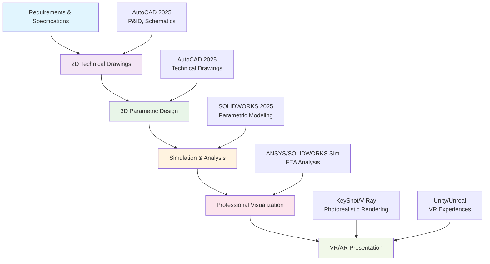
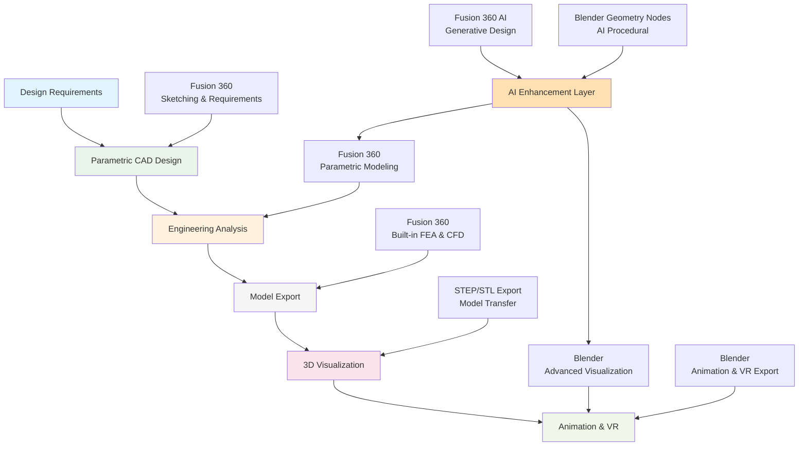
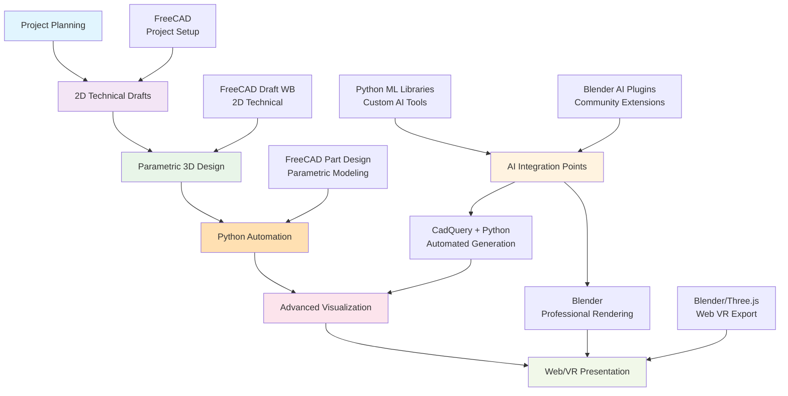
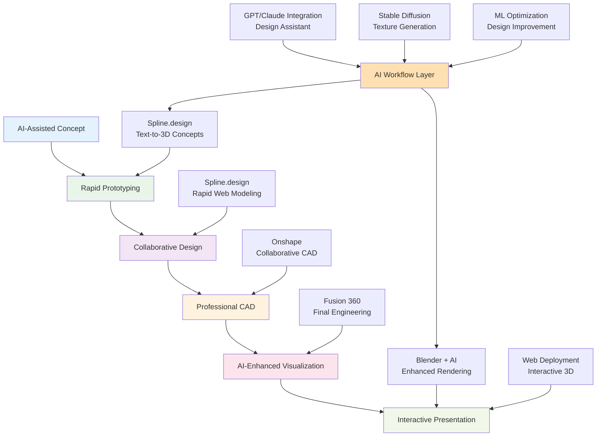
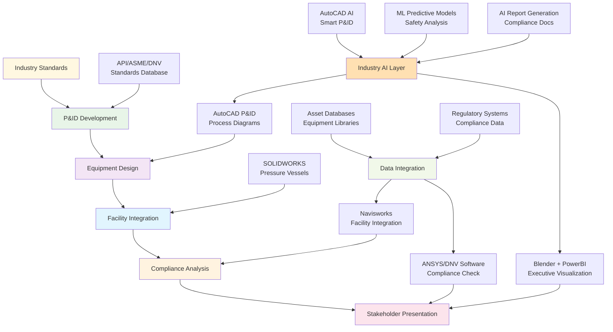

# Engineering + Visualization Integrated Workflows

> Part of: ai-cad-research specification  
> Created: 2025-08-08  
> Focus: Combined engineering precision with professional visualization capabilities

## Overview

This analysis presents the top 5 workflows that effectively combine engineering design precision with professional visualization capabilities. Each workflow is optimized for different scenarios, budgets, and technical requirements while maintaining oil & gas industry compliance.

## Workflow 1: Premium Commercial Integration

**Best for**: Large enterprises with comprehensive budgets seeking industry-standard solutions

**Software Stack:**
- **Requirements**: AutoCAD 2025 (P&ID, schematics)
- **2D Technical**: AutoCAD 2025 (industry standard)
- **3D CAD**: SOLIDWORKS 2025 (parametric precision)
- **Analysis**: ANSYS/SOLIDWORKS Simulation
- **Visualization**: KeyShot, V-Ray for rendering
- **VR/AR**: Unity or Unreal Engine

**Total Annual Cost**: ~$8,000-12,000 per seat
**Strengths**: Industry compliance, maximum precision, professional results
**Oil & Gas Fit**: ⭐⭐⭐⭐⭐ Perfect for all applications

---

## Workflow 2: Fusion 360 + Blender Hybrid

**Best for**: Mid-size companies balancing cost with professional capabilities

**Software Stack:**
- **CAD Design**: Autodesk Fusion 360 (parametric + AI)
- **Analysis**: Fusion 360 built-in simulation
- **Transfer**: STEP/STL/OBJ export formats
- **Visualization**: Blender (open source powerhouse)
- **AI Enhancement**: Both platforms' AI features

**Total Annual Cost**: ~$1,020 per seat
**Strengths**: Cost-effective, AI integration, professional visualization
**Oil & Gas Fit**: ⭐⭐⭐⭐ Excellent for most applications

---

## Workflow 3: Pure Open Source Pipeline

**Best for**: Cost-conscious organizations, research institutions, startups

**Software Stack:**
- **CAD Platform**: FreeCAD (complete open source CAD)
- **Automation**: CadQuery with Python scripting
- **Visualization**: Blender (industry-grade 3D)
- **Web Export**: Three.js, WebVR capabilities
- **AI Development**: Python ML ecosystem

**Total Annual Cost**: $0 (free)
**Strengths**: Zero cost, full customization, AI development freedom
**Oil & Gas Fit**: ⭐⭐⭐ Good for research and custom applications

---

## Workflow 4: Web-Native AI-First Pipeline

**Best for**: Modern teams prioritizing AI integration and collaboration

**Software Stack:**
- **AI Concept**: Spline.design (text-to-3D)
- **Collaboration**: Onshape (cloud-native)
- **Engineering**: Fusion 360 (precision work)
- **AI Visualization**: Blender + AI plugins
- **Deployment**: Web-based interactive 3D

**Total Annual Cost**: ~$2,600 per seat
**Strengths**: Cutting-edge AI, cloud collaboration, modern workflow
**Oil & Gas Fit**: ⭐⭐⭐ Good for innovation and presentation

---

## Workflow 5: Specialized Oil & Gas Pipeline

**Best for**: Oil & gas companies requiring industry-specific compliance and workflows

**Software Stack:**
- **Standards**: API/ASME/DNV compliance databases
- **P&ID**: AutoCAD P&ID (industry standard)
- **Equipment**: SOLIDWORKS (pressure vessel compliance)
- **Integration**: Navisworks (facility coordination)
- **Analysis**: ANSYS, DNV software suites
- **Presentation**: Blender + PowerBI integration

**Total Annual Cost**: ~$15,000-25,000 per seat
**Strengths**: Full industry compliance, specialized tools, regulatory approval
**Oil & Gas Fit**: ⭐⭐⭐⭐⭐ Purpose-built for oil & gas

---

## Workflow Comparison Matrix

| Workflow | Cost/Year | AI Integration | Industry Compliance | Learning Curve | Visualization Quality | Best For |
|----------|-----------|----------------|--------------------|-----------------|--------------------|----------|
| **Premium Commercial** | $8,000-12,000 | ⭐⭐⭐ | ⭐⭐⭐⭐⭐ | ⭐⭐⭐ | ⭐⭐⭐⭐⭐ | Large enterprises |
| **Fusion + Blender** | $1,020 | ⭐⭐⭐⭐ | ⭐⭐⭐⭐ | ⭐⭐⭐⭐ | ⭐⭐⭐⭐⭐ | **Recommended** |
| **Pure Open Source** | $0 | ⭐⭐⭐⭐⭐ | ⭐⭐⭐ | ⭐⭐ | ⭐⭐⭐⭐ | Startups/Research |
| **Web-Native AI** | $2,600 | ⭐⭐⭐⭐⭐ | ⭐⭐⭐ | ⭐⭐⭐⭐⭐ | ⭐⭐⭐⭐ | Innovation teams |
| **Oil & Gas Specialist** | $15,000-25,000 | ⭐⭐⭐ | ⭐⭐⭐⭐⭐ | ⭐⭐ | ⭐⭐⭐⭐ | Major O&G companies |

## Implementation Recommendations

### For Most Organizations: **Fusion 360 + Blender Hybrid**
- **Best value proposition**: Professional capabilities at reasonable cost
- **Strong AI integration**: Both platforms offer cutting-edge AI features
- **Excellent visualization**: Blender provides industry-leading rendering
- **Scalable**: Can grow from small teams to enterprise deployment

### Migration Strategy
1. **Phase 1**: Start with Fusion 360 for engineering design
2. **Phase 2**: Add Blender for visualization and presentation
3. **Phase 3**: Develop workflow integration and team training
4. **Phase 4**: Scale to full deployment with AI enhancements

### Success Metrics
- **Engineering Efficiency**: 30% faster design iterations
- **Visualization Quality**: Professional presentation standards
- **Cost Reduction**: 60-80% savings vs. premium commercial stack
- **AI Utilization**: Measurable productivity gains from AI features

This hybrid approach delivers the perfect balance of engineering precision, visualization excellence, and cost-effectiveness while maintaining strong AI integration capabilities.