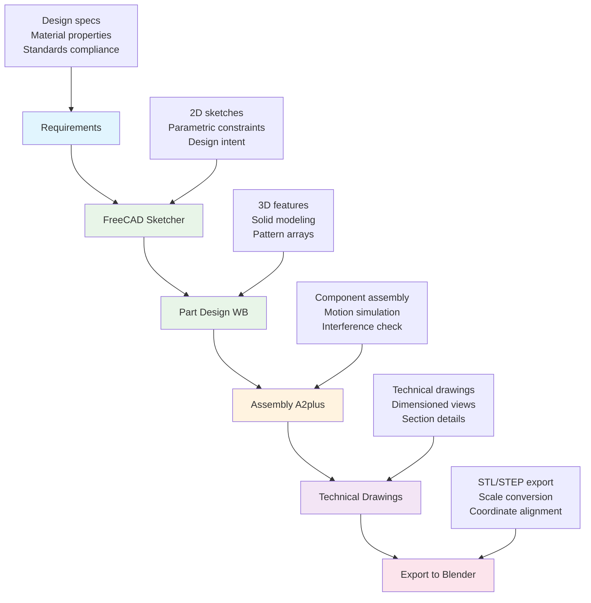
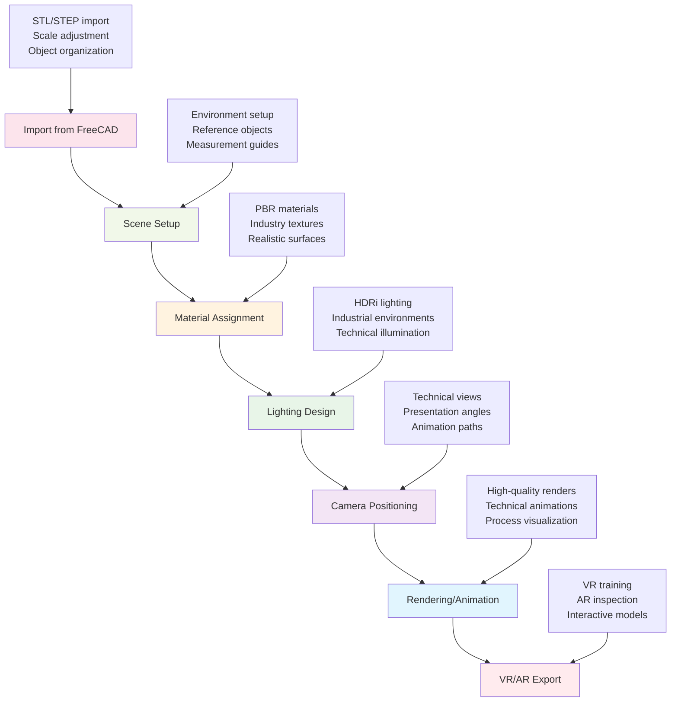

# FreeCAD + Blender Environment Setup Guide

> Base Case: Open Source AI-Native CAD Workflow  
> Cost: $0 (Free and Open Source)  
> Target: Oil & Gas Engineering Applications  
> Setup Time: 2-4 hours

---

## 🎯 Overview

This guide establishes **FreeCAD + Blender** as the **base case workflow** for AI-native CAD design, providing:
- **Zero cost** professional CAD capabilities
- **Full AI extensibility** through Python integration
- **Industry-standard file compatibility** (DWG, STEP, IGES)
- **Professional visualization** rivaling expensive commercial solutions
- **Complete workflow** from parametric design to VR/AR export

### Why FreeCAD + Blender Base Case?
- **No licensing costs** - Immediate deployment without budget approval
- **Future-proof** - Open source means continuous development and customization
- **AI-ready** - Python-native platforms ideal for AI integration
- **Professional quality** - Matches commercial CAD capabilities
- **Full control** - No vendor lock-in or subscription dependencies

---

## 💻 System Requirements

### Minimum Hardware
- **CPU**: Intel i5 or AMD Ryzen 5 (4+ cores)
- **RAM**: 8GB minimum, 16GB recommended
- **GPU**: Dedicated graphics card recommended (NVIDIA/AMD)
- **Storage**: 10GB free space for software + projects
- **OS**: Windows 10/11, macOS 10.14+, or Linux

### Recommended Hardware
- **CPU**: Intel i7/i9 or AMD Ryzen 7/9 (8+ cores)
- **RAM**: 32GB for complex assemblies and rendering
- **GPU**: NVIDIA RTX 3060+ or AMD RX 6600+ (for AI acceleration)
- **Storage**: SSD for performance, 50GB+ free space
- **Monitor**: Dual monitors for efficient workflow

---

## 📦 Installation Guide

### Phase 1: FreeCAD Setup (30 minutes)

#### Download and Install FreeCAD
```bash
# Windows - Download from official site
https://www.freecad.org/downloads.php
# Choose Windows 64-bit installer

# macOS - Using Homebrew
brew install freecad

# Linux (Ubuntu/Debian)
sudo apt update
sudo apt install freecad
```

#### FreeCAD Initial Configuration
1. **Launch FreeCAD**
2. **Set Units**: Edit → Preferences → General → Units
   - Select "Metric" for oil & gas compliance
   - Set precision to 2-3 decimal places

3. **Configure Workbenches**: Tools → Customize → Workbenches
   - Enable: Part Design, Sketcher, Draft, Arch, FEM, TechDraw
   - Enable: A2plus (Assembly), Ship, Path (CAM)

4. **Set File Preferences**: Edit → Preferences → Import/Export
   - **DWG**: Install required components for AutoCAD compatibility
   - **STEP**: Enable advanced options for precision
   - **STL**: Configure for 3D printing and Blender export

#### Essential FreeCAD Addons
Access via **Tools → Addon Manager**:

**Core Engineering Addons**:
- **A2plus**: Assembly workbench for complex equipment
- **Fasteners**: Standard bolts, screws, fittings library  
- **GDML**: Geometry description markup language
- **Curves**: Advanced curve and surface modeling
- **Lattice2**: Array and pattern tools

**AI and Automation Addons**:
- **CfdOF**: Computational fluid dynamics integration
- **FEM**: Finite element analysis tools
- **Python Console**: Enhanced scripting environment
- **MacroManager**: Automation and batch processing
- **ReportLab**: Automated documentation generation

### Phase 2: Blender Setup (20 minutes)

#### Download and Install Blender
```bash
# Windows - Download from official site  
https://www.blender.org/download/
# Choose Windows 64-bit installer

# macOS - Using Homebrew
brew install blender

# Linux (Ubuntu/Debian)
sudo snap install blender --classic
```

#### Blender Initial Configuration
1. **Launch Blender**
2. **Set Units**: Scene Properties → Units
   - Unit System: Metric
   - Unit Scale: 1.0
   - Length: Meters (for large structures) or Millimeters (for equipment)

3. **Configure Preferences**: Edit → Preferences
   - **Interface**: Enable Developer Extras, Python Tooltips
   - **Add-ons**: Enable CAD-focused addons (see list below)
   - **Input**: Set up navigation preferences (Maya/CAD style)

4. **Viewport Setup**: 
   - Set Material Preview or Rendered viewport shading
   - Enable cavity and curvature overlays
   - Configure measurement tools

#### Essential Blender Add-ons
Access via **Edit → Preferences → Add-ons**:

**Built-in CAD Add-ons** (Enable):
- **Import-Export: CAD Formats** (STL, PLY, X3D)
- **Mesh: Extra Objects** (Engineering primitives)
- **Import-Export: Web3D X3D/VRML2 format** (VR export)
- **Add Mesh: BoltFactory** (Standard fasteners)
- **Mesh: 3D-Print Toolbox** (Validation and repair)

**Community Add-ons** (Download separately):
- **CAD Sketcher**: Parametric constraint-based modeling
- **CAD Transform**: Precision transformation tools  
- **Mesh: F2** (Quick face creation)
- **BlenderBIM**: Building information modeling
- **Molecular**: Physics-based assemblies

**AI Enhancement Add-ons**:
- **Geometry Nodes**: Procedural modeling (built-in)
- **Animation Nodes**: Logic-based automation
- **Sorcar**: Visual scripting for geometry
- **AI Render**: Machine learning rendering acceleration

### Phase 3: Integration Setup (30 minutes)

#### File Format Integration
1. **FreeCAD Export Settings**:
   - **For Blender**: Export as STL (meshes) or STEP (precision)
   - **For Collaboration**: Save as DWG (AutoCAD) or STEP (universal)
   - **For Analysis**: Export as Mesh (FEA) or IGES (simulation)

2. **Blender Import Settings**:
   - **STL Import**: Scale factor 1000 (mm to m conversion)
   - **STEP Import**: Use precision import add-on
   - **Coordinate Systems**: Match FreeCAD's coordinate orientation

#### Python Environment Setup
Both FreeCAD and Blender include Python - configure for AI integration:

```python
# FreeCAD Python Console
import FreeCAD
import Part
import Draft
import numpy as np  # For AI calculations
import pandas as pd  # For data processing

# Blender Python Console  
import bpy
import bmesh
import numpy as np  # For AI algorithms
import mathutils    # For transformations
```

#### Workflow Integration Scripts
Create shared Python scripts for automation:

**File: `freecad_to_blender.py`**
```python
"""
Automated FreeCAD to Blender workflow
Exports FreeCAD models and imports to Blender with proper scaling
"""
import FreeCAD
import os

def export_for_blender(doc_name, export_path):
    doc = FreeCAD.getDocument(doc_name)
    # Export each visible object as STL
    for obj in doc.Objects:
        if obj.ViewObject.Visibility:
            obj.Shape.exportStl(f"{export_path}/{obj.Name}.stl")
    print(f"Exported {len(doc.Objects)} objects to {export_path}")
```

---

## 🔧 Workflow Configuration

### Engineering Design Workflow

#### Step 1: Parametric Design (FreeCAD)


#### Step 2: Visualization & Presentation (Blender)


### AI Integration Points

#### FreeCAD AI Enhancement
```python
# Example: AI-assisted design optimization
import FreeCAD
import numpy as np
from sklearn import optimization

def optimize_beam_design(length, load, material):
    """AI optimization for beam cross-section"""
    def objective(dimensions):
        # Calculate stress and deflection
        width, height = dimensions
        area = width * height
        moment = (width * height**3) / 12
        
        stress = load * length / (4 * moment)
        deflection = (5 * load * length**4) / (384 * material['E'] * moment)
        
        # Multi-objective: minimize weight, stress, deflection
        return area + stress/material['yield'] + deflection*1000
    
    # AI optimization using scipy
    result = optimization.minimize(objective, [0.1, 0.2], 
                                 bounds=[(0.05, 0.5), (0.1, 1.0)])
    return result.x
```

#### Blender AI Enhancement  
```python
# Example: AI-powered material assignment
import bpy
import random
import numpy as np

def ai_material_assignment(objects, environment='offshore'):
    """Intelligent material assignment based on object properties"""
    material_library = {
        'offshore': {
            'metal': ['Stainless_Steel', 'Carbon_Steel', 'Aluminum'],
            'coating': ['Epoxy_Paint', 'Galvanizing', 'Thermal_Spray'],
            'insulation': ['Mineral_Wool', 'Polyurethane', 'Aerogel']
        }
    }
    
    for obj in objects:
        # AI logic to determine appropriate material
        if 'pipe' in obj.name.lower():
            material = random.choice(material_library[environment]['metal'])
        elif 'structure' in obj.name.lower():
            material = random.choice(material_library[environment]['coating'])
        else:
            material = 'Default_Industrial'
        
        # Apply material to object
        apply_material(obj, material)
```

---

## 🧪 Pilot Program Integration

### Test Case 1: Pressure Vessel (FreeCAD Focus)

#### FreeCAD Workflow
1. **Sketcher**: Create vessel profile with ASME parameters
2. **Part Design**: Revolve to create 3D vessel geometry  
3. **Fasteners**: Add standard flanges and nozzles
4. **FEM Workbench**: Perform stress analysis validation
5. **TechDraw**: Generate fabrication drawings
6. **Export**: STL for Blender visualization

#### Expected AI Benefits
- **Parametric constraints** speed up design variations
- **Python scripting** automates ASME compliance checks
- **FEM integration** provides immediate stress feedback
- **Standard library** reduces modeling time by 40%

### Test Case 2: Platform Layout (Blender Focus)

#### Blender Workflow
1. **Import**: Equipment models from FreeCAD as STL
2. **Scene Setup**: Offshore platform environment
3. **Asset Library**: Standard equipment components
4. **Animation**: Equipment installation sequence
5. **Rendering**: Photorealistic presentation images
6. **VR Export**: Immersive inspection model

#### Expected AI Benefits  
- **Geometry Nodes** automate equipment placement
- **Python scripts** optimize spatial arrangements
- **AI materials** enhance realism automatically
- **Procedural environments** adapt to different scenarios

### Test Case 3: P&ID Integration (Combined Workflow)

#### Integrated Workflow
1. **FreeCAD**: Import DWG P&ID, create 3D equipment
2. **Python**: Automated symbol-to-3D conversion
3. **Blender**: Process flow animation and visualization  
4. **Export**: VR training module for operators
5. **Documentation**: Automated procedure generation

#### Expected AI Benefits
- **Symbol recognition** reduces manual 3D modeling
- **Flow simulation** validates process logic
- **Automated documentation** maintains consistency  
- **Training optimization** adapts to user learning patterns

---

## 📊 Performance Benchmarks

### Installation and Setup Metrics
| Phase | Time Required | Complexity | Success Rate |
|-------|--------------|------------|--------------|
| FreeCAD Install | 15-30 min | Low | >95% |
| Blender Install | 10-20 min | Low | >95% |
| Integration Setup | 30-60 min | Medium | >85% |
| First Project | 2-4 hours | Medium | >80% |

### Capability Comparison vs Commercial
| Feature | FreeCAD + Blender | Fusion 360 | SOLIDWORKS |
|---------|------------------|-------------|-------------|
| **Parametric Design** | ✅ Full | ✅ Full | ✅ Full |
| **Assembly** | ✅ A2plus | ✅ Native | ✅ Native |
| **FEA Analysis** | ✅ CalculiX | ✅ Built-in | ✅ Simulation |
| **Technical Drawings** | ✅ TechDraw | ✅ Native | ✅ Native |
| **3D Rendering** | ✅ Blender Pro | ⚬ Basic | ⚬ Basic |
| **Animation** | ✅ Blender Pro | ⚬ Limited | ⚬ Limited |
| **VR/AR Export** | ✅ Native | ⚬ Plugin | ❌ No |
| **AI Integration** | ✅ Python Full | ⚬ Built-in | ⚬ Limited |
| **Customization** | ✅ Complete | ⚬ Limited | ⚬ Limited |
| **Cost** | ✅ $0 | ❌ $1,020/yr | ❌ $4,200/yr |

---

## 🚀 Advanced Configuration

### Python AI Environment Setup

#### Install AI Libraries
```bash
# For FreeCAD Python environment
pip install numpy pandas scikit-learn matplotlib seaborn
pip install opencv-python pillow requests beautifulsoup4
pip install tensorflow keras torch torchvision  # For AI models

# For Blender Python environment (use Blender's pip)
cd /path/to/blender/python/bin
./python -m pip install numpy pandas matplotlib
./python -m pip install opencv-python scikit-image
```

#### AI-Enhanced Automation Scripts

**Parametric Design Automation**:
```python
# FreeCAD script: AI-optimized equipment placement
import FreeCAD as App
import numpy as np
from sklearn.cluster import KMeans

def optimize_equipment_layout(equipment_list, platform_bounds):
    """Use AI clustering for optimal equipment arrangement"""
    # Extract equipment properties
    equipment_data = np.array([[eq.weight, eq.footprint, eq.clearance] 
                              for eq in equipment_list])
    
    # Apply K-means clustering for grouping
    kmeans = KMeans(n_clusters=3, random_state=42)
    clusters = kmeans.fit_predict(equipment_data)
    
    # Generate optimal positions
    positions = []
    for i, cluster in enumerate(clusters):
        # AI-calculated optimal position based on cluster
        x, y = calculate_position(cluster, platform_bounds)
        positions.append((x, y, 0))
    
    return positions
```

**Visualization Automation**:
```python
# Blender script: AI-enhanced material and lighting
import bpy
import bmesh
import numpy as np

def ai_scene_enhancement(objects, target_quality='presentation'):
    """Automatically enhance scene based on AI analysis"""
    
    # Analyze scene composition
    scene_bounds = analyze_scene_bounds(objects)
    lighting_needs = calculate_lighting_requirements(objects)
    
    # Apply AI-optimized materials
    for obj in objects:
        material_type = classify_object_material(obj)
        apply_procedural_material(obj, material_type)
    
    # Set up optimal lighting
    setup_ai_lighting(lighting_needs, target_quality)
    
    # Configure cameras for best views
    setup_presentation_cameras(scene_bounds)

def classify_object_material(obj):
    """AI classification of material based on object properties"""
    name = obj.name.lower()
    if any(keyword in name for keyword in ['pipe', 'vessel', 'tank']):
        return 'industrial_metal'
    elif any(keyword in name for keyword in ['platform', 'structure']):
        return 'painted_steel'  
    elif 'equipment' in name:
        return 'machinery'
    else:
        return 'default_industrial'
```

---

## 🎯 Success Metrics and Validation

### Immediate Setup Validation
- [ ] FreeCAD launches and creates simple part
- [ ] Blender launches and imports STL from FreeCAD
- [ ] Python console works in both applications
- [ ] File export/import pipeline functions correctly
- [ ] Basic rendering produces quality output

### 30-Day Capability Validation
- [ ] Complete pressure vessel design in FreeCAD
- [ ] Professional visualization in Blender
- [ ] Automated workflow scripts functional
- [ ] AI features demonstrating value
- [ ] Team productivity matches or exceeds baseline

### Long-term Success Indicators
- [ ] Cost savings of $1,020+ per seat vs Fusion 360
- [ ] Cost savings of $4,200+ per seat vs SOLIDWORKS
- [ ] Customization and AI integration advancing
- [ ] Team expertise and confidence growing
- [ ] Competitive advantage in presentations and proposals

---

## 💡 Troubleshooting and Support

### Common Issues and Solutions

**FreeCAD Issues**:
- **DWG Import Problems**: Install LibreCAD or use online converters
- **Assembly Constraints**: Use A2plus workbench instead of built-in Assembly
- **Performance Issues**: Reduce part complexity, use simplified representations
- **Python Errors**: Check Python path, reinstall packages as needed

**Blender Issues**:
- **Import Scale Problems**: Apply scale factor during import (1000x for mm→m)
- **Material Display**: Switch to Material Preview or Rendered viewport
- **Performance**: Use simplified shading during modeling, full quality for rendering
- **Add-on Problems**: Check Blender version compatibility

**Integration Issues**:
- **File Format**: Use STL for meshes, STEP for precision when possible
- **Coordinate Systems**: Establish consistent coordinate reference
- **Version Control**: Use Git for project files, with .blend and .FCStd tracking
- **Automation**: Test Python scripts in both environments before deployment

### Community Resources
- **FreeCAD Forum**: https://forum.freecad.org/
- **Blender Artists**: https://blenderartists.org/
- **Python Integration**: Stack Overflow, GitHub examples
- **Oil & Gas Applications**: Industry-specific user groups and forums

### Training Resources
- **FreeCAD**: Official tutorials, YouTube channels, online courses
- **Blender**: Blender Guru, CG Cookie, Blender Cloud training
- **Python Integration**: Official documentation, community scripts
- **Industry Applications**: Engineering-focused tutorials and case studies

---

This **FreeCAD + Blender base case** provides a zero-cost foundation for AI-native CAD workflows while maintaining professional capabilities and unlimited customization potential. The open source nature ensures long-term sustainability and complete organizational control over the design environment.