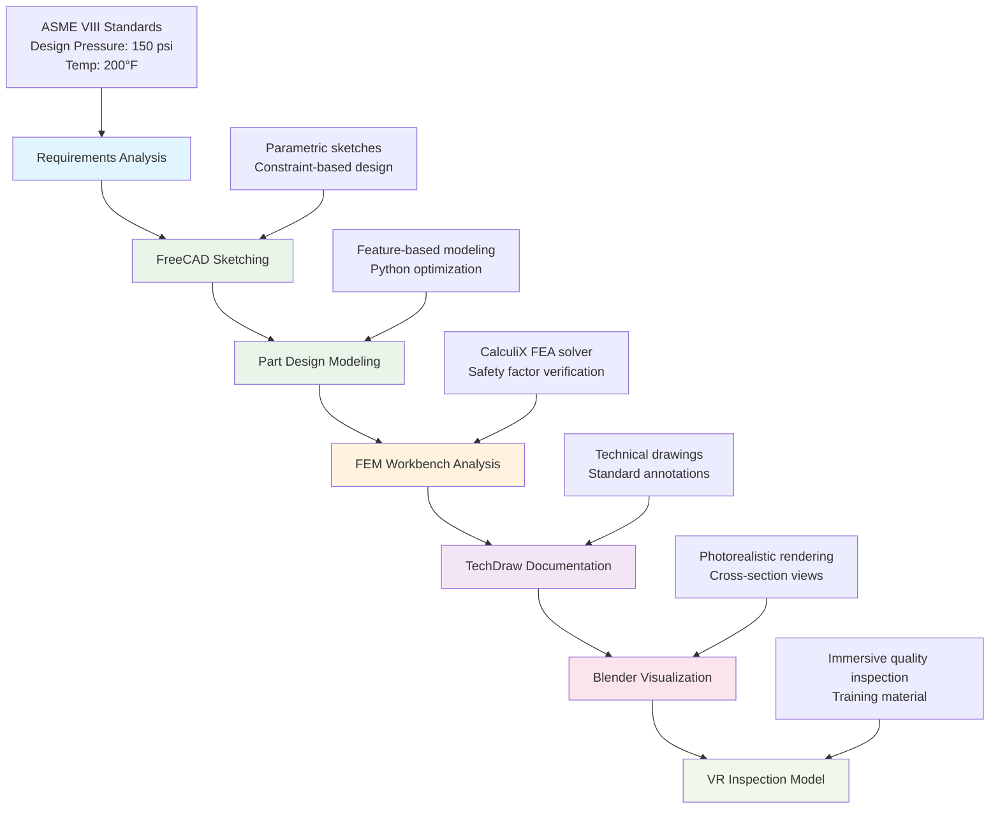
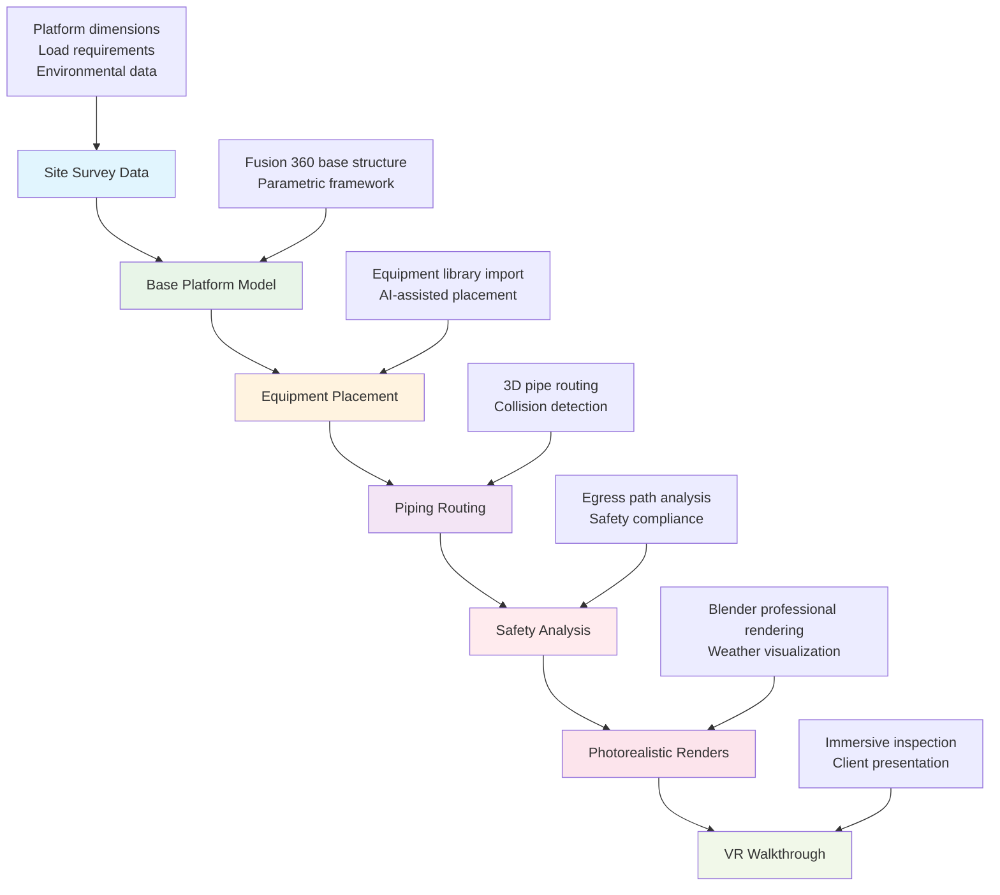
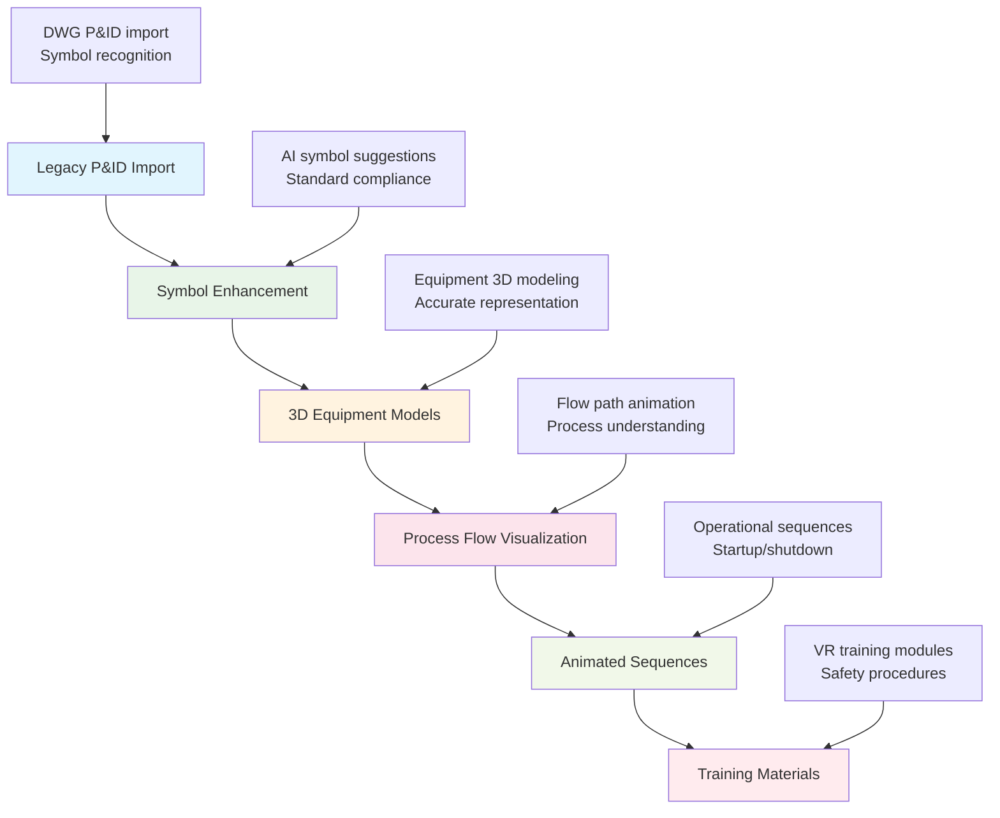
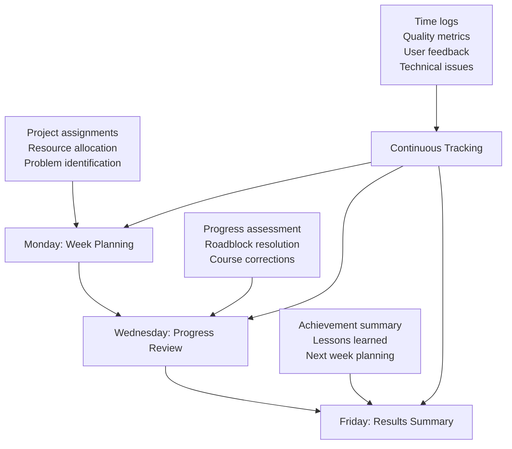

# AI-Native CAD Pilot Program: Test Cases & Evaluation Framework

> Program: **FreeCAD + Blender Open Source Workflow Validation**  
> Duration: 4 weeks  
> Participants: 3 users (Senior, Mid-level, Junior)  
> Focus: Oil & gas engineering applications  
> **Cost: $0 (Free and Open Source)**

---

## 🎯 Pilot Program Overview

### Objectives
1. **Validate workflow efficiency** in real oil & gas engineering projects
2. **Assess learning curve** and training requirements for different skill levels
3. **Test industry compliance** and file format compatibility
4. **Evaluate AI feature benefits** and measurable productivity gains
5. **Confirm visualization capabilities** for stakeholder presentations

### Success Criteria
- **Productivity**: Match or exceed current design speeds by Week 3
- **Quality**: Professional output meeting API/ASME standards
- **Usability**: Team confidence and satisfaction >80%
- **Integration**: Seamless workflow with existing file formats and processes

---

## 👥 Pilot Team Structure

### Participant Profiles
| Role | Experience Level | Current Tools | Focus Area |
|------|-----------------|---------------|------------|
| **Senior Designer** | 15+ years CAD | AutoCAD, SOLIDWORKS | Complex equipment design, mentoring |
| **Mid-level Engineer** | 5-10 years | AutoCAD, basic 3D | Facility layouts, P&ID integration |
| **Junior Designer** | 1-3 years | Basic AutoCAD | Learning efficiency, fresh perspective |

### Weekly Time Commitment
- **Week 1**: 20 hours (training + setup)
- **Week 2**: 15 hours (guided practice)
- **Week 3**: 20 hours (real project work)
- **Week 4**: 10 hours (evaluation + feedback)

---

## 📋 Test Case 1: Pressure Vessel Design (Senior Designer)

### Project Overview
**Design a horizontal pressure vessel for offshore oil separation**

### Traditional Workflow Baseline
- **Current Time**: 40 hours (AutoCAD + SOLIDWORKS)
- **Steps**: 2D drawings → 3D model → FEA analysis → Technical drawings
- **Deliverables**: P&ID symbol, 3D model, stress analysis, fabrication drawings

### FreeCAD + Blender Workflow Test


### Specific Tasks & Measurements
1. **Requirements to 3D Model**: Target <16 hours (vs 20 hours current)
2. **FEA Analysis**: FreeCAD FEM workbench vs external software efficiency
3. **Drawing Generation**: Automated vs manual drafting time
4. **Visualization Creation**: Professional rendering for client presentation
5. **File Compatibility**: Export to DWG, STEP for vendor collaboration

### Evaluation Criteria
- **Time Efficiency**: 20% improvement target
- **Design Quality**: ASME VIII compliance verified
- **AI Utilization**: Use Python AI scripting and automation features
- **Collaboration**: Successful file exchange with existing tools

---

## 📋 Test Case 2: Offshore Platform Layout (Mid-level Engineer)

### Project Overview
**Design 3D layout for offshore platform equipment arrangement**

### Traditional Workflow Baseline
- **Current Time**: 60 hours (AutoCAD + basic 3D visualization)
- **Deliverables**: 2D plan views, basic 3D model, equipment schedule
- **Limitations**: Poor visualization, difficult space optimization

### Fusion 360 + Blender Workflow Test


### Specific Tasks & Measurements
1. **Equipment Placement**: Compare AI-assisted vs manual placement efficiency
2. **Piping Design**: 3D routing with automatic collision detection
3. **Visualization Quality**: Professional presentation materials
4. **Collaboration**: Real-time cloud sharing vs email file exchanges
5. **Revision Management**: Change tracking and version control

### Evaluation Criteria
- **Design Speed**: 30% improvement in layout iterations
- **Visualization Impact**: Stakeholder presentation effectiveness
- **Collaboration Efficiency**: Cloud-based vs file-based workflows
- **Space Optimization**: Better equipment arrangement through 3D visualization

---

## 📋 Test Case 3: P&ID Integration & Enhancement (Junior Designer)

### Project Overview
**Import existing P&ID and create enhanced 3D visualization**

### Traditional Workflow Baseline
- **Current Time**: 20 hours (AutoCAD P&ID module)
- **Deliverables**: 2D process diagrams only
- **Limitations**: No 3D context, difficult to visualize complex processes

### Fusion 360 + Blender Workflow Test


### Specific Tasks & Measurements
1. **P&ID Import**: File compatibility and symbol recognition
2. **3D Modeling Speed**: Learning curve for parametric design
3. **Animation Creation**: Process flow visualization efficiency
4. **Training Material**: VR-ready export capabilities
5. **Documentation**: Automated report generation

### Evaluation Criteria
- **Learning Speed**: Junior designer proficiency timeline
- **Creative Output**: Enhanced visualization vs traditional 2D
- **Process Understanding**: 3D visualization impact on design comprehension
- **Export Quality**: VR training material effectiveness

---

## 📊 Pilot Program Evaluation Framework

### Daily Tracking Metrics
```mermaid
gantt
    title Pilot Program Timeline & Tracking
    dateFormat  X
    axisFormat %d
    
    section Week 1: Setup & Training
    Environment Setup     :w1-setup, 0, 2d
    Basic Training       :w1-train, 2d, 3d
    Tool Familiarization :w1-famil, 5d, 2d
    
    section Week 2: Guided Practice
    Test Case Assignment  :w2-assign, 7d, 1d
    Guided Implementation :w2-guide, 8d, 4d
    Progress Review      :w2-review, 12d, 1d
    
    section Week 3: Real Project Work
    Independent Work     :w3-work, 14d, 4d
    Mid-week Check-in    :w3-check, 16d, 1d
    Problem Solving      :w3-solve, 18d, 2d
    
    section Week 4: Evaluation
    Results Compilation  :w4-compile, 21d, 2d
    Team Feedback       :w4-feedback, 23d, 1d
    Final Presentation  :w4-present, 24d, 2d
```

### Performance Metrics Dashboard

#### Quantitative Measurements
| Metric | Current State | Target | Measurement Method |
|--------|---------------|--------|--------------------|
| **Design Time** | Baseline per project | 20-30% reduction | Time tracking logs |
| **Quality Score** | Standard compliance | Maintain 100% | Technical review checklist |
| **File Compatibility** | DWG/STEP support | 100% success | Export/import testing |
| **Learning Hours** | N/A | <40 hours to proficiency | Training time logs |

#### Qualitative Assessments
| Factor | Evaluation Method | Success Criteria |
|--------|------------------|------------------|
| **User Satisfaction** | Daily surveys (1-5 scale) | Average >4.0 |
| **Workflow Integration** | Process observation | Seamless operation |
| **AI Feature Adoption** | Usage analytics | >50% feature utilization |
| **Collaboration Impact** | Team feedback | Improved communication |

### Weekly Check-in Structure


---

## 🎯 Success Scenarios & Risk Mitigation

### Likely Success Indicators
- **Week 1**: Successful software installation and basic operation
- **Week 2**: Completion of training modules and simple projects
- **Week 3**: Independent work matching current productivity levels
- **Week 4**: Positive team feedback and measurable improvements

### Potential Challenges & Solutions
| Challenge | Risk Level | Mitigation Strategy |
|-----------|------------|-------------------|
| **Learning Curve** | Medium | Structured training, peer support |
| **File Compatibility** | Low | Extensive format testing |
| **Performance Issues** | Low | Hardware requirements validated |
| **Workflow Disruption** | Medium | Parallel operation with existing tools |

### Go/No-Go Decision Criteria
#### Green Light Indicators (Proceed to Full Implementation)
- User satisfaction >80%
- Productivity maintained or improved by Week 3
- Quality standards met consistently
- AI features demonstrating clear value

#### Yellow Light Indicators (Extended Trial)
- Mixed results requiring additional evaluation
- User satisfaction 60-79%
- Some productivity gains but inconsistent
- Technical issues with workarounds available

#### Red Light Indicators (Return to Current Tools)
- User satisfaction <60%
- Consistent productivity decline
- Quality or compliance issues
- Technical barriers without solutions

---

## 📋 Implementation Checklist

### Pre-Pilot Setup (Week 0)
- [ ] Stakeholder approval and budget authorization
- [ ] Pilot team selection and schedule coordination
- [ ] Hardware requirements verification
- [ ] Fusion 360 trial accounts setup (30-day free)
- [ ] Blender installation and configuration
- [ ] Baseline project documentation
- [ ] Evaluation metrics dashboard creation

### Week 1: Foundation
- [ ] Software orientation and basic navigation
- [ ] Import existing project files for compatibility testing
- [ ] Complete introductory tutorials and exercises
- [ ] Establish time tracking and feedback procedures
- [ ] First progress review and issue identification

### Week 2: Skill Building
- [ ] Advanced feature training (AI tools, simulation)
- [ ] Guided practice on simplified versions of test cases
- [ ] Peer learning sessions and knowledge sharing
- [ ] Mid-point evaluation and course corrections
- [ ] Integration testing with existing workflows

### Week 3: Real-World Application
- [ ] Independent work on assigned test case projects
- [ ] Daily progress tracking and issue logging
- [ ] Quality assurance reviews and feedback
- [ ] Collaboration testing with external stakeholders
- [ ] Documentation of best practices and lessons learned

### Week 4: Evaluation & Decision
- [ ] Comprehensive results compilation
- [ ] Team feedback sessions and recommendations
- [ ] Stakeholder presentation preparation
- [ ] Go/no-go decision documentation
- [ ] Implementation plan development (if approved)

---

## 🚀 Post-Pilot Implementation Strategy

### If Pilot Succeeds (>80% satisfaction, productivity maintained)
1. **Immediate Actions**
   - Purchase Fusion 360 licenses for pilot team
   - Develop comprehensive training program
   - Create workflow documentation and best practices
   - Plan gradual team expansion

2. **3-Month Rollout Plan**
   - Expand to 5-8 additional team members
   - Establish power users as internal trainers
   - Develop advanced feature adoption program
   - Create client presentation template library

3. **6-Month Integration**
   - Full team migration completion
   - Advanced AI feature workshops
   - Cross-departmental collaboration enhancement
   - ROI measurement and optimization

### Success Metrics for Full Implementation
- **Cost Savings**: Achieve 60-80% reduction vs traditional CAD stack
- **Productivity**: 30% improvement in design iteration speed
- **Quality**: Maintain 100% industry compliance
- **Innovation**: 50%+ utilization of AI features across team

This pilot program provides a comprehensive, low-risk validation of the Fusion 360 + Blender workflow with specific, measurable outcomes that will inform the full implementation decision.