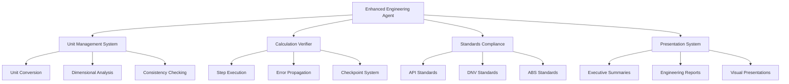

# Enhanced Engineering Agent Specification

## Executive Summary

This specification defines comprehensive enhancements to the existing CAD Engineering Specialist agent, transforming it into a powerful engineering calculation and verification platform. The enhanced agent will provide step-by-step calculation verification, professional unit management, and presentation capabilities suitable for both managers and engineers in offshore/marine engineering contexts.

## 1. Project Overview

### 1.1 Purpose
Enhance the existing engineering agent with advanced calculation capabilities including:
- Professional engineering unit management system
- Step-by-step calculation verification framework
- Industry standards compliance checking
- Multi-audience presentation system (managers vs engineers)
- Confidence analysis and risk assessment

### 1.2 Scope
- Integration with existing CAD Engineering Specialist agent
- Support for SI and Imperial unit systems
- API, DNV, ABS standards compliance
- Export capabilities (PDF, Excel, Markdown)
- Professional calculation documentation

### 1.3 Target Audience
- **Primary**: Engineering managers requiring executive summaries
- **Secondary**: Design engineers requiring detailed calculations
- **Tertiary**: Regulatory reviewers requiring compliance verification

## 2. Features and Capabilities

### 2.1 Engineering Unit Management System

#### 2.1.1 Multi-Unit System Support
```python
# Example unit management
class EngineeringUnits:
    def __init__(self):
        self.systems = {
            'SI': {
                'force': 'N', 'moment': 'N⋅m', 'stress': 'Pa',
                'length': 'm', 'mass': 'kg', 'time': 's'
            },
            'Imperial': {
                'force': 'lbf', 'moment': 'ft⋅lbf', 'stress': 'psi',
                'length': 'ft', 'mass': 'slug', 'time': 's'
            }
        }
    
    def convert(self, value, from_unit, to_unit):
        """Convert with full validation and error tracking"""
        pass
```

#### 2.1.2 Unit Consistency Verification
- Automatic dimensional analysis
- Cross-calculation unit validation
- Error propagation with units
- Industry-standard representations

#### 2.1.3 Professional Table Formatting
```
| Parameter                    | Value     | Unit   | Source/Standard |
|------------------------------|-----------|--------|-----------------|
| Maximum Wave Height (Hs)     | 12.5      | m      | DNV-RP-C205    |
| Wind Speed (1-hour avg)      | 35.8      | m/s    | API-RP-2A      |
| Current Velocity (surface)   | 1.2       | m/s    | Site Survey    |
```

### 2.2 Calculation Verification Framework

#### 2.2.1 Step-by-Step Execution
```python
class CalculationVerifier:
    def __init__(self):
        self.steps = []
        self.checkpoints = []
        
    def add_step(self, description, calculation, verification_fn=None):
        """Add calculation step with optional verification"""
        step = {
            'id': len(self.steps) + 1,
            'description': description,
            'calculation': calculation,
            'verification': verification_fn,
            'timestamp': datetime.now(),
            'status': 'pending'
        }
        self.steps.append(step)
        return step
    
    def execute_with_verification(self, user_confirmation=True):
        """Execute with optional user confirmation at checkpoints"""
        for step in self.steps:
            if user_confirmation and step.get('checkpoint'):
                response = input(f"Continue with step {step['id']}: {step['description']}? (y/n): ")
                if response.lower() != 'y':
                    break
            
            # Execute calculation with error handling
            result = self._execute_step(step)
            step['result'] = result
            step['status'] = 'completed'
```

#### 2.2.2 Checkpoint System
- User-defined verification points
- Automatic intermediate result validation
- Rollback capability for errors
- Audit trail maintenance

#### 2.2.3 Error Propagation Analysis
- Uncertainty quantification
- Sensitivity analysis
- Monte Carlo error propagation
- Confidence interval calculation

### 2.3 Industry Standards Integration

#### 2.3.1 Standards Compliance Framework
```python
class StandardsCompliance:
    def __init__(self):
        self.standards = {
            'API-RP-2A': {
                'safety_factors': {'permanent': 1.7, 'variable': 1.3},
                'load_combinations': ['LC1', 'LC2', 'LC3'],
                'verification_checks': ['geometry', 'materials', 'loads']
            },
            'DNV-RP-C103': {
                'fatigue_curves': 'SN_curves.yaml',
                'safety_factors': {'fatigue': 10.0},
                'stress_concentration': 'SCF_database.yaml'
            }
        }
    
    def verify_compliance(self, calculation_type, results):
        """Verify results against applicable standards"""
        pass
```

#### 2.3.2 Supported Standards
- **API RP-2A**: Offshore platform design
- **DNV-RP-C103**: Fatigue design of offshore structures
- **DNV-RP-F105**: Free spanning pipelines
- **ABS Guide**: Offshore structures
- **AISC**: Steel structure design

### 2.4 Professional Presentation System

#### 2.4.1 Executive Summary Generation
```python
class ExecutiveSummary:
    def generate(self, calculation_results):
        return {
            'project_overview': self._extract_key_parameters(calculation_results),
            'critical_findings': self._identify_critical_results(calculation_results),
            'compliance_status': self._assess_compliance(calculation_results),
            'recommendations': self._generate_recommendations(calculation_results),
            'risk_assessment': self._summarize_risks(calculation_results)
        }
```

#### 2.4.2 Detailed Engineering Reports
- Complete calculation worksheets
- Step-by-step derivations
- Reference citations
- Quality assurance documentation

#### 2.4.3 Visual Representations
- Engineering diagrams with calculations
- Load distribution plots
- Safety factor visualization
- Trend analysis charts

### 2.5 Marketing and Convincing Features

#### 2.5.1 Confidence Analysis
```python
class ConfidenceAnalysis:
    def analyze(self, calculation_results):
        return {
            'confidence_intervals': self._calculate_confidence_intervals(),
            'sensitivity_analysis': self._perform_sensitivity_analysis(),
            'benchmark_comparison': self._compare_with_benchmarks(),
            'validation_metrics': self._calculate_validation_metrics()
        }
```

#### 2.5.2 Risk Assessment Integration
- Failure mode analysis
- Consequence assessment
- Mitigation recommendations
- Cost-benefit analysis

#### 2.5.3 Industry Benchmarking
- Comparison with industry standards
- Performance metrics
- Best practice adherence
- Optimization opportunities

## 3. Technical Architecture

### 3.1 System Architecture



### 3.2 Integration Points

#### 3.2.1 Existing Agent Integration
- Extends CAD Engineering Specialist agent
- Maintains delegation to FreeCAD and GMsh agents
- Integrates with OrcaFlex and AQWA agents for analysis

#### 3.2.2 Data Flow Architecture
```python
class EnhancedEngineeringAgent:
    def __init__(self):
        self.unit_manager = EngineeringUnits()
        self.verifier = CalculationVerifier()
        self.standards = StandardsCompliance()
        self.presenter = PresentationSystem()
        
        # Integration with existing agents
        self.freecad_agent = FreecadAgent()
        self.gmsh_agent = GmshAgent()
        self.orcaflex_agent = OrcaflexAgent()
```

### 3.3 Performance Requirements

#### 3.3.1 Parallel Processing Support
- Concurrent calculation execution
- Parallel unit conversion batches
- Distributed standards checking
- Background error analysis

#### 3.3.2 Caching Strategy
```python
class CalculationCache:
    def __init__(self):
        self.cache = {}
        self.hash_algorithm = 'sha256'
    
    def cache_calculation(self, inputs, results):
        """Cache calculation results with input hash"""
        input_hash = self._hash_inputs(inputs)
        self.cache[input_hash] = {
            'results': results,
            'timestamp': datetime.now(),
            'metadata': self._extract_metadata(inputs)
        }
```

#### 3.3.3 Export Capabilities
- PDF generation with professional formatting
- Excel workbooks with calculation sheets
- Markdown for documentation systems
- JSON/YAML for data interchange

## 4. Implementation Examples

### 4.1 Mooring Line Tension Calculation

```python
def calculate_mooring_tension_with_verification():
    """Example: Step-by-step mooring line tension calculation"""
    
    # Initialize calculation environment
    calc = EnhancedCalculation("Mooring Line Tension Analysis")
    
    # Step 1: Define input parameters
    calc.add_step(
        "Define environmental conditions",
        {
            'wave_height': (12.5, 'm', 'DNV-RP-C205'),
            'wind_speed': (35.8, 'm/s', 'API-RP-2A'),
            'current_speed': (1.2, 'm/s', 'Site Survey')
        },
        verification=verify_environmental_limits
    )
    
    # Step 2: Calculate wave loads
    calc.add_step(
        "Calculate wave forces using Morrison equation",
        lambda env: morrison_wave_force(env['wave_height'], env['period']),
        verification=verify_wave_force_magnitude
    )
    
    # Step 3: Apply safety factors per API-RP-2A
    calc.add_step(
        "Apply safety factors per API-RP-2A",
        lambda force: force * 1.7,  # Permanent load factor
        verification=verify_api_compliance
    )
    
    # Execute with user confirmation
    results = calc.execute_with_verification(user_confirmation=True)
    
    # Generate reports
    executive_summary = calc.generate_executive_summary()
    detailed_report = calc.generate_detailed_report()
    
    return results, executive_summary, detailed_report
```

### 4.2 Fatigue Life Assessment

```python
def fatigue_life_assessment_with_sn_curves():
    """Example: Fatigue life calculation with S-N curve application"""
    
    calc = EnhancedCalculation("Fatigue Life Assessment")
    
    # Load S-N curve data per DNV-RP-C103
    calc.add_step(
        "Load S-N curve parameters",
        load_dnv_sn_curve_data,
        verification=verify_sn_curve_validity
    )
    
    # Calculate stress ranges
    calc.add_step(
        "Calculate stress ranges using rainflow counting",
        lambda data: rainflow_analysis(data['stress_history']),
        verification=verify_stress_range_distribution
    )
    
    # Apply Palmgren-Miner rule
    calc.add_step(
        "Apply cumulative damage rule",
        lambda ranges: sum(ni/Ni for ni, Ni in ranges),
        verification=verify_damage_ratio
    )
    
    # Safety factor application
    calc.add_step(
        "Apply fatigue safety factor (10.0 per DNV)",
        lambda damage: 1.0 / (damage * 10.0),
        verification=verify_fatigue_safety
    )
    
    return calc.execute_with_verification()
```

### 4.3 Wind Load Calculation with Tables

```python
def wind_load_calculation_with_tables():
    """Example: Wind load with professional table formatting"""
    
    calc = EnhancedCalculation("Wind Load Analysis")
    
    # Calculate wind loads for different structural components
    components = [
        {'name': 'Main Deck', 'area': 500, 'height': 15, 'cd': 1.2},
        {'name': 'Superstructure', 'area': 200, 'height': 25, 'cd': 1.0},
        {'name': 'Crane', 'area': 50, 'height': 40, 'cd': 1.5}
    ]
    
    results_table = []
    for comp in components:
        force = 0.5 * air_density * wind_speed**2 * comp['area'] * comp['cd']
        moment = force * comp['height']
        
        results_table.append({
            'Component': comp['name'],
            'Area [m²]': comp['area'],
            'Height [m]': comp['height'],
            'Cd [-]': comp['cd'],
            'Force [kN]': round(force/1000, 1),
            'Moment [kN⋅m]': round(moment/1000, 1)
        })
    
    # Generate professional table
    table = calc.format_professional_table(
        results_table,
        title="Wind Load Analysis Results",
        standard_reference="API-RP-2A Section 2.3.1"
    )
    
    return table
```

### 4.4 Pipeline Stress Analysis with Code Compliance

```python
def pipeline_stress_analysis_with_compliance():
    """Example: Pipeline stress analysis with multiple code checks"""
    
    calc = EnhancedCalculation("Pipeline Stress Analysis")
    
    # Calculate combined stresses
    calc.add_step(
        "Calculate von Mises stress",
        lambda loads: sqrt(sigma_x**2 + sigma_y**2 - sigma_x*sigma_y + 3*tau_xy**2),
        verification=verify_stress_calculation
    )
    
    # Check against multiple standards
    compliance_checks = [
        ('DNV-RP-F101', check_dnv_f101_compliance),
        ('API-5L', check_api_5l_compliance),
        ('ASME B31.8', check_asme_b31_8_compliance)
    ]
    
    for standard, check_function in compliance_checks:
        calc.add_step(
            f"Verify compliance with {standard}",
            check_function,
            verification=verify_standard_compliance
        )
    
    return calc.execute_with_verification()
```

## 5. Agent Delegation Strategy

### 5.1 Inter-Agent Coordination
The enhanced engineering agent will coordinate with existing specialized agents:

- **FreeCAD Agent**: Parametric modeling and geometry generation
- **GMsh Agent**: Mesh generation for FEA analysis
- **OrcaFlex Agent**: Hydrodynamic analysis and mooring calculations
- **AQWA Agent**: Wave diffraction and radiation analysis

### 5.2 Task Routing Logic
```python
class AgentDelegation:
    def route_task(self, task_description, requirements):
        if 'freecad' in task_description.lower() or 'parametric' in requirements:
            return self.delegate_to_freecad_agent(task_description)
        elif 'mesh' in task_description.lower() or 'fem' in requirements:
            return self.delegate_to_gmsh_agent(task_description)
        elif 'orcaflex' in requirements or 'mooring' in task_description.lower():
            return self.delegate_to_orcaflex_agent(task_description)
        else:
            return self.handle_locally(task_description)
```

## 6. Quality Assurance

### 6.1 Verification Protocols
- Mathematical verification against analytical solutions
- Cross-validation with industry standard software
- Peer review integration
- Automated regression testing

### 6.2 Documentation Standards
- Complete calculation provenance
- Reference traceability
- Version control integration
- Audit trail maintenance

### 6.3 Error Handling
- Graceful failure modes
- Error message clarity
- Recovery procedures
- User guidance integration

## 7. Performance Metrics

### 7.1 Calculation Accuracy
- Target: ±2% deviation from analytical solutions
- Benchmark: Industry standard software comparison
- Validation: Cross-verification with multiple methods

### 7.2 Processing Speed
- Target: &lt;30 seconds for typical calculations
- Parallel processing: 4x speed improvement
- Caching effectiveness: 80% cache hit rate

### 7.3 User Experience
- Setup time: &lt;5 minutes for new calculations
- Documentation generation: &lt;60 seconds
- Export time: &lt;30 seconds for all formats

## 8. Security and Compliance

### 8.1 Data Security
- Secure calculation storage
- Encrypted data transmission
- Access control integration
- Audit logging

### 8.2 Regulatory Compliance
- Industry standard adherence
- Documentation requirements
- Traceability maintenance
- Quality system integration

## 9. Future Enhancements

### 9.1 Advanced Features
- Machine learning optimization
- Automated design recommendations
- Real-time collaboration
- Cloud-based calculations

### 9.2 Integration Opportunities
- CAD system plugins
- ERP system integration
- Project management tools
- Regulatory submission systems

## 10. Implementation Timeline

The implementation will be executed in phases as detailed in the accompanying tasks.md file, with estimated completion in 8-10 weeks including testing and documentation.

---

*This specification provides the foundation for creating a world-class engineering calculation and verification system that serves both technical and managerial audiences in the offshore/marine engineering industry.*