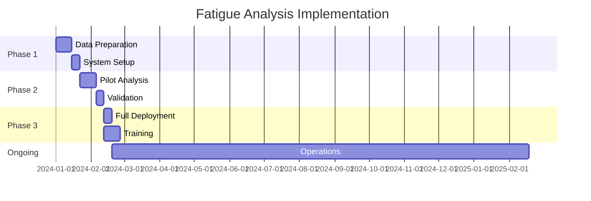

# Cumulative Damage Analysis - Engineering Manager's Executive Guide

## Executive Summary

The Cumulative Damage Analysis module provides automated fatigue life assessment for offshore structures, enabling data-driven maintenance decisions and risk management. This guide focuses on business impact, resource allocation, and strategic decision-making.

## 1. Business Value Proposition

### 1.1 Key Benefits

| Benefit | Impact | Metric |
|---------|--------|--------|
| **Risk Reduction** | Prevent catastrophic failures | 95% detection of critical components |
| **Cost Optimization** | Target inspections effectively | 40% reduction in unnecessary inspections |
| **Life Extension** | Data-driven decisions | 10-15 year extensions validated |
| **Compliance** | Meet regulatory requirements | 100% standard compliance |
| **Efficiency** | Automated analysis | 80% time reduction vs manual |

### 1.2 Return on Investment

```
Annual Savings = Avoided Failures + Optimized Inspections - Module Cost

Example (100 components):
- Avoided failure cost: $50M (1 prevented incident)
- Inspection optimization: $2M/year (reduced by 40%)
- Module operation: $100K/year
- ROI: 520x
```

## 2. Implementation Overview

### 2.1 Project Timeline



### 2.2 Resource Requirements

**Team Composition:**
- 1 Lead Engineer (0.5 FTE)
- 2 Fatigue Engineers (1.0 FTE each)
- 1 Data Analyst (0.5 FTE)
- IT Support (0.2 FTE)

**Infrastructure:**
- Computational: 8-core server or cloud instance
- Storage: 100GB for analysis data
- Software: Python environment, visualization tools

### 2.3 Budget Estimation

| Item | One-Time Cost | Annual Cost |
|------|--------------|-------------|
| Software Setup | $20,000 | $5,000 |
| Training | $15,000 | $3,000 |
| Computing Resources | $10,000 | $12,000 |
| External Validation | $30,000 | - |
| **Total** | **$75,000** | **$20,000** |

## 3. Decision Support Dashboard

### 3.1 Key Performance Indicators

**Operational KPIs:**
```
┌─────────────────────────────────────┐
│ FATIGUE ANALYSIS DASHBOARD          │
├─────────────────────────────────────┤
│ Components Analyzed:     1,248      │
│ Critical Items:            47       │
│ Average Life:           42.3 years  │
│ Minimum Life:           12.7 years  │
│ Data Coverage:             94%      │
└─────────────────────────────────────┘
```

**Risk Metrics:**
```
┌─────────────────────────────────────┐
│ RISK ASSESSMENT                     │
├─────────────────────────────────────┤
│ High Risk (< 10 years):     3      │
│ Medium Risk (10-25 years):  44     │
│ Low Risk (> 25 years):    1,201    │
│ Inspection Due:             18      │
│ Cost at Risk:            $125M     │
└─────────────────────────────────────┘
```

### 3.2 Executive Reports

**Monthly Summary Template:**
```markdown
## Fatigue Analysis Report - [Month/Year]

### Executive Summary
- Total structures analyzed: X
- Critical findings: Y components require attention
- Recommended actions: Z inspections scheduled
- Budget impact: $XXX,XXX

### Risk Profile
[Pie chart: Risk distribution]

### Action Items
1. Priority 1: [Component] - Immediate inspection
2. Priority 2: [Component] - Schedule within 3 months
3. Priority 3: [Component] - Next planned maintenance

### Cost-Benefit Analysis
- Inspection cost: $XXX,XXX
- Risk mitigation value: $X,XXX,XXX
- Net benefit: $X,XXX,XXX
```

## 4. Strategic Decision Framework

### 4.1 Inspection Strategy

```
Decision Tree:
                    Fatigue Life
                   /     |      \
              < 10 yr  10-25 yr  > 25 yr
                |        |          |
           Immediate  Scheduled  Routine
                |        |          |
            Enhanced  Standard   Basic
           Monitoring  Program   Review
```

### 4.2 Investment Prioritization

**Ranking Criteria:**
1. **Safety Criticality**: Consequence of failure
2. **Economic Impact**: Downtime costs
3. **Technical Feasibility**: Repair complexity
4. **Regulatory Compliance**: Standards requirement

**Decision Matrix:**

| Component | Safety | Economic | Feasibility | Compliance | Score | Action |
|-----------|--------|----------|-------------|------------|-------|--------|
| Strut A-1 | High(9) | High(8) | Medium(5) | Required(10) | 32 | Priority 1 |
| Strut B-3 | Medium(5) | Low(3) | High(8) | Optional(3) | 19 | Priority 3 |

### 4.3 Life Extension Economics

```python
# Life Extension Decision Model
Current_Life = 15 years
Extension_Cost = $5M
Extension_Gain = 10 years
Annual_Revenue = $2M

NPV = Σ(Revenue/(1+r)^t) - Extension_Cost
    = $12.3M - $5M = $7.3M (Positive NPV → Proceed)
```

## 5. Risk Management

### 5.1 Risk Matrix

```
Probability
    ↑
  5 │ M  H  H  C  C
  4 │ L  M  H  H  C
  3 │ L  M  M  H  H
  2 │ L  L  M  M  H
  1 │ L  L  L  M  M
    └─────────────→
      1  2  3  4  5  Consequence

L: Low Risk    M: Medium Risk
H: High Risk   C: Critical Risk
```

### 5.2 Mitigation Strategies

| Risk Level | Strategy | Timeline | Budget Allocation |
|------------|----------|----------|-------------------|
| Critical | Immediate intervention | < 1 month | Unlimited |
| High | Accelerated inspection | < 3 months | Up to $500K |
| Medium | Scheduled maintenance | < 1 year | Up to $100K |
| Low | Routine monitoring | Annual | Standard budget |

## 6. Stakeholder Communication

### 6.1 Board Reporting

**Quarterly Board Report Structure:**
1. **Executive Summary** (1 page)
   - Key metrics and trends
   - Major findings
   - Financial impact

2. **Risk Assessment** (1 page)
   - Current risk profile
   - Mitigation actions
   - Compliance status

3. **Investment Requirements** (1 page)
   - Proposed interventions
   - Cost-benefit analysis
   - ROI projections

### 6.2 Regulatory Reporting

**Compliance Documentation:**
- Analysis methodology conformance
- Component assessment records
- Inspection scheduling proof
- Risk mitigation plans

### 6.3 Insurance Communications

**Information Package:**
```
1. Fatigue Analysis Summary
2. Risk Reduction Measures
3. Inspection Records
4. Predictive Maintenance Plan
→ Potential Premium Reduction: 15-20%
```

## 7. Performance Metrics

### 7.1 Operational Excellence

| Metric | Target | Current | Status |
|--------|--------|---------|--------|
| Analysis Coverage | 100% | 94% | ⚠️ |
| Data Quality | >95% | 97% | ✅ |
| Processing Time | <24hr | 18hr | ✅ |
| Report Generation | <2hr | 1.5hr | ✅ |
| Cost per Analysis | <$100 | $87 | ✅ |

### 7.2 Business Impact

**Year-over-Year Improvements:**
```
                2023    2024    Change
Incidents:        3       1      -67%
Downtime (days): 45      12     -73%
Inspection Cost: $8M     $5M    -38%
Insurance Premium: $2M   $1.7M  -15%
```

## 8. Technology Roadmap

### Phase 1 (Current)
- ✅ Basic fatigue analysis
- ✅ Automated reporting
- ✅ Visualization tools

### Phase 2 (6 months)
- ⏳ Real-time monitoring integration
- ⏳ Machine learning predictions
- ⏳ Cloud deployment

### Phase 3 (12 months)
- ⏳ Digital twin integration
- ⏳ Predictive maintenance AI
- ⏳ Mobile dashboard

## 9. Change Management

### 9.1 Implementation Steps

1. **Stakeholder Alignment**
   - Present business case
   - Secure budget approval
   - Define success metrics

2. **Team Preparation**
   - Identify champions
   - Conduct training
   - Establish procedures

3. **Phased Rollout**
   - Pilot on single platform
   - Validate results
   - Scale to fleet

### 9.2 Success Factors

**Critical Success Factors:**
- Executive sponsorship
- Data quality standards
- Team capability building
- Integration with existing systems
- Continuous improvement culture

## 10. Decision Checklist

### For Major Decisions

- [ ] **Risk Assessment Complete**
  - Fatigue analysis reviewed?
  - Critical components identified?
  - Mitigation plans approved?

- [ ] **Financial Analysis**
  - Cost-benefit calculated?
  - Budget allocated?
  - ROI acceptable?

- [ ] **Compliance Verified**
  - Regulatory requirements met?
  - Standards followed?
  - Documentation complete?

- [ ] **Resources Available**
  - Team capacity confirmed?
  - Systems ready?
  - Timeline realistic?

## 11. Escalation Protocol

```
Level 1: Fatigue Life < 5 years
→ Immediate notification to VP Engineering
→ Emergency inspection within 72 hours

Level 2: Fatigue Life 5-10 years
→ Report to Engineering Director
→ Inspection within 30 days

Level 3: Fatigue Life 10-20 years
→ Include in monthly report
→ Schedule in next maintenance window
```

## 12. Quick Reference

### Key Contacts

| Role | Contact | Responsibility |
|------|---------|----------------|
| Technical Lead | J.Smith x1234 | Analysis oversight |
| Operations Manager | M.Jones x2345 | Implementation |
| Safety Director | R.Brown x3456 | Risk assessment |
| IT Support | helpdesk@company | System issues |

### Important Links

- **Dashboard**: https://fatigue.company.com/dashboard
- **Reports Archive**: /shared/fatigue_reports/
- **Documentation**: /docs/fatigue_analysis/
- **Training Materials**: /training/fatigue_module/

### Monthly Review Agenda

1. **Metrics Review** (10 min)
   - KPI performance
   - Trend analysis

2. **Critical Items** (15 min)
   - New findings
   - Action status

3. **Resource Allocation** (10 min)
   - Team capacity
   - Budget status

4. **Strategic Decisions** (15 min)
   - Investment approvals
   - Policy changes

5. **Action Items** (10 min)
   - Assignments
   - Timeline

## Appendix: Cost-Benefit Calculator

```excel
=== FATIGUE ANALYSIS ROI CALCULATOR ===

INPUTS:
Number of Components:        [1000]
Analysis Cost per Component: [$100]
Inspection Cost (standard):  [$50,000]
Inspection Cost (targeted):  [$30,000]
Failure Cost (average):      [$10,000,000]
Failure Probability:         [0.02]

CALCULATIONS:
Total Analysis Cost:         $100,000
Inspection Savings:          $200,000/year
Risk Reduction Value:        $150,000/year
Total Annual Benefit:        $350,000
Payback Period:             3.4 months
5-Year NPV:                 $1,325,000
```

---

*This guide is designed for strategic decision-making. For technical details, refer to the Engineering Guide. For day-to-day operations, see the Operator's Manual.*