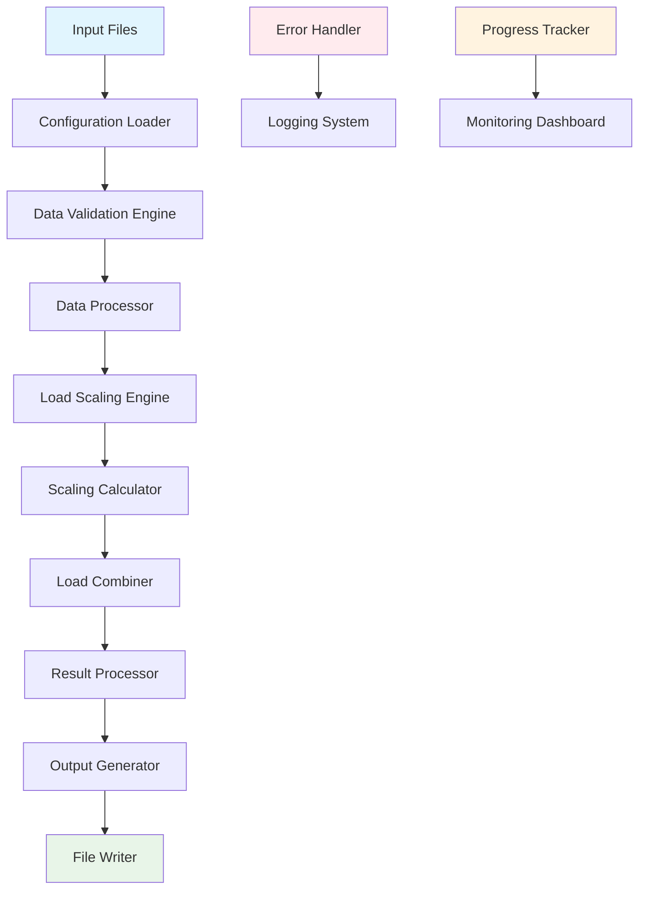

# Load Scaling Program - Software Architecture Specification

## Executive Summary

This document defines the comprehensive software architecture for the load scaling program used in offshore mooring strut fatigue analysis. The system implements a reference seastate scaling methodology that processes pre-computed time series data, applies load scaling factors, and generates fatigue damage assessments for multiple vessel configurations.

## 1. System Overview

### 1.1 Purpose
The load scaling program automates the fatigue analysis workflow by:
- Processing reference seastate time series data (wind @ 10m/s, wave @ Hs=0.5m)
- Applying linear scaling factors to match 81 target fatigue conditions
- Combining wind and wave loads to calculate effective tension
- Supporting 4 distinct vessel configurations with operational weighting
- Generating comprehensive fatigue life assessments

### 1.2 Key Requirements
- **Performance**: Process 4 configurations × 81 conditions × 8 struts within time limits
- **Accuracy**: Maintain calculation precision for fatigue life predictions
- **Scalability**: Support additional vessel configurations and fatigue conditions
- **Traceability**: Complete audit trail of scaling decisions and calculations
- **Modularity**: Extensible architecture for future enhancements

## 2. Architectural Principles

### 2.1 Design Patterns
- **Strategy Pattern**: Interchangeable scaling algorithms
- **Factory Pattern**: Configuration-specific processor creation
- **Observer Pattern**: Progress monitoring and logging
- **Pipeline Pattern**: Sequential data processing stages

### 2.2 Quality Attributes
- **Maintainability**: Clear separation of concerns, modular design
- **Performance**: Parallel processing, memory optimization
- **Reliability**: Comprehensive error handling and validation
- **Usability**: Clear APIs and intuitive CLI interface
- **Testability**: Unit testable components with dependency injection

## 3. System Architecture

### 3.1 High-Level Architecture

```
┌─────────────────────────────────────────────────────────────────┐
│                     Load Scaling System                         │
├─────────────────────────────────────────────────────────────────┤
│  ┌─────────────────┐  ┌─────────────────┐  ┌─────────────────┐  │
│  │   CLI Layer     │  │   Web API       │  │  Batch Runner   │  │
│  │  (Click-based)  │  │   (FastAPI)     │  │   (Celery)      │  │
│  └─────────────────┘  └─────────────────┘  └─────────────────┘  │
├─────────────────────────────────────────────────────────────────┤
│                    Service Layer                                │
│  ┌─────────────────┐  ┌─────────────────┐  ┌─────────────────┐  │
│  │ Fatigue Analysis│  │ Load Scaling    │  │ Result          │  │
│  │ Orchestrator    │  │ Engine          │  │ Aggregator      │  │
│  └─────────────────┘  └─────────────────┘  └─────────────────┘  │
├─────────────────────────────────────────────────────────────────┤
│                    Core Processing Layer                        │
│  ┌─────────────────┐  ┌─────────────────┐  ┌─────────────────┐  │
│  │ Data Processor  │  │ Scaling         │  │ Validation      │  │
│  │                 │  │ Calculator      │  │ Engine          │  │
│  └─────────────────┘  └─────────────────┘  └─────────────────┘  │
├─────────────────────────────────────────────────────────────────┤
│                    Data Access Layer                            │
│  ┌─────────────────┐  ┌─────────────────┐  ┌─────────────────┐  │
│  │ File I/O        │  │ Configuration   │  │ Output          │  │
│  │ Manager         │  │ Loader          │  │ Generator       │  │
│  └─────────────────┘  └─────────────────┘  └─────────────────┘  │
├─────────────────────────────────────────────────────────────────┤
│                    Infrastructure Layer                         │
│  ┌─────────────────┐  ┌─────────────────┐  ┌─────────────────┐  │
│  │ Logging &       │  │ Error Handling  │  │ Progress        │  │
│  │ Monitoring      │  │ & Recovery      │  │ Tracking        │  │
│  └─────────────────┘  └─────────────────┘  └─────────────────┘  │
└─────────────────────────────────────────────────────────────────┘
```

### 3.2 Component Responsibilities

#### 3.2.1 CLI Layer
- **Purpose**: User interface for command-line execution
- **Technology**: Click framework with argparse fallback
- **Responsibilities**:
  - Parse command-line arguments and options
  - Validate input parameters
  - Orchestrate processing workflow
  - Display progress and results

#### 3.2.2 Service Layer
- **Purpose**: Business logic coordination
- **Components**:
  - `FatigueAnalysisOrchestrator`: Master workflow controller
  - `LoadScalingEngine`: Core scaling logic implementation
  - `ResultAggregator`: Multi-configuration result combination

#### 3.2.3 Core Processing Layer
- **Purpose**: Data transformation and calculation engines
- **Components**:
  - `DataProcessor`: Time series data handling
  - `ScalingCalculator`: Load scaling algorithms
  - `ValidationEngine`: Data quality assurance

## 4. Data Flow Architecture

### 4.1 Overall Data Flow



### 4.2 Detailed Processing Pipeline

#### Stage 1: Input Processing
```
┌─────────────────┐    ┌─────────────────┐    ┌─────────────────┐
│ Reference       │    │ Fatigue         │    │ Configuration   │
│ Seastates       │--->│ Conditions      │--->│ Files           │
│ (CSV)           │    │ (CSV)           │    │ (YAML)          │
└─────────────────┘    └─────────────────┘    └─────────────────┘
         │                       │                       │
         └───────────────────────┼───────────────────────┘
                                 ▼
                    ┌─────────────────────────┐
                    │ Configuration Loader    │
                    │ - Validates file format │
                    │ - Checks completeness   │
                    │ - Loads into memory     │
                    └─────────────────────────┘
```

#### Stage 2: Scaling Calculation
```
┌─────────────────┐    ┌─────────────────┐    ┌─────────────────┐
│ Wind Speed      │    │ Wave Height     │    │ Direction       │
│ Scaling         │    │ Scaling         │    │ Matching        │
│ (V/10)²         │    │ Hs/0.5          │    │ Algorithm       │
└─────────────────┘    └─────────────────┘    └─────────────────┘
         │                       │                       │
         └───────────────────────┼───────────────────────┘
                                 ▼
                    ┌─────────────────────────┐
                    │ Scaling Factor Matrix   │
                    │ [81 × 2] factors        │
                    │ Wind + Wave scaling     │
                    └─────────────────────────┘
```

#### Stage 3: Load Combination
```
┌─────────────────┐    ┌─────────────────┐    ┌─────────────────┐
│ Scaled Wind     │    │ Scaled Wave     │    │ Combined        │
│ Time Series     │ +  │ Time Series     │ =  │ Effective       │
│                 │    │                 │    │ Tension         │
└─────────────────┘    └─────────────────┘    └─────────────────┘
```

## 5. Modular Component Design

### 5.1 Core Processing Components

#### 5.1.1 DataProcessor Class
```python
class DataProcessor:
    """Handles time series data loading and preprocessing"""
    
    def __init__(self, config: ProcessingConfig):
        self.config = config
        self.validator = DataValidator()
        self.cache = DataCache()
    
    def load_reference_data(self, seastate_id: str, strut_id: str) -> TimeSeries:
        """Load reference seastate time series data"""
        
    def preprocess_data(self, data: TimeSeries) -> TimeSeries:
        """Apply preprocessing filters and validation"""
        
    def cache_data(self, key: str, data: TimeSeries) -> None:
        """Cache processed data for reuse"""
```

#### 5.1.2 ScalingCalculator Class
```python
class ScalingCalculator:
    """Implements load scaling algorithms"""
    
    def __init__(self, base_conditions: BaseConditions):
        self.base_wind_speed = base_conditions.wind_speed
        self.base_hs = base_conditions.hs
        
    def calculate_wind_scaling(self, target_wind_speed: float) -> float:
        """Calculate wind load scaling factor: (V/V_ref)²"""
        
    def calculate_wave_scaling(self, target_hs: float) -> float:
        """Calculate wave load scaling factor: Hs/Hs_ref"""
        
    def apply_scaling(self, time_series: TimeSeries, factor: float) -> TimeSeries:
        """Apply scaling factor to time series data"""
```

#### 5.1.3 LoadCombiner Class
```python
class LoadCombiner:
    """Combines scaled wind and wave loads"""
    
    def __init__(self, combination_method: str = "linear_addition"):
        self.method = combination_method
        
    def combine_loads(self, wind_loads: TimeSeries, wave_loads: TimeSeries) -> TimeSeries:
        """Combine wind and wave loads into effective tension"""
        
    def validate_combination(self, result: TimeSeries) -> bool:
        """Validate combined load results"""
```

### 5.2 File I/O Operations

#### 5.2.1 FileIOManager Class
```python
class FileIOManager:
    """Centralized file I/O operations"""
    
    def __init__(self, base_path: Path):
        self.base_path = base_path
        self.supported_formats = ['.csv', '.xlsx', '.yaml', '.json']
        
    def load_csv(self, file_path: Path, **kwargs) -> pd.DataFrame:
        """Load CSV with error handling and validation"""
        
    def save_csv(self, data: pd.DataFrame, file_path: Path, **kwargs) -> None:
        """Save CSV with consistent formatting"""
        
    def load_configuration(self, config_path: Path) -> Dict:
        """Load YAML/JSON configuration files"""
        
    def ensure_output_directory(self, path: Path) -> None:
        """Create output directories if they don't exist"""
```

#### 5.2.2 ConfigurationLoader Class
```python
class ConfigurationLoader:
    """Loads and validates configuration files"""
    
    def __init__(self, config_schema: Dict):
        self.schema = config_schema
        self.validator = ConfigValidator(schema)
        
    def load_master_config(self, config_path: Path) -> MasterConfig:
        """Load master configuration with validation"""
        
    def load_fatigue_conditions(self, conditions_path: Path) -> List[FatigueCondition]:
        """Load fatigue conditions from CSV"""
        
    def load_reference_seastates(self, reference_path: Path) -> List[ReferenceSeastate]:
        """Load reference seastate definitions"""
```

### 5.3 Validation Engine

#### 5.3.1 DataValidator Class
```python
class DataValidator:
    """Comprehensive data validation"""
    
    def validate_time_series(self, data: TimeSeries) -> ValidationResult:
        """Validate time series data quality"""
        checks = [
            self._check_data_completeness,
            self._check_temporal_consistency,
            self._check_value_ranges,
            self._check_statistical_properties
        ]
        
    def validate_scaling_factors(self, factors: List[float]) -> ValidationResult:
        """Validate calculated scaling factors"""
        
    def validate_configuration(self, config: Dict) -> ValidationResult:
        """Validate configuration file contents"""
```

#### 5.3.2 ValidationResult Class
```python
@dataclass
class ValidationResult:
    """Validation result container"""
    is_valid: bool
    errors: List[str]
    warnings: List[str]
    metrics: Dict[str, float]
    
    def add_error(self, message: str) -> None:
        """Add validation error"""
        
    def add_warning(self, message: str) -> None:
        """Add validation warning"""
```

## 6. Error Handling Strategy

### 6.1 Error Classification

#### 6.1.1 Critical Errors (System Halt)
- Missing required input files
- Corrupted configuration data
- Invalid scaling parameters
- Memory allocation failures

#### 6.1.2 Processing Errors (Recoverable)
- Individual file read errors
- Data quality issues
- Calculation overflow/underflow
- Network timeouts

#### 6.1.3 Warning Conditions
- Missing optional files
- Data outside expected ranges
- Performance degradation
- Deprecated configuration options

### 6.2 Error Handling Implementation

```python
class ErrorHandler:
    """Centralized error handling and recovery"""
    
    def __init__(self, config: ErrorConfig):
        self.config = config
        self.logger = logging.getLogger(__name__)
        
    def handle_critical_error(self, error: Exception, context: str) -> None:
        """Handle critical errors with system halt"""
        self.logger.critical(f"Critical error in {context}: {error}")
        self._cleanup_resources()
        sys.exit(1)
        
    def handle_processing_error(self, error: Exception, context: str) -> bool:
        """Handle recoverable processing errors"""
        self.logger.error(f"Processing error in {context}: {error}")
        return self._attempt_recovery(error, context)
        
    def handle_warning(self, message: str, context: str) -> None:
        """Handle warning conditions"""
        self.logger.warning(f"Warning in {context}: {message}")
```

### 6.3 Recovery Strategies

#### 6.3.1 File I/O Recovery
- Retry with exponential backoff
- Alternative file paths
- Default value substitution
- Partial processing continuation

#### 6.3.2 Calculation Recovery
- Boundary value clamping
- Alternative algorithm selection
- Precision adjustment
- Skip problematic data points

## 7. Logging and Monitoring

### 7.1 Logging Architecture

```python
class LoggingManager:
    """Centralized logging configuration"""
    
    def __init__(self, config: LoggingConfig):
        self.config = config
        self.setup_loggers()
        
    def setup_loggers(self) -> None:
        """Configure multiple loggers for different purposes"""
        loggers = {
            'main': self._setup_main_logger(),
            'performance': self._setup_performance_logger(),
            'audit': self._setup_audit_logger(),
            'debug': self._setup_debug_logger()
        }
        
    def log_processing_start(self, context: Dict) -> None:
        """Log processing initiation with context"""
        
    def log_progress(self, completed: int, total: int, context: str) -> None:
        """Log processing progress"""
```

### 7.2 Progress Tracking

```python
class ProgressTracker:
    """Track and report processing progress"""
    
    def __init__(self, total_items: int):
        self.total_items = total_items
        self.completed_items = 0
        self.start_time = time.time()
        
    def update_progress(self, increment: int = 1) -> None:
        """Update progress counter"""
        
    def get_eta(self) -> timedelta:
        """Calculate estimated time to completion"""
        
    def get_progress_report(self) -> ProgressReport:
        """Generate comprehensive progress report"""
```

## 8. Performance Optimization

### 8.1 Parallel Processing Strategy

#### 8.1.1 Multi-Level Parallelization
```python
class ParallelProcessor:
    """Coordinate parallel processing at multiple levels"""
    
    def __init__(self, config: ParallelConfig):
        self.config = config
        self.executor = self._setup_executor()
        
    def process_configurations_parallel(self, configurations: List[Config]) -> List[Result]:
        """Process vessel configurations in parallel"""
        
    def process_conditions_parallel(self, conditions: List[Condition]) -> List[Result]:
        """Process fatigue conditions in parallel"""
        
    def process_struts_parallel(self, struts: List[int]) -> List[Result]:
        """Process struts in parallel"""
```

#### 8.1.2 Memory Optimization
```python
class MemoryManager:
    """Optimize memory usage for large datasets"""
    
    def __init__(self, config: MemoryConfig):
        self.config = config
        self.cache = LRUCache(maxsize=config.cache_size)
        
    def load_data_chunked(self, data_source: DataSource) -> Iterator[Chunk]:
        """Load data in memory-efficient chunks"""
        
    def optimize_data_types(self, df: pd.DataFrame) -> pd.DataFrame:
        """Optimize DataFrame data types for memory efficiency"""
```

### 8.2 Caching Strategy

#### 8.2.1 Multi-Level Caching
- **L1 Cache**: In-memory processed data
- **L2 Cache**: Disk-based intermediate results
- **L3 Cache**: Shared network storage for team access

```python
class CacheManager:
    """Multi-level caching system"""
    
    def __init__(self, config: CacheConfig):
        self.l1_cache = MemoryCache(config.l1_size)
        self.l2_cache = DiskCache(config.l2_path)
        self.l3_cache = NetworkCache(config.l3_url) if config.l3_enabled else None
        
    def get(self, key: str) -> Optional[Any]:
        """Retrieve from cache hierarchy"""
        
    def put(self, key: str, value: Any, level: int = 1) -> None:
        """Store in appropriate cache level"""
```

## 9. Output Generation

### 9.1 Output Architecture

```python
class OutputGenerator:
    """Generate structured output files and reports"""
    
    def __init__(self, config: OutputConfig):
        self.config = config
        self.formatters = self._setup_formatters()
        
    def generate_scaling_factors(self, factors: ScalingFactors) -> Path:
        """Generate scaling factors CSV with audit trail"""
        
    def generate_combined_loads(self, loads: CombinedLoads) -> Path:
        """Generate combined effective tension files"""
        
    def generate_summary_report(self, results: Results) -> Path:
        """Generate comprehensive summary report"""
```

### 9.2 Report Generation

```python
class ReportGenerator:
    """Generate various types of reports"""
    
    def generate_processing_summary(self, stats: ProcessingStats) -> str:
        """Generate text-based processing summary"""
        
    def generate_html_report(self, results: Results) -> str:
        """Generate interactive HTML report"""
        
    def generate_audit_trail(self, operations: List[Operation]) -> str:
        """Generate comprehensive audit trail"""
```

## 10. Configuration Management

### 10.1 Configuration Hierarchy

```yaml
# Master Configuration Schema
master_config:
  analysis:
    name: str
    type: str
    project_id: str
    
  processing:
    parallel_workers: int
    memory_limit_gb: float
    cache_enabled: bool
    
  validation:
    strict_mode: bool
    tolerance_pct: float
    
  output:
    base_directory: str
    formats: List[str]
    compression: bool
```

### 10.2 Configuration Validation

```python
class ConfigValidator:
    """Validate configuration files against schema"""
    
    def __init__(self, schema: Dict):
        self.schema = schema
        
    def validate_config(self, config: Dict) -> ValidationResult:
        """Comprehensive configuration validation"""
        
    def check_file_paths(self, config: Dict) -> List[str]:
        """Verify all specified file paths exist"""
        
    def check_parameter_ranges(self, config: Dict) -> List[str]:
        """Verify parameters are within valid ranges"""
```

## 11. Integration Points

### 11.1 External System Integration

#### 11.1.1 OrcaFlex Integration
```python
class OrcaFlexInterface:
    """Interface with OrcaFlex simulation data"""
    
    def extract_time_series(self, simulation_path: Path) -> List[TimeSeries]:
        """Extract time series from OrcaFlex results"""
        
    def validate_simulation_data(self, data: SimulationData) -> ValidationResult:
        """Validate OrcaFlex simulation outputs"""
```

#### 11.1.2 Database Integration
```python
class DatabaseInterface:
    """Interface with external databases"""
    
    def store_results(self, results: Results) -> bool:
        """Store processing results in database"""
        
    def retrieve_historical_data(self, query: Query) -> List[Record]:
        """Retrieve historical analysis data"""
```

### 11.2 API Design

```python
class LoadScalingAPI:
    """RESTful API for load scaling operations"""
    
    @app.post("/api/v1/analysis/submit")
    async def submit_analysis(self, request: AnalysisRequest) -> AnalysisResponse:
        """Submit new fatigue analysis job"""
        
    @app.get("/api/v1/analysis/{job_id}/status")
    async def get_analysis_status(self, job_id: str) -> StatusResponse:
        """Get analysis job status"""
        
    @app.get("/api/v1/analysis/{job_id}/results")
    async def get_analysis_results(self, job_id: str) -> ResultsResponse:
        """Retrieve analysis results"""
```

## 12. Testing Strategy

### 12.1 Test Architecture

#### 12.1.1 Unit Testing
```python
class TestScalingCalculator(unittest.TestCase):
    """Unit tests for scaling calculations"""
    
    def setUp(self):
        self.calculator = ScalingCalculator(BaseConditions())
        
    def test_wind_scaling_calculation(self):
        """Test wind scaling factor calculation"""
        
    def test_wave_scaling_calculation(self):
        """Test wave scaling factor calculation"""
        
    def test_edge_cases(self):
        """Test boundary conditions and edge cases"""
```

#### 12.1.2 Integration Testing
```python
class TestDataFlowIntegration(unittest.TestCase):
    """Integration tests for complete data flow"""
    
    def test_end_to_end_processing(self):
        """Test complete processing pipeline"""
        
    def test_error_recovery(self):
        """Test error handling and recovery"""
        
    def test_parallel_processing(self):
        """Test parallel processing functionality"""
```

### 12.2 Test Data Management

```python
class TestDataManager:
    """Manage test data and scenarios"""
    
    def generate_synthetic_data(self, scenario: TestScenario) -> TestData:
        """Generate synthetic test data"""
        
    def load_reference_data(self, test_case: str) -> TestData:
        """Load reference test data"""
        
    def validate_test_results(self, expected: Results, actual: Results) -> bool:
        """Validate test results against expected outcomes"""
```

## 13. Deployment Architecture

### 13.1 Deployment Options

#### 13.1.1 Standalone Deployment
- Single machine execution
- Local file system access
- Direct OrcaFlex integration

#### 13.1.2 Container Deployment
```dockerfile
FROM python:3.11-slim

WORKDIR /app
COPY requirements.txt .
RUN pip install -r requirements.txt

COPY src/ ./src/
COPY config/ ./config/

ENTRYPOINT ["python", "-m", "digitalmodel.modules.fatigue_analysis"]
```

#### 13.1.3 Cloud Deployment
- Kubernetes orchestration
- Scalable worker nodes
- Distributed storage
- API gateway integration

### 13.2 Environment Configuration

```python
class EnvironmentManager:
    """Manage different deployment environments"""
    
    def __init__(self, environment: str):
        self.environment = environment
        self.config = self._load_environment_config()
        
    def setup_logging(self) -> None:
        """Configure environment-specific logging"""
        
    def setup_storage(self) -> StorageInterface:
        """Configure environment-specific storage"""
        
    def setup_monitoring(self) -> MonitoringInterface:
        """Configure environment-specific monitoring"""
```

## 14. Security Considerations

### 14.1 Data Security

#### 14.1.1 Access Control
```python
class AccessController:
    """Control access to sensitive data and operations"""
    
    def authenticate_user(self, credentials: Credentials) -> AuthResult:
        """Authenticate user credentials"""
        
    def authorize_operation(self, user: User, operation: Operation) -> bool:
        """Authorize specific operations"""
        
    def audit_access(self, user: User, resource: Resource, action: str) -> None:
        """Audit access attempts"""
```

#### 14.1.2 Data Encryption
```python
class DataEncryption:
    """Handle data encryption/decryption"""
    
    def encrypt_sensitive_data(self, data: bytes) -> bytes:
        """Encrypt sensitive data at rest"""
        
    def decrypt_sensitive_data(self, encrypted_data: bytes) -> bytes:
        """Decrypt sensitive data"""
        
    def secure_file_transfer(self, source: Path, destination: Path) -> bool:
        """Securely transfer files"""
```

## 15. Maintenance and Operations

### 15.1 Health Monitoring

```python
class HealthMonitor:
    """Monitor system health and performance"""
    
    def check_system_health(self) -> HealthStatus:
        """Perform comprehensive health check"""
        
    def monitor_performance_metrics(self) -> PerformanceMetrics:
        """Collect performance metrics"""
        
    def check_resource_utilization(self) -> ResourceUsage:
        """Monitor CPU, memory, and disk usage"""
```

### 15.2 Backup and Recovery

```python
class BackupManager:
    """Manage data backup and recovery"""
    
    def create_backup(self, backup_type: str) -> BackupResult:
        """Create system backup"""
        
    def restore_from_backup(self, backup_id: str) -> RestoreResult:
        """Restore from backup"""
        
    def verify_backup_integrity(self, backup_id: str) -> bool:
        """Verify backup data integrity"""
```

## 16. Future Extensibility

### 16.1 Plugin Architecture

```python
class PluginManager:
    """Manage system plugins and extensions"""
    
    def load_plugins(self, plugin_dir: Path) -> List[Plugin]:
        """Load available plugins"""
        
    def register_scaling_algorithm(self, algorithm: ScalingAlgorithm) -> None:
        """Register new scaling algorithm"""
        
    def register_output_format(self, formatter: OutputFormatter) -> None:
        """Register new output format"""
```

### 16.2 API Versioning

```python
class APIVersionManager:
    """Manage API version compatibility"""
    
    def register_version(self, version: str, handler: VersionHandler) -> None:
        """Register API version handler"""
        
    def route_request(self, request: Request) -> Response:
        """Route request to appropriate version handler"""
        
    def handle_deprecation(self, old_version: str, new_version: str) -> None:
        """Handle API version deprecation"""
```

## 17. Conclusion

This architectural specification provides a comprehensive foundation for implementing a robust, scalable, and maintainable load scaling program. The modular design enables independent development and testing of components while ensuring system cohesion through well-defined interfaces.

### Key Architectural Benefits

1. **Modularity**: Clear separation of concerns enables independent component development
2. **Scalability**: Parallel processing and caching strategies support large-scale analyses
3. **Maintainability**: Comprehensive logging, error handling, and documentation
4. **Extensibility**: Plugin architecture and API versioning support future enhancements
5. **Reliability**: Robust error handling and recovery mechanisms
6. **Performance**: Optimized data processing and memory management

### Implementation Roadmap

1. **Phase 1**: Core processing components and file I/O
2. **Phase 2**: Parallel processing and optimization
3. **Phase 3**: Advanced features and integration
4. **Phase 4**: Deployment and monitoring infrastructure

This architecture serves as the blueprint for developing a production-ready load scaling system that meets current requirements while providing a foundation for future enhancements.