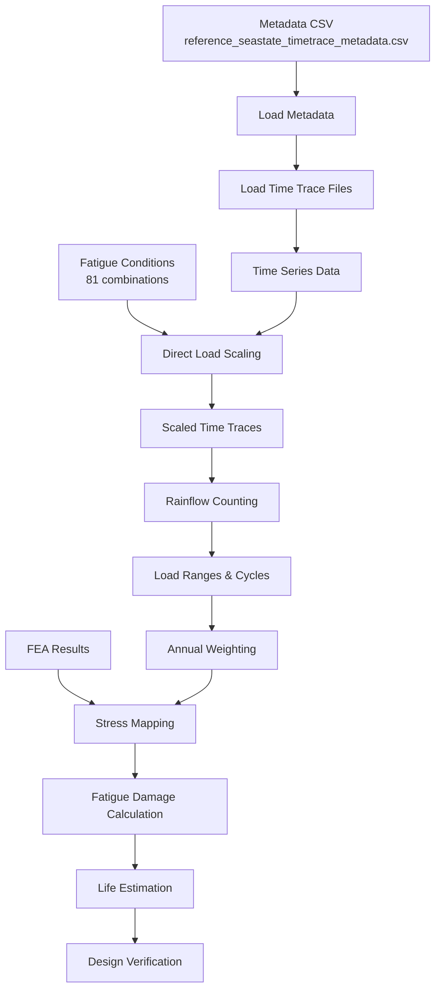

# Reference Seastate Scaling Fatigue Analysis

## Executive Summary

This specification defines a comprehensive fatigue analysis system for offshore mooring struts using reference seastate scaling methodology. The system uses pre-computed reference seastate time traces (wind @ 10m/s, wave @ Hs=0.5m) that are directly scaled to match 81 target fatigue conditions. This approach eliminates the need for repeated time domain simulations by leveraging linear scaling relationships for wind and wave loads, followed by rainflow counting and S-N curve damage assessment.

The system analyzes 4 distinct vessel configurations, each requiring separate fatigue damage calculations:
1. **FSTs Light (L015)** - Both FSTs in light condition (15% loaded)
2. **FSTs Full (L095)** - Both FSTs in full condition (95% loaded)  
3. **FSTs Light + LNGC Full** - Light FSTs with full 125k m³ LNGC (offloading scenario)
4. **FSTs Full + LNGC Light** - Full FSTs with light 125k m³ LNGC (loading scenario)

## Project Overview

### Objective
Develop an automated fatigue analysis module that implements the complete procedure for strut foundation fatigue evaluation using rainflow counting, as defined in the WLNG fatigue methodology document. The system processes pre-computed reference seastate time traces directly, eliminating the need for repeated time domain simulations.

### Scope
- **Reference Seastates**: 34 pre-computed conditions (18 wave @ Hs=0.5m, 16 wind @ 10m/s)
- **Metadata Format**: CSV file with metadata (each row = metadata for one time trace file)
- **Time Trace Data**: Separate CSV files containing actual time series data
- **Fatigue Conditions**: 81 combined wind-wave conditions with scaling factors
- **Direct Load Scaling**: Scale reference time traces to target fatigue conditions
- **Rainflow Processing**: Apply rainflow counting to scaled time traces for 8 mooring struts
- **Annual Weighting**: Weight results by occurrence percentages
- **FEA Integration**: Map loads to stresses using finite element results
- **Fatigue Calculation**: Apply S-N curves and Miner's rule for damage assessment

## Production Data Workflow

### Data Source Structure
The system processes production time series data from 4 vessel configurations:

#### Production Data Location
```
D:\1522\ctr9\fatigue_wsp_method\07c_fatigue\csv\
├── fsts_l015/                     # Configuration 1 (46.25% weight)
├── fsts_l095/                     # Configuration 2 (46.25% weight)  
├── fsts_l015_125km3_l100_pb/     # Configuration 3 - LNGC Port Berthing (3.75%)
└── fsts_l095_125km3_l000_pb/     # Configuration 4 - LNGC Port Berthing (3.75%)
```

#### Reference Seastates per Configuration
Each configuration contains 17 reference seastates:
- 9 wind cases at 10 m/s (various directions)
- 8 wave cases at Hs=0.5m (various directions)
- Files: Strut1.csv through Strut8.csv in each reference folder

#### 2. Data Processing Approach
**Key Processing Decisions:**
- **Tension Source**: Use effective tension at FST vessel end only (not jacket end)
- **Load Combination**: Simple addition of scaled wind and wave loads
- **Direction Handling**: Use respective wind/wave directions from fatigue conditions
- **Tp Selection**: Use closest available reference Tp (1.93s, 2.70s, or 3.47s)
- **Intermediate Files**: Keep all scaled and combined files for QA

#### 3. Time Trace Data Format
Production CSV files contain multiple columns:
- Time (s)
- Effective Tension at FST Vessel End (kN) [PRIMARY DATA]
- Effective Tension at FST Jacket End (kN) [not used]
- Effective Tension at Jacket End (kN) [not used]
- Additional columns [not used]

**File Naming Pattern**: `{config}_FC{###}_Strut{#}_{type}.csv`

### Processing Pipeline
1. **Load Configuration Data**: For each of 4 vessel configurations
2. **Process Fatigue Conditions**: For each of 81 fatigue conditions:
   - Select closest wind reference (by direction)
   - Select closest wave reference (by direction and Tp)
   - Scale wind reference: (V/10)²
   - Scale wave reference: Hs/0.5
   - Combine: Effective tension = scaled_wind + scaled_wave
3. **Rainflow Analysis**: Process combined effective tension through rainflow counting
4. **Stress Conversion**: Use tension-to-stress lookup table with interpolation
5. **Fatigue Calculation**: Apply S-N curves (ABS E in Air) with SCF=1.0
6. **Configuration Weighting**: Apply operational time weights (46.25%, 46.25%, 3.75%, 3.75%)

## Technical Architecture

### Module Structure
```
src/digitalmodel/modules/fatigue_analysis/
├── core/
│   ├── __init__.py
│   ├── rainflow_processor.py     # Rainflow counting implementation
│   ├── load_scaler.py           # Load scaling for fatigue conditions
│   ├── stress_mapper.py         # FEA stress mapping
│   └── fatigue_calculator.py    # S-N curve and damage calculations
├── config/
│   ├── reference_seastate_timetrace_metadata.csv  # Reference seastate metadata
│   ├── reference_seastate_definition.csv # Reference seastate environmental conditions  
│   ├── fatigue_seastates.csv             # 81 fatigue conditions
│   └── sn_curve_parameters.yml           # S-N curve parameters
├── data/
│   ├── metadata/                # Metadata CSV files
│   ├── timetraces/              # Individual time trace CSV files
│   ├── intermediate/            # Processed rainflow data
│   └── output/                  # Final fatigue results
└── cli/
    └── fatigue_analysis_cli.py  # Command-line interface
```

### Configuration Management
- **Production Data**: Time series from D:\1522\ctr9\fatigue_wsp_method\07c_fatigue\csv\
- **Configuration Weights**: CSV file with operational time distribution
- **Fatigue Conditions**: CSV file (`fatigue_conditions.csv`) with 81 conditions and scaling factors
- **Tension-to-Stress**: Lookup table (`tension_range_to_stress_range_function.csv`) 
- **S-N Curve**: ABS E in Air parameters (log_a1=12.018, m1=3.0, threshold=1e6)

## Data Flow Architecture



## Implementation Requirements

### 1. Production Data Processing
- **Data Location**: D:\1522\ctr9\fatigue_wsp_method\07c_fatigue\csv\
- **Configurations**: 4 vessel configurations with different operational weights
- **Reference Conditions**: 17 per configuration (9 wind @ 10m/s, 8 wave @ Hs=0.5m)
- **Strut Files**: 8 struts per reference (Strut1.csv through Strut8.csv)
- **Total Files**: 544 per configuration (17 references × 8 struts × 4 data columns)
- **Direct Processing**: Scale and combine reference time traces without re-simulation

### 2. Production Data Handler
```python
class ProductionDataHandler:
    def __init__(self, base_path='D:/1522/ctr9/fatigue_wsp_method/07c_fatigue/csv'):
        self.base_path = base_path
        self.configurations = {
            'fsts_l015': {'weight': 46.25, 'desc': 'FSTs Light (15%)'},
            'fsts_l095': {'weight': 46.25, 'desc': 'FSTs Full (95%)'},
            'fsts_l015_125km3_l100_pb': {'weight': 3.75, 'desc': 'FSTs Light + LNGC Full (Port Berthing)'},
            'fsts_l095_125km3_l000_pb': {'weight': 3.75, 'desc': 'FSTs Full + LNGC Light (Port Berthing)'}
        }
        
    def load_strut_data(self, config, reference_dir, strut_num):
        """Load effective tension data for a specific strut"""
        file_path = f"{self.base_path}/{config}/{reference_dir}/Strut{strut_num}.csv"
        df = pd.read_csv(file_path, encoding='latin-1')
        
        # Extract effective tension at FST vessel end (column index may vary)
        vessel_end_column = 'Effective Tension at FST Vessel End (kN)'
        return df['Time (s)'].values, df[vessel_end_column].values
    
    def get_reference_dirs(self, config):
        """Get all reference directories for a configuration"""
        import os
        config_path = f"{self.base_path}/{config}"
        return [d for d in os.listdir(config_path) if os.path.isdir(os.path.join(config_path, d))]
```

### 3. Rainflow Counting Module
```python
class RainflowProcessor:
    def __init__(self, duration=200):  # seconds
        self.duration = duration
    
    def process_scaled_timeseries(self, scaled_trace):
        """Apply rainflow counting to scaled time trace"""
        # Direct rainflow on already-scaled time trace
        return load_ranges, cycle_counts
    
    def process_all_struts(self, scaled_traces):
        """Process all 8 struts for all fatigue conditions"""
        # Process scaled time traces for each strut
        pass
```

### 4. Load Scaling and Combination System
```python
class DirectLoadScaler:
    def __init__(self, metadata_handler, fatigue_conditions_path='fatigue_seastates.csv',
                 scaling_factors_output='fatigue_scaling_factors.csv'):
        self.base_wind_speed = 10  # m/s
        self.base_hs = 0.5  # m
        self.metadata_handler = metadata_handler
        self.fatigue_conditions_path = fatigue_conditions_path
        self.scaling_factors_output = scaling_factors_output
        self.fatigue_conditions = pd.read_csv(fatigue_conditions_path)
        self.scaling_factors_df = None
        
        # Calculate and save scaling factors on initialization
        self.calculate_and_save_scaling_factors()
    
    def calculate_and_save_scaling_factors(self):
        """Calculate all scaling factors and save to CSV for verification"""
        scaling_data = []
        
        for idx, row in self.fatigue_conditions.iterrows():
            wind_speed = row['Wind Speed (m/s)']
            hs = row['Hs (m)']
            occurrence = row['Occurrence (%)']
            
            # Calculate scaling factors
            wind_scale_factor = (wind_speed / self.base_wind_speed) ** 2
            wave_scale_factor = hs / self.base_hs
            
            # Create formula strings for documentation
            wind_formula = f"({wind_speed}/{self.base_wind_speed})^2"
            wave_formula = f"{hs}/{self.base_hs}"
            
            scaling_data.append({
                'Row': row['Row'],
                'Wind Speed (m/s)': wind_speed,
                'Hs (m)': hs,
                'Wind Scale Factor': round(wind_scale_factor, 6),
                'Wave Scale Factor': round(wave_scale_factor, 6),
                'Wind Scale Formula': wind_formula,
                'Wave Scale Formula': wave_formula,
                'Occurrence (%)': occurrence,
                'Wind Dir (°)': row['Wind Dir (°)'],
                'Wave Dir (°)': row['Wave Dir (°)']
            })
        
        # Save to DataFrame and CSV
        self.scaling_factors_df = pd.DataFrame(scaling_data)
        self.scaling_factors_df.to_csv(self.scaling_factors_output, index=False)
        
        # Log summary statistics
        self.log_scaling_statistics()
        
        return self.scaling_factors_df
    
    def log_scaling_statistics(self):
        """Log key statistics about scaling factors"""
        print(f"Scaling factors calculated and saved to: {self.scaling_factors_output}")
        print(f"Wind scaling range: {self.scaling_factors_df['Wind Scale Factor'].min():.4f} to "
              f"{self.scaling_factors_df['Wind Scale Factor'].max():.4f}")
        print(f"Wave scaling range: {self.scaling_factors_df['Wave Scale Factor'].min():.4f} to "
              f"{self.scaling_factors_df['Wave Scale Factor'].max():.4f}")
        print(f"Total fatigue conditions: {len(self.scaling_factors_df)}")
        print(f"Total occurrence check: {self.scaling_factors_df['Occurrence (%)'].sum():.2f}%")
    
    def scale_time_trace(self, time_trace, seastate_type, fatigue_row):
        """Scale entire time trace based on target fatigue condition"""
        # Get pre-calculated scaling factor from DataFrame
        row_num = fatigue_row['Row']
        scaling_row = self.scaling_factors_df[self.scaling_factors_df['Row'] == row_num].iloc[0]
        
        # Use appropriate scaling factor based on seastate type
        if seastate_type == 'wind':
            scale_factor = scaling_row['Wind Scale Factor']
        else:  # wave
            scale_factor = scaling_row['Wave Scale Factor']
        
        # Apply scaling to entire time trace
        scaled_trace = time_trace * scale_factor
        return scaled_trace, scale_factor
    
    def select_wind_reference(self, target_dir):
        """Select appropriate wind reference seastate based on direction
        
        Wind reference seastates (WD01-WD16) cover various directions at 10 m/s
        """
        # Map target direction to closest available wind reference
        # This is a simplified mapping - actual implementation would use metadata
        direction_map = {
            0: 'WD01', 45: 'WD02', 90: 'WD03', 135: 'WD04',
            180: 'WD05', 225: 'WD06', 270: 'WD07', 315: 'WD08',
            # Additional references for specific directions
            70: 'WD09', 110: 'WD10', 125: 'WD11', 150: 'WD12',
            200: 'WD13', 290: 'WD14', 335: 'WD15', 160: 'WD16'
        }
        
        # Find closest direction
        closest_dir = min(direction_map.keys(), key=lambda x: abs(x - target_dir))
        return direction_map[closest_dir]
    
    def select_wave_reference(self, target_dir):
        """Select appropriate wave reference seastate based on direction
        
        Wave reference seastates (W01-W18) cover various directions at Hs = 0.5m
        """
        # Map target direction to closest available wave reference
        direction_map = {
            0: 'W01', 45: 'W02', 70: 'W03', 90: 'W04',
            110: 'W05', 125: 'W06', 135: 'W07', 150: 'W08',
            160: 'W09', 180: 'W10', 200: 'W11', 225: 'W12',
            270: 'W13', 290: 'W14', 310: 'W15', 315: 'W16',
            335: 'W17', 350: 'W18'
        }
        
        # Find closest direction
        closest_dir = min(direction_map.keys(), key=lambda x: abs(x - target_dir))
        return direction_map[closest_dir]
    
    def determine_reference_seastate(self, fatigue_row):
        """Determine which reference seastate to use based on fatigue condition"""
        row_num = fatigue_row['Row']
        scaling_row = self.scaling_factors_df[self.scaling_factors_df['Row'] == row_num].iloc[0]
        
        # Compare relative impact of wind vs wave
        wind_impact = scaling_row['Wind Scale Factor']
        wave_impact = scaling_row['Wave Scale Factor']
        
        # Select reference based on dominant scaling factor
        # Also consider direction matching for better representation
        if wind_impact > wave_impact * 1.5:  # Wind dominant (with 1.5x threshold)
            return self.select_wind_reference(scaling_row['Wind Dir (°)'])
        else:
            return self.select_wave_reference(scaling_row['Wave Dir (°)'])
    
    def process_fatigue_condition(self, config, fatigue_row, strut_num):
        """Process a single fatigue condition by combining scaled wind and wave references"""
        # Get scaling factors
        wind_speed = fatigue_row['Wind Speed (m/s)']
        hs = fatigue_row['Hs (m)']
        wind_dir = fatigue_row['Wind Dir (°)']
        wave_dir = fatigue_row['Wave Dir (°)']
        tp = fatigue_row['Tp (s)']
        
        # Calculate scaling factors
        wind_scale = (wind_speed / 10) ** 2
        wave_scale = hs / 0.5
        
        # Select closest reference directories
        wind_ref = self.select_wind_reference(wind_dir)  # e.g., wind_000deg
        wave_ref = self.select_wave_reference(wave_dir, tp)  # e.g., wave_000deg_Hs050cm_Tp270cs
        
        # Load and scale reference data
        _, wind_tension = self.data_handler.load_strut_data(config, wind_ref, strut_num)
        _, wave_tension = self.data_handler.load_strut_data(config, wave_ref, strut_num)
        
        scaled_wind = wind_tension * wind_scale
        scaled_wave = wave_tension * wave_scale
        
        # Combine using simple addition
        effective_tension = scaled_wind + scaled_wave
        
        # Store metadata about scaling for traceability
        metadata = {
            'fatigue_condition': fatigue_row['Row'],
            'wind_reference': wind_ref_id,
            'wave_reference': wave_ref_id,
            'wind_scale_factor': wind_scale_factor,
            'wave_scale_factor': wave_scale_factor,
            'occurrence_pct': fatigue_row['Occurrence (%)'],
            'wind_dir': scaling_row['Wind Dir (°)'],
            'wave_dir': scaling_row['Wave Dir (°)'],
            'wind_speed': scaling_row['Wind Speed (m/s)'],
            'Hs': scaling_row['Hs (m)']
        }
        
        return effective_tension, metadata
    
    def generate_all_scaled_traces(self, output_dir='data/scaled_traces', time_step=0.1):
        """Generate combined effective tension time traces for all 81 fatigue conditions and 8 struts
        
        Args:
            output_dir: Directory to save the combined time traces
            time_step: Time step for the output time traces (seconds)
        
        Returns:
            Dictionary of effective tension time traces and comprehensive metadata
        """
        import os
        import numpy as np
        
        os.makedirs(output_dir, exist_ok=True)
        
        scaled_results = {}
        scaling_log = []
        
        print(f"Generating effective tension time traces for {len(self.fatigue_conditions)} fatigue conditions...")
        
        for idx, row in self.fatigue_conditions.iterrows():
            condition_id = row['Row']
            
            for strut_id in ['S1', 'S2', 'S3', 'S4', 'S5', 'S6', 'S7', 'S8']:
                key = f"FC{condition_id:03d}_{strut_id}"
                
                # Process and get combined effective tension with metadata
                effective_tension, metadata = self.process_fatigue_condition(row, strut_id)
                scaled_results[key] = effective_tension
                
                # Prepare comprehensive scaling information for logging
                scaling_log.append({
                    'Fatigue_Condition': f"FC{condition_id:03d}",
                    'Strut_ID': strut_id,
                    'Wind_Speed_mps': metadata['wind_speed'],
                    'Hs_m': metadata['Hs'],
                    'Wind_Dir_deg': metadata['wind_dir'],
                    'Wave_Dir_deg': metadata['wave_dir'],
                    'Wind_Ref_Seastate': metadata['wind_reference'],
                    'Wave_Ref_Seastate': metadata['wave_reference'],
                    'Wind_Scale_Factor': round(metadata['wind_scale_factor'], 4),
                    'Wave_Scale_Factor': round(metadata['wave_scale_factor'], 4),
                    'Occurrence_pct': metadata['occurrence_pct'],
                    'Max_Tension_kN': round(np.max(effective_tension), 2),
                    'Min_Tension_kN': round(np.min(effective_tension), 2),
                    'Mean_Tension_kN': round(np.mean(effective_tension), 2),
                    'Std_Dev_kN': round(np.std(effective_tension), 2)
                })
                
                # Save combined effective tension time trace to CSV file
                output_path = os.path.join(output_dir, f"{key}_effective_tension.csv")
                
                # Create time array based on trace length and time step
                time_array = np.arange(len(effective_tension)) * time_step
                
                # Save with comprehensive headers
                output_df = pd.DataFrame({
                    'time_s': time_array,
                    'effective_tension_kN': effective_tension,
                })
                
                # Add metadata as header comments
                with open(output_path, 'w') as f:
                    f.write(f"# Fatigue Condition: FC{condition_id:03d}\n")
                    f.write(f"# Strut: {strut_id}\n")
                    f.write(f"# Wind Speed: {metadata['wind_speed']} m/s\n")
                    f.write(f"# Significant Wave Height: {metadata['Hs']} m\n")
                    f.write(f"# Wind Scale Factor: {metadata['wind_scale_factor']:.4f}\n")
                    f.write(f"# Wave Scale Factor: {metadata['wave_scale_factor']:.4f}\n")
                    f.write(f"# Annual Occurrence: {metadata['occurrence_pct']}%\n")
                    f.write(f"# Wind Reference: {metadata['wind_reference']}\n")
                    f.write(f"# Wave Reference: {metadata['wave_reference']}\n")
                    output_df.to_csv(f, index=False)
                
                # Progress indicator
                if (idx * 8 + int(strut_id[1]) - 1) % 50 == 0:
                    progress = ((idx * 8 + int(strut_id[1]) - 1) / (len(self.fatigue_conditions) * 8)) * 100
                    print(f"  Progress: {progress:.1f}% - Processing {key}")
        
        # Save comprehensive scaling log for audit trail and verification
        scaling_log_df = pd.DataFrame(scaling_log)
        scaling_log_path = os.path.join(output_dir, 'effective_tension_scaling_log.csv')
        scaling_log_df.to_csv(scaling_log_path, index=False)
        
        # Generate summary statistics
        summary_path = os.path.join(output_dir, 'effective_tension_summary.txt')
        with open(summary_path, 'w') as f:
            f.write("=" * 80 + "\n")
            f.write("EFFECTIVE TENSION GENERATION SUMMARY\n")
            f.write("=" * 80 + "\n\n")
            f.write(f"Total Fatigue Conditions: {len(self.fatigue_conditions)}\n")
            f.write(f"Total Struts: 8\n")
            f.write(f"Total Time Traces Generated: {len(scaled_results)}\n")
            f.write(f"Output Directory: {output_dir}\n\n")
            
            f.write("SCALING FACTOR RANGES:\n")
            f.write(f"  Wind Scale Factors: {scaling_log_df['Wind_Scale_Factor'].min():.4f} to "
                   f"{scaling_log_df['Wind_Scale_Factor'].max():.4f}\n")
            f.write(f"  Wave Scale Factors: {scaling_log_df['Wave_Scale_Factor'].min():.4f} to "
                   f"{scaling_log_df['Wave_Scale_Factor'].max():.4f}\n\n")
            
            f.write("EFFECTIVE TENSION STATISTICS:\n")
            f.write(f"  Maximum Tension: {scaling_log_df['Max_Tension_kN'].max():.2f} kN\n")
            f.write(f"  Minimum Tension: {scaling_log_df['Min_Tension_kN'].min():.2f} kN\n")
            f.write(f"  Average Mean Tension: {scaling_log_df['Mean_Tension_kN'].mean():.2f} kN\n")
            f.write(f"  Average Std Dev: {scaling_log_df['Std_Dev_kN'].mean():.2f} kN\n\n")
            
            f.write(f"Scaling Log: {scaling_log_path}\n")
            f.write(f"Summary generated at: {pd.Timestamp.now()}\n")
        
        print(f"\n✓ Generated {len(scaled_results)} effective tension time traces")
        print(f"✓ Output directory: {output_dir}")
        print(f"✓ Scaling log: {scaling_log_path}")
        print(f"✓ Summary: {summary_path}")
        
        return scaled_results
    
    def update_scaling_factors(self, new_fatigue_conditions_path=None):
        """Dynamically update scaling factors if fatigue conditions change"""
        if new_fatigue_conditions_path:
            self.fatigue_conditions_path = new_fatigue_conditions_path
        
        # Reload fatigue conditions
        self.fatigue_conditions = pd.read_csv(self.fatigue_conditions_path)
        
        # Recalculate and save scaling factors
        self.calculate_and_save_scaling_factors()
        
        print("Scaling factors updated successfully")
```

### 5. Tension to Stress Conversion
```python
class TensionToStressConverter:
    def __init__(self, lookup_table_path='tension_range_to_stress_range_function.csv'):
        """Load tension to stress conversion table"""
        self.lookup_df = pd.read_csv(lookup_table_path)
        self.tension_values = self.lookup_df['Tension Range (kN)'].values
        self.stress_values = self.lookup_df['Stress Range (Mpa)'].values
    
    def convert_to_stress(self, tension_range):
        """Convert tension range to stress range using linear interpolation"""
        # Linear relationship: Stress = Tension / 4
        # More precisely: use lookup table with interpolation
        return np.interp(tension_range, self.tension_values, self.stress_values)
    
    def process_rainflow_results(self, tension_ranges, cycle_counts):
        """Convert tension ranges to stress ranges for S-N curve application"""
        stress_ranges = [self.convert_to_stress(t) for t in tension_ranges]
        return stress_ranges, cycle_counts
```

### 6. Fatigue Damage Calculator
```python
class FatigueCalculator:
    def __init__(self):
        # ABS E in Air parameters
        self.log_a1 = 12.018
        self.m1 = 3.0
        self.log_a2 = 11.170
        self.m2 = 5.0
        self.threshold = 1e6
        self.scf = 1.0  # No stress concentration factor
    
    def cycles_to_failure(self, stress_range):
        """Calculate cycles to failure using bi-linear S-N curve"""
        if stress_range == 0:
            return float('inf')
        
        N = self.threshold
        stress_at_N = 10 ** ((self.log_a1 - np.log10(N)) / self.m1)
        
        if stress_range <= stress_at_N:
            # High cycle regime
            return 10 ** (self.log_a1 - self.m1 * np.log10(stress_range))
        else:
            # Low cycle regime
            return 10 ** (self.log_a2 - self.m2 * np.log10(stress_range))
    
    def calculate_damage(self, cycle_counts, stress_ranges):
        """Apply Miner's rule for damage accumulation"""
        total_damage = 0
        for n, stress in zip(cycle_counts, stress_ranges):
            N = self.cycles_to_failure(stress)
            total_damage += n / N
        return total_damage
    
    def annual_damage(self, total_damage, analysis_duration=200):
        """Scale damage to annual basis"""
        seconds_per_year = 31_536_000
        return total_damage * (seconds_per_year / analysis_duration)
```

## Configuration Files

### Environmental Conditions (environmental_conditions.yml)
```yaml
wave_conditions:
  - case_id: "W01"
    Hs: 0.5  # m
    Tp: 8.0  # s
    direction: 0  # degrees
  # ... 17 more wave cases

wind_conditions:
  - case_id: "WD01"
    speed: 10.0  # m/s
    direction: 0  # degrees
  # ... 15 more wind cases
```

### Fatigue Conditions (fatigue_seastates.csv)
The 81 fatigue conditions are defined in `fatigue_seastates.csv` with columns:
- `Row`: Condition index (1-81)
- `Wind Speed (m/s)`: Target wind speed for scaling
- `Wind Dir (°)`: Wind direction
- `Hs (m)`: Significant wave height for scaling
- `Tp (s)`: Peak period
- `Wave Dir (°)`: Wave direction
- `Occurrence (%)`: Annual occurrence percentage for weighting
- `Occurrence (hrs)`: Annual hours

Example entries:
```csv
Row,Wind Speed (m/s),Wind Dir (°),Hs (m),Tp (s),Wave Dir (°),Occurrence (%),Occurrence (hrs)
1,5,180,0.15,1.7,150,7.76,680.2
2,3,180,0.09,1,150,6.977,611.6
...
```

### S-N Curve Parameters (sn_curve_parameters.yml)
```yaml
sn_curves:
  abs_e_in_air:
    A: 1.04e12
    m: 3
    C: 1.48e11
    r: 5
    threshold_cycles: 1e6
    
material_properties:
  steel:
    fatigue_design_factor: 2.0
    design_life_years: 25
```

## Command Line Interface

### Primary Commands
```bash
# Complete fatigue analysis workflow with metadata and time traces
uv run python -m digitalmodel.modules.fatigue_analysis \
    --metadata reference_seastate_timetrace_metadata.csv \
    --timetraces-dir data/timetraces \
    --config config.yml

# Individual processing steps
# Step 1: Validate metadata and time trace files
uv run python -m digitalmodel.modules.fatigue_analysis.validate \
    --metadata reference_seastate_timetrace_metadata.csv \
    --timetraces-dir data/timetraces

# Step 2: Scale time traces for fatigue conditions
uv run python -m digitalmodel.modules.fatigue_analysis.scaling \
    --metadata reference_seastate_timetrace_metadata.csv \
    --timetraces-dir data/timetraces \
    --fatigue-conditions fatigue_seastates.csv \
    --output-dir data/scaled_traces

# Step 3: Apply rainflow counting to scaled traces
uv run python -m digitalmodel.modules.fatigue_analysis.rainflow \
    --scaled-dir data/scaled_traces \
    --output-dir data/rainflow_results

# Batch processing
uv run python -m digitalmodel.modules.fatigue_analysis --batch --parallel 4
```

### CLI Parameters
- `--config`: Main configuration file path
- `--metadata`: Metadata CSV file path (`reference_seastate_timetrace_metadata.csv`)
- `--timetraces-dir`: Directory containing individual time trace CSV files
- `--output-directory`: Results output directory
- `--parallel`: Number of parallel workers
- `--struts`: Specific struts to analyze (default: all 8)
- `--conditions`: Specific fatigue conditions to process
- `--verbose`: Detailed progress output
- `--validate`: Run validation checks only
- `--scaled-dir`: Directory containing scaled time traces (for intermediate steps)
- `--output-dir`: Output directory for specific processing steps

## Input/Output Specifications

### Input Requirements
1. **Metadata File**: `reference_seastate_timetrace_metadata.csv`
   - Format: Each row contains metadata for one time trace file
   - Columns: `[seastate_id, seastate_type, strut_id, time_trace_file, duration, sample_rate, units]`
   - Total rows: 272 (34 reference seastates × 8 struts)
   
2. **Time Trace Files**: Individual CSV files in `data/timetraces/` directory
   - Format: Two columns `[time, load_value]`
   - One file per seastate/strut combination
   - File naming convention: `{seastate_id}_{strut_id}.csv`
   - Example: `W01_S1.csv`, `WD16_S8.csv`
   
3. **FEA Results**: Unit stress values per strut location
   - Stress response per unit load (4000 kN)
   - Multiple critical locations per strut
   
4. **Fatigue Conditions File**: `fatigue_seastates.csv`
   - 81 fatigue conditions with wind/wave parameters
   - Annual occurrence percentages for weighting
   - Target values for load scaling
   
5. **Configuration Files**: 
   - S-N curve parameters (ABS "E" in Air)
   - FEA stress concentration factors

### Output Products
1. **Scaled Reference Files**: Individual scaled wind and wave references (for QA)
   - Naming: `{config}_FC{###}_{ref_case}_s{scale}_Strut{#}_scaled.csv`
   - Example: `fsts_l015_FC001_wind_000deg_s025_Strut1_scaled.csv`

2. **Combined Effective Tension**: Wind + Wave combined loads
   - Naming: `{config}_FC{###}_Strut{#}_combined.csv`
   - Example: `fsts_l015_FC001_Strut1_combined.csv`
   
3. **Rainflow Cycle Results**: Tension ranges and cycle counts
   - Naming: `{config}_FC{###}_Strut{#}_cycles.csv`
   - Contains: tension_range_kN, cycle_count, half_cycles

4. **Damage Results**: Per fatigue condition damage
   - Naming: `{config}_FC{###}_Strut{#}_damage.csv`
   - Contains: stress_range_MPa, cycles, damage, weighted_damage

5. **Configuration Summary**: Aggregated results per configuration
   - Naming: `{config}_fatigue_summary.csv`
   - Contains: strut_id, total_damage, fatigue_life_years

6. **Final Weighted Results**: Combined across all configurations
   - Separate results for each of 4 vessel configurations:
     - FSTs Light (L015) fatigue life
     - FSTs Full (L095) fatigue life
     - FSTs Light + LNGC Full (offloading) fatigue life
     - FSTs Full + LNGC Light (loading) fatigue life
   - Annual damage rates per configuration
   - Life predictions in years
   - Design compliance check for all configurations

## Validation Requirements

### Unit Testing
- Rainflow counting algorithm verification against known results
- Load scaling factor calculations
- S-N curve damage calculations
- Miner's rule implementation

### Integration Testing
- End-to-end workflow with sample data
- Multi-strut processing verification
- Configuration file parsing and validation

### Performance Requirements
- Process 272 rainflow datasets within 5 minutes
- Support parallel processing for multiple struts
- Memory efficient handling of large time series data

## Quality Assurance

### Code Standards
- Follow repository Python coding standards
- Implement comprehensive logging
- Include docstrings for all public methods
- Type hints for function signatures

### Documentation
- User guide with worked examples
- API documentation for all modules
- Configuration file schema documentation
- Troubleshooting guide

## Dependencies

### Core Dependencies
- **NumPy**: Numerical computations
- **Pandas**: Data manipulation and analysis
- **SciPy**: Advanced mathematical functions
- **PyYAML**: Configuration file parsing
- **Click**: Command-line interface framework

### Optional Dependencies
- **Matplotlib**: Results visualization
- **Plotly**: Interactive plotting
- **Jupyter**: Analysis notebooks

## Agent Delegation

This specification requires coordination with multiple specialized agents:

- **Signal Analysis Agent**: Rainflow counting algorithm implementation
- **OrcaFlex Agent**: Time domain simulation data extraction
- **Testing Agent**: Comprehensive test suite development (parallel execution)
- **Documentation Agent**: User guides and API documentation
- **FEA Agent**: Finite element analysis integration and stress mapping

## Dynamic Scaling Factor Management

### Automatic Calculation and Updates
The `DirectLoadScaler` class automatically:
1. **Calculates scaling factors** on initialization for all 81 fatigue conditions
2. **Saves to CSV file** (`fatigue_scaling_factors.csv`) for verification and audit
3. **Logs statistics** including min/max values and total occurrence check
4. **Updates dynamically** when fatigue conditions change via `update_scaling_factors()`

### Scaling Factor Verification Features
- **Pre-calculated values**: All scaling factors computed and stored for transparency
- **Formula documentation**: Each factor includes its calculation formula
- **Direction tracking**: Wind and wave directions preserved for reference selection
- **Audit trail**: Scaling log generated for each processed condition

### Usage Example
```python
# Initialize scaler - automatically calculates and saves scaling factors
scaler = DirectLoadScaler(metadata_handler)

# Scaling factors are now available in:
# - scaler.scaling_factors_df (DataFrame)
# - fatigue_scaling_factors.csv (file)

# If fatigue conditions change, update dynamically
scaler.update_scaling_factors('new_fatigue_conditions.csv')
```

## Execution Example

### Complete Workflow
```python
# Initialize the fatigue analysis system for production data
data_handler = ProductionDataHandler('D:/1522/ctr9/fatigue_wsp_method/07c_fatigue/csv')
scaler = LoadScaler(data_handler, 'input/fatigue_conditions.csv')
stress_converter = TensionToStressConverter('input/tension_range_to_stress_range_function.csv')

# Process each configuration separately
configurations = ['fsts_l015', 'fsts_l095', 'fsts_l015_125km3_l100_pb', 'fsts_l095_125km3_l000_pb']
config_weights = [46.25, 46.25, 3.75, 3.75]  # Operational time distribution

for config, weight in zip(configurations, config_weights):
    print(f"\nProcessing {config} (weight: {weight}%)...")
    
    # Step 1: Process all 81 fatigue conditions
    for fc_id in range(1, 82):
        fatigue_row = scaler.fatigue_conditions.iloc[fc_id - 1]
        
        for strut_num in range(1, 9):
            # Generate combined effective tension
            effective_tension = scaler.process_fatigue_condition(config, fatigue_row, strut_num)
            
            # Save intermediate files for QA
            save_scaled_references(config, fc_id, strut_num, effective_tension)

            # Step 2: Apply rainflow counting
            rainflow = RainflowCounter(gate_value=0.0001)  # 0.01% of max range
            tension_ranges, cycle_counts = rainflow.count_cycles(effective_tension)
            
            # Step 3: Convert to stress and calculate damage
            stress_ranges, _ = stress_converter.process_rainflow_results(tension_ranges, cycle_counts)
            
            fatigue_calc = FatigueCalculator()
            damage = fatigue_calc.calculate_damage(cycle_counts, stress_ranges)
            
            # Weight by occurrence percentage
            occurrence = fatigue_row['Occurrence (%)']
            weighted_damage = damage * (occurrence / 100)

# Step 4: Aggregate results and calculate fatigue life
print("\nCalculating configuration fatigue lives...")
results_summary = {}

for config, weight in zip(configurations, config_weights):
    config_damage = aggregate_damage_for_config(config)
    
    # Calculate fatigue life for each strut
    for strut_num in range(1, 9):
        annual_damage = config_damage[f'Strut{strut_num}']
        fatigue_life = 1.0 / annual_damage if annual_damage > 0 else float('inf')
        
        print(f"  {config} - Strut{strut_num}: {fatigue_life:.1f} years")
    
    # Find critical strut
    critical_strut = min(config_damage, key=config_damage.get)
    min_life = 1.0 / config_damage[critical_strut]
    
    results_summary[config] = {
        'weight_pct': weight,
        'critical_strut': critical_strut,
        'min_fatigue_life': min_life
    }

# Final Summary Report
print("\n" + "="*60)
print("FATIGUE LIFE SUMMARY (ALL CONFIGURATIONS)")
print("="*60)
for config, summary in results_summary.items():
    print(f"{config:30} - Weight: {summary['weight_pct']:5.2f}%")
    print(f"  Critical Strut: {summary['critical_strut']}")
    print(f"  Min Fatigue Life: {summary['min_fatigue_life']:.1f} years")
    print()

# Calculate weighted overall fatigue life
weighted_damage = sum(1.0/summary['min_fatigue_life'] * summary['weight_pct']/100 
                      for summary in results_summary.values())
overall_life = 1.0 / weighted_damage
print(f"\nWeighted Overall Fatigue Life: {overall_life:.1f} years")
```

### Output Directory Structure
```
output/
├── fsts_l015/                           # Configuration 1 (46.25%)
│   ├── scaled_references/               # QA: Individual scaled wind/wave
│   │   ├── FC001_wind_000deg_s025_Strut1_scaled.csv
│   │   ├── FC001_wave_000deg_Hs050cm_Tp270cs_s030_Strut1_scaled.csv
│   │   └── ...
│   ├── combined_tension/                # Wind + Wave combined
│   │   ├── FC001_Strut1_combined.csv
│   │   └── ...
│   ├── rainflow_cycles/                 # Rainflow results
│   │   ├── FC001_Strut1_cycles.csv
│   │   └── ...
│   ├── damage_results/                  # Damage calculations
│   │   ├── FC001_Strut1_damage.csv
│   │   └── ...
│   └── fsts_l015_fatigue_summary.csv    # Configuration summary
├── fsts_l095/                           # Configuration 2 (46.25%)
│   └── [similar structure]
├── fsts_l015_125km3_l100_pb/           # Configuration 3 (3.75%)
│   └── [similar structure]
├── fsts_l095_125km3_l000_pb/           # Configuration 4 (3.75%)
│   └── [similar structure]
└── summary/
    ├── all_configurations_comparison.csv
    ├── weighted_fatigue_life.csv
    └── fatigue_analysis_report.html
```

## Success Criteria

1. **Functional**: Complete automated fatigue analysis workflow for all 4 configurations
2. **Performance**: Process full dataset (4 configs × 81 conditions × 8 struts) within time limits
3. **Accuracy**: Validation against manual calculations within 1% tolerance
4. **Configuration Coverage**: Separate fatigue life estimates for:
   - FSTs Light (L015) - standalone
   - FSTs Full (L095) - standalone
   - FSTs Light + LNGC Full (offloading)
   - FSTs Full + LNGC Light (loading)
5. **Usability**: Intuitive CLI with clear error messages and progress indicators
6. **Maintainability**: Well-documented, modular code structure
7. **Integration**: Seamless integration with existing OrcaFlex workflows
8. **Traceability**: Complete audit trail of scaling factors and processing decisions
9. **Critical Component**: Identify critical strut for each configuration

## Risk Mitigation

- **Algorithm Accuracy**: Validate rainflow implementation against established standards
- **Performance**: Implement parallel processing and memory optimization
- **Data Quality**: Comprehensive input validation and error handling
- **Scalability**: Modular design to support additional analysis types