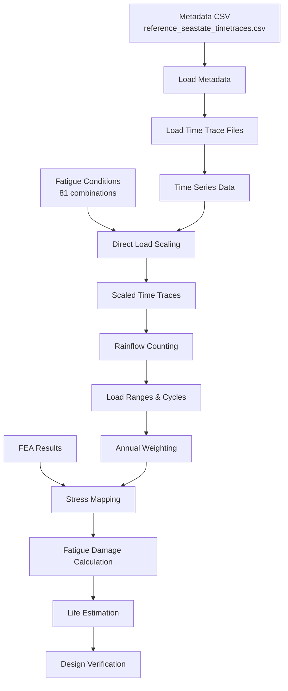

# Strut Foundation Fatigue Analysis with Rainflow Counting

## Executive Summary

This specification defines a comprehensive fatigue analysis system for strut foundation structures using rainflow counting methodology. The system uses a metadata CSV file (`reference_seastate_timetraces.csv`) where each row contains metadata about a time trace file for a specific reference seastate. The actual time trace data is stored in separate CSV files. These reference time traces are directly scaled to match target fatigue conditions, followed by rainflow counting and fatigue damage calculation, eliminating the need for repeated time domain simulations.

## Project Overview

### Objective
Develop an automated fatigue analysis module that implements the complete procedure for strut foundation fatigue evaluation using rainflow counting, as defined in the WLNG fatigue methodology document. The system processes pre-computed reference seastate time traces directly, eliminating the need for repeated time domain simulations.

### Scope
- **Reference Seastates**: 34 pre-computed conditions (18 wave @ Hs=0.5m, 16 wind @ 10m/s)
- **Metadata Format**: CSV file with metadata (each row = metadata for one time trace file)
- **Time Trace Data**: Separate CSV files containing actual time series data
- **Fatigue Conditions**: 81 combined wind-wave conditions with scaling factors
- **Direct Load Scaling**: Scale reference time traces to target fatigue conditions
- **Rainflow Processing**: Apply rainflow counting to scaled time traces for 8 mooring struts
- **Annual Weighting**: Weight results by occurrence percentages
- **FEA Integration**: Map loads to stresses using finite element results
- **Fatigue Calculation**: Apply S-N curves and Miner's rule for damage assessment

## Reference Seastate Time Trace Workflow

### Data Input Structure
The system uses a two-tier data structure for managing reference seastate time traces:

#### 1. Metadata File (`reference_seastate_timetraces.csv`)
```
┌─────────────┬──────────────┬──────────┬─────────────────┬──────────┬────────────┬──────────────┐
│ seastate_id │ seastate_type│ strut_id │ time_trace_file │ duration │ sample_rate│ units        │
├─────────────┼──────────────┼──────────┼─────────────────┼──────────┼────────────┼──────────────┤
│ W01         │ wave         │ S1       │ W01_S1.csv      │ 10800    │ 0.1        │ kN           │
│ W01         │ wave         │ S2       │ W01_S2.csv      │ 10800    │ 0.1        │ kN           │
│ ...         │ ...          │ ...      │ ...             │ ...      │ ...        │ ...          │
│ WD16        │ wind         │ S8       │ WD16_S8.csv     │ 10800    │ 0.1        │ kN           │
└─────────────┴──────────────┴──────────┴─────────────────┴──────────┴────────────┴──────────────┘
Total rows: 272 (34 reference seastates × 8 struts)
```

#### 2. Time Trace Data Files
Each time trace file referenced in the metadata contains the actual time series data:
```
Example: W01_S1.csv
┌──────┬───────────┐
│ time │ load_value│
├──────┼───────────┤
│ 0.0  │ 125.3     │
│ 0.1  │ 128.7     │
│ 0.2  │ 124.1     │
│ ...  │ ...       │
│10800 │ 122.9     │
└──────┴───────────┘
```

### Processing Pipeline
1. **Load Metadata**: Read `reference_seastate_timetraces.csv` to identify all time trace files
2. **Load Time Traces**: Read individual CSV files containing actual time series data
3. **Apply Scaling Factors**: For each of 81 fatigue conditions:
   - Identify corresponding reference seastate (wind or wave)
   - Load the appropriate time trace file
   - Apply scaling factor to entire time trace
   - Wind scaling: (target_speed/10)²
   - Wave scaling: target_Hs/0.5
4. **Rainflow Analysis**: Process scaled time traces through rainflow counting
5. **Fatigue Calculation**: Apply S-N curves to resulting load cycles

## Technical Architecture

### Module Structure
```
src/digitalmodel/modules/fatigue_analysis/
├── core/
│   ├── __init__.py
│   ├── rainflow_processor.py     # Rainflow counting implementation
│   ├── load_scaler.py           # Load scaling for fatigue conditions
│   ├── stress_mapper.py         # FEA stress mapping
│   └── fatigue_calculator.py    # S-N curve and damage calculations
├── config/
│   ├── environmental_conditions.yml
│   ├── fatigue_conditions.yml
│   └── sn_curve_parameters.yml
├── data/
│   ├── metadata/                # Metadata CSV files
│   ├── timetraces/              # Individual time trace CSV files
│   ├── intermediate/            # Processed rainflow data
│   └── output/                  # Final fatigue results
└── cli/
    └── fatigue_analysis_cli.py  # Command-line interface
```

### Configuration Management
- **Environmental Conditions**: YAML configuration for 34 load cases (18 wave + 16 wind)
- **Fatigue Conditions**: 81 combined conditions with occurrence percentages
- **S-N Curve Parameters**: ABS "E" in Air curve parameters
- **FEA Parameters**: Unit load values and stress concentration factors

## Data Flow Architecture



## Implementation Requirements

### 1. Reference Seastate Time Trace Input Processing
- **Metadata File**: CSV file (`reference_seastate_timetraces.csv`)
- **Metadata Structure**: Each row contains metadata pointing to a time trace file
- **Time Trace Files**: Separate CSV files containing actual time series data
- **Reference Conditions**: 34 total (18 wave cases @ Hs=0.5m, 16 wind cases @ 10m/s)
- **Strut Data**: 8 mooring struts per seastate (272 total time trace files)
- **Direct Processing**: Time traces are directly scaled without additional simulation

### 2. Metadata and Time Trace Handler
```python
class MetadataHandler:
    def __init__(self, metadata_path='reference_seastate_timetraces.csv'):
        self.metadata_path = metadata_path
        self.metadata_df = None
        self.time_traces = {}
    
    def load_metadata(self):
        """Load metadata CSV containing references to time trace files"""
        # Columns: [seastate_id, seastate_type, strut_id, time_trace_file, duration, sample_rate, units]
        self.metadata_df = pd.read_csv(self.metadata_path)
        return self.metadata_df
    
    def load_time_trace(self, seastate_id, strut_id):
        """Load actual time trace data from referenced CSV file"""
        # Find the file path from metadata
        row = self.metadata_df[(self.metadata_df['seastate_id'] == seastate_id) & 
                               (self.metadata_df['strut_id'] == strut_id)]
        file_path = row['time_trace_file'].values[0]
        
        # Load time series data from CSV file
        trace_data = pd.read_csv(f'data/timetraces/{file_path}')
        return trace_data['load_value'].values
    
    def get_reference_type(self, seastate_id):
        """Determine if reference seastate is wind or wave type"""
        return self.metadata_df[self.metadata_df['seastate_id'] == seastate_id]['seastate_type'].values[0]
```

### 3. Rainflow Counting Module
```python
class RainflowProcessor:
    def __init__(self, duration=200):  # seconds
        self.duration = duration
    
    def process_scaled_timeseries(self, scaled_trace):
        """Apply rainflow counting to scaled time trace"""
        # Direct rainflow on already-scaled time trace
        return load_ranges, cycle_counts
    
    def process_all_struts(self, scaled_traces):
        """Process all 8 struts for all fatigue conditions"""
        # Process scaled time traces for each strut
        pass
```

### 4. Direct Load Scaling System
```python
class DirectLoadScaler:
    def __init__(self, metadata_handler):
        self.base_wind_speed = 10  # m/s
        self.base_hs = 0.5  # m
        self.metadata_handler = metadata_handler
    
    def scale_time_trace(self, time_trace, seastate_type, target_condition):
        """Scale entire time trace based on target fatigue condition"""
        # Determine scaling factor based on seastate type
        if seastate_type == 'wind':
            scale_factor = (target_condition['wind_speed'] / self.base_wind_speed) ** 2
        else:  # wave
            scale_factor = target_condition['wave_height'] / self.base_hs
        
        # Apply scaling to entire time trace
        scaled_trace = time_trace * scale_factor
        return scaled_trace
    
    def process_fatigue_condition(self, fatigue_condition, strut_id):
        """Process a single fatigue condition for a specific strut"""
        # Determine which reference seastate to use (wind or wave)
        if fatigue_condition['primary_driver'] == 'wind':
            # Use appropriate wind reference seastate
            reference_id = self.select_wind_reference(fatigue_condition)
        else:
            # Use appropriate wave reference seastate
            reference_id = self.select_wave_reference(fatigue_condition)
        
        # Load the time trace from file
        time_trace = self.metadata_handler.load_time_trace(reference_id, strut_id)
        seastate_type = self.metadata_handler.get_reference_type(reference_id)
        
        # Scale the time trace
        scaled_trace = self.scale_time_trace(time_trace, seastate_type, fatigue_condition)
        return scaled_trace
    
    def generate_all_scaled_traces(self, fatigue_conditions):
        """Generate scaled time traces for all 81 fatigue conditions and 8 struts"""
        scaled_results = {}
        for condition in fatigue_conditions:
            for strut_id in ['S1', 'S2', 'S3', 'S4', 'S5', 'S6', 'S7', 'S8']:
                key = f"{condition['id']}_{strut_id}"
                scaled_results[key] = self.process_fatigue_condition(condition, strut_id)
        return scaled_results
```

### 5. Stress Mapping Integration
```python
class StressMapper:
    def __init__(self, unit_load=4000):  # kN
        self.unit_load = unit_load
    
    def calculate_unit_stress(self, fea_results):
        """Calculate stress per unit load from FEA"""
        return fea_results / self.unit_load
    
    def map_loads_to_stress(self, load_ranges, unit_stress, scf=1.0):
        """Convert load ranges to stress ranges"""
        return scf * load_ranges * unit_stress
```

### 6. Fatigue Damage Calculator
```python
class FatigueCalculator:
    def __init__(self):
        # ABS "E" in Air parameters
        self.A = 1.04e12
        self.m = 3
        self.C = 1.48e11
        self.r = 5
        self.threshold = 1e6
    
    def cycles_to_failure(self, stress_range):
        """Calculate cycles to failure using S-N curve"""
        if stress_range <= self.threshold:
            return self.A * (stress_range ** -self.m)
        else:
            return self.C * (stress_range ** -self.r)
    
    def calculate_damage(self, cycle_counts, stress_ranges):
        """Apply Miner's rule for damage accumulation"""
        total_damage = 0
        for n, stress in zip(cycle_counts, stress_ranges):
            N = self.cycles_to_failure(stress)
            total_damage += n / N
        return total_damage
    
    def annual_damage(self, total_damage, analysis_duration=200):
        """Scale damage to annual basis"""
        seconds_per_year = 31_536_000
        return total_damage * (seconds_per_year / analysis_duration)
```

## Configuration Files

### Environmental Conditions (environmental_conditions.yml)
```yaml
wave_conditions:
  - case_id: "W01"
    Hs: 0.5  # m
    Tp: 8.0  # s
    direction: 0  # degrees
  # ... 17 more wave cases

wind_conditions:
  - case_id: "WD01"
    speed: 10.0  # m/s
    direction: 0  # degrees
  # ... 15 more wind cases
```

### Fatigue Conditions (fatigue_conditions.yml)
```yaml
fatigue_conditions:
  - condition_id: "FC01"
    wind_speed: 5.0  # m/s
    wave_height: 1.0  # m (Hs)
    occurrence_percent: 2.5
  # ... 80 more conditions
```

### S-N Curve Parameters (sn_curve_parameters.yml)
```yaml
sn_curves:
  abs_e_in_air:
    A: 1.04e12
    m: 3
    C: 1.48e11
    r: 5
    threshold_cycles: 1e6
    
material_properties:
  steel:
    fatigue_design_factor: 2.0
    design_life_years: 25
```

## Command Line Interface

### Primary Commands
```bash
# Complete fatigue analysis workflow with metadata and time traces
uv run python -m digitalmodel.modules.fatigue_analysis \
    --metadata reference_seastate_timetraces.csv \
    --timetraces-dir data/timetraces \
    --config config.yml

# Individual processing steps
# Step 1: Validate metadata and time trace files
uv run python -m digitalmodel.modules.fatigue_analysis.validate \
    --metadata reference_seastate_timetraces.csv \
    --timetraces-dir data/timetraces

# Step 2: Scale time traces for fatigue conditions
uv run python -m digitalmodel.modules.fatigue_analysis.scaling \
    --metadata reference_seastate_timetraces.csv \
    --timetraces-dir data/timetraces \
    --fatigue-conditions config/fatigue_conditions.yml \
    --output-dir data/scaled_traces

# Step 3: Apply rainflow counting to scaled traces
uv run python -m digitalmodel.modules.fatigue_analysis.rainflow \
    --scaled-dir data/scaled_traces \
    --output-dir data/rainflow_results

# Batch processing
uv run python -m digitalmodel.modules.fatigue_analysis --batch --parallel 4
```

### CLI Parameters
- `--config`: Main configuration file path
- `--metadata`: Metadata CSV file path (`reference_seastate_timetraces.csv`)
- `--timetraces-dir`: Directory containing individual time trace CSV files
- `--output-directory`: Results output directory
- `--parallel`: Number of parallel workers
- `--struts`: Specific struts to analyze (default: all 8)
- `--conditions`: Specific fatigue conditions to process
- `--verbose`: Detailed progress output
- `--validate`: Run validation checks only
- `--scaled-dir`: Directory containing scaled time traces (for intermediate steps)
- `--output-dir`: Output directory for specific processing steps

## Input/Output Specifications

### Input Requirements
1. **Metadata File**: `reference_seastate_timetraces.csv`
   - Format: Each row contains metadata for one time trace file
   - Columns: `[seastate_id, seastate_type, strut_id, time_trace_file, duration, sample_rate, units]`
   - Total rows: 272 (34 reference seastates × 8 struts)
   
2. **Time Trace Files**: Individual CSV files in `data/timetraces/` directory
   - Format: Two columns `[time, load_value]`
   - One file per seastate/strut combination
   - File naming convention: `{seastate_id}_{strut_id}.csv`
   - Example: `W01_S1.csv`, `WD16_S8.csv`
   
3. **FEA Results**: Unit stress values per strut location
   - Stress response per unit load (4000 kN)
   - Multiple critical locations per strut
   
4. **Configuration Files**: 
   - Fatigue condition definitions with scaling parameters
   - S-N curve parameters (ABS "E" in Air)
   - Annual occurrence percentages

### Output Products
1. **Rainflow Results**: Load ranges and cycle counts per strut per condition
2. **Scaled Load Data**: Combined wind-wave loads for fatigue conditions
3. **Stress Range Data**: Mapped stress ranges with cycle counts
4. **Damage Assessment**: Per-strut damage calculations
5. **Fatigue Life Estimates**: Final life estimates and design verification

## Validation Requirements

### Unit Testing
- Rainflow counting algorithm verification against known results
- Load scaling factor calculations
- S-N curve damage calculations
- Miner's rule implementation

### Integration Testing
- End-to-end workflow with sample data
- Multi-strut processing verification
- Configuration file parsing and validation

### Performance Requirements
- Process 272 rainflow datasets within 5 minutes
- Support parallel processing for multiple struts
- Memory efficient handling of large time series data

## Quality Assurance

### Code Standards
- Follow repository Python coding standards
- Implement comprehensive logging
- Include docstrings for all public methods
- Type hints for function signatures

### Documentation
- User guide with worked examples
- API documentation for all modules
- Configuration file schema documentation
- Troubleshooting guide

## Dependencies

### Core Dependencies
- **NumPy**: Numerical computations
- **Pandas**: Data manipulation and analysis
- **SciPy**: Advanced mathematical functions
- **PyYAML**: Configuration file parsing
- **Click**: Command-line interface framework

### Optional Dependencies
- **Matplotlib**: Results visualization
- **Plotly**: Interactive plotting
- **Jupyter**: Analysis notebooks

## Agent Delegation

This specification requires coordination with multiple specialized agents:

- **Signal Analysis Agent**: Rainflow counting algorithm implementation
- **OrcaFlex Agent**: Time domain simulation data extraction
- **Testing Agent**: Comprehensive test suite development (parallel execution)
- **Documentation Agent**: User guides and API documentation
- **FEA Agent**: Finite element analysis integration and stress mapping

## Success Criteria

1. **Functional**: Complete automated fatigue analysis workflow
2. **Performance**: Process full dataset within specified time limits
3. **Accuracy**: Validation against manual calculations within 1% tolerance
4. **Usability**: Intuitive CLI with clear error messages and progress indicators
5. **Maintainability**: Well-documented, modular code structure
6. **Integration**: Seamless integration with existing OrcaFlex workflows

## Risk Mitigation

- **Algorithm Accuracy**: Validate rainflow implementation against established standards
- **Performance**: Implement parallel processing and memory optimization
- **Data Quality**: Comprehensive input validation and error handling
- **Scalability**: Modular design to support additional analysis types