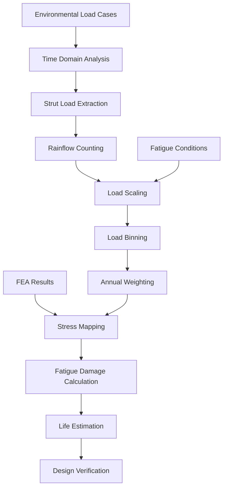

# Strut Foundation Fatigue Analysis with Rainflow Counting

## Executive Summary

This specification defines a comprehensive fatigue analysis system for strut foundation structures using rainflow counting methodology. The system automates the complete fatigue evaluation workflow from environmental load case definition through time domain analysis, rainflow counting, load scaling, stress mapping, and final fatigue life estimation.

## Project Overview

### Objective
Develop an automated fatigue analysis module that implements the complete procedure for strut foundation fatigue evaluation using rainflow counting, as defined in the WLNG fatigue methodology document.

### Scope
- **Environmental Load Cases**: 18 wave + 16 wind conditions
- **Fatigue Conditions**: 81 combined wind-wave conditions
- **Time Domain Analysis**: 3-hour simulations per condition
- **Rainflow Processing**: Extract load ranges and cycle counts for 8 mooring struts
- **Scaling & Weighting**: Scale loads for fatigue conditions and weight by annual occurrence
- **FEA Integration**: Map loads to stresses using finite element results
- **Fatigue Calculation**: Apply S-N curves and Miner's rule for damage assessment

## Technical Architecture

### Module Structure
```
src/digitalmodel/modules/fatigue_analysis/
├── core/
│   ├── __init__.py
│   ├── rainflow_processor.py     # Rainflow counting implementation
│   ├── load_scaler.py           # Load scaling for fatigue conditions
│   ├── stress_mapper.py         # FEA stress mapping
│   └── fatigue_calculator.py    # S-N curve and damage calculations
├── config/
│   ├── environmental_conditions.yml
│   ├── fatigue_conditions.yml
│   └── sn_curve_parameters.yml
├── data/
│   ├── input/                   # Time domain results
│   ├── intermediate/            # Processed rainflow data
│   └── output/                  # Final fatigue results
└── cli/
    └── fatigue_analysis_cli.py  # Command-line interface
```

### Configuration Management
- **Environmental Conditions**: YAML configuration for 34 load cases (18 wave + 16 wind)
- **Fatigue Conditions**: 81 combined conditions with occurrence percentages
- **S-N Curve Parameters**: ABS "E" in Air curve parameters
- **FEA Parameters**: Unit load values and stress concentration factors

## Data Flow Architecture



## Implementation Requirements

### 1. Environmental Load Case Processing
- Load 18 wave load cases (Hs = 0.5 m)
- Load 16 wind load cases (wind speed = 10 m/s)
- Each simulation duration: 3 hours
- Extract strut load time histories for 8 mooring struts

### 2. Rainflow Counting Module
```python
class RainflowProcessor:
    def __init__(self, duration=200):  # seconds
        self.duration = duration
    
    def process_timeseries(self, load_history):
        """Apply rainflow counting to extract load ranges and cycles"""
        # Implementation using established rainflow algorithm
        return load_ranges, cycle_counts
    
    def process_all_struts(self, simulation_results):
        """Process all 8 struts for all 34 conditions"""
        # Returns 272 arrays (34 conditions × 8 struts)
        pass
```

### 3. Load Scaling System
```python
class LoadScaler:
    def scale_wind_loads(self, base_loads, target_wind_speed, base_wind_speed=10):
        """Scale wind loads with square of wind speed ratio"""
        scale_factor = (target_wind_speed / base_wind_speed) ** 2
        return base_loads * scale_factor
    
    def scale_wave_loads(self, base_loads, target_hs, base_hs=0.5):
        """Scale wave loads linearly with significant wave height"""
        scale_factor = target_hs / base_hs
        return base_loads * scale_factor
    
    def combine_scaled_loads(self, wind_loads, wave_loads, bins):
        """Map scaled loads to common bins and sum cycle counts"""
        pass
```

### 4. Stress Mapping Integration
```python
class StressMapper:
    def __init__(self, unit_load=4000):  # kN
        self.unit_load = unit_load
    
    def calculate_unit_stress(self, fea_results):
        """Calculate stress per unit load from FEA"""
        return fea_results / self.unit_load
    
    def map_loads_to_stress(self, load_ranges, unit_stress, scf=1.0):
        """Convert load ranges to stress ranges"""
        return scf * load_ranges * unit_stress
```

### 5. Fatigue Damage Calculator
```python
class FatigueCalculator:
    def __init__(self):
        # ABS "E" in Air parameters
        self.A = 1.04e12
        self.m = 3
        self.C = 1.48e11
        self.r = 5
        self.threshold = 1e6
    
    def cycles_to_failure(self, stress_range):
        """Calculate cycles to failure using S-N curve"""
        if stress_range <= self.threshold:
            return self.A * (stress_range ** -self.m)
        else:
            return self.C * (stress_range ** -self.r)
    
    def calculate_damage(self, cycle_counts, stress_ranges):
        """Apply Miner's rule for damage accumulation"""
        total_damage = 0
        for n, stress in zip(cycle_counts, stress_ranges):
            N = self.cycles_to_failure(stress)
            total_damage += n / N
        return total_damage
    
    def annual_damage(self, total_damage, analysis_duration=200):
        """Scale damage to annual basis"""
        seconds_per_year = 31_536_000
        return total_damage * (seconds_per_year / analysis_duration)
```

## Configuration Files

### Environmental Conditions (environmental_conditions.yml)
```yaml
wave_conditions:
  - case_id: "W01"
    Hs: 0.5  # m
    Tp: 8.0  # s
    direction: 0  # degrees
  # ... 17 more wave cases

wind_conditions:
  - case_id: "WD01"
    speed: 10.0  # m/s
    direction: 0  # degrees
  # ... 15 more wind cases
```

### Fatigue Conditions (fatigue_conditions.yml)
```yaml
fatigue_conditions:
  - condition_id: "FC01"
    wind_speed: 5.0  # m/s
    wave_height: 1.0  # m (Hs)
    occurrence_percent: 2.5
  # ... 80 more conditions
```

### S-N Curve Parameters (sn_curve_parameters.yml)
```yaml
sn_curves:
  abs_e_in_air:
    A: 1.04e12
    m: 3
    C: 1.48e11
    r: 5
    threshold_cycles: 1e6
    
material_properties:
  steel:
    fatigue_design_factor: 2.0
    design_life_years: 25
```

## Command Line Interface

### Primary Commands
```bash
# Complete fatigue analysis workflow
uv run python -m digitalmodel.modules.fatigue_analysis --config config.yml

# Individual processing steps
uv run python -m digitalmodel.modules.fatigue_analysis.rainflow --input-dir data/timeseries
uv run python -m digitalmodel.modules.fatigue_analysis.scaling --fatigue-conditions config/fatigue_conditions.yml
uv run python -m digitalmodel.modules.fatigue_analysis.damage --stress-results data/stress_ranges.csv

# Batch processing
uv run python -m digitalmodel.modules.fatigue_analysis --batch --parallel 4
```

### CLI Parameters
- `--config`: Main configuration file path
- `--input-directory`: Time domain results directory
- `--output-directory`: Results output directory
- `--parallel`: Number of parallel workers
- `--struts`: Specific struts to analyze (default: all 8)
- `--conditions`: Specific fatigue conditions to process
- `--verbose`: Detailed progress output
- `--validate`: Run validation checks only

## Input/Output Specifications

### Input Requirements
1. **Time Domain Results**: CSV files with strut load time histories
2. **FEA Results**: Unit stress values per strut location
3. **Configuration Files**: Environmental and fatigue condition definitions

### Output Products
1. **Rainflow Results**: Load ranges and cycle counts per strut per condition
2. **Scaled Load Data**: Combined wind-wave loads for fatigue conditions
3. **Stress Range Data**: Mapped stress ranges with cycle counts
4. **Damage Assessment**: Per-strut damage calculations
5. **Fatigue Life Estimates**: Final life estimates and design verification

## Validation Requirements

### Unit Testing
- Rainflow counting algorithm verification against known results
- Load scaling factor calculations
- S-N curve damage calculations
- Miner's rule implementation

### Integration Testing
- End-to-end workflow with sample data
- Multi-strut processing verification
- Configuration file parsing and validation

### Performance Requirements
- Process 272 rainflow datasets within 5 minutes
- Support parallel processing for multiple struts
- Memory efficient handling of large time series data

## Quality Assurance

### Code Standards
- Follow repository Python coding standards
- Implement comprehensive logging
- Include docstrings for all public methods
- Type hints for function signatures

### Documentation
- User guide with worked examples
- API documentation for all modules
- Configuration file schema documentation
- Troubleshooting guide

## Dependencies

### Core Dependencies
- **NumPy**: Numerical computations
- **Pandas**: Data manipulation and analysis
- **SciPy**: Advanced mathematical functions
- **PyYAML**: Configuration file parsing
- **Click**: Command-line interface framework

### Optional Dependencies
- **Matplotlib**: Results visualization
- **Plotly**: Interactive plotting
- **Jupyter**: Analysis notebooks

## Agent Delegation

This specification requires coordination with multiple specialized agents:

- **Signal Analysis Agent**: Rainflow counting algorithm implementation
- **OrcaFlex Agent**: Time domain simulation data extraction
- **Testing Agent**: Comprehensive test suite development (parallel execution)
- **Documentation Agent**: User guides and API documentation
- **FEA Agent**: Finite element analysis integration and stress mapping

## Success Criteria

1. **Functional**: Complete automated fatigue analysis workflow
2. **Performance**: Process full dataset within specified time limits
3. **Accuracy**: Validation against manual calculations within 1% tolerance
4. **Usability**: Intuitive CLI with clear error messages and progress indicators
5. **Maintainability**: Well-documented, modular code structure
6. **Integration**: Seamless integration with existing OrcaFlex workflows

## Risk Mitigation

- **Algorithm Accuracy**: Validate rainflow implementation against established standards
- **Performance**: Implement parallel processing and memory optimization
- **Data Quality**: Comprehensive input validation and error handling
- **Scalability**: Modular design to support additional analysis types