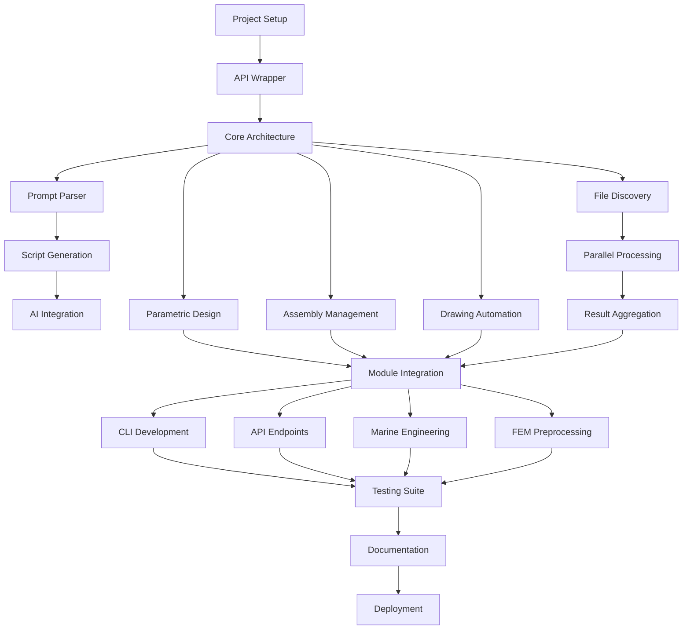

# FreeCAD Agent Implementation Tasks

## Phase 1: Foundation (Week 1-2)

### 1. Project Setup and Infrastructure
**Effort**: 4 hours
- [x] Create agent directory structure under `agents/freecad/` ✅
- [x] Set up Python virtual environment with FreeCAD dependencies ✅
- [x] Configure agent_config.json with capabilities and settings ✅
- [x] Initialize git repository and create README.md ✅
- [x] Set up logging and error handling framework ✅

### 2. FreeCAD API Wrapper Development
**Effort**: 8 hours
- [x] Create base FreeCAD API wrapper class ✅
- [x] Implement document management functions (create, open, save) ✅
- [x] Add object creation and manipulation methods ✅
- [x] Develop geometry and constraint handling ✅
- [x] Test API wrapper with sample operations ✅

### 3. Core Agent Architecture
**Effort**: 6 hours
- [x] Implement base Agent class following Agent OS patterns ✅
- [x] Create capability registry and method mapping ✅
- [x] Set up configuration management system ✅
- [x] Implement error handling and recovery mechanisms ✅
- [x] Add performance monitoring and metrics collection ✅

## Phase 2: Natural Language Processing (Week 2-3)

### 4. Prompt Parser Development
**Effort**: 8 hours
- [x] Create natural language to command translator ✅
- [x] Implement intent recognition for CAD operations ✅
- [x] Add parameter extraction from prompts ✅
- [x] Develop context management for multi-step operations ✅
- [x] Test with various prompt formats and edge cases ✅

### 5. Script Generation Engine
**Effort**: 10 hours
- [x] Build Python script generator from parsed commands ✅
- [x] Create template library for common operations ✅
- [x] Implement variable substitution and parameterization ✅
- [x] Add script validation and syntax checking ✅
- [x] Develop script optimization for performance ✅

### 6. AI Integration Layer
**Effort**: 6 hours
- [x] Integrate with LLM for enhanced prompt understanding ✅
- [x] Implement design suggestion generation ✅
- [x] Add error message interpretation and user guidance ✅
- [x] Create feedback loop for continuous improvement ✅
- [x] Test AI responses for accuracy and relevance ✅

## Phase 3: CAD Operations (Week 3-4)

### 7. Parametric Design Module
**Effort**: 12 hours
- [ ] Implement parametric model creation from specifications
- [ ] Add feature-based modeling capabilities
- [ ] Create constraint solver integration
- [ ] Develop design table processing
- [ ] Build parameter modification workflows

### 8. Assembly Management System
**Effort**: 10 hours
- [ ] Create component placement algorithms
- [ ] Implement constraint-based assembly
- [ ] Add collision detection and clearance checking
- [ ] Develop bill of materials generation
- [ ] Build assembly animation capabilities

### 9. Drawing Automation
**Effort**: 8 hours
- [ ] Implement automatic view generation
- [ ] Add intelligent dimension placement
- [ ] Create annotation and labeling system
- [ ] Develop drawing template management
- [ ] Build export to various drawing formats

## Phase 4: Batch Processing (Week 4-5)

### 10. File Discovery System
**Effort**: 4 hours
- [ ] Implement pattern-based file search (glob, regex)
- [ ] Add recursive directory traversal
- [ ] Create file filtering by type and properties
- [ ] Develop file metadata extraction
- [ ] Build file validation and verification

### 11. Parallel Processing Engine
**Effort**: 8 hours
- [ ] Implement asyncio-based parallel execution
- [ ] Create adaptive worker pool management
- [ ] Add progress tracking and reporting
- [ ] Develop resource management and throttling
- [ ] Build error handling for batch operations

### 12. Result Aggregation Framework
**Effort**: 6 hours
- [ ] Create result collection and consolidation
- [ ] Implement summary report generation
- [ ] Add statistical analysis of batch results
- [ ] Develop export to various formats (CSV, JSON, Excel)
- [ ] Build visualization of batch processing metrics

## Phase 5: Integration (Week 5-6)

### 13. Module Integration
**Effort**: 8 hours
- [ ] Integrate with OrcaFlex agent for hydrodynamic data
- [ ] Connect with AQWA agent for diffraction analysis
- [ ] Add data exchange with signal analysis module
- [ ] Implement cross-module workflow orchestration
- [ ] Test end-to-end integration scenarios

### 14. CLI Development
**Effort**: 6 hours
- [ ] Create command-line interface following standards
- [ ] Implement all required parameters (--input-directory, --pattern, etc.)
- [ ] Add interactive mode for guided operations
- [ ] Develop help documentation and examples
- [ ] Test CLI with various use cases

### 15. API Endpoints
**Effort**: 8 hours
- [ ] Design RESTful API architecture
- [ ] Implement core CRUD operations
- [ ] Add batch processing endpoints
- [ ] Create WebSocket support for real-time updates
- [ ] Develop API documentation with OpenAPI/Swagger

## Phase 6: Specialized Features (Week 6-7)

### 16. Marine Engineering Tools
**Effort**: 10 hours
- [ ] Implement hull design automation
- [ ] Add stability calculation integration
- [ ] Create structural analysis preprocessing
- [ ] Develop mooring system design tools
- [ ] Build vessel arrangement optimization

### 17. FEM Preprocessing
**Effort**: 8 hours
- [ ] Create mesh generation automation
- [ ] Implement boundary condition application
- [ ] Add load case definition tools
- [ ] Develop material property assignment
- [ ] Build result extraction and formatting

### 18. Workbench Development Tools
**Effort**: 6 hours
- [ ] Create custom workbench generator
- [ ] Implement toolbar and menu customization
- [ ] Add command registration system
- [ ] Develop icon and resource management
- [ ] Build workbench packaging and distribution

## Phase 7: Quality Assurance (Week 7-8)

### 19. Unit Testing Suite
**Effort**: 8 hours
- [ ] Write tests for API wrapper functions
- [ ] Create tests for script generation
- [ ] Add tests for batch processing
- [ ] Develop tests for integration points
- [ ] Implement continuous integration pipeline

### 20. Integration Testing
**Effort**: 6 hours
- [ ] Test end-to-end workflows
- [ ] Validate cross-module communication
- [ ] Performance testing with large files
- [ ] Load testing for batch operations
- [ ] Security and input validation testing

### 21. Documentation
**Effort**: 8 hours
- [ ] Write comprehensive user guide
- [ ] Create API reference documentation
- [ ] Develop example scripts and tutorials
- [ ] Build troubleshooting guide
- [ ] Generate architecture documentation

## Phase 8: Deployment (Week 8)

### 22. Package and Distribution
**Effort**: 4 hours
- [ ] Create pip-installable package
- [ ] Set up PyPI distribution
- [ ] Build Docker container
- [ ] Create installation scripts
- [ ] Develop update mechanism

### 23. Performance Optimization
**Effort**: 6 hours
- [ ] Profile code for bottlenecks
- [ ] Optimize memory usage
- [ ] Improve parallel processing efficiency
- [ ] Cache frequently used operations
- [ ] Minimize startup time

### 24. User Training and Support
**Effort**: 4 hours
- [ ] Create video tutorials
- [ ] Develop quick start guide
- [ ] Build example workflow library
- [ ] Set up user support channels
- [ ] Gather initial user feedback

## Maintenance and Enhancement Tasks

### 25. Continuous Improvement
**Ongoing Effort**: 2 hours/week
- [ ] Monitor error logs and fix bugs
- [ ] Implement user-requested features
- [ ] Update for new FreeCAD versions
- [ ] Optimize based on usage patterns
- [ ] Maintain documentation currency

### 26. Advanced Features (Future)
**Effort**: Variable
- [ ] Machine learning model integration
- [ ] Cloud processing capabilities
- [ ] Real-time collaboration features
- [ ] AR/VR visualization support
- [ ] Industry-specific templates

## Task Dependencies

## Resource Requirements

### Human Resources
- **Lead Developer**: Full-time for 8 weeks
- **FreeCAD Expert**: Part-time consultation (20 hours total)
- **QA Engineer**: 2 weeks for testing phase
- **Technical Writer**: 1 week for documentation

### Technical Resources
- **Development Environment**: Windows/Linux with FreeCAD 1.0+
- **Testing Infrastructure**: Multiple OS environments
- **CI/CD Pipeline**: GitHub Actions or similar
- **Documentation Platform**: MkDocs or similar

## Success Metrics

### Completion Criteria
- All tasks marked as complete
- Test coverage > 80%
- Documentation complete and reviewed
- Performance benchmarks met
- User acceptance testing passed

### Key Performance Indicators
- Task completion rate: 95%+
- Bug discovery rate: < 5 per week after deployment
- User adoption rate: 50% within first month
- Performance improvement: 5x for batch operations
- User satisfaction score: 4.5/5 or higher

## Risk Mitigation

### Critical Path Items
1. FreeCAD API Wrapper (blocks all CAD operations)
2. Parallel Processing Engine (blocks batch processing)
3. Module Integration (blocks ecosystem connectivity)

### Contingency Plans
- **API Limitations**: Implement workarounds or request FreeCAD enhancements
- **Performance Issues**: Scale back features or optimize algorithms
- **Integration Challenges**: Develop adapter patterns or middleware
- **Resource Constraints**: Prioritize core features, defer advanced capabilities

## Notes

- Tasks can be executed in parallel where dependencies allow
- Each task includes time for testing and documentation
- Regular check-ins with stakeholders recommended
- Continuous integration should be set up early
- User feedback should be incorporated throughout development