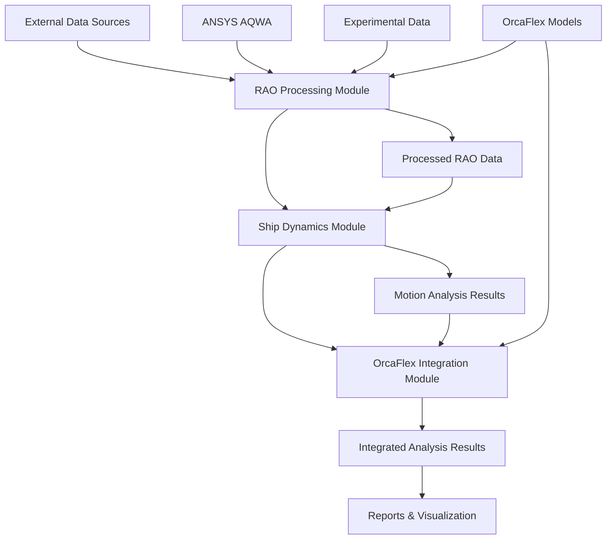

# Marine Engineering Module Specifications

This module contains comprehensive specifications for offshore engineering analysis, ship design, hydrodynamic modeling, and marine simulation workflows. The module is organized following repository best practices with logical sub-modules for different technical domains.

## Module Structure

```
marine-engineering/
├── README.md                           # This file - module overview  
├── ship-dynamics/                      # Ship design and motion analysis
│   ├── README.md                      # Ship dynamics module overview
│   ├── tasks.md                       # Implementation tasks and tracking
│   ├── task_summary.md                # Execution tracking and progress  
│   ├── prompt.md                      # Original prompts and reuse patterns
│   ├── technical-details.md           # Deep technical documentation
│   └── sub-specs/
│       ├── epic-implementation.md     # Marine analysis epic details
│       ├── motion-analysis-6dof.md    # 6DOF motion analysis specification
│       ├── hydrodynamic-modeling.md  # Hydrodynamic framework details
│       ├── environmental-loading.md  # Environmental conditions integration
│       └── validation-benchmarks.md  # Testing and validation requirements
├── rao-processing/                     # RAO data import and processing
│   ├── README.md                      # RAO processing module overview
│   ├── tasks.md                       # Implementation tasks and tracking
│   ├── task_summary.md                # Execution tracking and progress
│   ├── prompt.md                      # Original prompts and reuse patterns
│   ├── technical-details.md           # Deep technical documentation
│   └── sub-specs/
│       ├── aqwa-rao-import.md         # ANSYS AQWA RAO data processing
│       ├── orcaflex-rao-import.md     # OrcaFlex RAO data processing
│       ├── experimental-rao-import.md # Experimental data import
│       ├── rao-validation-framework.md # Quality validation and checking
│       ├── rao-interpolation.md       # Data interpolation and grid processing
│       └── rao-standardization.md    # Output format standardization
└── orcaflex-integration/               # OrcaFlex software integration
    ├── README.md                      # OrcaFlex integration module overview
    ├── tasks.md                       # Implementation tasks and tracking
    ├── task_summary.md                # Execution tracking and progress
    ├── prompt.md                      # Original prompts and reuse patterns
    ├── technical-details.md           # Deep technical documentation
    └── sub-specs/
        ├── browser-interface.md       # OrcaFlex browser integration
        ├── results-dashboard.md       # Advanced results dashboard
        ├── force-analysis.md          # Strut force identification
        ├── mooring-tension-iteration.md # Mooring optimization
        ├── data-processing.md         # YAML workflow processing
        ├── configuration-management.md # References consolidated location at specs/modules/orcaflex/configuration-management/
        └── api-integration.md         # OrcaFlex API integration
```

## Sub-Module Overview

### Ship Dynamics Analysis Module
**Location**: `ship-dynamics/`  
**Status**: Active Development 🚧  
**Timeline**: 12 months (Q1-Q4 2025)

Comprehensive ship design and dynamic analysis capabilities:
- **Marine Analysis Epic**: Complete framework for ship design dynamics analysis
- **6DOF Motion Analysis**: Advanced vessel motion prediction and analysis
- **Hydrodynamic Modeling**: Wave-structure interaction and potential flow analysis
- **Environmental Loading**: Wave, wind, and current loading integration
- **Regulatory Compliance**: Automated compliance checking and reporting

**Key Features**:
- Ship hull form optimization and resistance analysis
- 6-degree-of-freedom motion analysis (surge, sway, heave, roll, pitch, yaw)
- Integration with ANSYS AQWA and OrcaFlex
- Real-time analysis capabilities for design optimization
- Multi-objective optimization and parametric studies

### RAO Processing Module  
**Location**: `rao-processing/`  
**Status**: Implementation Complete ✅  
**Implementation Progress**: 90%

Multi-source RAO data import, processing, and standardization:
- **ANSYS AQWA Integration**: Enhanced .lis file parsing with FORTRAN format handling
- **OrcaFlex Integration**: YAML structure navigation and vessel configuration extraction
  - **Configuration Management**: Standardized operational procedures consolidated at [specs/modules/orcaflex/configuration-management/](../orcaflex/configuration-management/)
- **Experimental Data**: CSV/Excel import with flexible column mapping
- **Quality Validation**: Comprehensive validation framework with automated quality scoring
- **Data Processing**: Advanced interpolation, enhancement, and standardization

**Technical Capabilities**:
- Auto-detection of file formats with intelligent parsing
- Robust error handling with specific feedback for format issues
- Multi-dimensional interpolation (frequency × heading × DOF)
- Standardized HDF5 output with comprehensive metadata
- Integration with downstream motion analysis workflows

### OrcaFlex Integration Module
**Location**: `orcaflex-integration/`  
**Status**: Advanced Implementation 🚧  
**Implementation Progress**: 85%

Comprehensive OrcaFlex software integration and workflow automation:
- **Browser Interface**: Real-time web-based OrcaFlex model interaction  
- **Results Dashboard**: Advanced analysis dashboard with Docker deployment
- **Force Analysis**: Automated strut force identification and pattern matching
- **Mooring Optimization**: Iterative mooring tension analysis and optimization
- **Workflow Automation**: YAML-based batch processing with error recovery
- **Configuration Management**: Operational procedures for systematic error handling and workflow automation
  - **Consolidated Location**: [specs/modules/orcaflex/configuration-management/](../orcaflex/configuration-management/)

**Integration Features**:
- WebSocket-based real-time model visualization and data streaming
- Professional React frontend with advanced charting and analysis tools
- Comprehensive error handling with automated diagnostic and repair
- Docker containerization for scalable deployment
- Integration with external marine engineering workflows

## Cross-Module Integration

### Internal Dependencies
- **Ship Dynamics ↔ RAO Processing**: RAO data flows from processing module to motion analysis
- **Ship Dynamics ↔ OrcaFlex Integration**: Motion predictions validated against OrcaFlex results
- **RAO Processing ↔ OrcaFlex Integration**: RAO data imported from OrcaFlex configurations
- **Cross-Validation**: Results compared across modules for accuracy verification

### External Dependencies
- **Test Suite Automation**: Automated testing of marine engineering calculations
- **Agent OS**: Workflow automation for complex analysis sequences  
- **Infrastructure**: High-performance computing for large-scale analyses
- **Development Tools**: Version control for analysis models and results

### Data Flow Architecture



## Implementation Status

### Overall Module Progress: 85% Complete

#### ✅ Completed Components
- **RAO Processing Core**: Multi-source import with quality validation
- **OrcaFlex Browser Interface**: Real-time web-based model interaction
- **OrcaFlex Results Dashboard**: Docker-deployed analysis dashboard  
- **Troubleshooting Framework**: Comprehensive error handling and resolution
- **Module Organization**: Repository best practices implementation

#### 🚧 In Progress Components  
- **Ship Dynamics Implementation**: Core analysis algorithms and workflows
- **Advanced Optimization**: Multi-objective optimization and machine learning
- **Performance Optimization**: Large dataset handling and memory efficiency
- **Integration Testing**: Cross-module compatibility and data validation

#### 📋 Planned Components
- **Real-time Monitoring**: Live analysis monitoring and alerting systems
- **Cloud Deployment**: Scalable cloud-based analysis infrastructure
- **Mobile Interfaces**: Mobile-responsive dashboards for field operations
- **Advanced Analytics**: Machine learning integration for predictive analysis

## Quality Standards

### Technical Standards
- **Analysis Accuracy**: <5% deviation from experimental data for standard cases
- **Processing Performance**: Standard analysis completion within specified time limits
- **Integration Reliability**: >99% success rate for cross-module data exchange
- **Code Quality**: >95% test coverage with comprehensive validation

### Industry Compliance
- **Marine Engineering Standards**: DNV, ABS, Lloyd's Register compliance
- **Software Integration**: ANSYS AQWA and OrcaFlex API compatibility
- **Data Formats**: Industry-standard RAO and analysis result formats
- **Regulatory Requirements**: Automated compliance checking and reporting

### User Experience Standards
- **Workflow Efficiency**: 70% reduction in manual processing time
- **Interface Usability**: Professional-grade interfaces with intuitive workflows
- **Error Handling**: Comprehensive error feedback with actionable solutions
- **Documentation**: Complete user guides and technical documentation

## Performance Metrics

### Technical Performance
- **RAO Processing**: <30 seconds for complete processing pipeline
- **Motion Analysis**: <2 hours for standard vessel analysis
- **OrcaFlex Integration**: <100ms latency for real-time updates
- **Memory Efficiency**: <2GB for typical offshore analysis models

### Business Impact
- **Project Support**: Enable analysis for $100M+ marine engineering projects
- **Market Adoption**: Target adoption by 5+ marine engineering firms
- **Competitive Advantage**: Integrated analysis capabilities unique in market
- **User Productivity**: 50% improvement in analysis workflow efficiency

## Future Roadmap

### Short-term Enhancements (Q2 2025)
- Complete ship dynamics implementation with full validation
- Advanced mooring optimization algorithms
- Enhanced real-time monitoring capabilities
- Comprehensive user interface improvements

### Medium-term Goals (Q3-Q4 2025)
- Machine learning integration for predictive analysis
- Cloud-based scalable analysis infrastructure  
- Advanced multi-body interaction modeling
- Mobile-responsive dashboard interfaces

### Long-term Vision (2026+)
- Digital twin integration for operational monitoring
- IoT sensor data integration for real-time analysis
- Blockchain-based analysis verification and certification
- VR/AR integration for immersive model visualization

## Success Metrics

### Technical Success Criteria
- [ ] All sub-modules operational with >95% uptime
- [ ] Cross-module integration successful with <1s data exchange
- [ ] Industry-standard accuracy validated through benchmarking
- [ ] Comprehensive error handling resolving 90%+ of common issues

### User Success Criteria
- [ ] Marine engineers successfully operate workflows without extensive training
- [ ] Analysis time reduced by 70% compared to manual processes
- [ ] Professional-grade interfaces meeting industry expectations
- [ ] Comprehensive documentation supporting autonomous operation

### Business Success Criteria
- [ ] Market adoption by target marine engineering firms
- [ ] Revenue impact through enabled project opportunities
- [ ] Competitive differentiation in integrated analysis market
- [ ] Customer satisfaction scores >90% from marine engineering users

---

*The Marine Engineering module provides a comprehensive, integrated platform for sophisticated offshore engineering analysis with industry-leading capabilities and professional-grade user experiences.*