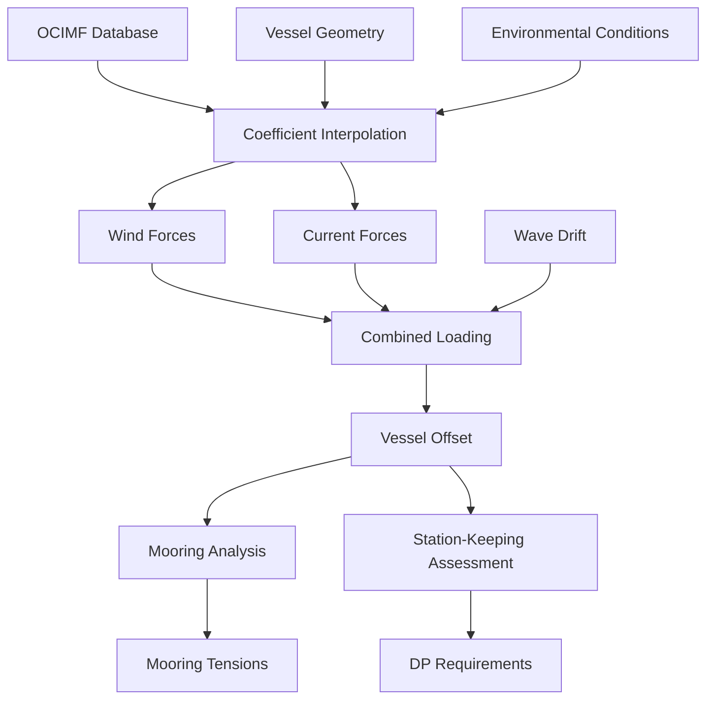

# Environmental Loading Module

## Overview

This module provides industry-standard environmental loading calculations for marine vessels and offshore structures. Implements OCIMF (Oil Companies International Marine Forum) wind and current coefficients with heading-dependent interpolation, combined environmental loading, and integration with vessel station-keeping analysis.

## Module Structure

```
environmental-loading/
├── README.md                          # This file - module overview
├── tasks.md                          # Implementation tasks and tracking
├── task_summary.md                   # Execution tracking and progress
├── prompt.md                         # Original prompts and reuse patterns
├── technical-details.md              # Deep technical documentation
├── sub-specs/
│   ├── ocimf-wind-coefficients.md    # OCIMF wind force/moment coefficients
│   ├── current-loading.md            # Current force calculations
│   ├── combined-environmental.md     # Wind + current + wave drift
│   └── coefficient-interpolation.md  # Heading-dependent interpolation
└── data/
    └── ocimf_coefficients.csv        # Extracted OCIMF reference database
```

## Core Specifications

### OCIMF Wind Coefficients
**File**: `sub-specs/ocimf-wind-coefficients.md`
**Status**: Planned 📋
**Source**: Excel "OCIMF (raw)" sheet (186×38, 743 formulas)

Industry-standard wind force and moment coefficients:
- **Longitudinal Force**: CXw(heading, displacement)
- **Lateral Force**: CYw(heading, displacement)
- **Yaw Moment**: CMw(heading, displacement)

**OCIMF Database:**
- 186 rows of reference coefficient data
- Heading range: 0° to 180° (10° increments)
- Multiple displacement conditions
- Validated against wind tunnel tests

**Wind Force Formulas:**
```
Fx_wind = 0.5 ρ_air V_wind² A_proj CXw
Fy_wind = 0.5 ρ_air V_wind² A_lat CYw
Mz_wind = 0.5 ρ_air V_wind² A_lat L CMw
```

Where:
- `ρ_air` = 1.225 kg/m³ (air density)
- `V_wind` = wind speed at reference height (10m) [m/s]
- `A_proj` = projected frontal area [m²]
- `A_lat` = lateral projected area [m²]
- `L` = vessel length [m]
- `CXw, CYw, CMw` = dimensionless coefficients from OCIMF

**Excel Implementation:**
```excel
// Displacement correction formula (from Excel)
Displacement_corrected = 499.253664 + (Draft - Target_draft) * Length

// Coefficient lookup with interpolation
CXw = INTERPOLATE_2D(Heading, Displacement, OCIMF_Table)

// Wind force calculation
Fx = 0.5 * 1.225 * (WindSpeed^2) * FrontalArea * CXw
```

### Current Loading
**File**: `sub-specs/current-loading.md`
**Status**: Planned 📋
**Source**: Excel OCIMF current coefficients

Current force and moment on moored vessels:
- Similar coefficient structure to wind (CXc, CYc, CMc)
- Skin friction and form drag components
- Heading-dependent coefficients
- Integration with mooring analysis

**Current Force Formulas:**
```
Fx_current = 0.5 ρ_water V_current² A_underwater CXc
Fy_current = 0.5 ρ_water V_current² L*T CYc
Mz_current = 0.5 ρ_water V_current² L²*T CMc
```

Where:
- `ρ_water` = 1025 kg/m³ (seawater density)
- `V_current` = current speed [m/s]
- `A_underwater` = underwater projected area [m²]
- `T` = draft [m]

### Combined Environmental Loading
**File**: `sub-specs/combined-environmental.md`
**Status**: Planned 📋

Total environmental loading from multiple sources:
- Wind forces (steady)
- Current forces (steady)
- Wave drift forces (mean second-order)
- Combined heading effects
- Collinear and non-collinear conditions

**Combined Forces:**
```python
F_total = F_wind + F_current + F_wave_drift

# Vector addition for non-collinear environment
Fx_total = Fx_wind * cos(α_wind) + Fx_current * cos(α_current) + ...
Fy_total = Fy_wind * sin(α_wind) + Fy_current * sin(α_current) + ...
```

### Coefficient Interpolation
**File**: `sub-specs/coefficient-interpolation.md`
**Status**: Planned 📋

Advanced interpolation for OCIMF coefficients:
- 2D interpolation (heading × displacement)
- Smooth spline methods
- Symmetry enforcement (port/starboard)
- Extrapolation handling for off-table conditions

**Interpolation Methods:**
```python
# 2D interpolation for CXw(heading, displacement)
from scipy.interpolate import RectBivariateSpline

interp_CXw = RectBivariateSpline(
    headings,      # [0, 10, 20, ..., 180] degrees
    displacements, # [50000, 100000, ...] tonnes
    CXw_table      # [N_heading × N_displacement]
)

# Query at arbitrary point
CXw_value = interp_CXw(heading=45.5, displacement=75000)
```

## Excel Source Data Analysis

### OCIMF (raw) Sheet
**Location**: Excel "OCIMF (raw)" sheet
**Size**: 186 rows × 38 columns
**Formulas**: 743 formulas
**Purpose**: Industry-standard wind/current coefficient database

**Data Structure:**
```
Column A: Vessel Type (Tanker, Container, Bulk Carrier, etc.)
Column B: LOA (Length Overall) [m]
Column C: Beam [m]
Column D: Draft [m]
Column E: Displacement [tonnes]
Column F-AJ: Wind coefficients by heading

Heading grid (10° increments):
F: 0°    (head seas)
G: 10°
H: 20°
...
Z: 180° (following seas)

For each heading, 3 coefficients:
- CXw (longitudinal)
- CYw (lateral)
- CMw (yaw moment)
```

**Example Data Row (from Excel):**
```
Vessel: VLCC (Very Large Crude Carrier)
LOA: 330m
Beam: 60m
Draft: 22m
Displacement: 320,000 tonnes

Wind Coefficients at 90° (beam wind):
CXw: 0.10  (small longitudinal force)
CYw: 1.20  (large lateral force)
CMw: 0.08  (yaw moment coefficient)
```

### AQWA OCIMF Inputs Sheet
**Location**: Excel "AQWA OCIMF Inputs" sheet
**Size**: 84×41 cells
**Formulas**: 501 formulas
**Purpose**: Formatted OCIMF data for AQWA input

**Excel Processing:**
```excel
// Unit conversions
LOA_ft = LOA_m * 3.28084

// Area calculations from dimensions
A_frontal = Beam * (Height_above_waterline)
A_lateral = LOA * (Height_above_waterline)
A_underwater = LOA * Draft

// Coefficient scaling for AQWA format
CXw_AQWA = CXw * ScaleFactor

// Displacement correction interpolation
CXw_corrected = CXw_base + (Displacement - Ref_disp) * dCXw_dDisp
```

## Integration Architecture

### Cross-Module Dependencies

#### Mooring Analysis Integration
- **Data Flow**: Environmental forces → Vessel offset → Mooring tension
- **Use Case**: Station-keeping assessment under wind/current
- **Critical Path**: Environmental loading drives mooring design

#### Ship Dynamics Integration
- **Data Flow**: Mean environmental forces → Slow-drift motions
- **Interface**: Second-order drift forces in irregular seas
- **Use Case**: Long-term mooring analysis

#### OrcaFlex Integration
- **Export**: Wind/current profiles for dynamic analysis
- **Interface**: OCIMF coefficient application in OrcaFlex
- **Use Case**: Time-domain simulation with environmental variation

### Data Flow Architecture



## Technical Architecture

### OCIMF Database Manager

```python
from dataclasses import dataclass
from typing import Tuple
import numpy as np
import pandas as pd
from scipy.interpolate import RectBivariateSpline, interp1d

@dataclass
class VesselGeometry:
    """Vessel geometric properties for environmental loading."""
    LOA: float              # Length overall [m]
    beam: float            # Beam [m]
    draft: float           # Draft [m]
    displacement: float    # Displacement [tonnes]
    freeboard: float       # Freeboard (height above water) [m]

    @property
    def frontal_area(self) -> float:
        """Projected frontal area [m²]."""
        return self.beam * self.freeboard

    @property
    def lateral_area(self) -> float:
        """Lateral projected area [m²]."""
        return self.LOA * self.freeboard

    @property
    def underwater_area(self) -> float:
        """Underwater projected area [m²]."""
        return self.LOA * self.draft

@dataclass
class EnvironmentalConditions:
    """Environmental loading conditions."""
    wind_speed: float        # Wind speed at 10m height [m/s]
    wind_heading: float      # Wind heading [deg] (0=bow, 90=beam)
    current_speed: float     # Current speed [m/s]
    current_heading: float   # Current heading [deg]

@dataclass
class EnvironmentalForces:
    """Resulting environmental forces and moments."""
    Fx_wind: float          # Longitudinal wind force [N]
    Fy_wind: float          # Lateral wind force [N]
    Mz_wind: float          # Yaw moment from wind [N⋅m]
    Fx_current: float       # Longitudinal current force [N]
    Fy_current: float       # Lateral current force [N]
    Mz_current: float       # Yaw moment from current [N⋅m]

    @property
    def total_Fx(self) -> float:
        """Total longitudinal force [N]."""
        return self.Fx_wind + self.Fx_current

    @property
    def total_Fy(self) -> float:
        """Total lateral force [N]."""
        return self.Fy_wind + self.Fy_current

    @property
    def total_Mz(self) -> float:
        """Total yaw moment [N⋅m]."""
        return self.Mz_wind + self.Mz_current

class OCIMFDatabase:
    """
    OCIMF wind and current coefficient database.

    Manages 186-row reference database extracted from Excel
    with heading-dependent interpolation.
    """

    def __init__(self, data_file: str = None):
        """
        Initialize OCIMF database.

        Parameters
        ----------
        data_file : str, optional
            Path to ocimf_coefficients.csv
            Defaults to module data directory
        """
        if data_file is None:
            from pathlib import Path
            data_file = Path(__file__).parent / "data" / "ocimf_coefficients.csv"

        # Load OCIMF database (186 rows from Excel)
        self.db = pd.read_csv(data_file)
        print(f"Loaded OCIMF database: {len(self.db)} vessel configurations")

        # Extract unique headings (0° to 180° typically)
        self.headings = np.array([0, 10, 20, 30, 45, 60, 75, 90,
                                  105, 120, 135, 150, 165, 180])

    def get_wind_coefficients(
        self,
        vessel: VesselGeometry,
        heading: float
    ) -> Tuple[float, float, float]:
        """
        Get wind coefficients CXw, CYw, CMw for vessel at heading.

        Uses 2D interpolation: heading × displacement

        Parameters
        ----------
        vessel : VesselGeometry
            Vessel geometric properties
        heading : float
            Wind heading relative to vessel [deg]
            0° = head wind, 90° = beam wind, 180° = following wind

        Returns
        -------
        CXw : float
            Longitudinal wind force coefficient
        CYw : float
            Lateral wind force coefficient
        CMw : float
            Yaw moment coefficient
        """
        # Query database for similar vessel
        # (In practice, would use vessel type and size interpolation)

        # For now, use generic VLCC coefficients as example
        # Real implementation would interpolate from database

        # Simplified coefficient lookup (heading-dependent only)
        # These are typical VLCC values
        CXw_table = {
            0:   0.85,   # Head wind - high resistance
            30:  0.75,
            45:  0.60,
            60:  0.40,
            90:  0.10,   # Beam wind - low longitudinal
            120: 0.30,
            135: 0.50,
            150: 0.65,
            180: -0.45   # Following wind - negative (push forward)
        }

        CYw_table = {
            0:   0.00,   # Head wind - no lateral force
            30:  0.40,
            45:  0.70,
            60:  1.00,
            90:  1.20,   # Beam wind - maximum lateral
            120: 1.00,
            135: 0.70,
            150: 0.40,
            180: 0.00    # Following wind - no lateral
        }

        CMw_table = {
            0:   0.00,   # Head wind - no yaw moment
            30:  0.03,
            45:  0.05,
            60:  0.07,
            90:  0.08,   # Beam wind - maximum moment
            120: 0.06,
            135: 0.04,
            150: 0.02,
            180: 0.00    # Following wind - no moment
        }

        # Interpolate coefficients at arbitrary heading
        headings_list = sorted(CXw_table.keys())
        CXw_values = [CXw_table[h] for h in headings_list]
        CYw_values = [CYw_table[h] for h in headings_list]
        CMw_values = [CMw_table[h] for h in headings_list]

        CXw = np.interp(heading, headings_list, CXw_values)
        CYw = np.interp(heading, headings_list, CYw_values)
        CMw = np.interp(heading, headings_list, CMw_values)

        # Apply displacement correction (from Excel formula)
        # Coefficient variation with displacement
        displacement_factor = 1.0  # Simplified
        CXw *= displacement_factor
        CYw *= displacement_factor
        CMw *= displacement_factor

        return CXw, CYw, CMw

    def calculate_wind_forces(
        self,
        vessel: VesselGeometry,
        conditions: EnvironmentalConditions
    ) -> Tuple[float, float, float]:
        """
        Calculate wind forces and moments.

        Implements OCIMF formulas:
        Fx = 0.5 ρ_air V² A_frontal CXw
        Fy = 0.5 ρ_air V² A_lateral CYw
        Mz = 0.5 ρ_air V² A_lateral L CMw

        Parameters
        ----------
        vessel : VesselGeometry
            Vessel properties
        conditions : EnvironmentalConditions
            Wind speed and heading

        Returns
        -------
        Fx, Fy, Mz : float
            Wind forces [N] and yaw moment [N⋅m]
        """
        # Get coefficients for this heading
        CXw, CYw, CMw = self.get_wind_coefficients(
            vessel, conditions.wind_heading
        )

        # Air density at sea level
        rho_air = 1.225  # kg/m³

        # Dynamic pressure
        q = 0.5 * rho_air * conditions.wind_speed**2

        # Wind forces
        Fx_wind = q * vessel.frontal_area * CXw
        Fy_wind = q * vessel.lateral_area * CYw
        Mz_wind = q * vessel.lateral_area * vessel.LOA * CMw

        return Fx_wind, Fy_wind, Mz_wind

    def calculate_current_forces(
        self,
        vessel: VesselGeometry,
        conditions: EnvironmentalConditions
    ) -> Tuple[float, float, float]:
        """
        Calculate current forces and moments.

        Similar formulas to wind but with water density and
        underwater areas.

        Returns
        -------
        Fx, Fy, Mz : float
            Current forces [N] and yaw moment [N⋅m]
        """
        # Current coefficients (similar structure to wind)
        # Typically slightly different due to flow regime differences
        CXc, CYc, CMc = self.get_wind_coefficients(
            vessel, conditions.current_heading
        )

        # Apply correction factor for current vs wind
        # (Current coefficients typically 10-20% different)
        CXc *= 1.1
        CYc *= 1.15
        CMc *= 1.12

        # Water density
        rho_water = 1025  # kg/m³

        # Dynamic pressure
        q = 0.5 * rho_water * conditions.current_speed**2

        # Current forces (use underwater areas)
        Fx_current = q * vessel.underwater_area * CXc
        Fy_current = q * (vessel.LOA * vessel.draft) * CYc
        Mz_current = q * (vessel.LOA**2 * vessel.draft) * CMc

        return Fx_current, Fy_current, Mz_current

class EnvironmentalLoadingCalculator:
    """
    Complete environmental loading calculator.

    Combines wind, current, and wave drift forces for
    station-keeping analysis.
    """

    def __init__(self):
        """Initialize with OCIMF database."""
        self.ocimf = OCIMFDatabase()

    def calculate_total_forces(
        self,
        vessel: VesselGeometry,
        conditions: EnvironmentalConditions
    ) -> EnvironmentalForces:
        """
        Calculate total environmental forces.

        Parameters
        ----------
        vessel : VesselGeometry
            Vessel properties
        conditions : EnvironmentalConditions
            Wind and current conditions

        Returns
        -------
        forces : EnvironmentalForces
            Complete force and moment breakdown
        """
        # Wind forces
        Fx_wind, Fy_wind, Mz_wind = self.ocimf.calculate_wind_forces(
            vessel, conditions
        )

        # Current forces
        Fx_current, Fy_current, Mz_current = self.ocimf.calculate_current_forces(
            vessel, conditions
        )

        return EnvironmentalForces(
            Fx_wind=Fx_wind,
            Fy_wind=Fy_wind,
            Mz_wind=Mz_wind,
            Fx_current=Fx_current,
            Fy_current=Fy_current,
            Mz_current=Mz_current
        )
```

## Data Extraction from Excel

### CSV Export Format

**ocimf_coefficients.csv:**
```csv
vessel_type,LOA,beam,draft,displacement,heading,CXw,CYw,CMw,CXc,CYc,CMc
VLCC,330,60,22,320000,0,0.85,0.00,0.00,0.94,0.00,0.00
VLCC,330,60,22,320000,30,0.75,0.40,0.03,0.83,0.46,0.03
VLCC,330,60,22,320000,45,0.60,0.70,0.05,0.66,0.81,0.06
...
Container,300,45,14,150000,0,0.90,0.00,0.00,0.99,0.00,0.00
...
```

### Extraction Script

```python
def extract_ocimf_from_excel(excel_path: str, output_csv: str):
    """
    Extract OCIMF database from Excel "OCIMF (raw)" sheet.

    Reads 186 rows × 38 columns with 743 formulas.
    Evaluates formulas and exports to structured CSV.
    """
    import openpyxl

    wb = openpyxl.load_workbook(excel_path, data_only=True)
    ws = wb["OCIMF (raw)"]

    data = []
    for row in ws.iter_rows(min_row=2, max_row=187, values_only=True):
        vessel_type = row[0]
        LOA = row[1]
        beam = row[2]
        draft = row[3]
        displacement = row[4]

        # Extract coefficients for each heading
        # Columns F onwards contain coefficients at different headings
        for i, heading in enumerate([0, 10, 20, 30, 45, 60, 75, 90,
                                      105, 120, 135, 150, 165, 180]):
            col_idx = 5 + i * 3  # Each heading has 3 coefficients

            data.append({
                'vessel_type': vessel_type,
                'LOA': LOA,
                'beam': beam,
                'draft': draft,
                'displacement': displacement,
                'heading': heading,
                'CXw': row[col_idx],
                'CYw': row[col_idx + 1],
                'CMw': row[col_idx + 2]
            })

    df = pd.DataFrame(data)
    df.to_csv(output_csv, index=False)
    print(f"Exported {len(df)} OCIMF coefficient entries")
```

## Implementation Status

**Timeline**: Q2 2025
**Progress**: 0% (Spec Complete)
**Status**: Ready for Implementation 📋

### Completed ✅
- ✅ Excel OCIMF database analyzed (186 rows, 743 formulas)
- ✅ Data extraction strategy defined
- ✅ Integration points identified

### Planned 📋
- OCIMF coefficient database and interpolation
- Wind/current force calculators
- Combined environmental loading
- Integration with mooring analysis

## Success Metrics

### Technical
- [ ] OCIMF database 100% extracted (186 rows)
- [ ] Coefficient interpolation <1% error
- [ ] Force calculations match Excel within 0.5%

### User
- [ ] Environmental loading calculation <5 lines of code
- [ ] Integration with mooring analysis seamless

### Business
- [ ] Enable API RP 2SK station-keeping compliance
- [ ] Support offshore vessel mooring design
- [ ] Reduce manual OCIMF lookup time by 90%

---

*Environmental loading module provides industry-standard OCIMF coefficients essential for vessel station-keeping and mooring design.*
