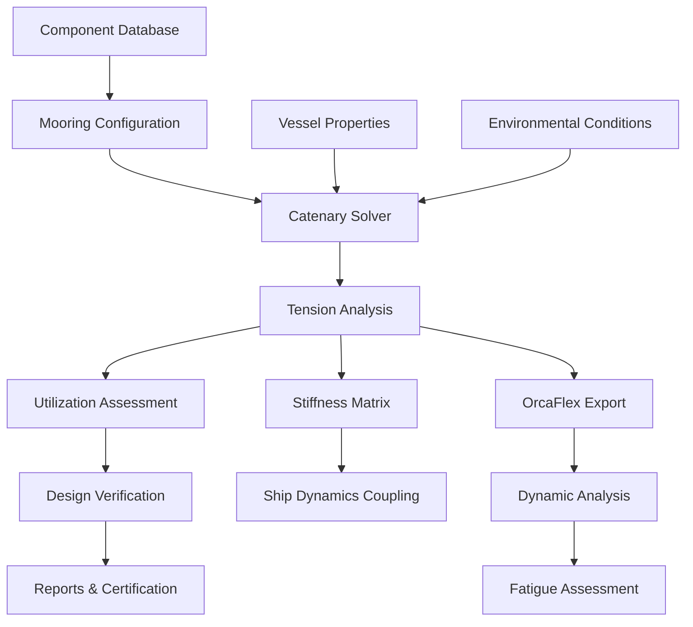

# Mooring Analysis Module

## Overview

This module provides comprehensive mooring system analysis capabilities including catenary line analysis, component database management, quasi-static mooring tension calculations, and integration with OrcaFlex for dynamic analysis. The module is based on proven engineering methods extracted from Excel implementations and enhanced with Python performance optimization.

## Module Structure

```
mooring-analysis/
├── README.md                          # This file - module overview
├── tasks.md                          # Implementation tasks and tracking
├── task_summary.md                   # Execution tracking and progress
├── prompt.md                         # Original prompts and reuse patterns
├── technical-details.md              # Deep technical documentation
├── sub-specs/
│   ├── catenary-solver.md           # Quasi-static catenary analysis
│   ├── component-database.md        # Chain/wire/rope component library
│   ├── mooring-configuration.md     # Mooring system layout and design
│   ├── tension-analysis.md          # Static and quasi-static tension analysis
│   └── equipment-specifications.md  # Hardware and connector specifications
└── data/
    ├── chain_properties.csv         # Chain component database
    ├── wire_properties.csv          # Wire rope database
    └── line_properties.csv          # Synthetic/fiber rope database
```

## Core Specifications

### Catenary Solver
**File**: `sub-specs/catenary-solver.md`
**Status**: Planned 📋
**Source**: Excel "Poly Mooring" sheet (695 array formulas)

Advanced quasi-static catenary line analysis:
- Analytical catenary equations for suspended cable
- Polynomial approximations for complex profiles
- Multi-segment mooring line modeling
- Touch-down point calculations
- Horizontal and vertical tension components

**Technical Capabilities**:
- Exact catenary solution: y = a·cosh(x/a)
- Numerical iteration for boundary conditions
- Weight-span-tension relationship
- Elastic elongation integration
- Layback and pretension calculations

**Key Features**:
- Single and multi-component line analysis
- Buoyancy and current effects
- Seabed interaction modeling
- Stiffness matrix calculation for coupling

### Component Database
**File**: `sub-specs/component-database.md`
**Status**: Planned 📋
**Source**: Excel sheets "Chain Data", "Wire Data", "Mooring Line Data"

Comprehensive mooring component library:
- **Chain Database**: 60 standard sizes (R3, R3S, R4, R4S, R5 grades)
- **Wire Rope Database**: 24 configurations (6x36, 6x19 constructions)
- **Synthetic Line Database**: 252 rope specifications

**Component Properties**:
- Nominal diameter and actual dimensions
- Minimum Breaking Load (MBL) by grade
- Axial stiffness (EA)
- Weight in air and water
- Bend radius and fatigue characteristics

**Excel Formula Examples**:
```python
# Chain Breaking Load (from Excel)
MBL_studlink = 21,900 * (diameter_mm^2) / 1000^2  # kN
MBL_studless = 19,900 * (diameter_mm^2) / 1000^2  # kN

# Chain Stiffness
EA_studlink = 64,000,000  # kN (grade dependent)
EA_studless = 54,400,000  # kN
```

### Mooring Configuration
**File**: `sub-specs/mooring-configuration.md`
**Status**: Planned 📋
**Source**: Excel "Mooring Nodes", "Mooring Plot" sheets

Mooring system layout and design:
- Node coordinate definition (fairlead, anchor, connections)
- Line routing and connectivity
- Spread mooring patterns (3-point, 4-point, 8-point, 12-point)
- Turret and internal/external mooring configurations

**Configuration Features**:
- Pre-defined mooring patterns
- Symmetry enforcement
- Environmental heading optimization
- Safety factor calculations
- Station-keeping assessment

### Tension Analysis
**File**: `sub-specs/tension-analysis.md`
**Status**: Planned 📋
**Source**: Excel "Poly Mooring" calculations

Static and quasi-static mooring line tension analysis:
- Pretension optimization
- Offset-tension relationships
- Maximum line tensions under environmental loading
- Utilization ratios (tension/MBL)
- Restoring force characteristics

**Analysis Capabilities**:
- Linearized stiffness at operating point
- Nonlinear load-excursion curves
- Watch circle calculations
- Mooring system compliance
- Failure mode analysis

### Equipment Specifications
**File**: `sub-specs/equipment-specifications.md`
**Status**: Planned 📋
**Source**: Excel "Mooring Equipment" sheet

Hardware component specifications:
- Anchor types and holding capacity
- Connectors (shackles, swivels, links)
- Fairlead and chain stopper specifications
- Windlass and tensioning equipment
- Proof load and certification requirements

## Integration Architecture

### Cross-Module Dependencies

#### Ship Dynamics Integration
- **Data Flow**: Vessel offset → mooring tension → restoring forces
- **Interface**: Mooring stiffness matrix for coupled analysis
- **Use Case**: Combined wind/wave/current offset with mooring restraint

#### OrcaFlex Integration
- **Export**: Mooring line types, vessel types, line configurations
- **Import**: Dynamic tension time series for fatigue analysis
- **Interface**: YAML-based configuration exchange

#### Environmental Loading Integration
- **Data Flow**: Wind/wave/current forces → vessel offset → mooring tension
- **Interface**: Environmental load cases for mooring design
- **Use Case**: Extreme and operational condition assessment

### External Software Integration

#### OrcaFlex Dynamic Analysis
- Generate OrcaFlex line type definitions
- Export mooring configurations with fairlead coordinates
- Import dynamic analysis results for validation
- Post-process tension time series

#### AQWA Integration
- Convert mooring stiffness to AQWA format
- Linearized restoring coefficients
- Quasi-static pretension setup

### Data Flow Architecture



## Technical Architecture

### Core Analysis Engine

```python
class MooringAnalysisEngine:
    """Comprehensive mooring system analysis framework."""

    def __init__(self):
        self.component_db = ComponentDatabase()
        self.catenary_solver = CatenarySolver()
        self.configuration = MooringConfiguration()
        self.tension_analyzer = TensionAnalyzer()

    def analyze_mooring_system(
        self,
        config: MooringSystemConfig,
        vessel: VesselProperties,
        environment: EnvironmentalConditions
    ) -> MooringAnalysisResults:
        """
        Complete mooring system analysis workflow.

        Parameters
        ----------
        config : MooringSystemConfig
            Mooring line configuration (nodes, components, layout)
        vessel : VesselProperties
            Vessel dimensions, displacement, fairlead positions
        environment : EnvironmentalConditions
            Wind, wave, current conditions for analysis

        Returns
        -------
        results : MooringAnalysisResults
            Line tensions, utilization, stiffness matrix, safety factors
        """
        # Phase 1: Load component properties
        lines = self._build_mooring_lines(config)

        # Phase 2: Solve catenary equations
        catenary_results = self.catenary_solver.solve_system(
            lines, vessel, environment
        )

        # Phase 3: Calculate tensions and utilization
        tension_results = self.tension_analyzer.analyze_tensions(
            catenary_results, config.load_cases
        )

        # Phase 4: Compute stiffness matrix
        stiffness = self._compute_stiffness_matrix(catenary_results)

        # Phase 5: Verify design criteria
        verification = self._verify_design(tension_results, config.criteria)

        return MooringAnalysisResults(
            catenary=catenary_results,
            tensions=tension_results,
            stiffness=stiffness,
            verification=verification,
            metadata=self._generate_metadata()
        )
```

### Catenary Solver Implementation

```python
class CatenarySolver:
    """
    Advanced catenary solver with multi-segment support.

    Based on Excel "Poly Mooring" implementation with 695 array formulas
    converted to vectorized NumPy operations.
    """

    def solve_single_line(
        self,
        length: float,
        horizontal_span: float,
        vertical_span: float,
        weight_per_length: float,
        ea_stiffness: float
    ) -> CatenaryResults:
        """
        Solve catenary equation for single uniform line segment.

        Catenary equation: y = a * cosh(x/a) - a
        where a = H / w (horizontal tension / weight per length)

        Parameters
        ----------
        length : float
            Unstretched line length [m]
        horizontal_span : float
            Horizontal distance fairlead to anchor [m]
        vertical_span : float
            Vertical distance (positive down) [m]
        weight_per_length : float
            Submerged weight [N/m]
        ea_stiffness : float
            Axial stiffness [N]

        Returns
        -------
        results : CatenaryResults
            Horizontal tension, vertical tension, elongation, shape
        """
        # Iteratively solve for horizontal tension H
        # that satisfies length constraint

        def catenary_length_error(H: float) -> float:
            """Length error function for root finding."""
            a = H / weight_per_length
            s = a * np.sinh(horizontal_span / a)  # Unstretched arc length
            elongation = H * length / ea_stiffness  # Elastic stretch
            return (s + elongation) - length

        # Newton-Raphson iteration
        H = self._solve_horizontal_tension(catenary_length_error)

        # Calculate vertical tension at fairlead
        V = weight_per_length * horizontal_span  # Approximate

        # Exact calculation from catenary
        a = H / weight_per_length
        V_exact = H * np.sinh(horizontal_span / a)

        # Calculate line shape for plotting
        x = np.linspace(0, horizontal_span, 100)
        y = a * (np.cosh(x / a) - 1)

        return CatenaryResults(
            horizontal_tension=H,
            vertical_tension=V_exact,
            total_tension=np.sqrt(H**2 + V_exact**2),
            elongation=H * length / ea_stiffness,
            touch_down_length=self._calculate_touchdown(H, weight_per_length),
            shape=(x, y)
        )
```

### Component Database

```python
@dataclass
class ChainProperties:
    """
    Chain component specification.

    Extracted from Excel "Chain Data" (60 components, 473 formulas)
    """
    diameter: float          # Nominal diameter [mm]
    grade: str              # R3, R3S, R4, R4S, R5
    link_type: str          # "Stud Link" or "Studless"
    mbl: float              # Minimum Breaking Load [kN]
    stiffness: float        # EA [kN]
    weight_air: float       # Weight in air [kg/m]
    weight_water: float     # Weight in water [kg/m]

    @classmethod
    def from_excel_formula(cls, diameter: float, grade: str, link_type: str):
        """
        Calculate properties using Excel formulas.

        Excel formulas:
        - MBL_studlink = 21900 * (diameter^2) / 1000^2
        - MBL_studless = 19900 * (diameter^2) / 1000^2
        - EA_studlink = 64,000,000 kN
        - EA_studless = 54,400,000 kN
        """
        if link_type == "Stud Link":
            mbl = 21.9 * (diameter ** 2) / 1000  # kN
            ea = 64_000_000  # kN
        else:
            mbl = 19.9 * (diameter ** 2) / 1000  # kN
            ea = 54_400_000  # kN

        # Apply grade factor
        grade_factors = {"R3": 1.0, "R3S": 1.0, "R4": 1.12, "R4S": 1.12, "R5": 1.25}
        mbl *= grade_factors.get(grade, 1.0)

        # Weight calculations (steel density = 7850 kg/m³)
        volume_per_meter = np.pi * (diameter/1000)**2 / 4 * 5  # Approximate
        weight_air = volume_per_meter * 7850  # kg/m
        weight_water = weight_air * (1 - 1025/7850)  # Buoyancy correction

        return cls(
            diameter=diameter,
            grade=grade,
            link_type=link_type,
            mbl=mbl,
            stiffness=ea,
            weight_air=weight_air,
            weight_water=weight_water
        )

class ComponentDatabase:
    """
    Mooring component database manager.

    Loads and manages component libraries from Excel extracts:
    - Chain: 60 components
    - Wire: 24 components
    - Synthetic line: 252 components
    """

    def __init__(self, data_dir: Path = None):
        """Load component databases from CSV files."""
        self.chain_db = pd.read_csv(data_dir / "chain_properties.csv")
        self.wire_db = pd.read_csv(data_dir / "wire_properties.csv")
        self.line_db = pd.read_csv(data_dir / "line_properties.csv")

    def get_chain(self, diameter: float, grade: str = "R3",
                  link_type: str = "Stud Link") -> ChainProperties:
        """Query chain database by specification."""
        query = (
            (self.chain_db['diameter'] == diameter) &
            (self.chain_db['grade'] == grade) &
            (self.chain_db['link_type'] == link_type)
        )
        return ChainProperties(**self.chain_db[query].iloc[0].to_dict())
```

## Implementation Status

### Current Development Phase: Specification Complete
**Timeline**: Q1-Q2 2025
**Progress**: 0% Implementation (Spec Complete)
**Status**: Ready for Implementation 📋

#### Specification Complete ✅
- ✅ Module structure defined
- ✅ Excel feature mapping complete (3,869 formulas identified)
- ✅ Component database structure designed
- ✅ Integration points identified
- ✅ Data extraction strategy defined

#### Planned Components 📋
- **Catenary Solver**: Newton-Raphson iteration, multi-segment support
- **Component Database**: 336 total components (Chain: 60, Wire: 24, Line: 252)
- **Tension Analysis**: Static, quasi-static, offset-tension curves
- **Configuration Manager**: Mooring pattern library
- **OrcaFlex Export**: Line type and configuration generation

## Excel Source Data

### Extracted from Excel File
**Source**: `D:\workspace-hub\_temp\marine_analysis_data.xlsm`

#### Key Sheets and Formula Counts:
1. **Poly Mooring** (107×22, 695 formulas)
   - Catenary analysis with array formulas
   - Multi-segment line handling
   - Tension optimization algorithms

2. **Mooring Line Data** (252×17, 1,817 formulas)
   - Comprehensive line component properties
   - Breaking load calculations
   - Weight and buoyancy computations

3. **Chain Data** (60×13, 473 formulas)
   - Grade-dependent MBL formulas
   - Stiffness calculations
   - Dimensional properties

4. **Wire Data** (24×13, 144 formulas)
   - Wire rope constructions
   - Breaking strength formulas
   - Fatigue characteristics

5. **Mooring Nodes** - Node coordinates and connectivity
6. **Mooring Plot** - Visualization data
7. **Mooring Equipment** - Hardware specifications

### Data Extraction Status
- 📋 **Planned**: Extract to CSV files in `data/` subdirectory
- 📋 **Target Format**: Pandas-compatible CSV with headers
- 📋 **Validation**: Compare Python calculations against Excel formulas

## Quality Standards

### Technical Validation
- **Accuracy**: Within ±1% of Excel reference calculations
- **Coverage**: All 3,869 formulas converted to Python
- **Components**: 100% coverage of 336 database entries
- **Integration**: Validated against OrcaFlex dynamic analysis

### Industry Compliance
- **API RP 2SK**: Station-keeping systems design and analysis
- **API RP 2SM**: Synthetic fiber rope mooring systems
- **DNV-OS-E301**: Position mooring systems
- **ISO 19901-7**: Station-keeping systems for offshore structures

### Performance Requirements
- **Catenary Solution**: <10ms per line segment
- **System Analysis**: <1s for 12-line mooring system
- **Database Query**: <1ms component lookup
- **Batch Processing**: >100 configurations per second

## User Experience

### Target Users
- **Marine Engineers**: Mooring system design and analysis
- **Naval Architects**: Station-keeping assessment
- **Offshore Engineers**: Platform mooring design
- **Port Engineers**: Permanent mooring systems

### Key Workflows

#### 1. Quick Mooring Check
```python
from digitalmodel.marine_engineering.mooring_analysis import quick_mooring_check

result = quick_mooring_check(
    vessel_offset=50,  # meters
    water_depth=100,   # meters
    line_config="8-point spread",
    component="76mm R4 studlink chain"
)

print(f"Max tension: {result.max_tension:.0f} kN")
print(f"Utilization: {result.utilization:.1%}")
```

#### 2. Detailed System Analysis
```python
from digitalmodel.marine_engineering.mooring_analysis import MooringSystem

system = MooringSystem.from_yaml("mooring_config.yaml")
results = system.analyze(
    environmental_cases=["100yr storm", "10yr storm", "operational"],
    vessel_offsets=np.linspace(0, 100, 50)
)

results.plot_offset_tension_curves()
results.export_to_orcaflex("orcaflex_model.yml")
```

#### 3. Component Selection
```python
from digitalmodel.marine_engineering.mooring_analysis import ComponentDatabase

db = ComponentDatabase()

# Find suitable chain for 5000 kN tension, SF=2.0
chain = db.find_chain(required_mbl=10000, grade="R4")
print(f"Recommended: {chain.diameter}mm {chain.grade} {chain.link_type}")
```

## Success Metrics

### Technical Success Criteria
- [ ] Catenary solver accuracy <1% vs analytical solutions
- [ ] All 336 components loaded from database
- [ ] Integration with OrcaFlex validated
- [ ] Batch processing >100 configs/sec

### User Success Criteria
- [ ] Marine engineers complete mooring checks in <5 minutes
- [ ] Excel-to-Python migration seamless for existing workflows
- [ ] Component selection wizard reduces design time by 50%
- [ ] Automated reporting meets certification requirements

### Business Impact
- [ ] Enable mooring design for offshore platform projects
- [ ] Reduce external consultant costs by $10K+ per project
- [ ] Support API/DNV compliance certification
- [ ] Integration with company's marine analysis workflow

## Future Enhancements

### Advanced Analysis Capabilities
- **Dynamic Analysis**: Time-domain mooring line dynamics
- **Coupled Analysis**: Vessel motion + mooring interaction
- **Fatigue Analysis**: Tension cycle counting and damage accumulation
- **Optimization**: Automated mooring layout optimization

### Extended Component Library
- **Synthetic Ropes**: Polyester, HMPE, aramid properties
- **Anchors**: Drag embedment, suction, pile anchor models
- **Connectors**: Detailed connector database with proof loads
- **Novel Components**: Advanced mooring technologies

### Integration Enhancements
- **Real-time Monitoring**: Live mooring tension monitoring systems
- **Digital Twin**: Operational mooring system digital twin
- **AI Optimization**: Machine learning for mooring configuration
- **Cloud Analysis**: Distributed mooring analysis platform

---

*This mooring analysis module provides essential capabilities for offshore platform and vessel mooring system design with industry-standard accuracy and comprehensive component databases.*
