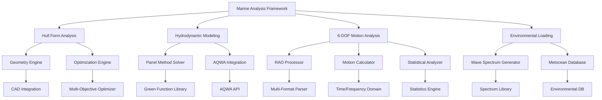

# Marine Analysis Epic - Implementation Details

## Epic Overview

**Epic ID**: EPIC-2025-MA-001  
**Title**: Marine Analysis for Ship Design and Dynamic Analysis  
**Status**: Active 🚧  
**Timeline**: 12 months (Q1-Q4 2025)  
**Total Effort**: 152 development days

## Epic Scope and Objectives

### Primary Objectives
1. **Ship Design Analysis Foundation**: Establish comprehensive hull form analysis and optimization capabilities
2. **Hydrodynamic Modeling Framework**: Implement advanced wave-structure interaction analysis
3. **6-DOF Motion Analysis**: Develop complete vessel motion prediction system
4. **Environmental Integration**: Create comprehensive environmental loading framework
5. **Industry Integration**: Seamless integration with ANSYS AQWA and OrcaFlex
6. **Regulatory Compliance**: Automated compliance checking and reporting

### Business Value Proposition
- **Market Impact**: Enable $100M+ marine vessel design projects
- **Technical Differentiation**: Integrated workflow from design to analysis
- **Competitive Advantage**: Single-source-of-truth approach with YAML configuration
- **Industry Adoption**: Target 5+ marine engineering firms within first year

## Epic Phases and Features

### Phase 1: Ship Design Analysis Foundation (Q1 2025)
**Duration**: 3 months | **Effort**: 50 development days

#### Feature 1.1: Hull Form Analysis and Optimization
**User Stories**: 5 stories | **Effort**: 20 days
- US-001: Hull geometry parameterization and generation
- US-002: Resistance calculation using empirical and CFD methods
- US-003: Hull form optimization for minimum resistance
- US-004: Seakeeping analysis for motion performance
- US-005: Stability calculations and regulatory compliance

**Technical Implementation**:
- Parametric hull form generation system
- Multi-method resistance analysis (Holtrop, Series 60, CFD)
- Multi-objective optimization with genetic algorithms
- Strip theory integration for preliminary seakeeping
- IMO stability regulation compliance checking

#### Feature 1.2: Hydrodynamic Modeling Framework
**User Stories**: 4 stories | **Effort**: 18 days
- US-006: Panel method implementation for potential flow analysis
- US-007: Diffraction and radiation problem setup
- US-008: Wave-structure interaction modeling
- US-009: Integration with ANSYS AQWA for validation

**Technical Implementation**:
- 3D panel method solver with adaptive mesh refinement
- Green's function computation for infinite and finite depth
- Boundary integral equation solver with iterative methods
- AQWA input/output file generation and parsing

#### Feature 1.3: Environmental Loading Analysis
**User Stories**: 3 stories | **Effort**: 12 days
- US-010: Wave spectrum modeling (JONSWAP, Pierson-Moskowitz)
- US-011: Wind and current loading calculations
- US-012: Environmental criteria definition and management

**Technical Implementation**:
- Comprehensive wave spectrum library
- API RP 2A and DNV wind loading methodologies
- Metocean data integration and processing
- Extreme condition analysis with return period calculations

### Phase 2: Dynamic Analysis Capabilities (Q2 2025)
**Duration**: 3 months | **Effort**: 60 development days

#### Feature 2.1: 6-DOF Motion Analysis
**User Stories**: 6 stories | **Effort**: 25 days
- US-013: RAO data integration and processing
- US-014: Frequency domain motion analysis
- US-015: Time domain motion simulation
- US-016: Motion criteria assessment and operability
- US-017: Advanced statistical analysis
- US-018: Visualization and results export

**Technical Implementation**:
- Multi-source RAO data processing (AQWA, OrcaFlex, experimental)
- Response spectral density calculations
- Irregular wave time series generation with phase randomization
- Standard motion criteria implementation (ISO, DNV, ABS)
- Comprehensive statistical post-processing

#### Feature 2.2: Structural Response Integration
**User Stories**: 4 stories | **Effort**: 20 days
- US-019: Global structural analysis framework
- US-020: Local stress analysis integration
- US-021: Fatigue analysis for dynamic loading
- US-022: Structural optimization integration

**Technical Implementation**:
- Hull girder moment calculation from vessel motions
- Hot spot stress methodology for critical areas
- S-N curve database and rainflow counting
- Multi-disciplinary optimization framework

#### Feature 2.3: Mooring and Positioning Systems
**User Stories**: 3 stories | **Effort**: 15 days
- US-023: Mooring line dynamics analysis
- US-024: Dynamic positioning system modeling
- US-025: Station-keeping performance assessment

**Technical Implementation**:
- Catenary and taut mooring line analysis
- Thruster force allocation algorithms
- Anchor capacity and soil interaction modeling

### Phase 3: Advanced Analysis and Integration (Q3-Q4 2025)
**Duration**: 6 months | **Effort**: 67 development days

#### Feature 3.1: Multi-Body Analysis
**User Stories**: 4 stories | **Effort**: 30 days
- US-026: Multi-body hydrodynamic interaction
- US-027: Connector and fender modeling
- US-028: Marine installation analysis
- US-029: Side-by-side operations modeling

**Technical Implementation**:
- Multiple floating body interaction modeling
- Fender force-compression relationship modeling
- Heavy lift installation simulation
- Relative motion analysis for offloading operations

#### Feature 3.2: Real-Time Analysis and Optimization
**User Stories**: 4 stories | **Effort**: 22 days
- US-030: Real-time motion monitoring integration
- US-031: Adaptive analysis based on sea conditions
- US-032: Design optimization algorithms
- US-033: Machine learning integration

**Technical Implementation**:
- Live sensor data integration (IMU, GPS)
- Kalman filtering for motion estimation
- Multi-objective optimization with Pareto frontiers
- Neural network models for motion prediction

#### Feature 3.3: Regulatory Compliance and Reporting
**User Stories**: 3 stories | **Effort**: 15 days
- US-034: Automated compliance checking
- US-035: Standardized reporting templates
- US-036: Certification document generation

**Technical Implementation**:
- IMO and classification society rule verification
- Automated report generation with regulatory templates
- Digital signature integration for certifications

## Integration Architecture

### Core System Integration


### External Software Integration
- **ANSYS AQWA**: Hydrodynamic analysis validation and benchmarking
- **OrcaFlex**: Dynamic analysis integration and result comparison
- **CAD Systems**: Geometry import from SolidWorks, Rhino, AutoCAD
- **Databases**: Vessel libraries, regulatory standards, environmental data

## Quality Assurance Framework

### Validation Strategy
1. **Experimental Validation**: Comparison with model test data from MARIN, HSVA
2. **Numerical Benchmarking**: Validation against ANSYS AQWA, OrcaFlex results
3. **Industry Standards**: Compliance with DNV, ABS, Lloyd's Register requirements
4. **Code Verification**: Method of manufactured solutions for numerical accuracy

### Performance Requirements
- **Analysis Speed**: Standard vessel analysis &lt;2 hours
- **Memory Efficiency**: Large mesh models (&gt;100k panels) handled effectively
- **Accuracy**: &lt;5% deviation from experimental data for standard cases
- **Reliability**: &gt;99% uptime for analysis services

### Testing Framework
```python
class EpicValidationFramework:
    """Comprehensive validation for marine analysis epic."""
    
    def __init__(self):
        self.benchmark_cases = BenchmarkDatabase()
        self.experimental_data = ExperimentalDataLibrary()
        
    def validate_epic_implementation(self) -> EpicValidationReport:
        """Validate complete epic implementation."""
        
        validation_results = {}
        
        # Phase 1 validation
        validation_results['hull_analysis'] = self.validate_hull_analysis()
        validation_results['hydrodynamics'] = self.validate_hydrodynamic_modeling()
        validation_results['environmental'] = self.validate_environmental_loading()
        
        # Phase 2 validation
        validation_results['motion_analysis'] = self.validate_motion_analysis()
        validation_results['structural'] = self.validate_structural_integration()
        validation_results['positioning'] = self.validate_positioning_systems()
        
        # Phase 3 validation
        validation_results['multi_body'] = self.validate_multi_body_analysis()
        validation_results['optimization'] = self.validate_optimization_framework()
        validation_results['compliance'] = self.validate_regulatory_compliance()
        
        return EpicValidationReport(validation_results)
```

## Risk Management

### Technical Risks
1. **Integration Complexity**: ANSYS AQWA and OrcaFlex integration challenges
   - **Mitigation**: Early prototyping and vendor collaboration
   - **Contingency**: Fallback to file-based integration

2. **Performance Requirements**: Large vessel model computational demands
   - **Mitigation**: Parallel processing and algorithm optimization
   - **Contingency**: Cloud computing resources for heavy computations

3. **Validation Accuracy**: Meeting 5% accuracy requirement
   - **Mitigation**: Extensive experimental validation program
   - **Contingency**: Relaxed accuracy for preliminary design phase

### Schedule Risks
1. **Resource Availability**: Specialized marine engineering expertise
   - **Mitigation**: Early team recruitment and external consultants
   - **Contingency**: Phased delivery with reduced scope

2. **Integration Timeline**: Complex system integration requirements
   - **Mitigation**: Continuous integration approach with regular testing
   - **Contingency**: Manual integration processes as fallback

## Success Metrics

### Technical Success Criteria
- [ ] All phases implemented with acceptance criteria validation
- [ ] Hydrodynamic analysis accuracy &lt;5% vs experimental data
- [ ] Motion analysis producing realistic vessel responses
- [ ] Integration with ANSYS AQWA and OrcaFlex operational
- [ ] Real-time analysis capabilities for standard vessels
- [ ] Regulatory compliance reporting automated

### Business Success Criteria
- [ ] Market adoption by 5+ marine engineering firms
- [ ] Customer satisfaction &gt;90% scores
- [ ] Revenue impact: $5M opportunities enabled
- [ ] Competitive advantage in integrated analysis capabilities

### Performance Success Criteria
- [ ] Analysis speed: Parametric studies &lt;4 hours
- [ ] Memory efficiency: Large models handled effectively
- [ ] System reliability: &gt;99% uptime
- [ ] User productivity: 50% time reduction vs manual methods

## Implementation Timeline

### Q1 2025: Foundation Phase
- **Month 1**: Hull form analysis and resistance calculations
- **Month 2**: Hydrodynamic modeling and AQWA integration
- **Month 3**: Environmental loading and validation

### Q2 2025: Dynamic Analysis Phase
- **Month 4**: 6-DOF motion analysis implementation
- **Month 5**: Structural response integration
- **Month 6**: Mooring and positioning systems

### Q3-Q4 2025: Advanced Features Phase
- **Month 7-8**: Multi-body analysis capabilities
- **Month 9-10**: Real-time analysis and optimization
- **Month 11-12**: Regulatory compliance and deployment

## User Acceptance Criteria

### Marine Engineer Acceptance
- [ ] Intuitive workflow from vessel geometry to motion analysis
- [ ] Comprehensive validation reports for project documentation
- [ ] Seamless integration with existing marine engineering tools
- [ ] Professional-grade visualization and results presentation

### Naval Architect Acceptance
- [ ] Hull form optimization with regulatory constraint handling
- [ ] Accurate seakeeping and stability analysis
- [ ] Parametric study capabilities for design exploration
- [ ] Export capabilities to CAD and structural analysis tools

### FPSO Designer Acceptance
- [ ] Dynamic positioning and mooring system analysis
- [ ] Multi-body interaction for offloading operations
- [ ] Environmental operability assessment
- [ ] Fatigue analysis for dynamic loading conditions

## Continuous Improvement Framework

### Feedback Integration
- Regular user feedback sessions with marine engineers
- Industry conference presentations for validation
- Academic collaboration for research integration
- Regulatory body engagement for compliance verification

### Technology Evolution
- Machine learning integration for performance prediction
- Cloud computing adoption for large-scale analysis
- Digital twin integration for operational monitoring
- Blockchain integration for certification management

---

*This epic implementation provides the comprehensive foundation for sophisticated marine analysis capabilities with industry-leading accuracy and regulatory compliance.*