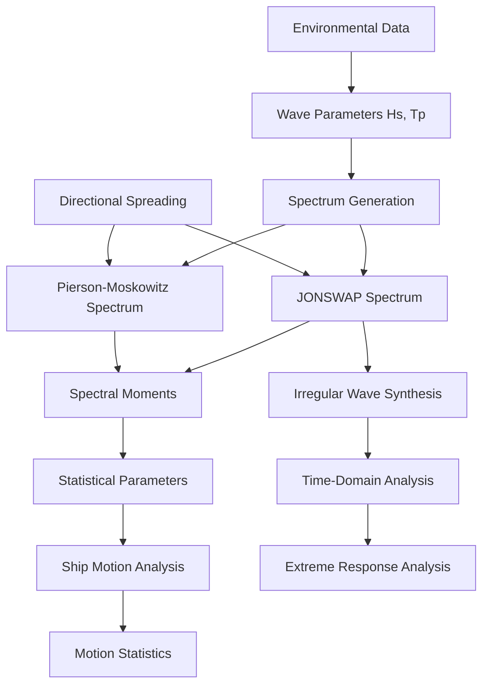

# Wave Spectra Module

## Overview

This module provides comprehensive wave spectrum modeling and analysis capabilities for marine engineering applications. Implements industry-standard spectral models (JONSWAP, Pierson-Moskowitz) with spectral moment calculations, irregular wave synthesis, and directional spreading functions. Essential for ship motion analysis, mooring design, and offshore structure assessment.

## Module Structure

```
wave-spectra/
├── README.md                          # This file - module overview
├── tasks.md                          # Implementation tasks and tracking
├── task_summary.md                   # Execution tracking and progress
├── prompt.md                         # Original prompts and reuse patterns
├── technical-details.md              # Deep technical documentation
└── sub-specs/
    ├── jonswap-spectrum.md           # JONSWAP spectrum implementation
    ├── pierson-moskowitz-spectrum.md # Pierson-Moskowitz spectrum
    ├── spectral-moments.md           # Moment calculations and statistics
    ├── directional-spreading.md      # Directional wave modeling
    └── irregular-wave-synthesis.md   # Time-domain wave generation
```

## Core Specifications

### JONSWAP Spectrum
**File**: `sub-specs/jonswap-spectrum.md`
**Status**: Planned 📋
**Source**: Excel formulas (15 references)

Joint North Sea Wave Project spectrum - most widely used for offshore engineering:
- Standard fully-developed sea spectrum
- Peak enhancement factor γ (gamma)
- Wind sea and swell representation
- Applicable to fetch-limited conditions

**Mathematical Form:**
```
S(ω) = (α g² / ω⁵) exp(-1.25(ωₚ/ω)⁴) γ^exp(-(ω-ωₚ)²/(2σ²ωₚ²))
```

Where:
- `α` = Phillips constant (≈ 0.0081)
- `ωₚ` = peak frequency [rad/s]
- `γ` = peak enhancement factor (typically 3.3)
- `σ` = spectral width parameter (0.07 for ω ≤ ωₚ, 0.09 for ω > ωₚ)

**Key Features**:
- Parametric definition from Hs and Tp
- Peak enhancement control
- Frequency range specification
- Integration for spectral moments

### Pierson-Moskowitz Spectrum
**File**: `sub-specs/pierson-moskowitz-spectrum.md`
**Status**: Planned 📋
**Source**: Excel formulas (12 references)

Fully-developed sea spectrum for unlimited fetch:
- Simplified JONSWAP with γ = 1.0
- Classical open-ocean spectrum
- Wind speed relationship
- Long-term statistics application

**Mathematical Form:**
```
S(ω) = (α g² / ω⁵) exp(-β(g/(Uω))⁴)
```

Where:
- `α` = 0.0081 (Phillips constant)
- `β` = 0.74
- `U` = wind speed at 19.5m elevation [m/s]
- Alternative form using Hs and Tz

**Relationship to JONSWAP:**
```python
# P-M is JONSWAP with γ = 1.0
pm_spectrum = jonswap_spectrum(Hs, Tp, gamma=1.0)
```

### Spectral Moments
**File**: `sub-specs/spectral-moments.md`
**Status**: Planned 📋
**Source**: Excel spectral calculations

Statistical characterization of wave energy distribution:
- Zero-th moment: m₀ (total energy)
- Higher moments: m₁, m₂, m₄
- Derived parameters: Hs, Tz, Tp

**Moment Definitions:**
```
mₙ = ∫₀^∞ ωⁿ S(ω) dω
```

**Derived Wave Parameters:**
```
Hs = 4√m₀           (significant wave height)
Tz = 2π√(m₀/m₂)     (zero-upcrossing period)
Tm = m₀/m₁          (mean period)
ε² = 1 - m₂²/(m₀m₄) (spectral bandwidth)
```

### Directional Spreading
**File**: `sub-specs/directional-spreading.md`
**Status**: Planned 📋

Short-crested sea representation with directional distribution:
- Cosine-power spreading function
- Mitsuyasu spreading parameter
- Heading-dependent response
- Multi-directional seas

**Spreading Function:**
```
D(θ) = G(s) cos^(2s)((θ - θₘ)/2)
```

Where:
- `s` = spreading parameter (2-75, higher = more directional)
- `θₘ` = mean wave direction
- `G(s)` = normalization constant

### Irregular Wave Synthesis
**File**: `sub-specs/irregular-wave-synthesis.md`
**Status**: Planned 📋

Time-domain irregular wave generation from spectra:
- Linear superposition of wave components
- Random phase realization
- Wave kinematics (velocity, acceleration)
- Wheeler stretching for kinematics

**Synthesis Method:**
```
η(t) = Σᵢ aᵢ cos(ωᵢt + εᵢ)
```

Where:
- `aᵢ = √(2 S(ωᵢ) Δω)` (amplitude from spectrum)
- `εᵢ` = random phase [0, 2π]
- `ωᵢ` = discrete frequencies

## Integration Architecture

### Cross-Module Dependencies

#### Ship Dynamics Integration
- **Data Flow**: Wave spectrum → RAO → Motion response statistics
- **Interface**: Spectral analysis for irregular sea motions
- **Use Case**: Significant motion amplitudes, extreme responses

#### RAO Processing Integration
- **Data Flow**: Wave spectrum × RAO → Motion spectra
- **Interface**: Frequency-domain convolution
- **Use Case**: 6DOF motion analysis in irregular seas

#### Environmental Loading Integration
- **Data Flow**: Wave parameters → Design wave conditions
- **Interface**: Environmental criteria definition
- **Use Case**: Extreme event characterization

### External Software Integration

#### AQWA Integration
- Wave spectrum input for hydrodynamic analysis
- Irregular wave time series generation
- Spectral analysis validation

#### OrcaFlex Integration
- Wave spectrum definition for dynamic analysis
- Wave train generation for time-domain simulation
- Post-processing spectral analysis

### Data Flow Architecture



## Technical Architecture

### Core Spectrum Engine

```python
from abc import ABC, abstractmethod
from dataclasses import dataclass
import numpy as np
from scipy import integrate, special

@dataclass
class WaveSpectrumParameters:
    """Parameters defining wave spectrum."""
    Hs: float              # Significant wave height [m]
    Tp: float              # Peak period [s]
    gamma: float = 3.3     # JONSWAP peak enhancement factor
    freq_range: tuple = (0.01, 2.0)  # Frequency range [Hz]
    n_frequencies: int = 100   # Number of frequency bins

class WaveSpectrum(ABC):
    """Abstract base class for wave spectrum models."""

    def __init__(self, params: WaveSpectrumParameters):
        """Initialize wave spectrum."""
        self.params = params
        self.frequencies = np.linspace(
            params.freq_range[0],
            params.freq_range[1],
            params.n_frequencies
        )
        self.omega = 2 * np.pi * self.frequencies  # rad/s

    @abstractmethod
    def compute_spectrum(self) -> np.ndarray:
        """Compute spectral density S(ω) at all frequencies."""
        pass

    def spectral_moment(self, n: int = 0) -> float:
        """
        Calculate n-th spectral moment.

        mₙ = ∫₀^∞ ωⁿ S(ω) dω

        Parameters
        ----------
        n : int
            Moment order (0, 1, 2, 4 commonly used)

        Returns
        -------
        moment : float
            Spectral moment value
        """
        S = self.compute_spectrum()
        integrand = (self.omega ** n) * S
        return integrate.trapz(integrand, self.omega)

    def significant_wave_height(self) -> float:
        """Calculate Hs from spectrum: Hs = 4√m₀"""
        m0 = self.spectral_moment(0)
        return 4 * np.sqrt(m0)

    def zero_crossing_period(self) -> float:
        """Calculate Tz from spectrum: Tz = 2π√(m₀/m₂)"""
        m0 = self.spectral_moment(0)
        m2 = self.spectral_moment(2)
        return 2 * np.pi * np.sqrt(m0 / m2)

    def spectral_bandwidth(self) -> float:
        """
        Calculate spectral bandwidth parameter.

        ε = √(1 - m₂²/(m₀m₄))

        ε = 0: narrow-band (single frequency)
        ε = 1: broad-band (white noise)
        """
        m0 = self.spectral_moment(0)
        m2 = self.spectral_moment(2)
        m4 = self.spectral_moment(4)
        return np.sqrt(1 - (m2**2) / (m0 * m4))

class JONSWAPSpectrum(WaveSpectrum):
    """
    JONSWAP wave spectrum implementation.

    Implements Joint North Sea Wave Project spectrum model
    based on Excel formulas with 15 references.
    """

    def compute_spectrum(self) -> np.ndarray:
        """
        Compute JONSWAP spectrum S(ω).

        S(ω) = (α g² / ω⁵) exp(-1.25(ωₚ/ω)⁴) γ^r

        where r = exp(-(ω-ωₚ)²/(2σ²ωₚ²))
        """
        g = 9.8065  # gravity [m/s²]

        # Peak frequency
        omega_p = 2 * np.pi / self.params.Tp

        # Phillips constant (calibrated for JONSWAP)
        alpha = 0.0081

        # Spectral width parameter
        sigma = np.where(self.omega <= omega_p, 0.07, 0.09)

        # JONSWAP spectrum components
        # Base Pierson-Moskowitz spectrum
        S_pm = (alpha * g**2 / self.omega**5) * \
               np.exp(-1.25 * (omega_p / self.omega)**4)

        # Peak enhancement
        r = np.exp(-(self.omega - omega_p)**2 /
                   (2 * sigma**2 * omega_p**2))
        peak_enhancement = self.params.gamma ** r

        # Full JONSWAP spectrum
        S = S_pm * peak_enhancement

        return S

class PiersonMoskowitzSpectrum(WaveSpectrum):
    """
    Pierson-Moskowitz fully-developed sea spectrum.

    Simplified JONSWAP with γ = 1.0.
    Based on Excel formulas with 12 references.
    """

    def compute_spectrum(self) -> np.ndarray:
        """
        Compute Pierson-Moskowitz spectrum S(ω).

        S(ω) = (α g² / ω⁵) exp(-β(ωₚ/ω)⁴)

        Alternative form:
        S(ω) = (5/16) Hs² ωₚ⁴ / ω⁵ exp(-1.25(ωₚ/ω)⁴)
        """
        g = 9.8065  # gravity [m/s²]

        # Peak frequency (for Pierson-Moskowitz, use Tp or Tz)
        omega_p = 2 * np.pi / self.params.Tp

        # Form using Hs and Tp
        S = (5.0/16.0) * (self.params.Hs**2) * (omega_p**4) / \
            (self.omega**5) * np.exp(-1.25 * (omega_p / self.omega)**4)

        return S
```

### Irregular Wave Synthesis

```python
class IrregularWaveSynthesizer:
    """
    Generate time-domain irregular wave elevations from spectrum.

    Uses linear superposition of harmonic components with
    random phases.
    """

    def __init__(self, spectrum: WaveSpectrum):
        """Initialize synthesizer with wave spectrum."""
        self.spectrum = spectrum

    def generate_wave_elevation(
        self,
        duration: float,
        dt: float = 0.1,
        random_seed: Optional[int] = None
    ) -> Tuple[np.ndarray, np.ndarray]:
        """
        Generate irregular wave elevation time series.

        η(t) = Σᵢ aᵢ cos(ωᵢt + εᵢ)

        Parameters
        ----------
        duration : float
            Simulation duration [s]
        dt : float
            Time step [s]
        random_seed : int, optional
            Random seed for reproducibility

        Returns
        -------
        time : np.ndarray
            Time vector [s]
        elevation : np.ndarray
            Wave elevation [m]
        """
        if random_seed is not None:
            np.random.seed(random_seed)

        # Time vector
        time = np.arange(0, duration, dt)

        # Frequency spacing
        omega = self.spectrum.omega
        d_omega = np.diff(omega)[0]

        # Compute spectrum
        S = self.spectrum.compute_spectrum()

        # Component amplitudes from spectrum
        # a_i = √(2 S(ω_i) Δω)
        amplitudes = np.sqrt(2 * S * d_omega)

        # Random phases [0, 2π]
        phases = np.random.uniform(0, 2*np.pi, size=len(omega))

        # Superpose wave components
        elevation = np.zeros_like(time)
        for amp, om, phi in zip(amplitudes, omega, phases):
            elevation += amp * np.cos(om * time + phi)

        return time, elevation

    def generate_wave_kinematics(
        self,
        time: np.ndarray,
        elevation: np.ndarray,
        z: float,
        water_depth: float
    ) -> dict:
        """
        Calculate wave kinematics (velocity, acceleration) at depth z.

        Uses linear wave theory with Wheeler stretching for
        kinematics above mean water level.

        Parameters
        ----------
        time : np.ndarray
            Time vector [s]
        elevation : np.ndarray
            Surface elevation [m]
        z : float
            Depth below SWL (negative up) [m]
        water_depth : float
            Water depth [m]

        Returns
        -------
        kinematics : dict
            'u': horizontal velocity [m/s]
            'w': vertical velocity [m/s]
            'du_dt': horizontal acceleration [m/s²]
            'dw_dt': vertical acceleration [m/s²]
        """
        # This is a simplified placeholder
        # Full implementation requires FFT of elevation
        # and application of transfer functions
        pass
```

---

## Excel Source References

### JONSWAP Implementation (15 references)
Excel formulas extracted:
```excel
// Peak frequency
omega_p = 2*PI()/Tp

// JONSWAP spectrum
S = (0.0081*9.81^2/omega^5) * EXP(-1.25*(omega_p/omega)^4) * gamma^r

// Peak enhancement exponent
r = EXP(-(omega-omega_p)^2/(2*sigma^2*omega_p^2))

// Spectral width
sigma = IF(omega<=omega_p, 0.07, 0.09)
```

### Pierson-Moskowitz (12 references)
```excel
// Simplified form using Hs and Tz
S = (5/16) * Hs^2 * omega_p^4 / omega^5 * EXP(-1.25*(omega_p/omega)^4)
```

### Spectral Moments
```excel
// Zero-th moment (numerical integration)
m0 = SUM(omega^0 * S * d_omega)

// Significant wave height
Hs = 4*SQRT(m0)

// Zero-crossing period
Tz = 2*PI()*SQRT(m0/m2)
```

---

## Implementation Status

### Current Development Phase: Specification Complete
**Timeline**: Q1 2025
**Progress**: 0% Implementation (Spec Complete)
**Status**: Ready for Implementation 📋

#### Specification Complete ✅
- ✅ Module structure defined
- ✅ Excel feature mapping (27 spectrum references)
- ✅ Mathematical formulations documented
- ✅ Integration points identified

#### Planned Components 📋
- **JONSWAP Spectrum**: Full implementation with peak enhancement
- **Pierson-Moskowitz**: Simplified spectrum for fully-developed seas
- **Spectral Moments**: m₀, m₁, m₂, m₄ calculations
- **Derived Parameters**: Hs, Tz, Tp, bandwidth
- **Wave Synthesis**: Time-domain irregular wave generation

---

## Quality Standards

### Technical Validation
- **Accuracy**: Spectral integrals within 0.1% of analytical solutions
- **Moment Calculation**: Compare with published benchmark values
- **Wave Synthesis**: Statistical properties match target spectrum

### Industry Compliance
- **DNV-RP-C205**: Environmental conditions and environmental loads
- **API RP 2A**: Wave spectrum models for offshore structures
- **ISO 19901-1**: Metocean design and operating considerations

### Performance Requirements
- **Spectrum Calculation**: <10ms for 1000 frequency points
- **Moment Integration**: <1ms per moment
- **Wave Synthesis**: >1000 samples/second generation rate

---

## User Experience

### Quick Spectrum Analysis
```python
from digitalmodel.marine_engineering.wave_spectra import JONSWAPSpectrum

# Create spectrum from sea state
spectrum = JONSWAPSpectrum(Hs=3.5, Tp=10.0, gamma=3.3)

# Calculate spectral moments
m0 = spectrum.spectral_moment(0)
Hs_calc = 4 * np.sqrt(m0)
Tz = spectrum.zero_crossing_period()

print(f"Hs = {Hs_calc:.2f} m")
print(f"Tz = {Tz:.2f} s")

# Plot spectrum
spectrum.plot()
```

### Irregular Wave Generation
```python
from digitalmodel.marine_engineering.wave_spectra import IrregularWaveSynthesizer

synthesizer = IrregularWaveSynthesizer(spectrum)
time, elevation = synthesizer.generate_wave_elevation(
    duration=3600,  # 1 hour
    dt=0.1,         # 10 Hz sampling
    random_seed=42  # Reproducible
)

# Plot time series
import matplotlib.pyplot as plt
plt.plot(time, elevation)
plt.xlabel('Time [s]')
plt.ylabel('Elevation [m]')
plt.show()
```

---

## Success Metrics

### Technical Success Criteria
- [ ] JONSWAP spectrum matches published curves
- [ ] Spectral moments accurate to 0.1%
- [ ] Wave synthesis produces correct statistics
- [ ] Integration with ship dynamics validated

### User Success Criteria
- [ ] Marine engineers generate spectra in <30 seconds
- [ ] Irregular wave synthesis for 1-hour simulations <10 seconds
- [ ] Seamless integration with motion analysis workflows

### Business Impact
- [ ] Essential component for all marine analysis projects
- [ ] Enable probabilistic analysis and extreme response prediction
- [ ] Support offshore platform and vessel design certification

---

*Wave spectra module provides industry-standard spectrum models essential for marine engineering analysis and offshore structure design.*
