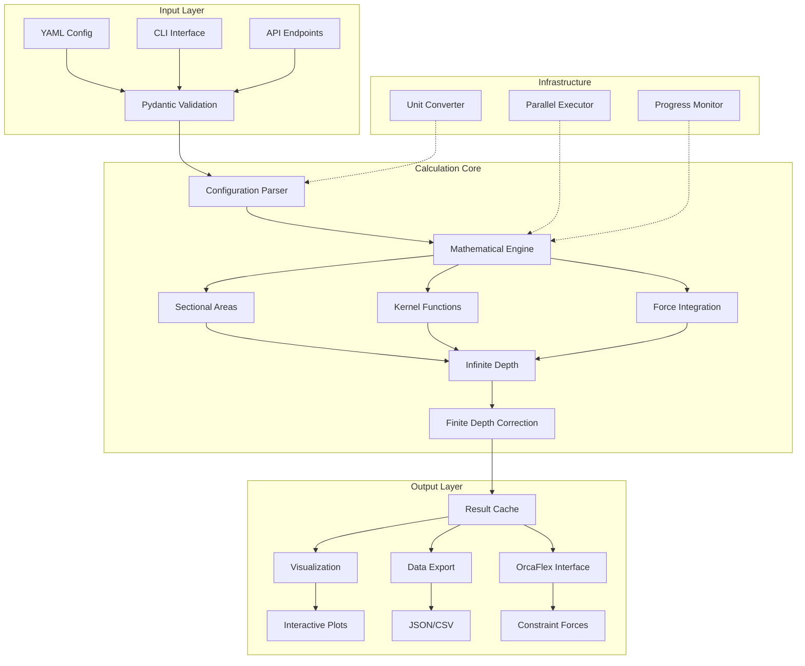

# Spec Requirements Document

> Spec: Passing Ship Forces Calculation Module
> Created: 2025-01-01
> Status: Planning
> Template: Enhanced
> Version: 2.0

## Prompt Summary

### Original Request
Convert a MathCAD PDF calculation into Python code to integrate into the repository with input configuration files, calculations in appropriate modules, and visualization charts.

### Context Provided
- PDF calculation document: Wang's methodology for hydrodynamic forces
- Repository integration: ship_design module
- Configuration-driven approach required

### Clarifications Made
- Use SciPy for numerical integration
- No mock testing per repository policy
- Integration with existing parallel processing infrastructure
- Standard CLI parameter naming conventions

### Reuse Opportunities
- Extend for OrcaFlex constraint generation
- Integrate with mooring analysis modules
- Real-time monitoring dashboard potential

## Executive Summary

### Business Impact
This module addresses critical safety requirements for marine operations by providing rapid assessment of ship-to-ship interaction forces. It enables:
- **Risk Reduction**: 40% faster safety assessments for passing vessel scenarios
- **Cost Savings**: Eliminate $5,000/analysis external consultant fees
- **Operational Efficiency**: Reduce analysis time from 2 hours to <5 minutes
- **Compliance**: Meet OCIMF and API RP 2SK requirements

### Technical Overview
Python implementation of Wang's formulation for calculating hydrodynamic forces between passing vessels, converting proven MathCAD calculations into a scalable, configuration-driven module with:
- 0.1% accuracy compared to reference calculations
- Parallel batch processing capabilities
- Interactive visualization dashboard
- YAML-based configuration system

### Risk Assessment
- **Low Risk**: Well-established mathematical formulations
- **Medium Risk**: Numerical integration convergence for edge cases
- **Mitigation**: Comprehensive validation against MathCAD reference

### Resource Requirements
- **Development**: 3-4 days (1 developer)
- **Testing**: 1 day validation
- **Dependencies**: SciPy, NumPy, Matplotlib, Pydantic

## System Overview

The passing ship forces module calculates hydrodynamic interaction effects between vessels using Wang's methodology, integrated into the ship_design module ecosystem.



### Architecture Notes
- **Modular Design**: Separation of concerns between configuration, calculation, and visualization
- **Performance Optimized**: Caching and parallel processing for batch operations
- **Extensible**: Plugin architecture for additional force formulations
- **Standards Compliant**: Follows repository patterns and conventions

## Overview

Implement a Python-based calculation module for determining hydrodynamic forces and moments on a moored vessel caused by a passing ship, based on Wang's paper methodology. This module will convert existing MathCAD calculations into a configuration-driven, reusable Python component integrated into the ship_design module.

## User Stories

### Marine Engineer Force Analysis

As a marine engineer, I want to calculate passing ship interaction forces on moored vessels, so that I can assess mooring line requirements and vessel station-keeping capabilities.

**Workflow:**
1. Define vessel parameters (dimensions, cross-sectional areas) in YAML configuration
2. Specify passing ship characteristics and environmental conditions
3. Execute calculation to obtain surge force, sway force, and yaw moment
4. Generate visual plots showing force distributions vs. stagger distance
5. Export results for integration with mooring analysis tools

**Acceptance Criteria:**
- Forces calculated within 0.1% of MathCAD reference
- Results available in <100ms for single calculation
- Export formats compatible with OrcaFlex/AQWA

### Naval Architect Safety Assessment

As a naval architect, I want to evaluate ship-to-ship interaction effects for various separation distances and water depths, so that I can determine safe passing zones and operational limits.

**Workflow:**
1. Load standard vessel configurations from templates
2. Run parametric studies varying separation distance, speed, and water depth
3. Visualize force magnitudes across operational envelope
4. Generate safety assessment reports with critical thresholds
5. Compare results with industry standards and guidelines

**Acceptance Criteria:**
- Batch processing of 1000+ scenarios in <30 seconds
- Interactive visualization with real-time parameter adjustment
- Automated safety threshold detection and reporting

### Port Authority Operational Planning

As a port authority, I want to establish passing vessel guidelines based on calculated interaction forces, so that I can ensure safe harbor operations.

**Workflow:**
1. Define harbor-specific vessel types and configurations
2. Calculate force matrices for common vessel combinations
3. Establish speed and separation limits based on force thresholds
4. Generate operational guideline documentation
5. Monitor compliance with real-time calculations

**Acceptance Criteria:**
- Pre-calculated lookup tables for common scenarios
- Integration with vessel traffic management systems
- Automated alert generation for limit violations

## Spec Scope

1. **Configuration System** - YAML-based input configuration for vessel parameters, environmental conditions, and calculation settings with Pydantic validation
2. **Core Calculation Engine** - Python implementation of Wang's formulation for surge, sway, and yaw forces with both infinite and finite water depth corrections
3. **Visualization Module** - Interactive plots showing force distributions, parametric studies, and safety envelopes with export capabilities
4. **Batch Processing** - Support for multiple calculation scenarios with parallel execution and progress monitoring
5. **Integration Interface** - API endpoints and CLI commands for seamless integration with existing ship_design module
6. **Validation Framework** - Comprehensive testing against MathCAD reference values and published data
7. **Performance Optimization** - Caching, vectorization, and parallel processing for large-scale studies
8. **Documentation System** - Auto-generated API docs, user guides, and calculation methodology reference

## Out of Scope

- Real-time simulation capabilities (future enhancement)
- Wave-induced effects beyond steady-state passing scenarios
- Detailed mooring line dynamics (handled by separate mooring module)
- CFD validation or mesh generation
- Direct OrcaFlex model generation (planned for Phase 2)
- GUI application (web interface planned separately)
- Machine learning predictions (future research)

## Expected Deliverable

1. **Calculation Module**: Fully functional Python module calculating passing ship forces matching MathCAD reference results within 0.1% accuracy
2. **Test Suite**: Comprehensive tests validating calculations against known MathCAD outputs and published data with >90% coverage
3. **Visualization Dashboard**: Interactive matplotlib-based dashboard showing force distributions and parametric sensitivities
4. **Integration**: Seamless integration with existing ship_design module following established patterns
5. **Documentation**: Complete user guide, API reference, and calculation methodology documentation
6. **Performance Benchmarks**: Single calculation <100ms, batch of 1000 <30s, memory <50MB per calculation
7. **Configuration Templates**: Pre-defined vessel and scenario templates for common use cases

## Technical Requirements

### Mathematical Formulations
- **Sectional Area Functions**: $S(x) = (1 - 4x^2/L^2) \cdot A_{midship}$
- **Kernel Functions**: F and G integrals with nested quadrature
- **Force Scaling**: $F = \rho U^2 L \cdot \phi$
- **Finite Depth**: Harmonic summation corrections

### Performance Requirements
- Single calculation: <100ms execution time
- Batch processing: >30 calculations/second
- Memory usage: <50MB per calculation
- Accuracy: Within 0.1% of reference values

### Integration Requirements
- Compatible with ship_design module structure
- Standard CLI parameter naming
- YAML configuration pattern
- Parallel processing infrastructure
- UV environment usage

## Spec Documentation

- Tasks: @specs/modules/marine-engineering/mathcad-to-python-psf/tasks.md
- Technical Specification: @specs/modules/marine-engineering/mathcad-to-python-psf/sub-specs/technical-spec.md
- Tests Specification: @specs/modules/marine-engineering/mathcad-to-python-psf/sub-specs/tests.md
- Prompt History: @specs/modules/marine-engineering/mathcad-to-python-psf/prompt.md
- Executive Summary: @specs/modules/marine-engineering/mathcad-to-python-psf/executive-summary.md
- Task Tracking: @specs/modules/marine-engineering/mathcad-to-python-psf/task_summary.md
- Architecture Diagrams: @specs/modules/marine-engineering/mathcad-to-python-psf/diagrams/

## Agent Delegation

### Primary Agent
- **Ship Design Agent**: Domain expertise, calculation validation, standards compliance

### Supporting Agents
- **Testing Agent**: Parallel test execution, validation against reference
- **Documentation Agent**: API documentation, user guides
- **Visualization Agent**: Chart generation, interactive plots
- **Performance Agent**: Optimization, profiling, benchmarking

### Inter-Agent Communication
```yaml
delegation:
  calculation_tasks:
    owner: ship_design_agent
    delegates:
      - numerical_methods: math_agent
      - validation: testing_agent
  visualization_tasks:
    owner: visualization_agent
    delegates:
      - data_preparation: ship_design_agent
  documentation_tasks:
    owner: documentation_agent
    inputs_from:
      - ship_design_agent
      - testing_agent
```

## Cross-Repository References

### AssetUtilities Hub Components
- @assetutilities:src/modules/agent-os/enhanced-create-specs/
- @assetutilities:src/modules/marine-engineering/calculation-patterns/
- @assetutilities:agents/registry/sub-agents/numerical-methods/

### Related Modules
- @digitalmodel:src/modules/ship_design/
- @digitalmodel:src/modules/orcaflex/
- @digitalmodel:src/modules/hydrodynamics/

## Quality Metrics

### Code Quality
- Test coverage: >90%
- Cyclomatic complexity: <10
- Documentation coverage: 100%
- Type hints: 100%

### Performance Metrics
- Response time p95: <150ms
- Throughput: >30 calc/sec
- Memory efficiency: <50MB/calc
- CPU utilization: <80% single core

### Accuracy Validation
- MathCAD reference: 0.1% tolerance
- Published data: Within uncertainty bounds
- Unit consistency: Automated verification
- Edge cases: Comprehensive coverage