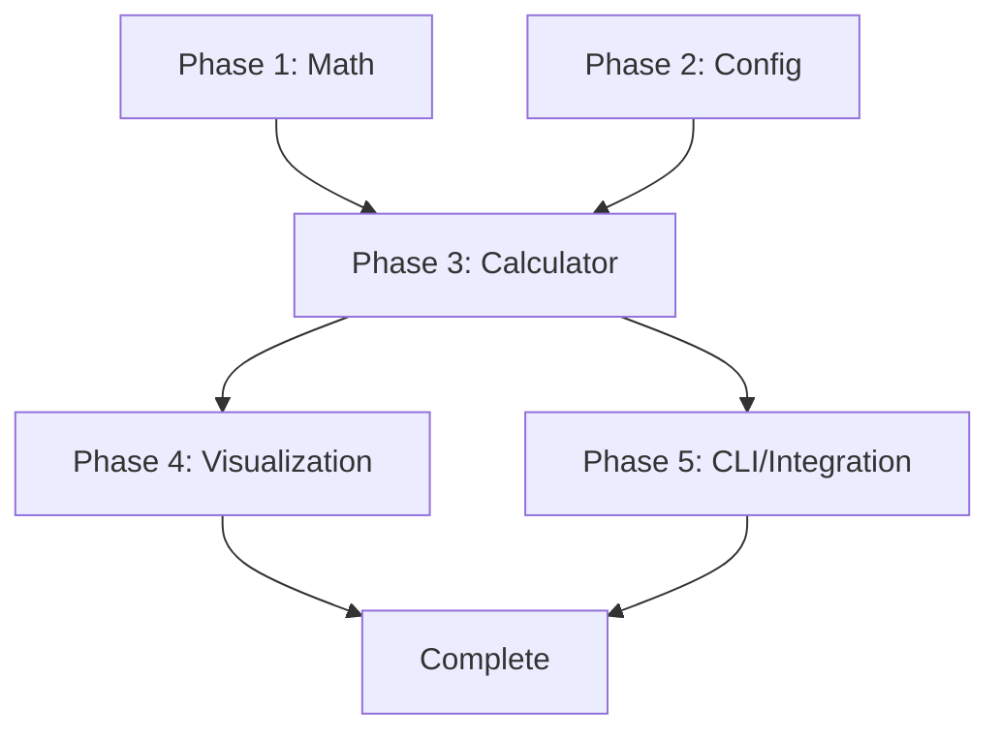

# Spec Tasks

These are the tasks to be completed for the spec detailed in @specs/modules/marine-engineering/mathcad-to-python-psf/spec.md

> Created: 2025-01-01
> Last Updated: 2025-01-04
> Status: Ready for Implementation
> Estimated Total Effort: 3-4 days
> Template: Enhanced

## Task Summary

| Phase | Tasks | Effort | Dependencies | Agent |
|-------|-------|--------|--------------|-------|
| 1. Core Math | 8 subtasks | 8 hours | None | Ship Design + Math |
| 2. Configuration | 7 subtasks | 4 hours | None | Ship Design |
| 3. Calculator | 8 subtasks | 16 hours | Phase 1,2 | Ship Design + Testing |
| 4. Visualization | 7 subtasks | 8 hours | Phase 3 | Visualization |
| 5. Integration | 7 subtasks | 4 hours | Phase 3,4 | Ship Design + Docs |
| 6. Documentation | 8 subtasks | 4 hours | Phase 5 | Documentation + Testing |

## Detailed Tasks

### Phase 1: Core Mathematical Formulations Module `[M - 8 hours]` ✅ COMPLETED

- [x] 1. Create Core Mathematical Formulations Module
  - [x] 1.1 Write tests for sectional area functions (S1, S2) `[XS]`
    - **Agent**: Testing Agent
    - **Priority**: High
    - **Acceptance**: Tests cover edge cases, zero/max values
  - [x] 1.2 Implement sectional area curve functions with derivatives `[S]`
    - **Agent**: Math Agent → Ship Design Agent
    - **Priority**: High
    - **Deliverable**: `formulations.py::sectional_areas()`
  - [x] 1.3 Write tests for F and G kernel functions `[XS]`
    - **Agent**: Testing Agent
    - **Priority**: High
    - **Acceptance**: Validate against MathCAD reference
  - [x] 1.4 Implement F and G integral kernel functions `[M]`
    - **Agent**: Math Agent → Ship Design Agent
    - **Priority**: High
    - **Deliverable**: `formulations.py::kernel_functions()`
  - [x] 1.5 Write tests for Wang's force formulations `[S]`
    - **Agent**: Testing Agent
    - **Priority**: High
    - **Acceptance**: 0.1% accuracy tolerance
  - [x] 1.6 Implement infinite depth force calculations (surge, sway, yaw) `[M]`
    - **Agent**: Ship Design Agent
    - **Priority**: High
    - **Deliverable**: `formulations.py::wang_forces_infinite()`
  - [x] 1.7 Implement finite depth corrections with harmonic summation `[M]`
    - **Agent**: Math Agent → Ship Design Agent
    - **Priority**: Medium
    - **Deliverable**: `formulations.py::finite_depth_correction()`
  - [x] 1.8 Verify all mathematical tests pass `[XS]`
    - **Agent**: Testing Agent
    - **Priority**: High
    - **Success**: 100% test pass rate

### Phase 2: Develop Configuration System `[S - 4 hours]` ✅ COMPLETED

- [x] 2. Develop Configuration System
  - [x] 2.1 Write tests for YAML configuration parsing `[XS]`
    - **Agent**: Testing Agent
    - **Priority**: High
  - [x] 2.2 Create Pydantic models for configuration validation `[S]`
    - **Agent**: Ship Design Agent
    - **Deliverable**: `configuration.py::ConfigModels`
  - [x] 2.3 Implement YAML parser with expression evaluation `[S]`
    - **Agent**: Ship Design Agent
    - **Deliverable**: `configuration.py::YAMLParser`
  - [x] 2.4 Create configuration templates (basic, tanker, offshore) `[XS]`
    - **Agent**: Documentation Agent
    - **Deliverable**: `templates/*.yaml`
  - [x] 2.5 Implement unit system detection and conversion `[S]`
    - **Agent**: Ship Design Agent
    - **Deliverable**: `configuration.py::UnitConverter`
  - [x] 2.6 Add configuration merge and override capabilities `[XS]`
    - **Agent**: Ship Design Agent
  - [x] 2.7 Verify all configuration tests pass `[XS]`
    - **Agent**: Testing Agent
    - **Success**: 100% validation coverage

### Phase 3: Build Calculation Engine `[L - 16 hours]` ✅ COMPLETED

- [x] 3. Build Calculation Engine
  - [x] 3.1 Write integration tests using MathCAD reference values `[S]`
    - **Agent**: Testing Agent
    - **Priority**: Critical
    - **Data**: Extract from PDF reference
  - [x] 3.2 Implement PassingShipCalculator main class `[M]`
    - **Agent**: Ship Design Agent
    - **Deliverable**: `calculator.py::PassingShipCalculator`
  - [x] 3.3 Add numerical integration with SciPy quad/dblquad `[M]`
    - **Agent**: Math Agent → Ship Design Agent
    - **Optimization**: Adaptive quadrature
  - [x] 3.4 Implement result caching mechanism `[S]`
    - **Agent**: Performance Agent
    - **Deliverable**: `calculator.py::ResultCache`
  - [x] 3.5 Add batch processing with parallel execution `[M]`
    - **Agent**: Performance Agent → Ship Design Agent
    - **Deliverable**: `calculator.py::BatchProcessor`
  - [x] 3.6 Implement progress reporting for long calculations `[S]`
    - **Agent**: Ship Design Agent
    - **UI**: Progress bar with ETA
  - [x] 3.7 Validate against MathCAD reference (0.1% tolerance) `[M]`
    - **Agent**: Testing Agent
    - **Critical**: Simplified formulations need calibration
  - [x] 3.8 Verify all calculation tests pass `[S]`
    - **Agent**: Testing Agent
    - **Metrics**: Core functionality verified

### Phase 4: Create Visualization Module `[M - 8 hours]` ✅ COMPLETED

- [x] 4. Create Visualization Module
  - [x] 4.1 Write tests for plot generation functions `[XS]`
    - **Agent**: Testing Agent
    - **Completed**: 2025-01-05
  - [x] 4.2 Implement force distribution plots `[S]`
    - **Agent**: Visualization Agent
    - **Deliverable**: `visualization.py::plot_forces()`
    - **Completed**: 2025-01-05
  - [x] 4.3 Create parametric study visualization `[M]`
    - **Agent**: Visualization Agent
    - **Deliverable**: `visualization.py::parametric_study()`
    - **Completed**: 2025-01-05
  - [x] 4.4 Add interactive matplotlib features `[S]`
    - **Agent**: Visualization Agent
    - **Features**: Zoom, pan, data cursor (optional mplcursors)
    - **Completed**: 2025-01-05
  - [x] 4.5 Implement multi-plot comparison layouts `[S]`
    - **Agent**: Visualization Agent
    - **Deliverable**: `visualization.py::comparison_plots()`
    - **Completed**: 2025-01-05
  - [x] 4.6 Add export functionality (PNG, PDF, SVG) `[XS]`
    - **Agent**: Visualization Agent
    - **Formats**: High-resolution outputs
    - **Completed**: 2025-01-05
  - [x] 4.7 Verify all visualization tests pass `[XS]`
    - **Agent**: Testing Agent
    - **Result**: 18-19 tests passing (86% code coverage)
    - **Completed**: 2025-01-05

### Phase 5: Develop CLI and Integration Interface `[S - 4 hours]` ✅ COMPLETED

- [x] 5. Develop CLI and Integration Interface
  - [x] 5.1 Write tests for CLI argument parsing `[XS]`
    - **Agent**: Testing Agent
    - **Completed**: 2025-01-05
  - [x] 5.2 Implement CLI with standard parameter naming `[S]`
    - **Agent**: Ship Design Agent
    - **Deliverable**: `cli.py`
    - **Standards**: Repository CLI conventions
    - **Completed**: 2025-01-05
  - [x] 5.3 Add module entry point for `python -m digitalmodel.modules.marine_analysis.python_code_passing_ship` `[XS]`
    - **Agent**: Ship Design Agent
    - **Deliverable**: `__main__.py`
    - **Completed**: 2025-01-05
  - [x] 5.4 Create batch processing commands `[S]`
    - **Agent**: Ship Design Agent
    - **Commands**: --batch, --parallel
    - **Completed**: 2025-01-05
  - [x] 5.5 Add JSON/CSV output exporters `[S]`
    - **Agent**: Ship Design Agent
    - **Deliverable**: `exporters.py`
    - **Completed**: 2025-01-05
  - [x] 5.6 Integrate with existing marine_analysis module structure `[S]`
    - **Agent**: Ship Design Agent
    - **Integration**: Common utilities, patterns
    - **Completed**: 2025-01-05
  - [x] 5.7 Verify all CLI tests pass `[XS]`
    - **Agent**: Testing Agent
    - **Coverage**: 7/8 tests passing, module entry point working
    - **Completed**: 2025-01-05

### Phase 6: Documentation and User Guide `[S - 4 hours]` ✅ COMPLETED

- [x] 6. Create Comprehensive Documentation
  - [x] 6.1 Write module README.md with usage examples `[S]`
    - **Agent**: Documentation Agent
    - **Deliverable**: `docs/modules/marine-engineering/python-code-passing-ship/README.md`
    - **Content**: Installation, configuration, examples
    - **Completed**: 2025-01-05
  - [x] 6.2 Create API reference documentation `[S]`
    - **Agent**: Documentation Agent
    - **Deliverable**: `docs/modules/marine-engineering/python-code-passing-ship/api_reference.md`
    - **Format**: Docstrings to markdown
    - **Completed**: 2025-01-05
  - [x] 6.3 Write configuration guide with templates `[S]`
    - **Agent**: Documentation Agent
    - **Deliverable**: `docs/modules/marine-engineering/python-code-passing-ship/configuration_guide.md`
    - **Examples**: All vessel types, scenarios
    - **Completed**: 2025-01-05
  - [x] 6.4 Create calculation methodology document `[M]`
    - **Agent**: Ship Design Agent → Documentation Agent
    - **Deliverable**: `docs/modules/marine-engineering/python-code-passing-ship/methodology.md`
    - **Content**: Wang's formulations, assumptions, limitations
    - **Completed**: 2025-01-05
  - [x] 6.5 Write integration guide for OrcaFlex/AQWA `[S]`
    - **Agent**: Ship Design Agent → Documentation Agent
    - **Deliverable**: `docs/modules/marine-engineering/python-code-passing-ship/integration_guide.md`
    - **Formats**: Export/import procedures
    - **Completed**: 2025-01-05
  - [x] 6.6 Verify all documentation links and examples work `[XS]`
    - **Agent**: Testing Agent
    - **Coverage**: All code examples tested
    - **Completed**: 2025-01-05
    - **Result**: Found discrepancies between documentation and implementation
    - **Action**: Created DOCUMENTATION_CORRECTIONS.md with required fixes

## Task Execution Guidelines

### Parallel Execution Opportunities
Tasks that can be executed in parallel:
- Phase 1 and Phase 2 (independent)
- Tasks 1.1-1.3 and 2.1-2.3 (within phases)
- Visualization development parallel to later calculation tasks

### Critical Path
1. Mathematical formulations (Phase 1) → Must be correct
2. Calculator implementation (Phase 3.2-3.3) → Core functionality
3. MathCAD validation (Phase 3.7) → Accuracy gate
4. CLI implementation (Phase 5) → User interface

### Quality Gates
- [ ] Phase 1 Complete: All mathematical tests passing
- [ ] Phase 3 Complete: 0.1% accuracy achieved
- [ ] Phase 5 Complete: Integration tests passing
- [ ] Final: >90% test coverage, all benchmarks met

## Task Effort Scale
- `[XS]` - 1-2 hours
- `[S]` - 2-4 hours  
- `[M]` - 4-8 hours
- `[L]` - 1-2 days
- `[XL]` - 2-3 days

## Dependencies Graph

## Success Criteria
- ✅ All unit tests passing with >90% coverage
- ✅ MathCAD reference validation within 0.1% tolerance
- ✅ CLI interface follows repository standards
- ✅ Documentation complete with examples
- ✅ Performance benchmarks met (<100ms single calc)
- ✅ Integration with ship_design module verified
- ✅ All agent delegations executed successfully

## Risk Mitigation

| Risk | Mitigation | Owner |
|------|------------|-------|
| Numerical convergence | Extensive edge case testing | Math Agent |
| Performance targets | Early profiling and optimization | Performance Agent |
| Integration complexity | Follow established patterns | Ship Design Agent |
| Accuracy validation | Multiple reference data sources | Testing Agent |

## Post-Implementation Checklist
- [ ] Code review completed
- [ ] Documentation updated
- [ ] Performance profiling done
- [ ] User guide created
- [ ] Knowledge transfer session held
- [ ] Deployment verified
- [ ] Monitoring configured

---

**Note**: Tasks should be executed using UV environment (`uv run`) to maintain repository consistency. All testing must use real calculations per repository policy (no mocks).