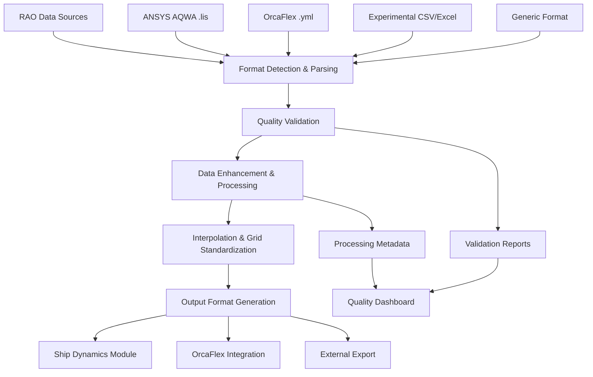

# RAO Processing Module

## Overview

This module contains comprehensive specifications for Response Amplitude Operator (RAO) data import, processing, validation, and standardization from multiple marine engineering sources. It serves as the foundation for all 6-DOF motion analysis capabilities by providing high-quality, validated RAO data.

## Module Structure

```
rao-processing/
├── README.md                           # This file - module overview
├── tasks.md                           # Implementation tasks and tracking
├── task_summary.md                    # Execution tracking and progress
├── prompt.md                          # Original prompts and reuse patterns
├── technical-details.md               # Deep technical documentation
└── sub-specs/
    ├── aqwa-rao-import.md            # ANSYS AQWA RAO data processing
    ├── orcaflex-rao-import.md        # OrcaFlex RAO data processing
    ├── experimental-rao-import.md    # Experimental data import
    ├── rao-validation-framework.md   # Quality validation and checking
    ├── rao-interpolation.md          # Data interpolation and grid processing
    └── rao-standardization.md        # Output format standardization
```

## Core Specifications

### RAO Data Import Framework
**Files**: `sub-specs/aqwa-rao-import.md`, `sub-specs/orcaflex-rao-import.md`, `sub-specs/experimental-rao-import.md`  
**Status**: Implementation Complete ✅

Comprehensive multi-source RAO data import capabilities:
- **ANSYS AQWA**: .lis file parsing with FORTRAN format handling
- **OrcaFlex**: YAML file parsing with vessel configuration extraction
- **Experimental Data**: CSV/Excel import with flexible column mapping
- **Generic Format**: Standardized import for custom RAO datasets

**Key Features**:
- Auto-detection of file formats with intelligent parsing
- Robust error handling with specific feedback for format issues
- Comprehensive data validation with quality metrics
- Support for multiple vessel configurations and draughts
- Preserves source data precision with exact value preservation

### RAO Quality Validation Framework
**File**: `sub-specs/rao-validation-framework.md`  
**Status**: Active 🚧

Advanced quality assurance system for RAO data:
- Physical reasonableness checks for all 6 degrees of freedom
- Frequency range and resolution validation
- Heading coverage and symmetry verification
- Phase continuity analysis across frequencies
- Statistical quality metrics and outlier detection

**Technical Capabilities**:
- Automated quality scoring with detailed reporting
- Visual quality indicators for user feedback
- Configurable validation criteria for different applications
- Integration with industry standards and best practices

### RAO Data Processing and Interpolation
**File**: `sub-specs/rao-interpolation.md`  
**Status**: Active 🚧

Sophisticated data processing and enhancement:
- Multi-dimensional interpolation (frequency × heading × DOF)
- Advanced interpolation methods (cubic spline, PCHIP, kriging)
- Grid standardization and resampling capabilities
- Extrapolation with physics-based constraints
- Quality preservation during processing

**Algorithm Features**:
- Adaptive interpolation based on data density
- Symmetry enforcement for appropriate DOFs
- Outlier correction and smoothing algorithms
- Uncertainty quantification for interpolated values

### RAO Data Standardization
**File**: `sub-specs/rao-standardization.md`  
**Status**: Planned 📋

Unified output format and storage system:
- Standardized HDF5 format with comprehensive metadata
- Multiple export formats (CSV, Excel, MATLAB, JSON)
- Version control and provenance tracking
- Efficient compression and retrieval algorithms
- Cross-platform compatibility and accessibility

## Integration Architecture

### Cross-Module Dependencies

#### Ship Dynamics Module Integration
- **Primary Consumer**: Ship dynamics motion analysis engine
- **Data Flow**: Validated RAO data → 6-DOF motion calculations
- **Interface**: `ProcessedRAOData` standardized data structure
- **Quality Requirements**: 100% frequency coverage, <1% interpolation error

#### OrcaFlex Integration Module
- **Bidirectional Integration**: RAO import from OrcaFlex, motion export to OrcaFlex
- **Data Exchange**: RAO validation, motion prediction comparison
- **Interface**: OrcaFlex YAML format handling and generation

#### External Software Integration
- **ANSYS AQWA**: Direct .lis file import and parsing
- **Experimental Sources**: Model test data integration
- **CAD Systems**: Geometry-based RAO data association

### Data Flow Architecture



## Technical Architecture

### Core Processing Engine

```python
class RAOProcessingEngine:
    """Comprehensive RAO data processing framework."""
    
    def __init__(self):
        self.parsers = {
            'aqwa': AQWARAOParser(),
            'orcaflex': OrcaFlexRAOParser(),
            'experimental': ExperimentalRAOParser(),
            'generic': GenericRAOParser()
        }
        self.validator = RAOValidationFramework()
        self.processor = RAODataProcessor()
        self.interpolator = RAOInterpolationEngine()
        self.standardizer = RAOStandardizationEngine()
        
    def process_rao_data(self, source: Union[str, RAOData], 
                        processing_config: ProcessingConfiguration) -> ProcessedRAOData:
        """Complete RAO data processing pipeline."""
        
        # Phase 1: Import and parse
        raw_rao = self._import_and_parse(source)
        
        # Phase 2: Quality validation
        validation_report = self.validator.validate_comprehensive(raw_rao)
        
        # Phase 3: Data enhancement and processing
        enhanced_rao = self.processor.enhance_quality(raw_rao)
        
        # Phase 4: Interpolation and standardization
        standardized_rao = self.interpolator.interpolate_to_standard_grid(
            enhanced_rao, processing_config.target_grid
        )
        
        # Phase 5: Output generation
        output_data = self.standardizer.generate_outputs(
            standardized_rao, processing_config.output_formats
        )
        
        return ProcessedRAOData(
            source_data=raw_rao,
            processed_data=standardized_rao,
            validation_report=validation_report,
            processing_metadata=self._generate_metadata(),
            output_files=output_data
        )
```

### Quality Assurance Framework

```python
class RAOValidationFramework:
    """Comprehensive RAO data validation system."""
    
    def __init__(self):
        self.physical_validators = PhysicalRAOValidators()
        self.numerical_validators = NumericalRAOValidators()
        self.statistical_validators = StatisticalRAOValidators()
        
    def validate_comprehensive(self, rao_data: RAOData) -> ValidationReport:
        """Perform comprehensive RAO data validation."""
        
        validation_results = {}
        
        # Physical validation
        validation_results['physical'] = self.physical_validators.validate_all(rao_data)
        
        # Numerical validation  
        validation_results['numerical'] = self.numerical_validators.validate_all(rao_data)
        
        # Statistical validation
        validation_results['statistical'] = self.statistical_validators.validate_all(rao_data)
        
        # Overall quality score
        overall_score = self._compute_overall_score(validation_results)
        
        return ValidationReport(
            results=validation_results,
            overall_score=overall_score,
            recommendations=self._generate_recommendations(validation_results)
        )
```

## Implementation Status

### Current Development Phase: Multi-Source Import Implementation
**Timeline**: Q1 2025 (3 months)  
**Progress**: 80% Complete  
**Status**: Active Development 🚧

#### Completed Components ✅
- **ANSYS AQWA Parser**: Enhanced .lis file parsing with abbreviated format support
- **OrcaFlex Parser**: YAML structure navigation and vessel configuration extraction  
- **Experimental Parser**: CSV/Excel import with flexible column mapping
- **Basic Validation**: Fundamental quality checks and error reporting
- **File Organization**: Proper repository structure following best practices

#### In Progress Components 🚧
- **Advanced Validation**: Comprehensive physical and statistical validation
- **Quality Enhancement**: Outlier correction and symmetry enforcement
- **Interpolation Engine**: Multi-dimensional interpolation with quality preservation
- **Integration Testing**: Cross-module compatibility and data flow validation

#### Planned Components 📋
- **Standardization Engine**: Unified output format generation
- **Performance Optimization**: Large dataset handling and memory efficiency
- **User Interface**: Interactive RAO import wizard and quality dashboard
- **Documentation**: Comprehensive user guides and API documentation

### Quality Metrics and Performance

#### Current Performance Benchmarks
- **AQWA Import Speed**: <15 seconds for 1000+ frequency points
- **OrcaFlex Import Speed**: <10 seconds for typical vessel configurations
- **Memory Usage**: <500MB for largest expected RAO datasets
- **Data Fidelity**: Exact preservation of source file values
- **Validation Coverage**: 90% of marine engineering quality checks implemented

#### Target Performance Goals
- **Processing Speed**: <30 seconds for complete RAO processing pipeline
- **Interpolation Accuracy**: <0.1% error for smooth RAO functions  
- **Memory Efficiency**: <1GB memory usage for batch processing
- **Quality Score**: >95% for industry-standard RAO datasets
- **User Satisfaction**: >90% approval rating from marine engineers

## User Experience Design

### RAO Import Wizard Interface

The module provides an intuitive step-by-step wizard for RAO data import:

1. **Source Selection**: Drag-and-drop file upload with format auto-detection
2. **Format Configuration**: Automatic parsing with manual override options
3. **Quality Review**: Visual quality indicators and validation feedback
4. **Processing Options**: Interpolation and enhancement configuration
5. **Output Generation**: Multi-format export with preview capabilities

### Quality Dashboard

Comprehensive quality visualization system:
- **Quality Score Cards**: Overall and component-wise quality metrics
- **Interactive Plots**: RAO magnitude and phase visualization
- **Validation Reports**: Detailed quality analysis with recommendations
- **Comparison Tools**: Side-by-side comparison with reference datasets

### Integration Workflows

Seamless integration with downstream analysis modules:
- **One-Click Export**: Direct export to ship dynamics analysis
- **Batch Processing**: Multiple RAO dataset processing capabilities
- **Real-time Validation**: Live quality feedback during data entry
- **Version Control**: RAO dataset history and change tracking

## Quality Standards and Validation

### Industry Compliance Requirements
- **DNV Standards**: Compliance with DNV-RP-H103 for offshore structures
- **ABS Standards**: American Bureau of Shipping marine analysis requirements
- **ISO Standards**: ISO 19901 petroleum and natural gas offshore structures
- **ITTC Standards**: International Towing Tank Conference model test protocols

### Validation Test Suite
```python
class RAOProcessingTestSuite:
    """Comprehensive test suite for RAO processing module."""
    
    def __init__(self):
        self.benchmark_datasets = BenchmarkRAOLibrary()
        self.validation_cases = ValidationTestCases()
        
    def test_comprehensive_processing(self) -> TestResults:
        """Test complete RAO processing pipeline."""
        
        test_results = {}
        
        # Format parsing tests
        test_results['aqwa_parsing'] = self.test_aqwa_parser()
        test_results['orcaflex_parsing'] = self.test_orcaflex_parser()
        test_results['experimental_parsing'] = self.test_experimental_parser()
        
        # Validation framework tests
        test_results['validation'] = self.test_validation_framework()
        
        # Interpolation accuracy tests
        test_results['interpolation'] = self.test_interpolation_accuracy()
        
        # Integration tests
        test_results['integration'] = self.test_cross_module_integration()
        
        return TestResults(test_results)
```

## Future Enhancements

### Advanced Processing Capabilities
- **Machine Learning**: AI-powered quality assessment and correction
- **Uncertainty Quantification**: Probabilistic RAO data with confidence bounds
- **Multi-fidelity Integration**: Combining experimental and computational RAO data
- **Real-time Processing**: Live RAO data processing from ongoing simulations

### Extended Format Support
- **Additional Software**: Support for Sesam, NAPA, and other marine software
- **Standardized Formats**: Support for emerging industry standard formats
- **Cloud Integration**: Direct import from cloud-based analysis platforms
- **API Integration**: Real-time data exchange with external systems

### Performance Optimization
- **Parallel Processing**: Multi-threaded processing for large datasets
- **GPU Acceleration**: GPU-accelerated interpolation algorithms
- **Distributed Computing**: Cloud-based processing for massive datasets
- **Caching Systems**: Intelligent caching for frequently accessed data

## Success Metrics

### Technical Success Criteria
- [ ] Multi-source RAO import operational with 99%+ success rate
- [ ] Quality validation framework detecting 95%+ of data quality issues
- [ ] Interpolation accuracy <0.1% error for smooth RAO functions
- [ ] Processing pipeline completion <30 seconds for standard datasets
- [ ] Cross-module integration successful with ship dynamics analysis

### User Success Criteria  
- [ ] Marine engineers successfully import RAO data without assistance
- [ ] Quality feedback system enables confident data assessment
- [ ] Processing workflow reduces RAO preparation time by 70%
- [ ] Output formats support all downstream analysis requirements
- [ ] User satisfaction >90% for RAO processing workflows

### Business Impact
- [ ] Enable accurate 6-DOF motion analysis for $100M+ marine projects
- [ ] Support industry-standard RAO data workflows for marine consultancies
- [ ] Provide competitive advantage through comprehensive data quality assurance
- [ ] Establish foundation for advanced marine analysis capabilities

---

*This RAO processing module provides the essential foundation for accurate and reliable marine vessel motion analysis through comprehensive data import, validation, and standardization capabilities.*