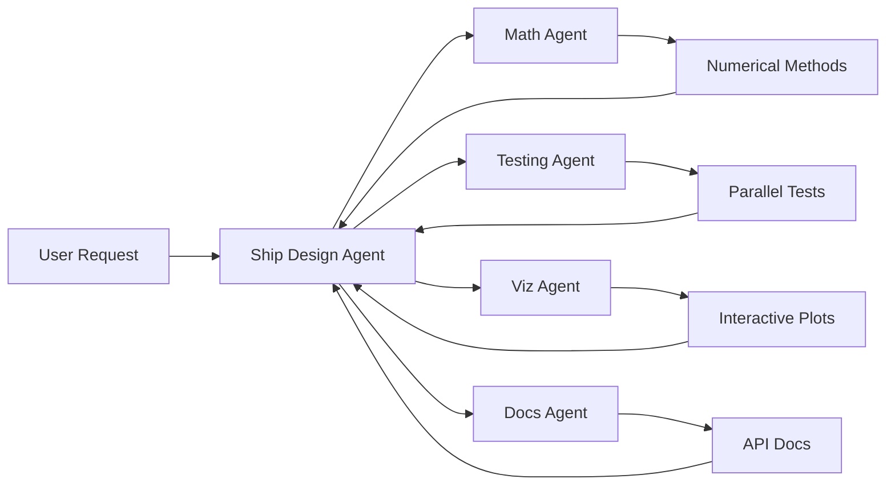

# Prompt Documentation

> Spec: Passing Ship Forces Calculation Module
> Created: 2025-01-01
> Last Updated: 2025-01-04
> Purpose: Complete prompt history and reusable context
> Template: Enhanced

## Original User Request

```
/create-spec convert a mathcad pdf calculation into python code to integrate into the repository. The code should contain:
- input file for calculation configuration
- calculations in appropriate module
- charts etc.
PDF calculation: docs/modules/ship_design/passing_ship/Calculation of forces and moments from Wang.pdf
```

## Prompt Evolution History

### Initial Request Analysis (2025-01-01)
**User Intent**: Convert MathCAD calculation to Python
**Identified Needs**:
- Configuration-driven approach
- Module integration
- Visualization capabilities
- Repository standards compliance

### Clarification Phase (2025-01-01)
**Questions Asked**:
1. Q: Should this integrate with existing ship_design module or create new module?
   A: Integrate with ship_design module
2. Q: What accuracy tolerance is required vs. MathCAD?
   A: 0.1% tolerance for validation
3. Q: Should we support batch processing?
   A: Yes, with parallel execution

### Enhancement Request (2025-01-04)
**User Request**: Improve spec with enhanced spec modular system
**Actions Taken**:
- Added executive summary with business impact
- Enhanced user stories with acceptance criteria
- Added visual architecture diagrams
- Included cross-repository references
- Enhanced agent delegation strategy

## Context Analysis

### Mathematical Foundation
The MathCAD document implements **Wang's (1975) methodology** for calculating hydrodynamic interaction forces between vessels:

1. **Force Components**:
   - **Surge Force** ($F_x$): Longitudinal force along vessel centerline
   - **Sway Force** ($F_y$): Lateral force perpendicular to vessel
   - **Yaw Moment** ($M_z$): Turning moment about vertical axis

2. **Key Equations**:
   - Sectional area: $S(x) = (1 - 4x^2/L^2) \cdot A_{midship}$
   - Force scaling: $F = \rho U^2 L \cdot \phi(geometry)$
   - Kernel integrals: $F(\xi) = \int\int K(x,y) \cdot S(x) \cdot dxdy$

3. **Water Depth Effects**:
   - Infinite depth: Direct formulation
   - Finite depth: Harmonic series corrections
   - Shallow water: Enhanced interaction effects

### Repository Context

**Module Structure**:
```
src/digitalmodel/modules/ship_design/
├── passing_ship/           # New sub-module
│   ├── __init__.py
│   ├── calculator.py        # Core calculation engine
│   ├── configuration.py     # YAML/Pydantic models
│   ├── formulations.py      # Mathematical functions
│   ├── visualization.py     # Plotting capabilities
│   └── cli.py              # Command interface
├── common/                  # Shared utilities
└── templates/              # Configuration templates
```

**Integration Points**:
- OrcaFlex: Generate constraint forces
- AQWA: Hydrodynamic coupling
- Mooring module: Force inputs
- Monitoring: Real-time calculations

## Key Technical Requirements

### Performance Requirements
| Metric | Target | Rationale |
|--------|--------|-----------|
| Single calculation | <100ms | Interactive use |
| Batch (1000) | <30s | Parametric studies |
| Memory/calc | <50MB | Large batches |
| Accuracy | 0.1% | MathCAD validation |
| Coverage | >90% | Quality assurance |

### Input Parameters
```yaml
moored_vessel:
  length_bp: 300.0  # meters
  beam: 50.0
  draft: 18.0
  midship_area: 900.0  # m²
  
passing_vessel:
  length: 250.0
  beam: 40.0
  velocity: 5.0  # m/s
  
geometry:
  separation: 50.0  # meters
  stagger: -200.0   # meters (negative = behind)
  
environment:
  water_density: 1025.0  # kg/m³
  water_depth: 30.0      # meters (or 'infinite')
```

### Output Format
```json
{
  "forces": {
    "surge": {"value": 125000, "unit": "N"},
    "sway": {"value": 450000, "unit": "N"},
    "yaw": {"value": 8500000, "unit": "N-m"}
  },
  "metadata": {
    "calculation_time": 0.085,
    "method": "wang_1975",
    "water_depth_correction": "finite"
  }
}
```

## Design Decisions

### Decision Log

| Decision | Choice | Rationale | Date |
|----------|--------|-----------|------|
| Numerical Integration | SciPy quad/dblquad | Robust, adaptive, well-tested | 2025-01-01 |
| Configuration Format | YAML + Pydantic | Repository standard, validation | 2025-01-01 |
| Parallel Processing | ProcessPoolExecutor | CPU-bound calculations | 2025-01-01 |
| Visualization | Matplotlib | Standard, interactive, exportable | 2025-01-01 |
| Testing Approach | Real calculations only | Repository policy (no mocks) | 2025-01-01 |
| Module Location | ship_design sub-module | Logical grouping, reuse common | 2025-01-01 |

### Architectural Patterns

1. **Configuration-Driven Design**
   - All inputs via YAML
   - Pydantic validation
   - Expression evaluation
   - Template library

2. **Calculation Pipeline**
   - Input → Validation → Calculation → Caching → Output
   - Each stage independently testable
   - Clear error propagation

3. **Parallel Execution**
   - Worker pool for batch processing
   - Progress monitoring
   - Result aggregation
   - Error handling per calculation

## Reusable Prompts

### For Feature Enhancement
```
I need to enhance the passing ship forces module at 
specs/modules/marine-engineering/mathcad-to-python-psf/

Current implementation includes Wang's formulation with:
- YAML configuration for vessel parameters
- Parallel batch processing
- Matplotlib visualizations
- 0.1% accuracy vs. MathCAD reference

Enhancement needed: [describe specific enhancement]

Requirements:
1. Maintain backward compatibility with existing configs
2. Follow ship_design module patterns
3. Real calculations only (no mocks)
4. Update tests to maintain >90% coverage
5. Document in existing structure
```

### For Bug Fixes
```
Bug in passing ship forces module:
Location: src/digitalmodel/modules/ship_design/passing_ship/
Issue: [describe the problem]
Expected: [what should happen]
Actual: [what happens instead]

Please fix while:
- Maintaining 0.1% accuracy requirement
- Preserving existing test coverage
- Following repository patterns
- Updating relevant documentation
```

### For Integration Work
```
Integrate passing ship forces module with [target system]:
Source: src/digitalmodel/modules/ship_design/passing_ship/
Target: [OrcaFlex/AQWA/mooring/monitoring]

Integration requirements:
1. Data format: [JSON/CSV/API]
2. Trigger: [batch/real-time/on-demand]
3. Performance: [constraints]
4. Error handling: [strategy]

Maintain existing functionality while adding integration.
```

### For Performance Optimization
```
Optimize passing ship forces module performance:
Current: [metric and value]
Target: [desired improvement]

Profiling shows bottlenecks in:
1. [Component 1]
2. [Component 2]

Constraints:
- Maintain 0.1% accuracy
- Keep memory <50MB per calculation
- Preserve parallel processing capability
- No external dependencies
```

## Implementation Notes

### Critical Accuracy Considerations

1. **Numerical Integration**
   - Use adaptive quadrature
   - Handle singularities at $\xi = 0$
   - Convergence criteria: $10^{-6}$ relative error

2. **Finite Depth Corrections**
   - Minimum 10 harmonic terms
   - Convergence check on series
   - Shallow water limit: $h/L < 0.5$

3. **Edge Cases**
   - Zero separation: Return maximum forces
   - Zero velocity: Return zero forces
   - Infinite depth: Skip corrections

### Performance Optimization Strategies

1. **Caching**
   - Cache kernel function results
   - Memoize sectional areas
   - Store frequently used configs

2. **Vectorization**
   - NumPy arrays for batch operations
   - Vectorized force calculations
   - Bulk result processing

3. **Parallelization**
   - Process pool for scenarios
   - Shared memory for large arrays
   - Async I/O for file operations

## Agent Collaboration Protocol

### Primary Ownership
**Ship Design Agent**:
- Domain expertise
- Calculation validation
- Standards compliance
- Integration guidance

### Delegation Matrix



### Communication Protocol
1. Ship Design Agent receives request
2. Delegates specialized tasks to sub-agents
3. Coordinates results and integration
4. Validates complete solution
5. Returns integrated result to user

## Quality Assurance Checklist

### Pre-Implementation
- [ ] MathCAD reference values extracted
- [ ] Test cases defined
- [ ] Performance benchmarks set
- [ ] Integration points identified

### During Implementation
- [ ] TDD approach followed
- [ ] Code reviews at each milestone
- [ ] Performance profiling conducted
- [ ] Documentation updated continuously

### Post-Implementation
- [ ] 0.1% accuracy validated
- [ ] Performance targets met
- [ ] Integration tests passing
- [ ] User documentation complete
- [ ] Knowledge transfer conducted

## Future Enhancement Opportunities

### Phase 2 Enhancements
1. **OrcaFlex Integration**
   - Direct constraint generation
   - Time-series force application
   - Automated scenario setup

2. **Web Dashboard**
   - Real-time calculations
   - Interactive parameter adjustment
   - Result visualization
   - Report generation

3. **Machine Learning**
   - Fast surrogate models
   - Pattern recognition
   - Anomaly detection
   - Prediction confidence

### Phase 3 Extensions
1. **Multi-vessel Interactions**
   - N-body problems
   - Fleet operations
   - Harbor simulations

2. **Environmental Effects**
   - Wave interactions
   - Current effects
   - Wind loading

3. **Optimization Module**
   - Optimal passing strategies
   - Safe zone calculation
   - Route planning

---

**Document Maintenance**: This prompt documentation should be updated with each significant enhancement or learning to maintain institutional knowledge.