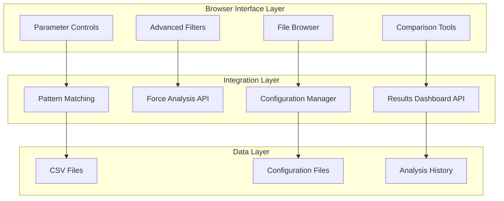
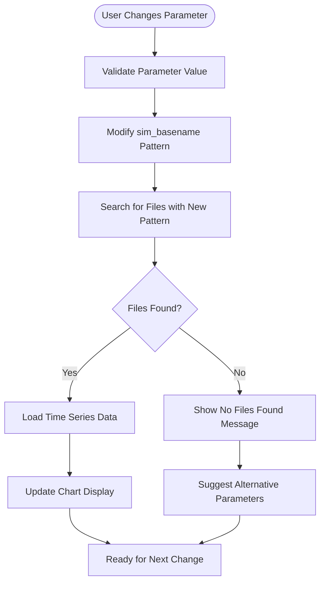
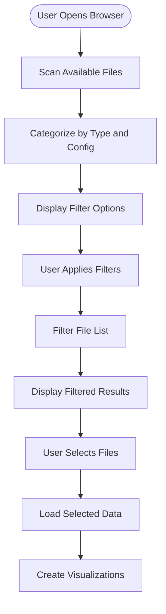
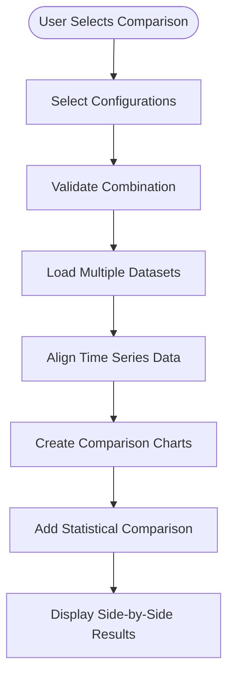

# OrcaFlex Browser Interface Specification

> **Module**: `orcaflex/browser-interface`  
> **Status**: Consolidated into Results Dashboard  
> **Priority**: Medium  
> **Updated**: 2025-08-12  

## Overview

The OrcaFlex Browser Interface provides manual parameter selection and file browsing capabilities, complementing the automated Results Dashboard. This interface enables engineers to manually explore different loading conditions and compare scenarios beyond the automatically identified maximum force configurations.

**Note**: Core functionality has been integrated into the Results Dashboard. This specification maintains the manual override and parameter selection workflows.

## Integration Status

### ✅ Integrated Features
- **Manual Parameter Override**: Users can modify any configuration parameter
- **Real-time File Pattern Updates**: Instant file search based on parameter changes  
- **Configuration Validation**: Parameter validation and error handling
- **Seamless UI Integration**: Built into main dashboard interface

### 🔄 Specialized Browser Features
- **Advanced File Filtering**: Complex filtering beyond standard parameters
- **Batch Comparison**: Side-by-side analysis of multiple configurations
- **Custom Pattern Matching**: User-defined file pattern creation
- **Historical Analysis**: Browse previous analysis results

## System Architecture



## Core Workflows

### 1. Manual Parameter Override Workflow



### 2. Advanced File Browser Workflow



### 3. Comparison Analysis Workflow



## User Interface Components

### Parameter Control Panel
```html
<div class="parameter-controls">
    <!-- Vessel Configuration -->
    <div class="config-section">
        <h3>Vessel Configuration</h3>
        <div class="param-group">
            <label>FST1 Loading:</label>
            <select id="fst1-loading" onchange="updateConfiguration()">
                <option value="15">15% LNG</option>
                <option value="95">95% LNG</option>
            </select>
        </div>
        <!-- Additional parameter controls -->
    </div>
    
    <!-- Environment Configuration -->
    <div class="config-section">
        <h3>Environment Configuration</h3>
        <div class="param-group">
            <label>Wave Heading:</label>
            <select id="wave-heading" onchange="updateConfiguration()">
                <option value="0">0°</option>
                <option value="45">45°</option>
                <option value="90">90°</option>
                <!-- Additional angles -->
            </select>
        </div>
    </div>
    
    <!-- Real-time Feedback -->
    <div class="feedback-section">
        <div id="pattern-preview">Pattern: fsts_l015_hwl_ncl_000deg_*</div>
        <div id="files-found">Files Found: 47</div>
    </div>
</div>
```

### Advanced File Browser
```html
<div class="file-browser">
    <!-- Filter Controls -->
    <div class="filter-controls">
        <div class="filter-group">
            <label>Return Period:</label>
            <select id="return-period-filter">
                <option value="">All Periods</option>
                <option value="005yr">5 Year</option>
                <option value="100yr">100 Year</option>
                <option value="1000yr">1000 Year</option>
            </select>
        </div>
        
        <div class="filter-group">
            <label>Component Type:</label>
            <select id="component-filter">
                <option value="">All Components</option>
                <option value="jacket">Jacket</option>
                <option value="strut">Strut</option>
                <option value="mooring">Mooring</option>
            </select>
        </div>
        
        <button onclick="applyFilters()">Apply Filters</button>
        <button onclick="clearFilters()">Clear All</button>
    </div>
    
    <!-- File List Display -->
    <div class="file-list">
        <table id="file-table">
            <thead>
                <tr>
                    <th>Select</th>
                    <th>File Name</th>
                    <th>Type</th>
                    <th>Configuration</th>
                    <th>Max Force</th>
                    <th>Modified</th>
                </tr>
            </thead>
            <tbody id="file-list-body">
                <!-- Populated dynamically -->
            </tbody>
        </table>
    </div>
    
    <!-- Selection Actions -->
    <div class="selection-actions">
        <button onclick="loadSelected()">Load Selected</button>
        <button onclick="compareSelected()">Compare Selected</button>
        <button onclick="exportSelected()">Export Selected</button>
    </div>
</div>
```

### Comparison Interface
```html
<div class="comparison-interface">
    <!-- Configuration Comparison -->
    <div class="config-comparison">
        <div class="config-column">
            <h4>Configuration A</h4>
            <div class="config-details">
                <div>Loading: 15% LNG</div>
                <div>Tide: HWL</div>
                <div>Heading: 0°</div>
                <div>Max Force: 8265.55 N</div>
            </div>
        </div>
        
        <div class="config-column">
            <h4>Configuration B</h4>
            <div class="config-details">
                <div>Loading: 95% LNG</div>
                <div>Tide: HWL</div>
                <div>Heading: 45°</div>
                <div>Max Force: 9125.42 N</div>
            </div>
        </div>
    </div>
    
    <!-- Side-by-Side Charts -->
    <div class="comparison-charts">
        <div class="chart-pair">
            <div id="chart-a-jacket" class="comparison-chart"></div>
            <div id="chart-b-jacket" class="comparison-chart"></div>
        </div>
        
        <div class="chart-pair">
            <div id="chart-a-strut" class="comparison-chart"></div>
            <div id="chart-b-strut" class="comparison-chart"></div>
        </div>
    </div>
    
    <!-- Statistical Comparison -->
    <div class="statistical-comparison">
        <table class="comparison-stats">
            <thead>
                <tr>
                    <th>Metric</th>
                    <th>Configuration A</th>
                    <th>Configuration B</th>
                    <th>Difference</th>
                </tr>
            </thead>
            <tbody>
                <tr>
                    <td>Max Strut Force</td>
                    <td>8265.55 N</td>
                    <td>9125.42 N</td>
                    <td>+859.87 N (+10.4%)</td>
                </tr>
                <!-- Additional metrics -->
            </tbody>
        </table>
    </div>
</div>
```

## JavaScript Implementation

### Parameter Override Handler
```javascript
function updateConfiguration() {
    const config = {
        fst1: document.getElementById('fst1-loading').value,
        fst2: document.getElementById('fst2-loading').value,
        tide: document.getElementById('tide-level').value,
        heading: document.getElementById('wave-heading').value,
        envType: document.getElementById('env-type').value
    };
    
    // Update pattern preview
    const pattern = buildFilePattern(config);
    document.getElementById('pattern-preview').textContent = `Pattern: ${pattern}`;
    
    // Search for matching files
    searchFilesForConfiguration(config)
        .then(results => {
            document.getElementById('files-found').textContent = 
                `Files Found: ${results.files.length}`;
            
            if (results.files.length > 0) {
                loadDataForConfiguration(config, results.files);
            } else {
                showNoFilesMessage(config);
            }
        })
        .catch(error => {
            console.error('Configuration update error:', error);
            showErrorMessage('Failed to update configuration');
        });
}

function buildFilePattern(config) {
    // Build sim_basename pattern from configuration
    const vessel = 'fsts'; // Could be dynamic based on config
    const loading = `l${config.fst1.padStart(3, '0')}`;
    const tide = config.tide;
    const envType = config.envType === 'colinear' ? 'cl' : 'ncl';
    const heading = `${config.heading.padStart(3, '0')}deg`;
    
    return `${vessel}_${loading}_${tide}_${envType}_${heading}_*`;
}
```

### Advanced File Filtering
```javascript
class FileFilter {
    constructor() {
        this.filters = {
            returnPeriod: '',
            componentType: '',
            dateRange: null,
            maxForceRange: null,
            customPattern: ''
        };
    }
    
    applyFilters(fileList) {
        return fileList.filter(file => {
            // Return period filter
            if (this.filters.returnPeriod && 
                !file.name.includes(this.filters.returnPeriod)) {
                return false;
            }
            
            // Component type filter
            if (this.filters.componentType && 
                !file.name.toLowerCase().includes(this.filters.componentType)) {
                return false;
            }
            
            // Date range filter
            if (this.filters.dateRange && 
                !this.isWithinDateRange(file.modified, this.filters.dateRange)) {
                return false;
            }
            
            // Max force range filter
            if (this.filters.maxForceRange && file.maxForce && 
                !this.isWithinForceRange(file.maxForce, this.filters.maxForceRange)) {
                return false;
            }
            
            // Custom pattern filter
            if (this.filters.customPattern && 
                !this.matchesCustomPattern(file.name, this.filters.customPattern)) {
                return false;
            }
            
            return true;
        });
    }
    
    setFilter(filterType, value) {
        this.filters[filterType] = value;
        this.triggerFilterUpdate();
    }
    
    clearAllFilters() {
        this.filters = {
            returnPeriod: '',
            componentType: '',
            dateRange: null,
            maxForceRange: null,
            customPattern: ''
        };
        this.triggerFilterUpdate();
    }
    
    triggerFilterUpdate() {
        // Emit event for UI update
        document.dispatchEvent(new CustomEvent('filtersChanged', {
            detail: { filters: this.filters }
        }));
    }
}
```

### Comparison Analysis Engine
```javascript
class ComparisonAnalysis {
    constructor() {
        this.configurations = [];
        this.datasets = [];
    }
    
    async addConfiguration(config) {
        try {
            const data = await loadDataForConfiguration(config);
            this.configurations.push(config);
            this.datasets.push(data);
            
            if (this.configurations.length >= 2) {
                this.enableComparison();
            }
        } catch (error) {
            console.error('Failed to add configuration:', error);
            throw error;
        }
    }
    
    createComparison() {
        if (this.datasets.length < 2) {
            throw new Error('Need at least 2 configurations for comparison');
        }
        
        // Align time series data
        const alignedData = this.alignTimeSeriesData();
        
        // Calculate statistical differences
        const statistics = this.calculateStatistics(alignedData);
        
        // Create comparison charts
        this.createComparisonCharts(alignedData);
        
        // Display statistical summary
        this.displayStatistics(statistics);
        
        return {
            alignedData,
            statistics,
            configurations: this.configurations
        };
    }
    
    alignTimeSeriesData() {
        // Find common time range across all datasets
        const timeRanges = this.datasets.map(data => ({
            min: Math.min(...data.time),
            max: Math.max(...data.time)
        }));
        
        const commonRange = {
            min: Math.max(...timeRanges.map(r => r.min)),
            max: Math.min(...timeRanges.map(r => r.max))
        };
        
        // Interpolate all datasets to common time vector
        const commonTime = this.generateCommonTimeVector(commonRange);
        
        return this.datasets.map(data => 
            this.interpolateToCommonTime(data, commonTime)
        );
    }
    
    calculateStatistics(alignedData) {
        const stats = {};
        
        // Calculate for each data series
        alignedData[0].categories.forEach((category, categoryIndex) => {
            stats[category] = {};
            
            Object.keys(alignedData[0].data[category]).forEach(seriesName => {
                const seriesStats = {
                    configs: alignedData.map(data => ({
                        max: Math.max(...data.data[category][seriesName]),
                        min: Math.min(...data.data[category][seriesName]),
                        mean: this.calculateMean(data.data[category][seriesName]),
                        std: this.calculateStd(data.data[category][seriesName])
                    })),
                    differences: []
                };
                
                // Calculate differences between configurations
                for (let i = 1; i < seriesStats.configs.length; i++) {
                    seriesStats.differences.push({
                        maxDiff: seriesStats.configs[i].max - seriesStats.configs[0].max,
                        meanDiff: seriesStats.configs[i].mean - seriesStats.configs[0].mean,
                        percentChange: ((seriesStats.configs[i].max - seriesStats.configs[0].max) / 
                                      seriesStats.configs[0].max * 100).toFixed(2)
                    });
                }
                
                stats[category][seriesName] = seriesStats;
            });
        });
        
        return stats;
    }
}
```

## API Integration Points

### Results Dashboard Integration
```javascript
// Integration with main dashboard for parameter override
function integrateWithResultsDashboard() {
    // Listen for max configuration events
    document.addEventListener('maxConfigurationFound', (event) => {
        const maxConfig = event.detail;
        populateBrowserInterface(maxConfig);
    });
    
    // Provide parameter override capability
    window.browserInterface = {
        overrideParameters: (newParams) => {
            updateConfiguration();
            return searchFilesForConfiguration(newParams);
        },
        
        getAvailableConfigurations: () => {
            return getAvailableFileConfigurations();
        },
        
        compareConfigurations: (configA, configB) => {
            const analyzer = new ComparisonAnalysis();
            analyzer.addConfiguration(configA);
            analyzer.addConfiguration(configB);
            return analyzer.createComparison();
        }
    };
}
```

### Force Analysis Integration
```javascript
// Integration with force analysis for pattern matching
function integrateWithForceAnalysis() {
    // Use force analysis pattern modification
    window.forceAnalysisIntegration = {
        modifyBasenamePattern: (originalBasename, parameterChanges) => {
            return fetch('/api/modify_pattern', {
                method: 'POST',
                headers: {'Content-Type': 'application/json'},
                body: JSON.stringify({
                    original_basename: originalBasename,
                    parameter_changes: parameterChanges
                })
            }).then(r => r.json());
        },
        
        searchFilesWithPattern: (pattern, folder) => {
            return fetch('/api/search_files', {
                method: 'GET',
                params: new URLSearchParams({
                    pattern: pattern,
                    folder: folder
                })
            }).then(r => r.json());
        }
    };
}
```

## File Organization

```
specs/modules/orcaflex/browser-interface/
├── README.md                    # This overview (current)
├── tasks.md                     # Implementation tasks
├── task_summary.md              # Task execution tracking
├── prompt.md                    # Original prompts and reuse
├── technical-details.md         # Deep technical documentation
└── sub-specs/                   # Component specifications
    ├── ui-components/           # User interface components
    ├── data-integration/        # Data integration patterns
    └── user-workflows/          # User workflow specifications
```

## Current Implementation Status

### ✅ Integrated Features (Complete)
- **Parameter Override**: Manual parameter modification in Results Dashboard
- **Real-time Updates**: Instant file pattern updates and searching
- **Configuration Validation**: Input validation and error handling
- **UI Integration**: Seamless integration with main dashboard

### 🔄 Advanced Features (Planned)
- **Advanced File Browser**: Comprehensive file filtering and browsing
- **Comparison Analysis**: Side-by-side configuration comparison
- **Custom Pattern Creation**: User-defined file pattern matching
- **Batch Operations**: Multi-configuration analysis and export

### 📋 Specialized Use Cases
- **Research Analysis**: Complex filtering for research scenarios
- **Design Optimization**: Parameter sweep and optimization workflows
- **Quality Assurance**: Validation and verification workflows
- **Training and Education**: Educational interface for learning OrcaFlex

## Integration with Core Systems

### Results Dashboard
- **Auto-Max Override**: Manual parameter changes after auto-max identification
- **Configuration Persistence**: Save and recall custom configurations
- **Workflow Integration**: Seamless transition between auto and manual modes

### Force Analysis
- **Pattern Engine**: Leverage force analysis pattern matching algorithms
- **File Search**: Use optimized file search and categorization
- **Configuration Extraction**: Utilize configuration parsing capabilities

### Future Enhancements
- **Advanced Analytics**: Statistical analysis across multiple configurations
- **Machine Learning**: Intelligent configuration recommendations
- **Collaboration**: Shared configurations and analysis sessions

## Success Metrics

### User Experience
- **Parameter Override Time**: &lt;2 seconds for any parameter change
- **File Search Accuracy**: 100% accurate file matching using pattern engine
- **UI Responsiveness**: Instant visual feedback for all user actions

### Technical Performance
- **Search Performance**: &lt;1 second for file pattern searches
- **Comparison Load Time**: &lt;5 seconds for dual configuration comparison
- **Memory Usage**: &lt;500MB for typical browser operations

### Business Value
- **Workflow Flexibility**: Support for both automated and manual analysis
- **Research Capability**: Enable advanced research and development workflows
- **Training Support**: Educational interface for new OrcaFlex users

---

*This specification defines the browser interface capabilities that complement the automated Results Dashboard, providing manual control and advanced analysis features for specialized workflows.*